---

## ⚠️ V2.0 架构重构说明（2026-04-21 更新）

**本文档按 V1.0 的 13 业务章节结构编写**。V2.0 架构重构（Phase 2 菜单归位）后，系统已**合并为 8 个一级模块**对标北森 / Workday / SAP SuccessFactors。**文档章节内容保留不动**，仅在此处加入新旧映射对照表，便于定位。

### V1.0 章节 → V2.0 一级模块对照

| V1.0 原章节 | V2.0 新一级模块 | URL 路径 | 说明 |
|---|---|---|---|
| 三、工作台 | 工作台（特殊一级） | `/workspace` | 保留 |
| **四、组织管理** | **01 组织人事**（新一级） | `/hrm/organization` | 合并 |
| **五、员工管理** | **01 组织人事** | `/hrm/employee` | 合并 + 重写（200 员工池 SSOT） |
| **六、合同管理** | **01 组织人事**（二级降级） | `/hrm/contract-list` 等 | 从一级降级 |
| **七、考勤管理** | **03 考勤与假期** | `/attendance/record` 等 | 合并 |
| **八、假勤管理** | **03 考勤与假期**（二级降级） | `/attendance/leave-*` | 合并 |
| **九、薪酬管理** | **04 薪酬福利** | `/comp/payroll` 等 | 合并，Phase 4 重写 |
| **十三、社保管理** | **04 薪酬福利**（二级降级） | `/comp/social-*` | 合并 |
| **十、绩效管理** | **05 绩效管理**（Phase A~D 成果保留） | `/perf/*` | 主体不变，菜单合并 |
| **十二、培训管理** | **06 培训与发展** | `/training/plan`、`/training/competency` | 扩展 + 能力模型迁入 |
| **十六、数据报表与分析** | **07 数据洞察** | `/insight/*` | 整合 + 绩效分析 + AI 辅助中心 |
| **十四、员工自助** | ❌ **砍掉** | — | 改为角色视图（`user` 账号登录即员工自助视图） |
| **十五、审批流引擎** | **08 系统管理**（二级降级） | `/system/approval-*` | 从一级降级 |
| **十七、系统管理** | **08 系统管理** | `/system/*` | 扩展（含 RBAC/数据权限/字典） |
| —（V1.0 缺招聘章节） | **02 招聘与入职**（新增） | `/recruit/*` | Phase 2 新建一级（整合原 recruitment + recruitmentOps + recruitmentSettings，砍掉 talentExperience） |

### V2.0 新增重点能力（不在 V1.0 范围内）
1. **200 员工档案池**（固定种子生成，全系统 SSOT）
2. **7 种 RBAC 角色 + 三层权限**（菜单 / 数据 / 字段）
3. **22 种基础字典**（教育 / 婚姻 / 民族等）
4. **12 节点组织树**（含组织演进历史）
5. **62 个岗位矩阵**（6 族 × 23 序列 × P1~P10 + M1~M5）
6. **能力模型**（5 级 L1~L5 行为化描述）
7. **人才盘点 9-box**（拖拽式工作台）
8. **AI 辅助中心**（5 项能力 + 强制 Review）
9. **绩效申诉**（5 类申诉 + 2 级审批 + 二次评议）

### 配套文档
- `docs/HR系统重构方案-V2.0-架构篇.md` — 8 模块详细规划 / 地基层设计
- `docs/HR系统重构方案-V2.0-迁移篇.md` — 21 一级 × 新 8 模块逐项对照
- `docs/HR系统重构方案-V2.0-实施计划.md` — 5 个 Phase 详细排期
- `docs/HR重构-Phase1-地基-plan.md` — Phase 1 交付记录
- `docs/HR重构-Phase2-菜单归位-plan.md` — Phase 2 实施计划

### 后续 Phase（V2.0 完整计划）
- Phase 3（异动/离职/编制 + 考勤/假期详化）
- Phase 4（薪酬完整闭环 + 培训管理 + 继任计划）
- Phase 5（数据洞察深化 + AI 中枢扩展 + 系统管理完善）

---

## 目录

- [一、文档信息](#一文档信息)
- [二、项目概述](#二项目概述)
  - [2.1 项目背景](#21-项目背景)
  - [2.2 项目建设目标](#22-项目建设目标)
  - [2.3 项目建设范围](#23-项目建设范围)
  - [2.4 需求分析](#24-需求分析)
  - [2.5 业务流程图](#25-业务流程图)
  - [2.6 用户角色定义](#26-用户角色定义)
- [三、工作台](#三工作台)
  - [3.1 功能概述](#31-功能概述)
  - [3.2 页面访问权限](#32-页面访问权限)
  - [3.3 功能详细设计](#33-功能详细设计)
- [四、组织管理](#四组织管理)
  - [4.1 功能概述](#41-功能概述)
  - [4.2 页面访问权限](#42-页面访问权限)
  - [4.3 功能详细设计](#43-功能详细设计)
- [五、员工管理](#五员工管理)
  - [5.1 功能概述](#51-功能概述)
  - [5.2 页面访问权限](#52-页面访问权限)
  - [5.3 功能详细设计](#53-功能详细设计)
- [六、合同管理](#六合同管理)
  - [6.1 功能概述](#61-功能概述)
  - [6.2 页面访问权限](#62-页面访问权限)
  - [6.3 功能详细设计](#63-功能详细设计)
- [七、考勤管理](#七考勤管理)
  - [7.1 功能概述](#71-功能概述)
  - [7.2 页面访问权限](#72-页面访问权限)
  - [7.3 功能详细设计](#73-功能详细设计)
- [八、假勤管理](#八假勤管理)
  - [8.1 功能概述](#81-功能概述)
  - [8.2 页面访问权限](#82-页面访问权限)
  - [8.3 功能详细设计](#83-功能详细设计)
- [九、薪酬管理](#九薪酬管理)
  - [9.1 功能概述](#91-功能概述)
  - [9.2 页面访问权限](#92-页面访问权限)
  - [9.3 功能详细设计](#93-功能详细设计)
- [十、绩效管理](#十绩效管理)
  - [10.1 功能概述](#101-功能概述)
  - [10.2 页面访问权限](#102-页面访问权限)
  - [10.3 功能详细设计](#103-功能详细设计)
- [十一、招聘管理](#十一招聘管理)
  - [11.1 功能概述](#111-功能概述)
  - [11.2 页面访问权限](#112-页面访问权限)
  - [11.3 功能详细设计](#113-功能详细设计)
    - [11.3.1 用户操作流程](#1131-用户操作流程)
    - [11.3.2 功能设计（核心六大模块）](#1132-功能设计核心六大模块)
    - [11.3.3 人才库管理](#1133-人才库管理)
    - [11.3.4 内推体系](#1134-内推体系)
    - [11.3.5 背调集成](#1135-背调集成)
    - [11.3.6 招聘数据分析](#1136-招聘数据分析)
    - [11.3.7 招聘配置与模板管理](#1137-招聘配置与模板管理)
    - [11.3.8 招聘官网与候选人门户](#1138-招聘官网与候选人门户)
    - [11.3.9 业务逻辑关联](#1139-业务逻辑关联)
- [十二、培训管理](#十二培训管理)
  - [12.1 功能概述](#121-功能概述)
  - [12.2 页面访问权限](#122-页面访问权限)
  - [12.3 功能详细设计](#123-功能详细设计)
- [十三、社保管理](#十三社保管理)
  - [13.1 功能概述](#131-功能概述)
  - [13.2 页面访问权限](#132-页面访问权限)
  - [13.3 功能详细设计](#133-功能详细设计)
- [十四、员工自助](#十四员工自助)
  - [14.1 功能概述](#141-功能概述)
  - [14.2 页面访问权限](#142-页面访问权限)
  - [14.3 功能详细设计](#143-功能详细设计)
- [十五、审批流引擎](#十五审批流引擎)
  - [15.1 功能概述](#151-功能概述)
  - [15.2 页面访问权限](#152-页面访问权限)
  - [15.3 功能详细设计](#153-功能详细设计)
- [十六、数据报表与分析](#十六数据报表与分析)
  - [16.1 功能概述](#161-功能概述)
  - [16.2 页面访问权限](#162-页面访问权限)
  - [16.3 功能详细设计](#163-功能详细设计)
- [十七、系统管理](#十七系统管理)
  - [17.1 功能概述](#171-功能概述)
  - [17.2 页面访问权限](#172-页面访问权限)
  - [17.3 功能详细设计](#173-功能详细设计)
- [十八、技术方案](#十八技术方案)
  - [18.1 技术架构](#181-技术架构)
  - [18.2 数据交互](#182-数据交互)
  - [18.3 外部系统集成](#183-外部系统集成)
  - [18.4 安全方案](#184-安全方案)
- [十九、非功能需求](#十九非功能需求)
  - [19.1 性能需求](#191-性能需求)
  - [19.2 安全需求](#192-安全需求)
  - [19.3 可用性需求](#193-可用性需求)
  - [19.4 兼容性需求](#194-兼容性需求)
- [二十、数据需求](#二十数据需求)
  - [20.1 数据字典](#201-数据字典)
  - [20.2 数据存储要求](#202-数据存储要求)
- [二十一、接口需求](#二十一接口需求)
  - [21.1 第三方系统接入接口规范](#211-第三方系统接入接口规范)
- [二十二、项目实施与验收](#二十二项目实施与验收)
  - [22.1 实施阶段](#221-实施阶段)
  - [22.2 系统培训服务](#222-系统培训服务)
  - [22.3 验收标准](#223-验收标准)
- [二十三、附录](#二十三附录)
  - [23.1 术语表](#231-术语表)
  - [23.2 参考资料](#232-参考资料)

---

## 一、文档信息

| 项目名称 | 企业HR系统 |
|---------|-----------|
| 文档版本 | V1.0 |
| 编制日期 | 2026-04-03 |
| 编制人 | HR系统研发团队 |
| 审核人 | - |
| 批准人 | - |
| 客户单位 | 待定企业 |
| 编制单位 | HR系统研发团队 |
| 适用范围 | 中大型企业（500~5000人）全面人力资源管理，涵盖组织管理、员工管理、合同管理、考勤假勤、薪酬绩效、招聘培训、社保管理、员工自助、审批流引擎、数据报表与系统管理等14大核心模块 |
| 核心目标 | 构建一体化人力资源管理平台，实现从组织架构、员工全生命周期、薪酬绩效、考勤假勤到招聘培训、社保管理的全流程数字化管理，提升企业人力资源管理效率和决策支持能力 |
| 文档状态 | 草稿 |

## 二、项目概述

### 2.1 项目背景

随着中国企业规模的持续扩张，传统人力资源管理模式面临严峻挑战。中大型企业（500~5000人规模）的人力资源管理需求日益复杂，涵盖组织架构、员工管理、薪酬绩效、考勤假勤、招聘培训、社保管理等多个领域，依靠 Excel 表格、纸质档案等传统方式进行管理已无法满足业务需求，主要体现在以下几个方面：

1. **组织架构与人员管理分散**：企业组织层级深、部门多，调整频繁，员工档案分散在各类系统或纸质文件中，无法实时反映企业实际状态，导致跨部门协作时责任不清、信息混乱，影响人力资源决策效率。

2. **考勤假勤管理效率低**：考勤打卡、请假审批、加班统计依赖人工处理，数据准确性差，假期额度计算复杂，容易出错，且无法与薪酬系统自动联动，增加HR工作负担。

3. **薪酬计算复杂且易出错**：薪酬结构多样化，涉及基本工资、绩效奖金、考勤扣款、社保扣除、个税计算等多个环节，人工计算工作量大、易出错，且工资条发放不及时，员工满意度低。

4. **绩效管理流程不规范**：绩效目标设定、评估打分、结果应用缺乏统一流程，评估标准不透明，绩效数据无法与薪酬、晋升等模块联动，影响员工激励效果。

5. **招聘流程协同困难**：招聘需求、简历筛选、面试安排、Offer发放等环节缺乏系统支持，招聘进度难以追踪，候选人体验差，且招聘数据无法沉淀为人才库，影响后续招聘效率。

6. **社保管理合规风险高**：社保增减员、基数调整、账单生成依赖人工操作，容易因数据错误或遗漏导致合规风险，且无法与薪酬系统自动联动，增加管理成本。

7. **员工自助服务缺失**：员工查询个人信息、工资条、假期余额等需要找HR人工处理，效率低且占用HR大量时间，员工体验差。

8. **审批流程固化不灵活**：请假、调薪、招聘等审批流程固化在系统中，无法根据企业实际情况灵活调整，且审批进度不透明，影响业务效率。

9. **数据分析能力不足**：人力资源数据分散在各个模块中，缺乏统一的数据报表和分析工具，管理层无法及时掌握人力资源状况，影响战略决策。

为解决上述问题，建设企业HR系统，通过数字化、流程化、智能化的手段，构建涵盖组织管理、员工管理、合同管理、考勤假勤、薪酬绩效、招聘培训、社保管理、员工自助、审批流引擎、数据报表与系统管理等14大核心模块的一体化人力资源管理平台，实现企业人力资源管理的精细化和智能化。

### 2.2 项目建设目标

本项目旨在建设一套企业级人力资源管理系统，实现以下目标：

1. **构建数字化组织架构体系**：支持无限层级的部门树结构管理，实现部门、岗位、编制的统一管理，提供可视化组织架构图，支持实时查看和导出，使企业组织状态透明可见，为跨部门协作和资源调配提供数据支撑。

2. **建立完整的员工全生命周期管理**：从员工入职到离职，统一管理员工基本信息、教育经历、工作经历、证件信息、合同信息，实现入职、异动、试用期、离职等全流程管理，为考勤、薪酬、绩效等其他HR模块提供可靠的员工数据基础。

3. **实现智能化考勤假勤管理**：支持多种考勤规则（弹性、固定、排班制），实现打卡、加班、请假、调休的全流程管理，自动计算假期额度和考勤统计，与薪酬系统无缝联动，提升考勤管理效率和准确性。

4. **构建灵活的薪酬计算引擎**：支持自定义薪资结构，自动联动考勤、绩效、社保数据进行薪酬计算，实现工资条电子化发放和个税申报，支持调薪管理和薪酬分析，提升薪酬管理的准确性和透明度。

5. **建立科学的绩效管理体系**：支持OKR/KPI目标管理，实现多维度绩效评估（上级评分、自评、360度评估），支持绩效校准和强制分布，绩效结果与薪酬、晋升联动，提升员工激励效果。

6. **优化招聘全流程管理**：从招聘需求到入职衔接，实现职位发布、简历管理、面试安排、Offer管理的全流程数字化，支持多平台职位发布和人才库沉淀，提升招聘效率和候选人体验。

7. **规范培训管理流程**：支持培训计划制定、课程管理、培训记录和效果评估，建立企业内部课程库，实现培训资源的有效管理和复用，提升员工能力发展。

8. **实现社保管理自动化**：支持多城市社保配置，实现增减员管理、公积金管理、社保账单生成和申报导出，与入离职、薪酬系统自动联动，降低社保管理的合规风险和人工成本。

9. **提供便捷的员工自助服务**：员工可自助查询个人信息、工资条、假期余额，提交请假、加班、报销等申请，查看审批进度，减轻HR工作负担，提升员工体验。

10. **构建灵活的审批流引擎**：支持自定义审批流程配置，实现条件分支、代理审批、多渠道通知，满足企业不同业务场景的审批需求，提升审批效率和透明度。

11. **建立全面的数据分析体系**：提供HR驾驶舱、人员分析、薪酬分析、招聘漏斗、考勤报表等多维度数据报表，支持数据可视化和趋势分析，为管理层决策提供数据支持。

12. **实现系统安全与权限管控**：基于RBAC的权限管理体系，支持用户账号、角色权限、数据字典、操作日志等系统管理功能，确保系统安全稳定运行。

### 2.3 项目建设范围

本项目建设范围包括企业人力资源管理的14大核心模块：

**系统端：**

- PC端管理后台（Web应用）：面向HR管理员、部门负责人、员工使用
- 移动端H5（微信/钉钉）：面向员工使用，支持考勤打卡、请假申请、工资条查询等

**功能模块：**

- **组织管理**：部门管理、岗位管理、编制管理、组织架构图
- **员工管理**：员工档案、入职管理、离职管理、员工异动、试用期管理、证件到期提醒
- **合同管理**：新建合同、合同续签、合同终止、合同归档
- **考勤管理**：考勤规则、打卡管理、加班管理、外勤管理、考勤统计
- **假勤管理**：假期配置、假期额度、请假申请、调休管理、假期台账
- **薪酬管理**：薪资结构、薪酬计算、工资条、个税申报、调薪管理
- **绩效管理**：绩效周期、目标管理、绩效评估、绩效校准、绩效档案
- **招聘管理**：招聘需求、职位发布、简历管理、面试管理、Offer管理、入职衔接
- **培训管理**：培训计划、课程管理、培训记录、培训评估
- **社保管理**：参保配置、增减员管理、公积金管理、社保账单、申报导出
- **员工自助（ESS）**：个人信息查询、工资条查询、假期余额查询、申请提交、审批进度查询
- **审批流引擎**：自定义审批流、条件分支、代理审批、审批通知
- **数据报表与分析**：HR驾驶舱、人员分析、薪酬分析、招聘漏斗、考勤报表
- **系统管理**：用户账号与权限（RBAC）、数据字典、操作日志、消息通知、系统参数

**数据范围：**

- 组织数据：部门信息、岗位信息、编制计划数据
- 员工数据：员工基本信息、教育经历、工作经历、证件信息、合同信息
- 考勤数据：打卡记录、加班记录、请假记录、调休记录、考勤统计数据
- 薪酬数据：薪资结构、工资记录、个税申报数据、调薪记录
- 绩效数据：绩效目标、评估记录、绩效结果、绩效档案
- 招聘数据：招聘需求、职位信息、简历信息、面试记录、Offer记录
- 培训数据：培训计划、课程信息、培训记录、评估结果
- 社保数据：参保配置、参保记录、社保账单、申报数据
- 审批数据：审批流程配置、审批记录、审批日志
- 系统数据：用户账号、角色权限、操作日志、系统参数

**不包含功能：**

- 考勤管理、薪酬管理（后续迭代实现）
- 移动端 H5（后续迭代实现）
- 审批流引擎（当前阶段使用内置简单审批，后续替换为独立审批流引擎）

### 2.4 需求分析

| 功能模块 | 子功能 | 需求描述 |
|---------|-------|---------|
| 组织管理 | 部门管理 | 支持无限层级部门树，维护部门基本信息、负责人和编制人数 |
| ^ | 岗位管理 | 管理岗位体系和职级职等，支持岗位说明书的维护 |
| ^ | 编制管理 | 设定各部门编制计划，实时显示在编人数，超编/缺编预警 |
| ^ | 组织架构图 | 可视化展示企业组织架构，支持按部门/岗位维度查看和导出 |
| 员工管理 | 员工档案 | 管理员工基本信息、教育经历、工作经历、证件信息及紧急联系人 |
| ^ | 入职管理 | 入职申请与审批流程，资料清单核对，系统账号自动开通 |
| ^ | 离职管理 | 离职申请与审批，工作交接清单，离职手续办理跟踪 |
| ^ | 员工异动 | 记录调岗、晋升/降职、调薪等异动，支持多级审批和历史查询 |
| ^ | 试用期管理 | 跟踪试用期状态，转正到期提醒，支持转正评估和审批 |
| ^ | 证件到期提醒 | 自动跟踪重要证件有效期，提前N天推送到期提醒 |

### 2.5 业务流程图

以下展示员工全生命周期的核心业务流程（从招聘录用到离职归档）：

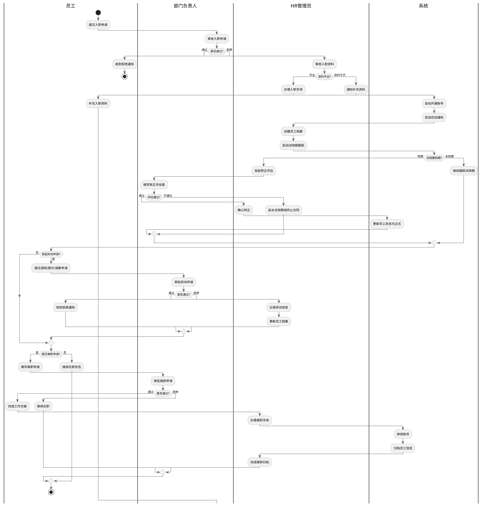

### 2.6 用户角色定义

| 角色名称 | 角色描述 | 主要职责 | 权限范围 |
|---------|---------|---------|---------|
| 超级管理员 | 系统最高权限管理者 | 系统配置、权限管理、全量数据访问 | 所有功能的增删改查 |
| HR管理员 | 人力资源部门核心操作人员 | 维护组织架构、管理员工档案、处理入离职流程 | 组织管理和员工管理全部功能 |
| 部门负责人 | 各业务部门负责人 | 查看本部门组织和员工信息，审批本部门申请 | 本部门数据查看，审批功能 |
| 普通员工 | 在职员工 | 查看个人信息，提交相关申请 | 个人信息查看，申请提交 |

## 三、工作台

### 3.1 功能概述

工作台是企业HR系统的首页，作为用户登录后的第一个页面，为不同角色的用户提供个性化的工作视图。工作台整合了用户信息、快捷入口、日程管理、审批概况等核心功能，帮助用户快速了解工作状态、访问常用功能，提升工作效率。

工作台采用角色化设计，根据用户角色（超级管理员、HR管理员、部门负责人、普通员工）展示不同的内容和功能模块，确保每个用户看到的信息与其工作职责相匹配。

### 3.2 页面访问权限

| 功能模块 | 超级管理员 | HR管理员 | 部门负责人 | 普通员工 |
|---------|-----------|---------|-----------|---------|
| 工作台首页 | ✓ | ✓ | ✓ | ✓ |
| 员工统计卡片 | ✓ | ✓ | ✗ | ✗ |
| 快捷入口（自定义） | ✓ | ✓ | ✓ | ✓ |
| 日程管理 | ✓ | ✓ | ✓ | ✓ |
| 审批概况 | ✓ | ✓ | ✓（仅本部门） | ✓（仅个人） |

### 3.3 功能详细设计

#### 3.3.1 工作台首页

##### （一）功能需求概述

工作台首页是用户登录系统后的默认页面，提供个性化的工作视图。页面顶部展示当前登录用户的基本信息（姓名、头像、角色、部门）和实时天气信息；中间区域根据用户角色展示不同的统计卡片和快捷入口；底部区域展示日程待办和审批概况。

工作台采用响应式布局，支持PC端和移动端访问，确保用户在不同设备上都能获得良好的使用体验。

**主要功能点：**

- 用户信息展示：显示当前登录用户的姓名、头像、角色、部门信息
- 天气信息展示：根据用户IP地址自动定位，显示当前城市的实时天气
- 员工统计卡片：仅管理员和HR角色可见，展示在职、待入职、试用期、正式、待离职、已离职员工数量
- 快捷入口：支持用户自定义常用功能的快捷访问，可添加、删除、排序
- 日程管理：展示个人日程，支持查看、新增、编辑、删除日程，支持日程提醒
- 审批概况：展示待审批、已审批、已拒绝等审批统计，支持点击"全部审批"跳转到审批列表页

**使用角色：**

| 角色 | 可见内容 |
|------|---------|
| 超级管理员 | 用户信息、天气、员工统计、快捷入口、日程管理、审批概况（全部） |
| HR管理员 | 用户信息、天气、员工统计、快捷入口、日程管理、审批概况（全部） |
| 部门负责人 | 用户信息、天气、快捷入口、日程管理、审批概况（本部门） |
| 普通员工 | 用户信息、天气、快捷入口、日程管理、审批概况（个人） |

---

##### （二）用户操作流程

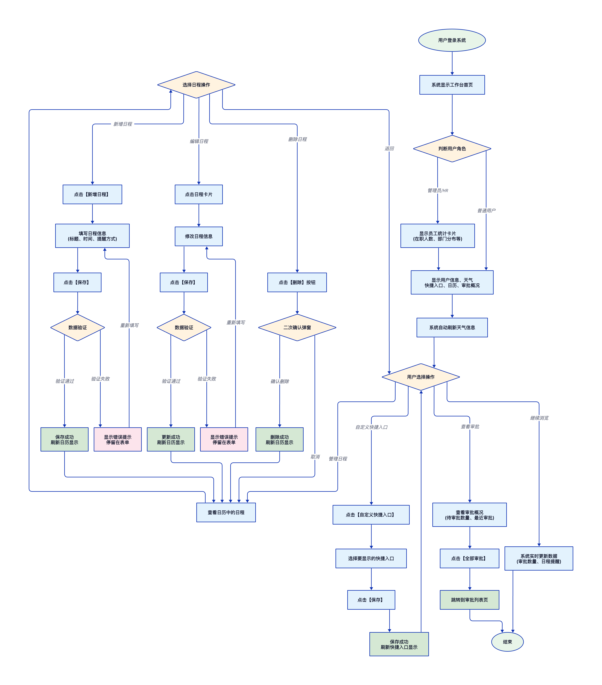

**流程说明：**

1. **登录系统**：用户输入账号密码登录系统，系统验证通过后跳转到工作台首页；
2. **查看工作台**：系统根据用户角色加载对应的工作台内容，展示用户信息、天气、统计卡片、快捷入口、日程和审批概况；
3. **自定义快捷入口**：用户点击快捷入口右上角的"自定义"按钮，进入快捷入口配置页面，可添加、删除、排序常用功能，保存后返回工作台；
4. **管理日程**：用户点击日历中的日期或日程，可查看日程详情、新增日程、编辑日程、删除日程；系统支持日程提醒功能，到期前通过站内消息提醒用户；
5. **查看审批概况**：用户查看审批概况图表，点击"全部审批"按钮跳转到审批列表页，查看详细的审批记录；

---

##### （三）功能设计

**系统交互时序**

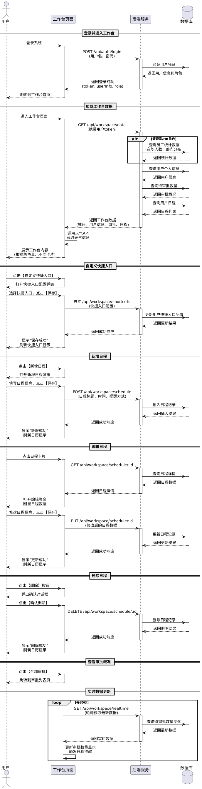

**核心功能**

1. **用户信息展示**
   - 显示当前登录用户的头像、姓名、角色、部门信息
   - 头像支持点击跳转到个人信息页面
   - 显示问候语（根据时间段显示"早上好"、"下午好"、"晚上好"）

2. **天气信息展示**
   - 根据用户IP地址自动定位城市
   - 调用第三方天气API获取实时天气信息
   - 显示城市名称、天气状况、温度、空气质量等信息
   - 天气信息每小时自动刷新一次

3. **员工统计卡片**（仅管理员和HR角色可见）
   - 在职员工：当前在职状态的员工总数
   - 待入职员工：已发放Offer但尚未入职的员工数
   - 试用期员工：当前处于试用期的员工数
   - 正式员工：已转正的正式员工数
   - 待离职员工：已提交离职申请但尚未办理完离职手续的员工数
   - 已离职员工：已完成离职手续的员工数
   - 每个卡片支持点击跳转到对应的员工列表页

4. **快捷入口**
   - 默认展示用户角色权限范围内的常用功能（如部门管理、员工档案、考勤记录等具体功能页面）
   - 快捷入口必须指向具体的功能页面（二级或更深层级的路由），不能指向一级菜单
   - 支持用户自定义快捷入口：添加、删除、排序
   - 快捷入口以网格形式展示，每个入口显示图标和名称
   - 最多支持16个快捷入口
   - 点击快捷入口直接跳转到对应的功能页面

5. **日程管理**
   - 以月历形式展示当前月份的日程
   - 日历中标注有日程的日期，点击日期查看当天的日程列表
   - 支持新增日程：填写日程标题、时间、地点、备注等信息
   - 支持编辑日程：修改日程信息
   - 支持删除日程：删除不需要的日程
   - 支持日程提醒：到期前通过站内消息提醒用户
   - 日程数据来源：个人日程（用户自己创建的日程）

6. **审批概况**
   - 以柱状图形式展示不同审批类型的统计数据（待审批、已审批、已拒绝）
   - 超级管理员和HR管理员：查看全部审批数据
   - 部门负责人：查看本部门的审批数据
   - 普通员工：查看个人的审批数据
   - 支持点击"全部审批"按钮跳转到审批列表页
   - 图表不支持点击柱状图跳转，仅展示统计数据

**数据字段**

**用户信息**

| 字段名称 | 字段类型 | 长度限制 | 是否必填 | 说明 |
|---------|---------|---------|---------|------|
| 用户姓名 | 文本 | 50 | 是 | 当前登录用户的姓名 |
| 用户头像 | 图片URL | 200 | 否 | 用户头像图片地址 |
| 用户角色 | 文本 | 50 | 是 | 用户角色名称（超级管理员、HR管理员、部门负责人、普通员工） |
| 所属部门 | 文本 | 100 | 是 | 用户所属部门名称 |

**天气信息**

| 字段名称 | 字段类型 | 长度限制 | 是否必填 | 说明 |
|---------|---------|---------|---------|------|
| 城市名称 | 文本 | 50 | 是 | 根据IP定位的城市名称 |
| 天气状况 | 文本 | 20 | 是 | 天气状况描述（晴、多云、雨等） |
| 当前温度 | 数字 | - | 是 | 当前温度（摄氏度） |
| 空气质量 | 文本 | 20 | 否 | 空气质量等级（优、良、轻度污染等） |

**员工统计**

| 字段名称 | 字段类型 | 长度限制 | 是否必填 | 说明 |
|---------|---------|---------|---------|------|
| 在职员工数 | 数字 | - | 是 | 当前在职状态的员工总数 |
| 待入职员工数 | 数字 | - | 是 | 已发放Offer但尚未入职的员工数 |
| 试用期员工数 | 数字 | - | 是 | 当前处于试用期的员工数 |
| 正式员工数 | 数字 | - | 是 | 已转正的正式员工数 |
| 待离职员工数 | 数字 | - | 是 | 已提交离职申请但尚未办理完离职手续的员工数 |
| 已离职员工数 | 数字 | - | 是 | 已完成离职手续的员工数 |

**快捷入口**

| 字段名称 | 字段类型 | 长度限制 | 是否必填 | 说明 |
|---------|---------|---------|---------|------|
| 入口名称 | 文本 | 50 | 是 | 快捷入口显示的名称 |
| 入口图标 | 文本 | 50 | 是 | 图标代码或图标URL |
| 跳转路径 | 文本 | 200 | 是 | 点击后跳转的路由路径 |
| 排序序号 | 数字 | - | 是 | 快捷入口的显示顺序 |

**日程信息**

| 字段名称 | 字段类型 | 长度限制 | 是否必填 | 说明 |
|---------|---------|---------|---------|------|
| 日程标题 | 文本 | 100 | 是 | 日程的标题 |
| 日程时间 | 日期时间 | - | 是 | 日程的开始时间 |
| 日程地点 | 文本 | 100 | 否 | 日程的地点 |
| 日程备注 | 文本 | 500 | 否 | 日程的详细说明 |
| 是否提醒 | 布尔值 | - | 是 | 是否开启日程提醒 |
| 提醒时间 | 日期时间 | - | 否 | 提醒的时间（如提前30分钟） |

**审批概况**

| 字段名称 | 字段类型 | 长度限制 | 是否必填 | 说明 |
|---------|---------|---------|---------|------|
| 待审批数量 | 数字 | - | 是 | 待审批的申请数量 |
| 已审批数量 | 数字 | - | 是 | 已审批通过的申请数量 |
| 已拒绝数量 | 数字 | - | 是 | 已拒绝的申请数量 |
| 审批类型 | 文本 | 50 | 是 | 审批类型（请假、加班、调薪等） |

**业务规则**

1. **角色权限规则**
   - 超级管理员和HR管理员：可查看员工统计卡片、全部审批数据
   - 部门负责人：不可查看员工统计卡片，只能查看本部门的审批数据
   - 普通员工：不可查看员工统计卡片，只能查看个人的审批数据

2. **天气信息规则**
   - 天气信息根据用户IP地址自动定位城市
   - 天气数据每小时自动刷新一次
   - 如果天气API调用失败，显示默认天气信息或隐藏天气模块

3. **快捷入口规则**
   - 快捷入口必须指向具体的功能页面（二级或更深层级的路由），不能指向一级菜单
   - 用户只能添加其角色权限范围内的功能作为快捷入口
   - 快捷入口最多支持16个
   - 快捷入口的排序由用户自定义，保存后立即生效
   - 一级菜单（如"组织管理"、"员工管理"）不能作为快捷入口，应选择具体的二级页面（如"部门管理"、"员工档案"）

4. **日程管理规则**
   - 日程时间不能早于当前时间
   - 日程提醒时间必须早于日程开始时间
   - 用户只能查看、编辑、删除自己创建的日程

5. **审批概况规则**
   - 审批概况数据实时更新
   - 部门负责人只能查看本部门员工的审批数据
   - 普通员工只能查看自己提交的审批数据

---

##### （四）业务逻辑关联

工作台模块与以下模块存在业务逻辑关联：

1. **用户管理模块**：工作台需要获取当前登录用户的基本信息（姓名、头像、角色、部门）
2. **员工管理模块**：员工统计卡片需要从员工管理模块获取不同状态的员工数量
3. **审批流引擎**：审批概况需要从审批流引擎获取待审批、已审批、已拒绝的审批数量
4. **权限管理模块**：快捷入口需要根据用户角色权限过滤可访问的功能
5. **日程管理模块**：日程管理功能需要调用日程管理模块的API进行日程的增删改查

## 四、组织管理

### 4.1 功能概述

组织管理模块是企业HR系统的基础模块，负责企业组织架构的搭建和维护。包括部门管理、岗位管理、编制管理和组织架构图四个核心功能，支持无限层级的树形组织结构，为员工管理、权限控制、数据隔离等功能提供基础支撑。

### 4.2 页面访问权限

| 功能模块 | 超级管理员 | HR管理员 | 部门负责人 | 普通员工 |
|---------|-----------|---------|-----------|---------|
| 部门管理 | ✓ | ✓ | ✓（仅查看） | ✗ |
| 岗位管理 | ✓ | ✓ | ✓（仅查看） | ✗ |
| 编制管理 | ✓ | ✓ | ✓（仅查看本部门） | ✗ |
| 组织架构图 | ✓ | ✓ | ✓ | ✓（仅查看） |

### 4.3 功能详细设计

#### 4.3.1 部门管理

##### （一）功能需求概述

部门管理是企业组织架构的基础模块，支持无限层级的树形部门结构。HR管理员可以维护部门的基本信息，包括部门名称、上级部门、负责人、编制人数、成立时间及职能描述等；支持对部门进行新增、编辑、删除及层级调整操作。普通员工和部门负责人具有只读权限，可查看完整的部门树结构。

**主要功能点：**

- 以树形结构展示企业完整的组织层级，支持无限层级嵌套
- 支持按部门名称搜索，快速定位目标部门
- 支持新增任意层级的部门节点
- 支持对已有部门信息进行编辑修改
- 支持删除无子部门、无在职员工的叶子节点部门
- 支持通过修改上级部门字段来调整部门在树中的层级位置
- 部门负责人从员工档案中选取，实现人员与组织的关联

**使用角色：**

| 角色 | 操作权限 |
|------|---------|
| 超级管理员 | 新增、编辑、删除、查看 |
| HR管理员 | 新增、编辑、删除、查看 |
| 部门负责人 | 仅查看 |
| 普通员工 | 无权限 |

---

##### （二）用户操作流程

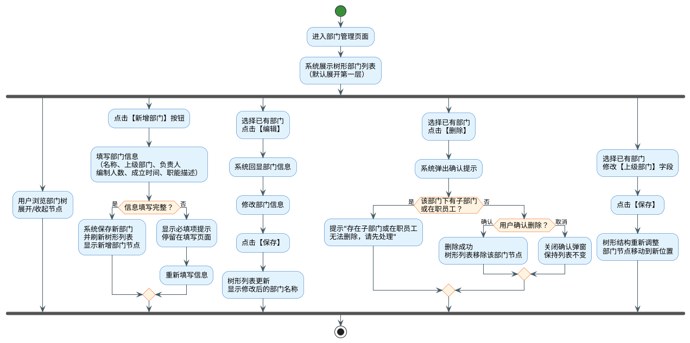

**流程说明：**

1. **查看部门树**：用户进入部门管理页面，系统默认展示展开第一层的树形部门列表，用户可自由展开或收起各层节点；
2. **新增部门**：用户点击【新增部门】，填写必要信息后保存，系统将新部门节点添加至对应上级部门下方；若必填项未填写，系统给出提示，停留在填写页面；
3. **编辑部门**：用户选择目标部门并点击【编辑】，系统回显当前部门信息，用户修改后保存，树形列表同步更新；
4. **删除部门**：用户点击【删除】后，系统首先校验该部门是否存在子部门或在职员工，若存在则给出不可删除提示；不存在时弹出二次确认，用户确认后删除成功；
5. **调整层级**：用户编辑部门时修改【上级部门】字段，保存后部门节点移动至新的层级位置，树形结构实时更新。

---

##### （三）功能设计

**系统交互时序：**

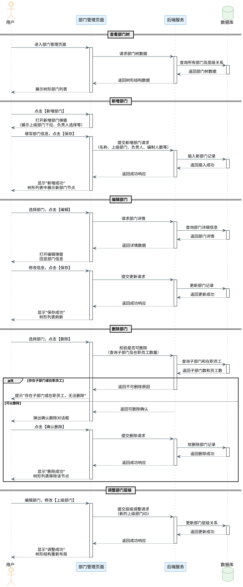

**核心功能：**

- **部门树展示**：以树形控件展示全量部门层级，支持无限层级嵌套，默认展开第一层，支持手动展开/收起节点；
- **搜索定位**：支持按部门名称关键字搜索，搜索结果高亮显示匹配节点并自动展开路径；
- **新增部门**：点击【新增部门】弹出对话框，填写部门基本信息，选择上级部门后保存，新部门挂载到所选上级部门下；
- **编辑部门**：点击目标部门的【编辑】按钮，弹出编辑对话框并回显当前数据，修改后保存生效；
- **删除部门**：系统在执行删除前校验是否存在子部门或在职员工，若存在则拒绝删除并给出提示，通过校验后需用户二次确认方可删除；
- **调整层级**：编辑部门时可修改【上级部门】字段实现部门层级调整，系统同步更新整棵树的层级关系；
- **负责人设置**：部门负责人从员工档案中选取，支持搜索姓名或工号定位员工，一个部门只能设置一位负责人。

**字段说明：**

| 字段名称 | 字段类型 | 长度限制 | 是否必填 | 说明 |
|---------|---------|---------|---------|------|
| 部门名称 | 文本 | 最多50字 | 是 | 部门的正式名称，同级部门下不允许重名 |
| 上级部门 | 下拉选择（树形） | — | 否 | 选择该部门的直属上级部门；不选则作为顶级部门 |
| 部门负责人 | 搜索选择 | — | 否 | 从在职员工中选取，每个部门只能设置一位负责人 |
| 编制人数 | 数字文本 | 1～9999 | 否 | 该部门的计划编制人数，用于编制管理模块的超编/缺编统计 |
| 成立时间 | 日期选择 | — | 否 | 部门正式成立的日期，格式为 YYYY-MM-DD |
| 职能描述 | 多行文本 | 最多500字 | 否 | 部门的主要职责与业务范围说明 |
| 部门编码 | 文本 | 最多20字 | 否 | 部门唯一标识编码，系统自动生成，支持手动修改 |

**业务规则：**

- **删除限制**：若部门下存在子部门，禁止删除，需先将子部门迁移或删除；若部门下存在在职员工（员工状态为"在职"），禁止删除，需先将员工转移至其他部门或办理离职；
- **层级限制**：调整上级部门时，不允许将部门设置为其自身下级部门的上级（即不允许循环引用），系统在选择上级部门时自动屏蔽当前部门的所有下级部门；
- **重名限制**：同一上级部门下，不允许存在名称完全相同的子部门；
- **负责人关联**：设置为部门负责人的员工离职后，系统自动清空该部门的负责人字段，并在部门列表中标记"负责人待补充"提醒HR管理员及时更新；
- **编制联动**：部门的编制人数字段与编制管理模块联动，修改后实时更新各部门的超编/缺编统计数据；
- **顶级部门**：上级部门字段留空时，该部门作为第一层顶级部门展示在树的根节点，企业可设置多个顶级部门。

---

##### （四）业务逻辑关联

部门管理作为组织架构的基础数据来源，与系统多个模块存在紧密的关联关系：

| 关联模块 | 关联说明 |
|---------|---------|
| 岗位管理 | 岗位归属于具体部门，部门删除前需清空或迁移该部门下的所有岗位 |
| 编制管理 | 编制计划以部门为单位设置，部门新增后自动在编制管理模块创建对应的编制记录 |
| 员工档案 | 员工档案中的"所属部门"字段从部门树中选取，部门调整后员工归属关系同步更新 |
| 组织架构图 | 组织架构图以部门树为数据源进行可视化渲染，部门信息变更后架构图实时刷新 |
| 员工异动 | 调岗记录中的"调入部门"和"调出部门"均引用部门管理的数据 |
| 权限管理 | 部门负责人角色的数据权限范围依据部门层级自动划定，层级调整后权限范围同步更新 |

#### 4.3.2 岗位管理

##### （一）功能需求概述

岗位管理用于维护企业岗位体系，是组织架构管理的重要组成部分。岗位信息与部门、员工档案、编制管理等模块紧密关联，是员工入职、异动、薪酬核算的基础数据来源。

**核心功能概述：**

| 功能项 | 说明 |
|-------|------|
| 岗位列表查看 | 以表格形式展示所有岗位，支持按部门/职级/状态筛选查询 |
| 新增岗位 | 填写岗位基本信息，包括名称、所属部门、岗位类别、职级职等、岗位说明书 |
| 编辑岗位 | 修改已有岗位信息，实时更新关联数据 |
| 停用岗位 | 将不再使用的岗位标记为停用，停用前检查是否有在职员工 |
| 岗位说明书维护 | 支持在岗位详情中录入职责描述、任职要求等说明书内容 |

**用户角色与权限：**

| 角色 | 可执行操作 |
|-----|----------|
| 超级管理员 | 新增、编辑、停用、查询全部岗位 |
| HR管理员 | 新增、编辑、停用、查询全部岗位 |
| 部门负责人 | 仅查看本部门相关岗位 |
| 普通员工 | 无访问权限 |

##### （二）用户操作流程

以下活动图描述了 HR 管理员在岗位管理页面的主要操作路径，包含查询筛选、新增岗位、编辑岗位和停用岗位四条主线流程：

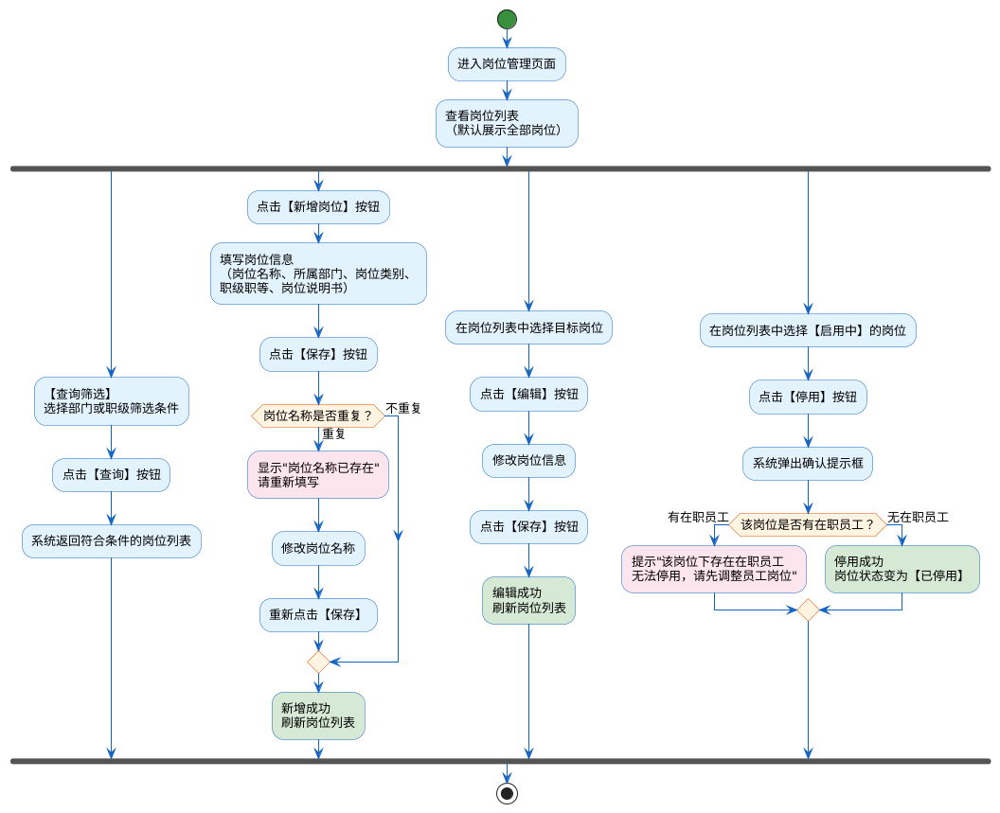

**流程说明：**

- **查询筛选**：用户进入页面后，可通过岗位名称、所属部门、职级或岗位状态条件进行精准筛选，系统实时返回匹配结果。
- **新增岗位**：用户填写岗位信息后提交，系统自动校验岗位名称唯一性；若名称重复则提示重新填写，校验通过则保存成功。
- **编辑岗位**：用户选择目标岗位后，系统回显已有数据，用户修改后保存，列表同步刷新。
- **停用岗位**：系统在执行停用前，自动检查该岗位下是否存在在职员工；存在则阻止操作并给出提示，不存在则停用成功。

##### （三）功能设计

###### 系统交互时序

以下时序图展示了岗位管理各核心操作的前后端交互过程：

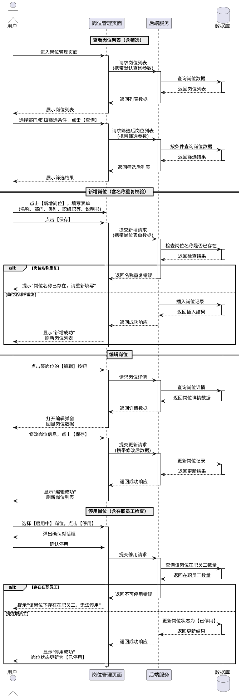

###### 核心功能说明

**1. 岗位列表与筛选**

- 默认加载全部岗位数据，按创建时间倒序排列
- 支持多条件组合筛选：岗位名称（模糊搜索）、所属部门、职级、岗位状态（启用/停用）
- 列表展示字段：岗位名称、所属部门、岗位类别、职级、职等、在职人数、岗位状态、操作

**2. 新增岗位**

- 点击【新增岗位】按钮，弹出新增表单弹窗
- 必填字段：岗位名称、所属部门、岗位类别、职级
- 选填字段：职等、岗位说明书、任职要求
- 保存时系统校验岗位名称在同一部门内是否唯一，重复则拦截并提示

**3. 编辑岗位**

- 点击列表行的【编辑】按钮，弹出编辑表单，回显当前岗位信息
- 支持修改所有字段（岗位名称修改同样需要唯一性校验）
- 保存后，与该岗位关联的员工档案中的岗位信息同步更新

**4. 停用岗位**

- 仅【启用中】状态的岗位可执行停用操作
- 停用前弹出确认弹窗，用户确认后系统检查该岗位下的在职员工数量
- 若存在在职员工，操作被阻止，提示"该岗位下存在在职员工，无法停用，请先调整员工岗位"
- 若无在职员工，岗位状态更新为【已停用】，已停用岗位不可在新增/异动员工时被选择

**5. 岗位说明书**

- 在新增/编辑表单中提供"岗位说明书"富文本输入区
- 支持录入：岗位职责、任职要求、工作汇报对象、协作部门等内容

###### 字段说明

**岗位基本信息字段：**

| 字段名称 | 字段类型 | 长度限制 | 是否必填 | 说明 |
|---------|---------|---------|---------|------|
| 岗位名称 | 文本输入 | 最多50字 | 是 | 同一部门内不允许重复 |
| 所属部门 | 下拉选择 | - | 是 | 选择企业部门，支持选择任意层级部门 |
| 岗位类别 | 下拉选择 | - | 是 | 可选值：管理岗、技术岗、职能岗、操作岗、销售岗 |
| 职级 | 下拉选择 | - | 是 | 可选值：P1~P10（P1-P3初级、P4-P6中级、P7-P9高级、P10专家） |
| 职等 | 下拉选择 | - | 是 | 同一职级下的细分等级，范围1-20 |
| 岗位说明书 | 文本输入（多行） | 最多5000字 | 否 | 岗位职责描述 |
| 任职要求 | 文本输入（多行） | 最多5000字 | 否 | 任职资格和能力要求 |
| 在职人数 | 系统自动统计 | - | - | 该岗位当前在职员工数量，系统自动计算 |
| 岗位状态 | 系统自动维护 | - | - | 启用/停用，新增岗位默认为启用 |
| 创建时间 | 系统自动生成 | - | - | 岗位记录创建时间，不可修改 |
| 更新时间 | 系统自动生成 | - | - | 岗位记录最后更新时间，系统自动维护 |

###### 业务规则

| 规则编号 | 规则描述 |
|---------|---------|
| POS-001 | 同一部门内岗位名称不允许重复，保存时系统自动校验 |
| POS-002 | 新增岗位默认状态为【启用】 |
| POS-003 | 停用岗位前，系统需检查该岗位下是否存在在职员工，有则阻止停用 |
| POS-004 | 已停用的岗位不可在新增员工、员工异动中被选择 |
| POS-005 | 岗位被员工档案引用时，修改岗位名称不影响员工档案中的历史快照记录 |
| POS-006 | 岗位删除功能暂不提供，仅支持停用，保留历史数据可追溯性 |
| POS-007 | 部门负责人仅可查看本部门及下级部门的岗位，无新增/编辑/停用权限 |

##### （四）业务逻辑关联

岗位管理与其他模块存在以下关联关系：

| 关联模块 | 关联说明 |
|---------|---------|
| 部门管理 | 每个岗位必须归属于一个部门，部门停用时需先处理该部门下的岗位 |
| 编制管理 | 编制计划按岗位维度进行统计，岗位是编制管理的基本单元 |
| 员工档案 | 员工档案中的"岗位"字段引用岗位管理中的启用状态岗位 |
| 入职管理 | 入职登记时需选择岗位，仅显示启用状态的岗位供选择 |
| 员工异动 | 调岗记录中的新岗位/原岗位字段均来源于岗位管理 |
| 组织架构图 | 组织架构图可按岗位维度展示各部门岗位分布情况 |

#### 4.3.3 编制管理

##### （一）功能需求概述

编制管理用于设定各部门的年度编制计划人数，实时展示当前在编人数，并自动计算缺编/超编情况进行可视化预警。HR管理员可按年度维护各部门的编制计划，系统通过与员工档案数据联动，实时统计各部门在编人数，为招聘计划和人力资源配置决策提供数据支撑。

**核心功能：**

- **编制计划维护**：按年度、按部门设定编制计划人数，支持新增、修改、删除操作
- **实时统计展示**：自动同步员工档案中的在编人数，展示编制总数、在编人数、缺编数、超编数
- **超编/缺编预警**：超编时红色标记，缺编时橙色标记，支持按预警状态筛选
- **数据导出**：支持按年度导出编制情况报表（Excel 格式）

**权限说明：**

| 角色 | 查看编制列表 | 新增/修改编制计划 | 导出报表 |
|------|------------|-----------------|---------|
| 超级管理员 | ✓（所有部门） | ✓ | ✓ |
| HR管理员 | ✓（所有部门） | ✓ | ✓ |
| 部门负责人 | ✓（仅本部门） | ✗ | ✗ |
| 普通员工 | ✗ | ✗ | ✗ |

---

##### （二）用户操作流程

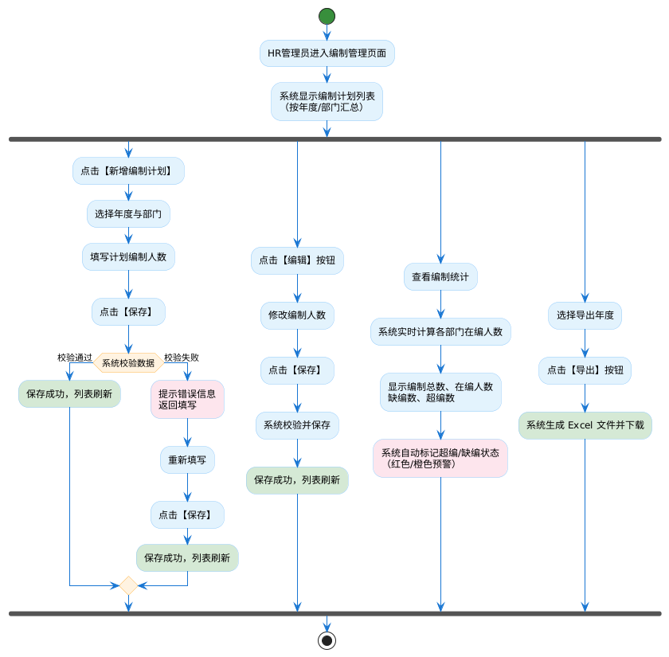

---

##### （三）功能设计

**1. 核心功能说明**

**编制计划维护**

HR管理员在编制计划列表页可按年度、部门进行筛选查看。页面加载时，年度筛选器默认选中当前年份（如2026年），自动展示当前年度的编制数据。点击【新增】按钮后，在弹窗中选择目标年度和部门，填写计划编制人数后保存。系统校验同一年度下同一部门不允许重复创建编制计划，已存在则提示错误。编辑时回显当前数据，修改编制人数后保存，系统同步重新计算缺编/超编数量。

**实时统计展示**

页面顶部展示汇总数据卡片，包含：总编制人数、全公司在编人数、缺编合计、超编合计。统计卡片的数据根据当前筛选条件（年度、部门、状态）动态计算，例如筛选2024年时显示2024年的统计数据，筛选技术部时显示技术部的统计数据。列表中每行显示部门的编制计划数、在编人数、差值（缺编为正数/超编为负数）及预警状态。在编人数数据来源为员工档案模块中状态为"在职"的员工，每次页面加载或筛选条件变化时实时查询计算。

**预警提醒**

系统根据计划编制人数与在编人数的差值自动判断预警状态：
- **正常**：在编人数 ≤ 计划编制人数，无预警
- **缺编**：在编人数 < 计划编制人数 × 80%，橙色标记提醒
- **超编**：在编人数 > 计划编制人数，红色标记提醒

**数据导出**

页面右上角提供【导出编制报表】按钮，点击后系统根据当前筛选条件（年度、部门、状态）导出符合条件的编制数据为 Excel 文件。导出内容包含：年度、部门名称、计划编制人数、在编人数、缺编人数、超编人数、编制状态、备注说明、创建时间。文件命名规则为"编制管理报表_YYYYMMDD_HHmmss.xlsx"，如"编制管理报表_20260410_143025.xlsx"。导出过程中显示加载提示，导出完成后自动下载到本地。

---

**2. 系统交互时序**

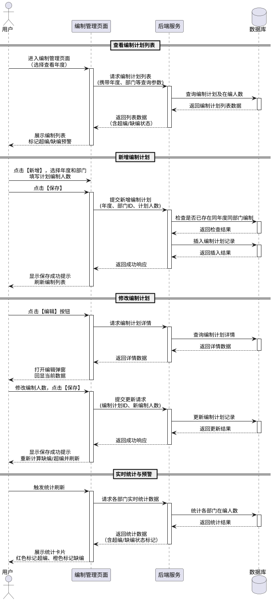

---

**3. 字段说明**

**编制计划信息字段：**

| 字段名称 | 字段类型 | 长度限制 | 是否必填 | 说明 |
|---------|---------|---------|---------|------|
| 年度 | 下拉选择 | - | 是 | 选择编制计划所属年度，如 2024、2025、2026 |
| 部门名称 | 下拉选择（树形） | - | 是 | 选择目标部门，支持层级树选择，同一年度内每个部门只允许创建一条编制计划 |
| 计划编制人数 | 文本（数字） | 最大 9999 | 是 | 该部门本年度计划招募/在编的总人数，仅允许输入正整数 |
| 备注说明 | 文本（多行） | 最多 200 字 | 否 | 编制计划的补充说明，如编制调整原因等 |
| 创建时间 | 日期时间（系统自动） | - | - | 系统自动记录，不可编辑 |

**编制统计展示字段（只读）：**

| 字段名称 | 字段类型 | 长度限制 | 是否必填 | 说明 |
|---------|---------|---------|---------|------|
| 在编人数 | 数字（系统计算） | - | - | 实时统计该部门状态为"在职"的员工总数，数据来源于员工档案 |
| 缺编/超编数 | 数字（系统计算） | - | - | 计划编制人数 − 在编人数，正数为缺编，负数为超编 |
| 预警状态 | 标签（系统判定） | - | - | 根据缺编/超编数自动标记：正常（绿色）、缺编（橙色）、超编（红色） |

---

**4. 业务规则**

1. **唯一性约束**：同一年度内，同一部门只允许存在一条有效的编制计划记录；重复创建时系统提示"该部门本年度编制计划已存在"。
2. **数据联动**：在编人数实时从员工档案模块获取，员工入职、离职、状态变更均自动影响在编统计，无需手动维护。
3. **层级约束**：子部门编制总和不能超过父部门编制。新增或修改子部门编制时，系统自动计算同级所有部门的编制总和，如果总和超过父部门编制，则提示错误"子部门编制总和（XXX人）超过父部门编制（XXX人），请先调整父部门编制"，操作失败。调整顺序：先增加父部门编制，再增加子部门编制。
4. **统计卡片显示**：页面顶部统计卡片的"总编制人数"显示总公司（根部门）的编制人数，不是所有部门编制的求和。"在编人数"统计全公司所有在职员工数量。"缺编人数"和"超编人数"基于总公司编制与全公司在编人数计算。
5. **删除限制**：若该年度编制计划已被其他模块（如招聘计划）引用，则不允许删除，系统提示"该编制计划存在关联数据，无法删除"。
6. **历史查询**：支持查看往年编制计划数据，历史数据只读，不允许修改。2026年之前的数据不可编辑和删除。
7. **缺编率阈值**：在编人数低于计划编制人数的 80% 时触发缺编预警，此阈值由系统管理员在系统配置中调整。
8. **导出范围**：导出时按当前筛选条件（年度、部门、状态）导出符合条件的编制数据，包含年度、部门名称、计划编制人数、在编人数、缺编人数、超编人数、编制状态、备注说明、创建时间等字段。
9. **导出格式**：导出文件为 Excel 格式（.xlsx），文件命名规则为"编制管理报表_YYYYMMDD_HHmmss.xlsx"，如"编制管理报表_20260410_143025.xlsx"。
10. **导出权限**：仅超级管理员和HR管理员拥有导出权限，部门负责人和普通员工无导出权限。

---

##### （四）业务关联

| 关联模块 | 关联方式 | 说明 |
|---------|---------|------|
| 部门管理 | 数据引用 | 编制计划以部门为维度建立，部门列表来源于部门管理模块；部门删除时需检查是否存在编制计划 |
| 员工档案 | 数据联动 | 在编人数实时从员工档案中统计"在职"员工数量，员工状态变更即时影响编制统计 |
| 入职管理 | 业务约束 | 办理员工入职时，系统可提示该部门当前编制使用情况，超编时给出警告提示（不强制拦截） |
| 离职管理 | 数据联动 | 员工离职确认后，对应部门在编人数自动减少，编制统计实时更新 |

#### 4.3.4 组织架构图

##### （一）功能需求概述

组织架构图以可视化方式展示企业完整的组织层级结构，帮助管理人员和员工快速了解公司的部门划分与汇报关系。系统支持按**部门**或**岗位**两种维度切换查看架构图，节点信息包含部门名称（或岗位名称）、负责人姓名及当前在编人数。用户可自由展开或折叠任意层级节点，支持将当前架构图导出为 PDF 或图片格式，便于打印存档和对外展示。

**核心功能一览：**

| 功能 | 说明 |
|------|------|
| 架构图展示 | 以树形图方式展示企业组织层级，节点显示部门名称、负责人、在编人数 |
| 维度切换 | 支持按部门维度和按岗位维度两种视角切换查看 |
| 展开/折叠节点 | 可对任意层级节点进行展开或折叠操作，灵活控制显示范围 |
| 导出功能 | 支持将当前架构图导出为 PDF 或图片（PNG）格式 |

##### （二）用户操作流程

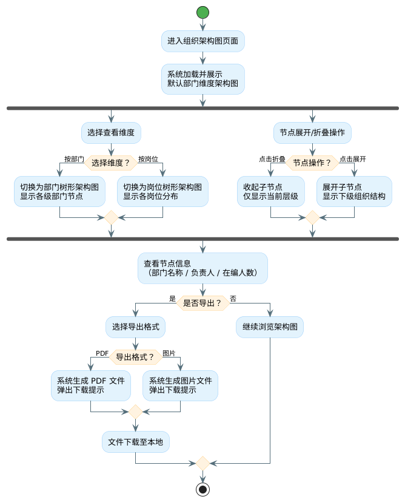

##### （三）功能设计

###### 1. 核心功能

**架构图展示**

进入组织架构图页面后，系统默认以部门维度加载完整的树形架构图。每个节点以卡片形式展示以下信息：
- 部门名称（或岗位名称）
- 负责人姓名
- 在编人数（当前实际人数 / 编制计划数）

树形图支持横向或纵向布局，根节点为企业根部门，子节点按层级逐级展开。超过三级的深层结构默认折叠，用户可手动展开查看。

**维度切换**

页面顶部提供维度切换按钮，支持以下两种查看视角：

| 维度 | 说明 |
|------|------|
| 按部门 | 展示各部门的层级从属关系，节点显示部门信息 |
| 按岗位 | 展示各岗位在各部门中的分布情况，节点显示岗位信息 |

切换维度时，系统重新请求对应数据并重新渲染架构图，切换过程显示加载动画。

**展开/折叠节点**

每个包含子节点的节点右侧或下方提供展开/折叠图标（▶ / ▼）：
- 点击折叠：收起该节点下的所有子节点，图标切换为 ▶
- 点击展开：展开该节点下的直属子节点，图标切换为 ▼
- 支持一键全部展开 / 全部折叠快捷操作

**导出功能**

页面右上角提供【导出】按钮，点击后弹出格式选择菜单：
- **导出为 PDF**：生成高清 PDF 文件，包含完整架构图，适合打印和正式存档
- **导出为图片**：生成 PNG 格式图片，适合快速分享和嵌入文档

导出时以当前展开状态和选择的维度为准，不额外折叠或展开节点。

###### 2. 系统交互时序

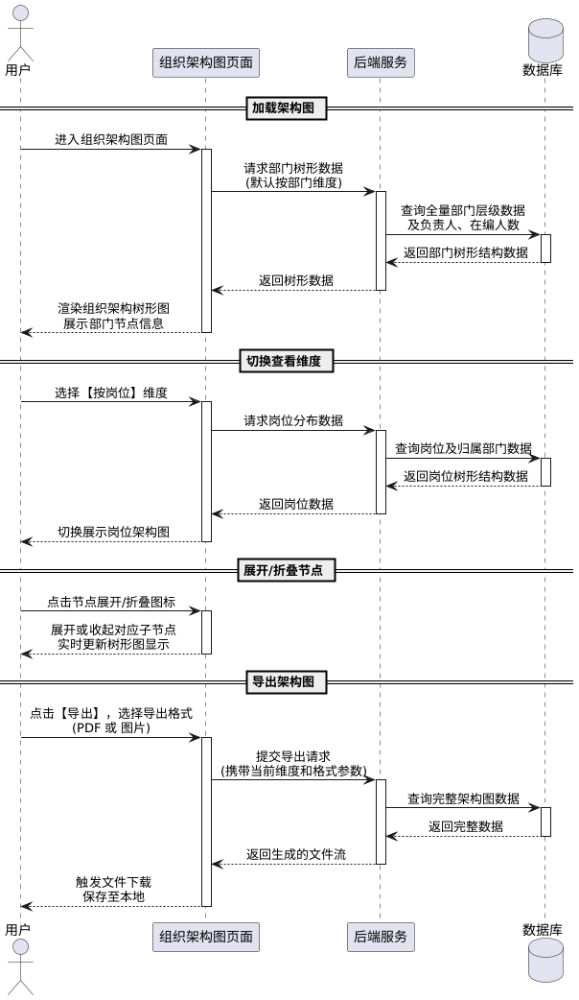

###### 3. 字段说明

| 字段名称 | 字段类型 | 长度限制 | 是否必填 | 说明 |
|---------|---------|---------|---------|------|
| 部门名称 | 文本 | 最多 50 字符 | 是 | 组织架构节点显示的部门或岗位名称 |
| 负责人 | 文本 | 最多 20 字符 | 否 | 该部门或岗位的负责人姓名，未设置时显示"暂无" |
| 在编人数 | 数字 | — | 否 | 格式为"当前人数 / 编制计划数"，编制未配置时仅显示当前人数 |
| 层级路径 | 文本 | — | 是 | 节点在组织树中的完整层级路径，用于定位和展示面包屑 |
| 节点状态 | 单选 | — | 是 | 标识节点当前是否启用，停用部门在架构图中置灰显示 |

###### 4. 业务规则

1. **权限控制**：超级管理员、HR管理员、部门负责人可查看完整架构图；普通员工仅可查看架构图，不可进行任何编辑操作。
2. **停用部门显示**：停用状态的部门节点在架构图中仍然显示，但以灰色样式区分，不影响整体层级完整性。
3. **在编人数统计**：节点在编人数为实时统计值，基于当前员工档案中处于"在职"状态的员工数量自动汇总，无需人工维护。
4. **导出范围**：导出内容以当前屏幕所选维度（部门/岗位）及展开状态为准，导出文件包含完整层级，不受折叠状态影响。
5. **数据同步**：组织架构图数据与部门管理模块实时同步，部门管理中的新增、编辑、删除操作会立即反映在架构图中。
6. **最大层级**：系统支持展示不超过 10 级的部门层级，超出层级的节点以提示方式告知用户通过部门管理页面查看。

## 五、员工管理

### 5.1 功能概述

员工管理模块是企业人力资源管理的核心模块，负责员工全生命周期的数据管理和业务流程处理。包括员工档案、入职管理、离职管理、员工异动、试用期管理和证件到期提醒六个核心功能，为考勤、薪酬、绩效等其他HR模块提供可靠的员工数据基础。

### 5.2 页面访问权限

| 功能模块 | 超级管理员 | HR管理员 | 部门负责人 | 普通员工 |
|---------|-----------|---------|-----------|---------|
| 员工档案 | ✓ | ✓ | ✓（仅查看本部门） | ✓（仅查看个人） |
| 入职管理 | ✓ | ✓ | ✓（审批） | ✗ |
| 离职管理 | ✓ | ✓ | ✓（审批） | ✓（申请） |
| 员工异动 | ✓ | ✓ | ✓（审批） | ✗ |
| 试用期管理 | ✓ | ✓ | ✓（评估） | ✗ |
| 证件到期提醒 | ✓ | ✓ | ✗ | ✗ |

### 5.3 功能详细设计

#### 5.3.1 员工档案

##### （一）功能需求概述

员工档案是企业人力资源管理的核心数据模块，用于统一管理员工的基本信息、教育经历、工作经历、证件信息及紧急联系人等全生命周期数据。系统支持员工档案的新增、编辑、查看、导出及状态管理，为考勤、薪酬、绩效等其他HR模块提供可靠的员工数据基础，消除信息孤岛。

**核心功能概述：**

| 功能项 | 说明 |
|-------|------|
| 员工列表查看 | 以表格形式展示所有员工档案，支持按部门/状态/入职时间等条件筛选 |
| 新增员工档案 | 填写员工基本信息、教育经历、工作经历、证件信息及紧急联系人 |
| 编辑员工档案 | 修改已有员工档案信息，实时更新关联数据 |
| 查看员工详情 | 查看员工完整档案信息，包含基本信息、教育经历、工作经历、证件信息、紧急联系人 |
| 员工档案导出 | 支持单个或批量导出员工档案，格式为Excel或PDF |
| 员工状态管理 | 管理员工状态（在职/试用期/已离职/停用），状态变更自动触发相关流程 |

**用户角色与权限：**

| 角色 | 可执行操作 |
|-----|----------|
| 超级管理员 | 新增、编辑、查看、导出、停用全部员工档案 |
| HR管理员 | 新增、编辑、查看、导出、停用全部员工档案 |
| 部门负责人 | 查看本部门员工档案，导出本部门员工信息 |
| 普通员工 | 查看个人档案信息，不可编辑 |

##### （二）用户操作流程

以下活动图描述了HR管理员在员工档案页面的主要操作路径，包含查看列表、新增员工、编辑员工、查看详情、批量导出及停用员工的完整流程：

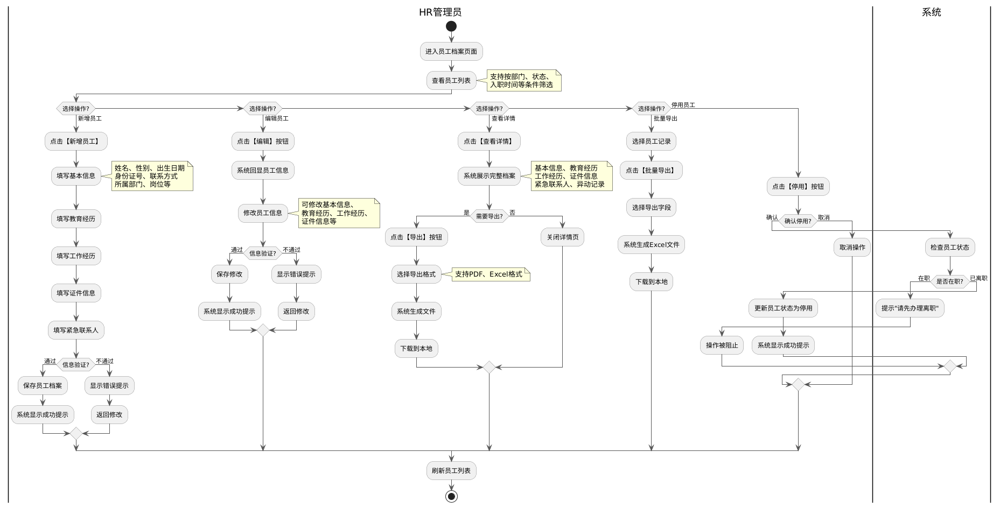

**流程说明：**

- **查看员工列表**：用户进入员工档案页面，系统默认展示全部员工列表，支持按部门、状态、入职时间等条件筛选。
- **新增员工档案**：用户点击【新增员工】，依次填写基本信息、教育经历、工作经历、证件信息、紧急联系人，系统校验信息完整性和唯一性后保存。
- **编辑员工档案**：用户点击【编辑】按钮，系统回显当前员工信息，用户修改后保存，系统同步更新关联模块数据。
- **查看员工详情**：用户点击【查看详情】，系统展示员工完整档案，包含基本信息、教育经历、工作经历、证件信息、紧急联系人及异动记录，支持导出为PDF或Excel。
- **批量导出**：用户选择多个员工记录，点击【批量导出】，选择导出字段后系统生成Excel文件供下载。
- **停用员工**：用户点击【停用】按钮，系统检查员工状态，若为在职状态则提示先办理离职，若已离职则更新状态为停用。

##### （三）功能设计

**系统交互时序：**

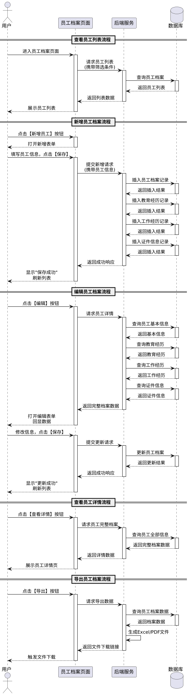

**核心功能说明：**

**1. 员工列表与筛选**

- 默认加载全部员工数据，按入职时间倒序排列
- 支持多条件组合筛选：所属部门（树形选择）、员工状态（在职/试用期/已离职/停用）、入职时间范围、员工姓名/工号
- 列表展示字段：工号、姓名、性别、所属部门、岗位、员工状态、入职时间、操作
- 支持按字段排序（入职时间、工号等）

**2. 新增员工档案**

- 点击【新增员工】按钮，打开多步骤表单
- **步骤一：基本信息**
  - 必填字段：姓名、性别、出生日期、身份证号、联系电话、所属部门、岗位、入职日期
  - 选填字段：民族、政治面貌、婚姻状况、户籍地址、现居住地址、电子邮箱
  - 系统自动生成员工工号（规则：部门编码 + 入职年份 + 4位流水号）
- **步骤二：教育经历**
  - 支持添加多条教育经历记录
  - 必填字段：学校名称、专业、学历、入学时间、毕业时间
  - 选填字段：学位、是否全日制
- **步骤三：工作经历**
  - 支持添加多条工作经历记录
  - 必填字段：公司名称、职位、入职时间、离职时间
  - 选填字段：工作描述、离职原因
- **步骤四：证件信息**
  - 支持添加多条证件记录
  - 必填字段：证件类型、证件号码、发证日期、有效期
  - 证件类型：身份证、护照、驾驶证、劳动合同、资质证书等
  - 系统自动计算证件到期天数，临近到期时触发提醒
- **步骤五：紧急联系人**
  - 支持添加多个紧急联系人
  - 必填字段：姓名、关系、联系电话
  - 选填字段：工作单位、备注
- 保存时系统校验身份证号唯一性，重复则拦截并提示

**3. 编辑员工档案**

- 点击列表行的【编辑】按钮，打开编辑表单，回显当前员工信息
- 支持修改所有字段（工号和入职日期不可修改）
- 保存后，与该员工关联的考勤、薪酬、绩效等模块数据同步更新
- 编辑操作记录在操作日志中，可追溯

**4. 查看员工详情**

- 点击列表行的【查看详情】按钮，打开详情页
- 详情页以标签页形式展示员工档案信息：
  - **基本信息**：员工基本信息、照片、工号、部门、岗位等
  - **教育经历**：学校、专业、学历、入学/毕业时间
  - **工作经历**：公司、职位、入职/离职时间、工作描述
  - **证件信息**：证件类型、证件号码、有效期、到期提醒状态
  - **紧急联系人**：姓名、关系、联系电话
- 详情页支持导出为PDF格式
- **注：异动记录、考勤记录、薪酬记录等标签页将在对应模块实现后添加**

**5. 员工档案导出**

- **单个导出**：在详情页点击【导出】按钮，选择导出格式（PDF/Excel）
- **批量导出**：在列表页选择多个员工，点击【批量导出】，选择导出字段后生成Excel文件
- 导出字段可自定义选择：基本信息、教育经历、工作经历、证件信息、紧急联系人
- 导出文件命名规则：员工档案_导出日期.xlsx 或 员工姓名_档案.pdf

**6. 员工状态管理**

- 员工状态包括：在职、试用期、已离职、停用
- **在职**：正常在职员工，可参与考勤、薪酬、绩效等业务
- **试用期**：新入职员工，试用期到期自动触发转正提醒
- **已离职**：办理离职手续后自动更新为已离职状态，不可参与业务流程
- **停用**：已离职员工可手动停用，停用后不可在新增/异动中被选择
- 状态变更自动触发相关模块联动（如停用后自动停止考勤记录）

**字段说明：**

**员工基本信息字段：**

| 字段名称 | 字段类型 | 长度限制 | 是否必填 | 说明 |
|---------|---------|---------|---------|------|
| 员工工号 | 文本（系统生成） | 最多20字符 | 是 | 系统自动生成，规则：部门编码+入职年份+4位流水号 |
| 姓名 | 文本输入 | 最多50字符 | 是 | 员工真实姓名 |
| 性别 | 下拉选择 | - | 是 | 可选值：男、女 |
| 出生日期 | 日期选择 | - | 是 | 格式为 YYYY-MM-DD |
| 身份证号 | 文本输入 | 18位 | 是 | 系统校验格式和唯一性 |
| 民族 | 下拉选择 | - | 否 | 可选值：汉族、回族、蒙古族等56个民族 |
| 政治面貌 | 下拉选择 | - | 否 | 可选值：群众、共青团员、中共党员等 |
| 婚姻状况 | 下拉选择 | - | 否 | 可选值：未婚、已婚、离异、丧偶 |
| 联系电话 | 文本输入 | 11位 | 是 | 手机号码，系统校验格式 |
| 电子邮箱 | 文本输入 | 最多100字符 | 否 | 系统校验邮箱格式 |
| 户籍地址 | 文本输入 | 最多200字符 | 否 | 户口所在地详细地址 |
| 现居住地址 | 文本输入 | 最多200字符 | 否 | 当前居住地详细地址 |
| 所属部门 | 树形下拉选择 | - | 是 | 选择企业部门树中的部门 |
| 岗位 | 下拉选择 | - | 是 | 选择该部门下的启用状态岗位 |
| 入职日期 | 日期选择 | - | 是 | 格式为 YYYY-MM-DD，不可修改 |
| 员工状态 | 系统自动维护 | - | - | 在职/试用期/已离职/停用 |
| 员工照片 | 图片上传 | 最大2MB | 否 | 支持JPG、PNG格式 |

**教育经历字段：**

| 字段名称 | 字段类型 | 长度限制 | 是否必填 | 说明 |
|---------|---------|---------|---------|------|
| 学校名称 | 文本输入 | 最多100字符 | 是 | 毕业院校全称 |
| 专业 | 文本输入 | 最多50字符 | 是 | 所学专业名称 |
| 学历 | 下拉选择 | - | 是 | 可选值：高中、大专、本科、硕士、博士 |
| 学位 | 下拉选择 | - | 否 | 可选值：学士、硕士、博士 |
| 入学时间 | 日期选择 | - | 是 | 格式为 YYYY-MM |
| 毕业时间 | 日期选择 | - | 是 | 格式为 YYYY-MM，需晚于入学时间 |
| 是否全日制 | 单选 | - | 否 | 可选值：是、否 |

**工作经历字段：**

| 字段名称 | 字段类型 | 长度限制 | 是否必填 | 说明 |
|---------|---------|---------|---------|------|
| 公司名称 | 文本输入 | 最多100字符 | 是 | 工作单位全称 |
| 职位 | 文本输入 | 最多50字符 | 是 | 担任职位名称 |
| 入职时间 | 日期选择 | - | 是 | 格式为 YYYY-MM |
| 离职时间 | 日期选择 | - | 是 | 格式为 YYYY-MM，需晚于入职时间 |
| 工作描述 | 多行文本 | 最多500字符 | 否 | 工作内容和职责描述 |
| 离职原因 | 文本输入 | 最多200字符 | 否 | 离职原因说明 |

**证件信息字段：**

| 字段名称 | 字段类型 | 长度限制 | 是否必填 | 说明 |
|---------|---------|---------|---------|------|
| 证件类型 | 下拉选择 | - | 是 | 可选值：身份证、护照、驾驶证、劳动合同、资质证书等 |
| 证件号码 | 文本输入 | 最多50字符 | 是 | 证件唯一编号 |
| 发证日期 | 日期选择 | - | 是 | 格式为 YYYY-MM-DD |
| 有效期 | 日期选择 | - | 是 | 格式为 YYYY-MM-DD，系统自动计算到期天数 |
| 证件附件 | 文件上传 | 最大5MB | 否 | 支持PDF、JPG、PNG格式 |

**紧急联系人字段：**

| 字段名称 | 字段类型 | 长度限制 | 是否必填 | 说明 |
|---------|---------|---------|---------|------|
| 姓名 | 文本输入 | 最多50字符 | 是 | 紧急联系人姓名 |
| 关系 | 下拉选择 | - | 是 | 可选值：父母、配偶、子女、兄弟姐妹、朋友等 |
| 联系电话 | 文本输入 | 11位 | 是 | 手机号码，系统校验格式 |
| 工作单位 | 文本输入 | 最多100字符 | 否 | 联系人工作单位 |
| 备注 | 文本输入 | 最多200字符 | 否 | 补充说明 |

**业务规则：**

| 规则编号 | 规则描述 |
|---------|---------|
| PROF-001 | 身份证号在系统中必须唯一，新增或编辑时系统自动校验，重复则拦截并提示 |
| PROF-002 | 员工工号由系统自动生成，规则：部门编码（2位）+ 入职年份（4位）+ 流水号（4位），如 HR20260001 |
| PROF-003 | 新增员工默认状态为"试用期"，试用期到期后需通过试用期管理模块办理转正 |
| PROF-004 | 在职或试用期状态的员工不可删除，只能通过离职管理模块办理离职后停用 |
| PROF-005 | 员工所属部门或岗位变更时，需通过员工异动模块办理，不可直接在档案中修改 |
| PROF-006 | 证件有效期临近到期时（提前30/60/90天），系统自动触发证件到期提醒 |
| PROF-007 | 员工档案编辑操作记录在操作日志中，包含操作人、操作时间、修改字段、修改前后值 |
| PROF-008 | 员工照片文件大小不超过2MB，格式限制为JPG、PNG |
| PROF-009 | 教育经历的毕业时间必须晚于入学时间，工作经历的离职时间必须晚于入职时间 |
| PROF-010 | 批量导出员工档案时，最多支持一次导出500条记录，超出需分批导出 |
| PROF-011 | 员工状态为"已离职"或"停用"时，不可在新增入职、员工异动等流程中被选择 |
| PROF-012 | 部门负责人只能查看和导出本部门及下级部门的员工档案，无新增/编辑/停用权限 |

##### （四）业务逻辑关联

员工档案作为HR系统的核心数据模块，与系统多个模块存在紧密的关联关系：

| 关联模块 | 关联说明 |
|---------|---------|
| 部门管理 | 员工档案中的"所属部门"字段引用部门管理的数据，部门调整后员工归属关系同步更新 |
| 岗位管理 | 员工档案中的"岗位"字段引用岗位管理的启用状态岗位，岗位停用后不可在新增员工时选择 |
| 入职管理 | 入职流程完成后自动创建员工档案，入职信息同步到档案基本信息中 |
| 离职管理 | 离职办理完成后，员工档案状态自动更新为"已离职"，保留历史数据不可编辑 |
| 员工异动 | 调岗、晋升、调薪等异动操作完成后，员工档案中的部门、岗位、薪资等信息自动更新 |
| 试用期管理 | 新员工入职后档案状态为"试用期"，转正后自动更新为"在职" |
| 证件到期提醒 | 员工档案中的证件信息自动触发证件到期提醒，临近到期时推送通知 |
| 考勤管理 | 考勤记录关联员工档案，员工状态为"已离职"或"停用"时停止考勤记录 |
| 薪酬管理 | 薪酬计算基于员工档案中的部门、岗位、入职日期等信息，档案变更后薪酬自动重算 |
| 绩效管理 | 绩效评估关联员工档案，员工状态变更后绩效评估权限同步调整 |
| 系统管理 | 员工档案创建后自动生成系统账号，离职后账号停用但保留操作日志 |

#### 5.3.2 入职管理

##### （一）功能需求概述

入职管理用于处理员工入职全流程，包括入职申请、审批、资料清单核对、合同签订、系统账号开通及员工档案创建。系统支持HR发起入职申请和批量导入候选人信息，通过多级审批流程确保入职手续合规完整。入职申请审批通过且资料齐全后进入"待入职"状态，此时可以为员工新建劳动合同；合同签订完成后，HR办理入职手续，系统自动创建员工档案并开通系统账号，为新员工快速融入企业提供便捷的数字化入职体验。

**核心功能概述：**

| 功能项 | 说明 |
|-------|------|
| 入职申请 | HR发起入职申请，填写候选人基本信息、应聘部门、应聘岗位、期望入职日期等 |
| 入职审批 | 部门负责人审批入职申请，支持通过/拒绝操作 |
| 资料清单核对 | 按清单逐项核对入职资料（劳动合同、身份证、学历证明等） |
| 合同签订 | 资料齐全后进入"待入职"状态，HR为员工新建并签订劳动合同 |
| 入职手续办理 | 合同签订完成后，录入员工档案、分配工号、开通系统账号 |
| 批量导入 | 支持通过Excel批量导入候选人信息，快速创建入职申请 |
| 入职进度跟踪 | 实时查看入职申请的审批进度和办理状态，支持催办提醒 |

**用户角色与权限：**

| 角色 | 可执行操作 |
|-----|----------|
| 超级管理员 | 查看全部入职记录、发起入职、审批、办理手续、批量导入 |
| HR管理员 | 查看全部入职记录、发起入职、审批、办理手续、批量导入 |
| 部门负责人 | 查看本部门入职记录、审批本部门入职申请 |
| 普通员工 | 无权限 |

##### （二）用户操作流程

以下活动图描述了入职管理的主要操作路径，包含HR发起入职、部门负责人审批、资料核对、手续办理、批量导入的完整流程：

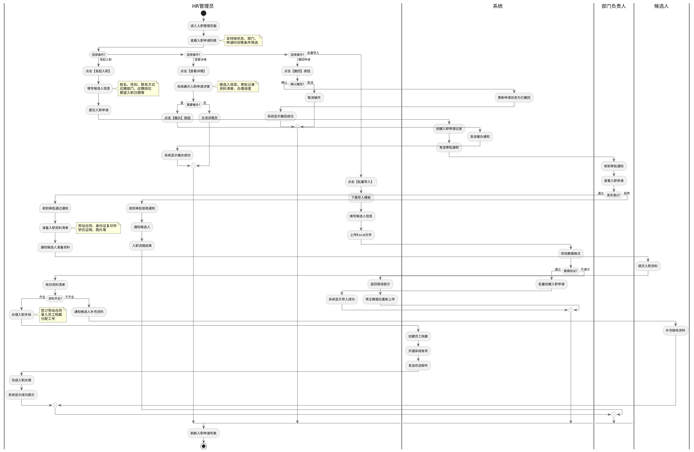

**流程说明：**

- **发起入职申请**：HR管理员进入入职管理页面，点击【发起入职】，填写候选人基本信息（姓名、性别、联系方式、应聘部门、应聘岗位、期望入职日期等）后提交，系统自动创建入职申请并发送审批通知给部门负责人。
- **部门负责人审批**：部门负责人收到通知后，查看入职申请详情，填写审批意见并选择通过或拒绝；拒绝则流程结束并通知HR，通过则进入资料准备环节。
- **资料清单核对**：HR管理员收到审批通过通知后，准备入职资料清单（劳动合同、身份证复印件、学历证明、照片等），通知候选人提交资料，核对资料完整性；资料不齐全时通知候选人补充，资料齐全后进入"待入职"状态。
- **新建并签订合同**：入职申请进入"待入职"状态后，HR在合同管理模块为该员工新建劳动合同，填写合同条款并提交审批，审批通过后完成合同签订。
- **办理入职手续**：合同签订完成后，HR管理员办理入职手续（录入员工档案、分配工号），系统自动创建员工档案、开通系统账号并发送欢迎邮件。
- **批量导入**：HR管理员点击【批量导入】，下载导入模板，填写候选人信息后上传Excel文件，系统校验数据格式并批量创建入职申请。

##### （三）功能设计

**系统交互时序：**

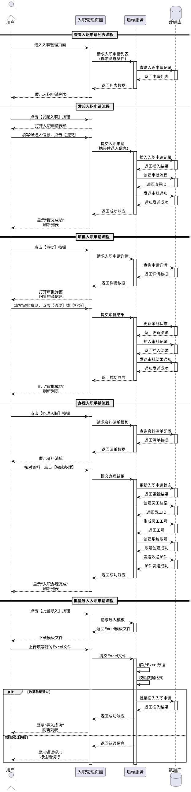

**核心功能说明：**

**1. 入职申请**

- 点击【发起入职】按钮，打开入职申请表单
- 必填字段：候选人姓名、性别、联系电话、应聘部门、应聘岗位、期望入职日期
- 选填字段：身份证号、电子邮箱、学历、毕业院校、工作经验、备注说明
- 提交后系统自动创建入职申请记录，状态为"待审批"，并发送通知给部门负责人

**2. 入职审批**

- 部门负责人收到通知后，在待办列表中查看入职申请
- 点击【审批】按钮，查看申请详情，填写审批意见
- 审批操作：通过、拒绝
- 部门负责人审批通过后，入职申请状态更新为"待办理"，通知HR管理员准备资料
- 部门负责人审批拒绝后，入职申请状态更新为"已拒绝"，流程结束

**3. 资料清单核对**

- HR管理员在入职申请详情页点击【准备资料】
- 系统展示入职资料清单：
  - 劳动合同（必须）
  - 身份证复印件（必须）
  - 学历证明复印件（必须）
  - 一寸照片2张（必须）
  - 离职证明（如有）
  - 体检报告（如需要）
  - 其他资料（根据岗位要求）
- HR逐项确认资料提交情况，勾选已提交项
- 资料不齐全时，点击【通知补充】，系统发送通知给候选人
- 资料齐全后，点击【资料已齐全】，入职申请状态更新为"待入职"，此时可以在合同管理模块为该员工新建劳动合同

**4. 入职手续办理**

- 合同签订完成后，HR管理员在入职申请详情页点击【办理入职】
- 系统展示入职手续清单：
  - 录入员工档案
  - 分配员工工号
  - 开通系统账号
  - 发放办公用品
  - 安排入职培训
- HR逐项确认手续办理情况，勾选已完成项
- 所有手续办理完成后，点击【完成入职】，系统执行以下操作：
  - 创建员工档案（状态为"试用期"）
  - 生成员工工号（规则：部门编码 + 入职年份 + 4位流水号）
  - 开通系统账号（用户名为工号，初始密码为身份证后6位）
  - 发送欢迎邮件（包含工号、初始密码、入职须知）
  - 更新入职申请状态为"已完成"

**5. 批量导入**

- 点击【批量导入】按钮，系统提供Excel模板下载
- 模板包含字段：候选人姓名、性别、联系电话、身份证号、应聘部门、应聘岗位、期望入职日期、学历、毕业院校、备注
- HR填写候选人信息后上传Excel文件
- 系统校验数据格式：
  - 必填字段不能为空
  - 联系电话格式正确（11位手机号）
  - 身份证号格式正确（18位）
  - 应聘部门和岗位在系统中存在
  - 期望入职日期格式正确（YYYY-MM-DD）
- 校验通过后，系统批量创建入职申请，状态为"待审批"
- 校验失败时，系统返回错误信息，标注错误行和错误原因

**6. 入职进度跟踪**

- 入职申请列表展示所有入职申请，支持按状态、部门、申请时间筛选
- 申请状态包括：待审批、已拒绝、待办理、待入职、已完成、已撤回
- 点击【查看详情】，展示入职申请完整信息：
  - 候选人基本信息
  - 审批记录（审批人、审批时间、审批意见）
  - 资料清单（已提交/未提交）
  - 手续办理进度
- 支持催办功能：点击【催办】按钮，系统发送催办通知给当前审批人或办理人
- 支持撤回功能：待审批状态的申请可撤回，撤回后状态更新为"已撤回"

**字段说明：**

**入职申请信息字段：**

| 字段名称 | 字段类型 | 长度限制 | 是否必填 | 说明 |
|---------|---------|---------|---------|------|
| 候选人姓名 | 文本输入 | 最多50字符 | 是 | 候选人真实姓名 |
| 性别 | 下拉选择 | - | 是 | 可选值：男、女 |
| 联系电话 | 文本输入 | 11位 | 是 | 手机号码，系统校验格式 |
| 身份证号 | 文本输入 | 18位 | 否 | 系统校验格式，入职办理时必填 |
| 电子邮箱 | 文本输入 | 最多100字符 | 否 | 系统校验邮箱格式 |
| 应聘部门 | 树形下拉选择 | - | 是 | 选择企业部门树中的部门 |
| 应聘岗位 | 下拉选择 | - | 是 | 选择该部门下的启用状态岗位 |
| 期望入职日期 | 日期选择 | - | 是 | 格式为 YYYY-MM-DD，不能早于当前日期 |
| 学历 | 下拉选择 | - | 否 | 可选值：高中、大专、本科、硕士、博士 |
| 毕业院校 | 文本输入 | 最多100字符 | 否 | 最高学历毕业院校 |
| 工作经验 | 文本输入 | 最多500字符 | 否 | 工作经历简述 |
| 备注说明 | 多行文本 | 最多500字符 | 否 | 补充说明 |
| 申请时间 | 系统自动生成 | - | - | 申请创建时间，不可修改 |
| 申请状态 | 系统自动维护 | - | - | 待审批、已拒绝、待办理、待入职、已完成、已撤回 |

**审批记录字段：**

| 字段名称 | 字段类型 | 长度限制 | 是否必填 | 说明 |
|---------|---------|---------|---------|------|
| 审批人 | 系统自动填充 | - | - | 当前审批节点的审批人姓名 |
| 审批时间 | 系统自动生成 | - | - | 审批操作时间 |
| 审批结果 | 下拉选择 | - | 是 | 可选值：通过、拒绝 |
| 审批意见 | 多行文本 | 最多200字符 | 否 | 审批人的意见和建议 |

**资料清单字段：**

| 字段名称 | 字段类型 | 长度限制 | 是否必填 | 说明 |
|---------|---------|---------|---------|------|
| 资料项目 | 系统预置 | - | - | 劳动合同、身份证复印件、学历证明、照片等 |
| 是否必须 | 系统预置 | - | - | 是/否 |
| 提交状态 | 复选框 | - | 是 | 已提交/未提交 |
| 提交时间 | 系统自动生成 | - | - | 资料提交时间 |
| 备注说明 | 多行文本 | 最多200字符 | 否 | 资料相关的补充说明 |

**入职手续清单字段：**

| 字段名称 | 字段类型 | 长度限制 | 是否必填 | 说明 |
|---------|---------|---------|---------|------|
| 手续项目 | 系统预置 | - | - | 签订劳动合同、录入档案、分配工号、开通账号等 |
| 办理状态 | 复选框 | - | 是 | 已完成/未完成 |
| 办理人 | 系统自动填充 | - | - | 办理该手续的HR姓名 |
| 办理时间 | 系统自动生成 | - | - | 手续办理完成时间 |
| 备注说明 | 多行文本 | 最多200字符 | 否 | 手续办理的补充说明 |

**业务规则：**

| 规则编号 | 规则描述 |
|---------|---------|
| ONB-001 | HR提交入职申请后，系统自动通知应聘部门的部门负责人审批 |
| ONB-002 | 部门负责人审批通过后，入职申请状态更新为"待办理"，通知HR管理员准备资料 |
| ONB-003 | 部门负责人审批拒绝后，入职申请状态更新为"已拒绝"，流程结束，通知HR管理员 |
| ONB-004 | 资料清单中标记为"必须"的资料项必须全部提交，否则不可进入"待入职"状态 |
| ONB-005 | 资料齐全后，入职申请状态更新为"待入职"，此时可以在合同管理模块为该员工新建劳动合同 |
| ONB-006 | 合同签订完成后，才能办理入职手续创建员工档案 |
| ONB-007 | 入职手续办理完成后，系统自动创建员工档案，状态为"试用期" |
| ONB-008 | 员工工号由系统自动生成，规则：部门编码（2位）+ 入职年份（4位）+ 流水号（4位） |
| ONB-009 | 系统账号用户名为员工工号，初始密码为身份证后6位，首次登录强制修改密码 |
| ONB-010 | 入职办理完成后，系统自动发送欢迎邮件给新员工，包含工号、初始密码、入职须知 |
| ONB-011 | 期望入职日期不能早于当前日期，且需符合企业入职时间规定（如每月1日、15日） |
| ONB-012 | 入职申请提交后，HR可在审批前撤回申请，撤回后申请状态更新为"已撤回" |
| ONB-013 | 批量导入时，系统校验数据格式，校验失败的行不导入，返回错误信息 |
| ONB-014 | 批量导入最多支持一次导入100条记录，超出需分批导入 |

##### （四）业务逻辑关联

入职管理与其他模块存在以下关联关系：

| 关联模块 | 关联说明 |
|---------|---------|
| 员工档案 | 入职办理完成后，系统自动创建员工档案，入职信息同步到档案基本信息中 |
| 部门管理 | 入职申请中的"应聘部门"字段引用部门管理的数据 |
| 岗位管理 | 入职申请中的"应聘岗位"字段引用岗位管理的启用状态岗位 |
| 合同管理 | 入职申请进入"待入职"状态后，可以在合同管理模块为该员工新建劳动合同；合同签订完成后，才能办理入职手续创建员工档案 |
| 试用期管理 | 入职办理完成后，员工档案状态为"试用期"，自动触发试用期跟踪 |
| 证件到期提醒 | 入职时录入的劳动合同信息自动触发证件到期提醒 |
| 系统管理 | 入职办理完成后，系统自动创建用户账号并分配默认权限 |

#### 5.3.3 离职管理

##### （一）功能需求概述

离职管理用于处理员工离职全流程，包括离职申请、审批、工作交接、手续办理及档案归档。系统支持员工主动离职和HR发起离职两种模式，通过多级审批流程确保离职手续合规完整，自动停用系统账号并归档员工信息，为企业用工风险管理提供可追溯的数据支撑。

**核心功能概述：**

| 功能项 | 说明 |
|-------|------|
| 离职申请 | 员工或HR发起离职申请，填写离职原因、期望离职日期等信息 |
| 离职审批 | 部门负责人、HR管理员多级审批，支持通过/拒绝/退回操作 |
| 工作交接 | 填写交接清单，记录工作内容、文档资料、物品移交情况 |
| 手续办理 | 按清单逐项办理离职手续（工牌、门禁、工资结算等） |
| 账号停用 | 离职确认后自动停用系统账号，保留数据访问权限记录 |
| 离职归档 | 归档离职材料，生成离职证明，更新员工状态为"已离职" |

**用户角色与权限：**

| 角色 | 可执行操作 |
|-----|----------|
| 超级管理员 | 查看全部离职记录、发起离职、审批、办理手续、归档 |
| HR管理员 | 查看全部离职记录、发起离职、审批、办理手续、归档 |
| 部门负责人 | 查看本部门离职记录、审批本部门员工离职申请 |
| 普通员工 | 提交个人离职申请、查看个人离职进度 |

##### （二）用户操作流程

以下活动图描述了离职管理的主要操作路径，包含员工提交申请、部门负责人审批、HR审批、工作交接、手续办理的完整流程：

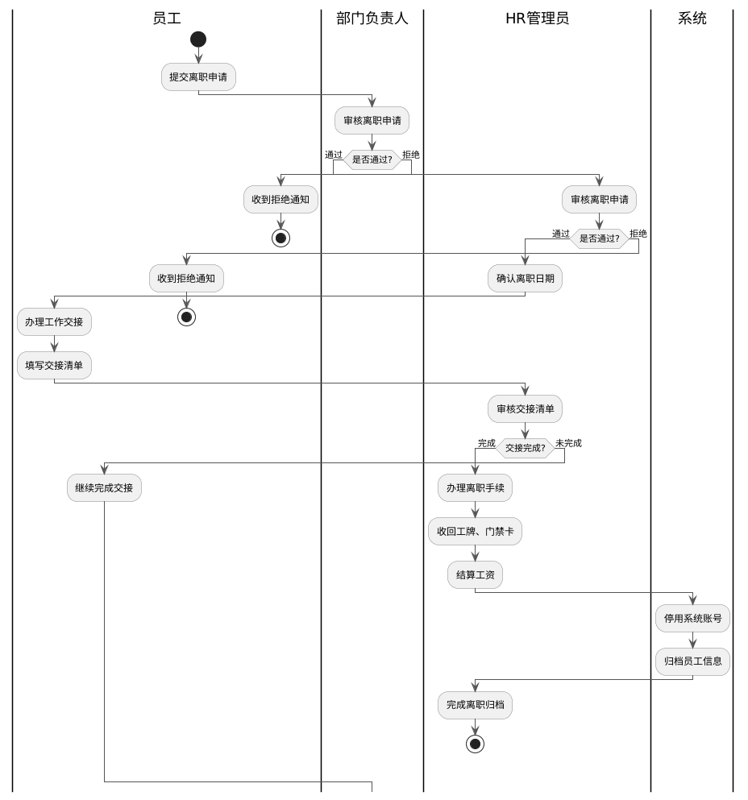

**流程说明：**

- **提交离职申请**：员工进入离职管理页面，点击【发起离职】，填写离职原因、期望离职日期、交接人等信息后提交，系统自动通知部门负责人审批。
- **部门负责人审批**：部门负责人收到通知后，查看离职申请详情，填写审批意见并选择通过或拒绝；拒绝则流程结束，通过则进入HR审批环节。
- **HR管理员审批**：HR管理员审核离职申请，确认离职日期和手续清单，审批通过后通知员工办理交接。
- **工作交接**：员工填写交接清单，记录工作内容、文档资料、物品移交情况，提交后由HR审核交接完成情况。
- **办理离职手续**：HR管理员按清单逐项办理离职手续（收回工牌、门禁卡、结算工资等），系统自动停用员工账号并归档离职信息。

##### （三）功能设计

**系统交互时序：**

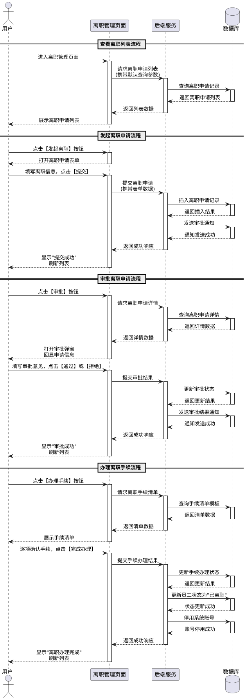

**核心功能说明：**

**1. 离职申请**

- 员工或HR点击【发起离职】按钮，弹出离职申请表单
- 必填字段：离职类型、离职原因、期望离职日期
- 选填字段：工作交接人、详细说明
- 提交后系统自动创建离职申请记录，状态为"待审批"，并发送通知给部门负责人

**2. 离职审批**

- 部门负责人收到通知后，在待办列表中查看离职申请
- 点击【审批】按钮，查看申请详情，填写审批意见
- 审批操作：通过、拒绝、退回修改
- 部门负责人审批通过后，自动流转至HR管理员审批
- HR管理员审批通过后，离职申请状态更新为"待交接"

**3. 工作交接**

- 员工在离职申请详情页点击【填写交接清单】
- 交接清单包含：工作内容交接、文档资料移交、物品归还、系统权限移交
- 每项交接内容需填写交接人、交接时间、交接说明
- 提交后HR管理员审核交接清单，确认交接完成

**4. 手续办理**

- HR管理员在离职申请详情页点击【办理手续】
- 系统展示离职手续清单：工牌归还、门禁卡注销、工资结算、社保停缴、公积金封存、离职证明开具
- HR逐项确认手续办理情况，勾选已完成项
- 所有手续办理完成后，点击【完成离职】，系统执行以下操作：
  - 更新员工状态为"已离职"
  - 停用系统账号（保留数据访问权限记录）
  - 归档离职材料
  - 生成离职证明

**5. 离职归档**

- 离职办理完成后，系统自动归档以下材料：
  - 离职申请表
  - 审批记录
  - 工作交接清单
  - 离职手续清单
  - 离职证明
- 归档材料支持在线查看和下载
- 已离职员工的档案保留在系统中，状态标记为"已离职"，不可编辑

**字段说明：**

**离职申请信息字段：**

| 字段名称 | 字段类型 | 长度限制 | 是否必填 | 说明 |
|---------|---------|---------|---------|------|
| 离职类型 | 下拉选择 | - | 是 | 可选值：主动离职、被动离职、合同到期、试用期不合格 |
| 离职原因 | 下拉选择 | - | 是 | 可选值：个人发展、薪资待遇、工作压力、家庭原因、其他 |
| 期望离职日期 | 日期选择 | - | 是 | 格式为 YYYY-MM-DD，不能早于当前日期 |
| 工作交接人 | 搜索选择 | - | 否 | 从在职员工中选取，用于工作交接 |
| 详细说明 | 多行文本 | 最多500字 | 否 | 离职原因的详细描述 |
| 申请时间 | 系统自动生成 | - | - | 申请提交时间，不可修改 |
| 申请状态 | 系统自动维护 | - | - | 待审批、审批中、已通过、已拒绝、已完成 |

**审批记录字段：**

| 字段名称 | 字段类型 | 长度限制 | 是否必填 | 说明 |
|---------|---------|---------|---------|------|
| 审批人 | 系统自动填充 | - | - | 当前审批节点的审批人姓名 |
| 审批时间 | 系统自动生成 | - | - | 审批操作时间 |
| 审批结果 | 下拉选择 | - | 是 | 可选值：通过、拒绝、退回修改 |
| 审批意见 | 多行文本 | 最多200字 | 否 | 审批人的意见和建议 |

**工作交接清单字段：**

| 字段名称 | 字段类型 | 长度限制 | 是否必填 | 说明 |
|---------|---------|---------|---------|------|
| 交接类型 | 系统预置 | - | - | 工作内容、文档资料、物品归还、系统权限 |
| 交接内容 | 多行文本 | 最多500字 | 是 | 具体交接事项描述 |
| 交接人 | 搜索选择 | - | 是 | 接收工作的员工 |
| 交接时间 | 日期选择 | - | 是 | 实际交接完成时间 |
| 交接说明 | 多行文本 | 最多200字 | 否 | 交接过程的补充说明 |

**离职手续清单字段：**

| 字段名称 | 字段类型 | 长度限制 | 是否必填 | 说明 |
|---------|---------|---------|---------|------|
| 手续项目 | 系统预置 | - | - | 工牌归还、门禁卡注销、工资结算、社保停缴、公积金封存、离职证明 |
| 办理状态 | 复选框 | - | 是 | 已完成/未完成 |
| 办理人 | 系统自动填充 | - | - | 办理该手续的HR姓名 |
| 办理时间 | 系统自动生成 | - | - | 手续办理完成时间 |
| 备注说明 | 多行文本 | 最多200字 | 否 | 手续办理的补充说明 |

**业务规则：**

| 规则编号 | 规则描述 |
|---------|---------|
| OFF-001 | 员工提交离职申请后，系统自动通知部门负责人审批 |
| OFF-002 | 部门负责人审批通过后，自动流转至HR管理员审批 |
| OFF-003 | 任一审批节点拒绝，离职申请状态更新为"已拒绝"，流程结束 |
| OFF-004 | HR审批通过后，离职申请状态更新为"待交接"，通知员工填写交接清单 |
| OFF-005 | 工作交接清单提交后，HR审核交接完成情况，确认后状态更新为"待办理手续" |
| OFF-006 | 所有离职手续办理完成后，系统自动停用员工账号，更新员工状态为"已离职" |
| OFF-007 | 已离职员工的档案保留在系统中，不可编辑，支持查看和导出 |
| OFF-008 | 离职证明自动生成，包含员工姓名、工号、入职日期、离职日期、工作岗位等信息 |
| OFF-009 | 期望离职日期不能早于当前日期，且需符合劳动法规定的提前通知期限 |
| OFF-010 | 离职申请提交后，员工可在审批前撤回申请，撤回后申请状态更新为"已撤回" |

##### （四）业务逻辑关联

离职管理与其他模块存在以下关联关系：

| 关联模块 | 关联说明 |
|---------|---------|
| 员工档案 | 离职办理完成后，员工档案状态更新为"已离职"，保留历史数据 |
| 合同管理 | 离职时自动终止劳动合同，记录合同终止日期和原因 |
| 考勤管理 | 离职日期后停止考勤记录，已有考勤数据保留用于工资结算 |
| 薪酬管理 | 离职时触发工资结算流程，计算最后一个月工资和补偿金 |
| 社保管理 | 离职后自动触发社保停缴和公积金封存流程 |
| 系统管理 | 离职确认后自动停用系统账号，保留操作日志和数据访问记录 |

#### 5.3.4 员工异动

##### （一）功能需求概述

员工异动管理是HR系统中用于处理员工岗位、部门、薪资等变动的核心功能模块。本模块支持调岗、晋升、降职、调薪等多种异动类型，通过规范化的审批流程确保异动的合规性和准确性。系统自动记录异动历史，为人力资源分析和决策提供数据支持。

**核心功能包括：**

1. **异动申请管理**：支持员工或HR发起异动申请，填写异动类型、生效日期、异动原因等信息
2. **异动审批流程**：部门负责人和HR分级审批，确保异动决策的合理性
3. **异动信息维护**：记录异动前后的部门、岗位、职级、薪资等关键信息变化
4. **异动历史查询**：查看员工的完整异动轨迹，支持按时间、类型、部门等条件筛选
5. **档案自动更新**：异动生效后自动更新员工档案中的相关信息
6. **异动统计分析**：统计各部门、各类型的异动数据，为人力资源规划提供依据

##### （二）用户操作流程

员工异动管理的典型操作流程如下图所示：

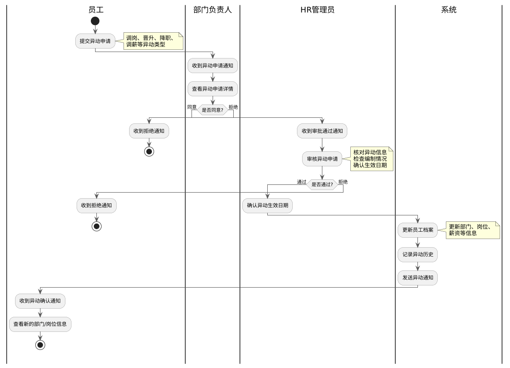

**主要操作步骤：**

1. **员工提交异动申请**：员工在系统中填写异动申请表单，选择异动类型（调岗、晋升、降职、调薪等），填写期望生效日期和异动原因
2. **部门负责人审批**：部门负责人收到审批通知后，查看异动申请详情，根据部门实际情况决定是否同意
3. **HR管理员审核**：部门负责人审批通过后，HR管理员进行最终审核，核对异动信息、检查编制情况、确认生效日期
4. **系统自动更新**：HR审核通过后，系统在生效日期自动更新员工档案中的部门、岗位、职级、薪资等信息
5. **记录异动历史**：系统自动记录异动前后的信息对比，生成异动历史记录
6. **发送异动通知**：系统向员工、原部门负责人、新部门负责人发送异动确认通知

##### （三）功能设计

###### 1. 核心功能

**（1）异动申请管理**

- 支持员工自主发起异动申请（如内部转岗申请）
- 支持HR代员工发起异动申请（如组织调整、晋升降职）
- 异动类型包括：调岗、晋升、降职、调薪、转正、试用期延长等
- 填写异动原因、期望生效日期、目标部门/岗位/职级/薪资等信息
- 支持上传附件（如晋升评估报告、调薪申请表等）
- 申请提交后自动触发审批流程，发送通知给相关审批人

**（2）异动审批流程**

- 部门负责人审批：原部门负责人和目标部门负责人分别审批
- HR审核：HR管理员进行最终审核，确认异动信息的准确性和合规性
- 支持审批意见填写、审批历史查看
- 审批拒绝时需填写拒绝原因，申请状态更新为"已拒绝"
- 审批通过后，异动申请进入"待生效"状态

**（3）异动信息维护**

- 记录异动前的信息：原部门、原岗位、原职级、原薪资等
- 记录异动后的信息：新部门、新岗位、新职级、新薪资等
- 记录异动生效日期、异动类型、异动原因
- 支持异动信息的查看和导出

**（4）异动历史查询**

- 查看员工的完整异动轨迹，按时间倒序展示
- 支持按异动类型、异动日期、部门等条件筛选
- 展示异动前后的信息对比，清晰呈现变化内容
- 支持导出异动历史报表

**（5）档案自动更新**

- 异动生效日期到达时，系统自动更新员工档案
- 更新内容包括：部门、岗位、职级、薪资、直属上级等
- 更新后发送通知给员工、原部门负责人、新部门负责人
- 保留异动前的历史数据，支持追溯查询

**（6）异动统计分析**

- 统计各部门的异动人数、异动类型分布
- 分析异动趋势，识别高频异动部门和岗位
- 生成异动报表，支持按月度、季度、年度统计
- 为人力资源规划和组织优化提供数据支持

###### 2. 字段定义

**（1）异动申请信息**

| 字段名称 | 字段类型 | 是否必填 | 字段说明 |
|---------|---------|---------|---------|
| 申请编号 | 字符串 | 是 | 系统自动生成，格式：TR + 年月日 + 4位流水号 |
| 员工姓名 | 字符串 | 是 | 异动员工的姓名 |
| 员工工号 | 字符串 | 是 | 异动员工的工号 |
| 异动类型 | 枚举 | 是 | 调岗、晋升、降职、调薪、转正、试用期延长等 |
| 申请人 | 字符串 | 是 | 发起申请的人员姓名（员工本人或HR） |
| 申请时间 | 日期时间 | 是 | 申请提交的时间 |
| 期望生效日期 | 日期 | 是 | 异动预计生效的日期 |
| 异动原因 | 文本 | 是 | 异动的详细原因说明 |
| 附件 | 文件 | 否 | 支持上传相关证明材料 |
| 申请状态 | 枚举 | 是 | 待审批、审批中、已通过、已拒绝、已撤回、已生效 |

**（2）异动详情信息**

| 字段名称 | 字段类型 | 是否必填 | 字段说明 |
|---------|---------|---------|---------|
| 原部门 | 字符串 | 是 | 异动前所属部门 |
| 新部门 | 字符串 | 是（调岗时） | 异动后所属部门 |
| 原岗位 | 字符串 | 是 | 异动前岗位名称 |
| 新岗位 | 字符串 | 是（调岗时） | 异动后岗位名称 |
| 原职级 | 字符串 | 是 | 异动前职级 |
| 新职级 | 字符串 | 是（晋升/降职时） | 异动后职级 |
| 原薪资 | 数字 | 是 | 异动前月薪（元） |
| 新薪资 | 数字 | 是（调薪时） | 异动后月薪（元） |
| 原直属上级 | 字符串 | 是 | 异动前的直属上级 |
| 新直属上级 | 字符串 | 是（调岗时） | 异动后的直属上级 |

**（3）审批记录信息**

| 字段名称 | 字段类型 | 是否必填 | 字段说明 |
|---------|---------|---------|---------|
| 审批节点 | 字符串 | 是 | 部门负责人审批、HR审核等 |
| 审批人 | 字符串 | 是 | 审批人员姓名 |
| 审批时间 | 日期时间 | 是 | 审批操作的时间 |
| 审批结果 | 枚举 | 是 | 通过、拒绝 |
| 审批意见 | 文本 | 否 | 审批人填写的意见或建议 |

**（4）异动历史记录**

| 字段名称 | 字段类型 | 是否必填 | 字段说明 |
|---------|---------|---------|---------|
| 异动编号 | 字符串 | 是 | 关联异动申请编号 |
| 员工工号 | 字符串 | 是 | 异动员工的工号 |
| 异动类型 | 枚举 | 是 | 调岗、晋升、降职、调薪等 |
| 异动生效日期 | 日期 | 是 | 异动实际生效的日期 |
| 变更字段 | 字符串 | 是 | 发生变更的字段名称（部门、岗位、职级、薪资等） |
| 变更前值 | 字符串 | 是 | 变更前的字段值 |
| 变更后值 | 字符串 | 是 | 变更后的字段值 |
| 操作人 | 字符串 | 是 | 执行异动操作的HR人员 |
| 操作时间 | 日期时间 | 是 | 异动记录创建时间 |

###### 3. 系统交互时序

员工异动管理的系统交互时序如下图所示：

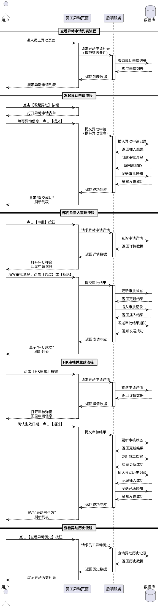

**主要交互流程：**

1. **查看异动申请列表**：用户进入异动管理页面，系统查询数据库返回异动申请列表，支持按状态、类型、时间等条件筛选
2. **发起异动申请**：用户填写异动申请表单并提交，系统插入异动申请记录、创建审批流程、发送审批通知
3. **部门负责人审批**：审批人查看异动申请详情，提交审批结果，系统更新审批状态、插入审批记录、发送审批结果通知
4. **HR审核并生效**：HR确认生效日期并审核通过，系统更新审核状态、更新员工档案、插入异动历史记录、发送异动通知
5. **查看异动历史**：用户查看员工的异动历史记录，系统查询数据库返回历史数据列表

###### 4. 业务规则

| 规则编号 | 规则描述 |
|---------|---------|
| TRF-001 | 异动申请编号自动生成，格式为"TR + 年月日 + 4位流水号"，如TR202604030001 |
| TRF-002 | 异动类型包括：调岗、晋升、降职、调薪、转正、试用期延长等，不同类型需填写不同的必填字段 |
| TRF-003 | 期望生效日期不能早于当前日期，且需符合公司异动管理制度规定的提前通知期限 |
| TRF-004 | 调岗异动需填写新部门和新岗位，晋升/降职需填写新职级，调薪需填写新薪资 |
| TRF-005 | 异动申请提交后，自动触发审批流程，先由部门负责人审批，再由HR审核 |
| TRF-006 | 部门负责人审批拒绝后，异动申请状态更新为"已拒绝"，流程终止 |
| TRF-007 | HR审核通过后，异动申请状态更新为"待生效"，等待生效日期到达 |
| TRF-008 | 异动生效日期到达时，系统自动更新员工档案中的相关信息（部门、岗位、职级、薪资等） |
| TRF-009 | 异动生效后，系统自动记录异动历史，包含异动前后的信息对比 |
| TRF-010 | 异动通知自动发送给员工、原部门负责人、新部门负责人 |
| TRF-011 | 异动申请提交后，员工可在审批前撤回申请，撤回后申请状态更新为"已撤回" |
| TRF-012 | 已生效的异动记录不可修改或删除，只能查看和导出 |

##### （四）业务逻辑关联

员工异动管理与其他模块存在以下关联关系：

| 关联模块 | 关联说明 |
|---------|---------|
| 员工档案 | 异动生效后，自动更新员工档案中的部门、岗位、职级、薪资等信息 |
| 组织管理 | 异动涉及部门调整时，需检查目标部门的编制情况，确保不超编 |
| 岗位管理 | 异动涉及岗位变更时，需验证目标岗位是否存在且有空缺 |
| 薪酬管理 | 调薪异动生效后，自动更新薪酬系统中的薪资标准，影响后续工资计算 |
| 绩效管理 | 晋升/降职异动需关联绩效评估结果，作为异动决策的依据 |
| 合同管理 | 重大异动（如岗位、薪资变更）可能需要签订劳动合同变更协议 |
| 审批流程 | 异动申请需经过多级审批，审批流程根据异动类型和金额自动配置 |

#### 5.3.5 试用期管理

##### （一）功能需求概述

试用期管理是HR系统中用于跟踪和管理新员工试用期的核心功能模块。本模块通过自动化的提醒机制和规范化的转正评估流程，帮助HR和部门负责人及时关注试用期员工的表现，确保转正决策的科学性和公正性。系统支持转正评估、试用期延长、转正提醒等功能，为企业人才筛选和培养提供有力支持。

**核心功能包括：**

1. **试用期员工管理**：自动识别和跟踪试用期员工，展示试用期剩余天数和转正日期
2. **转正提醒功能**：提前30天、15天、7天自动提醒HR发起转正评估
3. **转正评估流程**：部门负责人和HR分级评估，记录试用期表现和评估意见
4. **转正手续办理**：评估通过后办理转正手续，更新员工状态和薪资信息
5. **试用期延长**：评估不通过时支持延长试用期，记录延长原因和期限
6. **转正统计分析**：统计转正率、延长率、淘汰率等关键指标，为招聘质量评估提供依据

##### （二）用户操作流程

试用期管理的典型操作流程如下图所示：

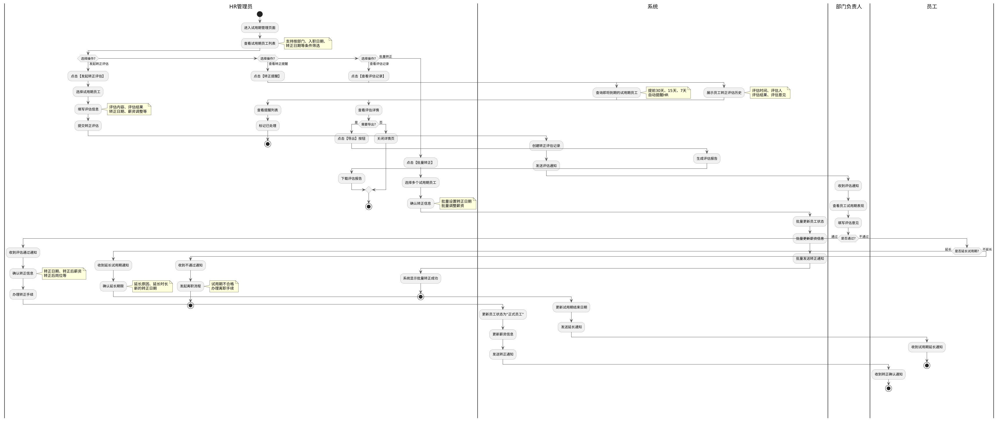

**主要操作步骤：**

1. **查看试用期员工列表**：HR进入试用期管理页面，查看所有试用期员工，支持按部门、入职日期、转正日期等条件筛选
2. **发起转正评估**：HR选择即将到期的试用期员工，填写评估信息（评估内容、评估结果、转正日期、薪资调整等），提交评估申请
3. **部门负责人评估**：部门负责人收到评估通知后，查看员工试用期表现，填写评估意见，决定是否通过
4. **HR确认转正**：评估通过后，HR确认转正信息（转正日期、转正后薪资、转正后岗位等），办理转正手续
5. **系统自动更新**：转正手续办理完成后，系统自动更新员工状态为"正式员工"，更新薪资信息，发送转正通知
6. **延长试用期**：评估不通过时，HR可选择延长试用期，填写延长原因和期限，系统更新试用期结束日期
7. **查看转正提醒**：HR查看即将到期的试用期员工列表，系统提前30天、15天、7天自动提醒

##### （三）功能设计

###### 1. 核心功能

**（1）试用期员工管理**

- 自动识别试用期员工：入职时根据劳动合同约定的试用期时长自动标记
- 展示试用期信息：入职日期、试用期时长、试用期结束日期、剩余天数
- 支持按部门、入职日期、转正日期等条件筛选
- 展示试用期状态：试用中、待评估、已转正、已延长、已离职
- 支持导出试用期员工名单

**（2）转正提醒功能**

- 自动提醒机制：提前30天、15天、7天自动提醒HR发起转正评估
- 提醒方式：系统消息、邮件、企业微信等多渠道通知
- 提醒内容：员工姓名、工号、部门、入职日期、转正日期
- 提醒列表：展示所有待提醒的试用期员工，支持标记已处理
- 逾期提醒：转正日期已过但未办理转正手续的员工，系统持续提醒

**（3）转正评估流程**

- HR发起评估：选择试用期员工，填写评估信息（评估内容、评估标准、转正日期等）
- 部门负责人评估：查看员工试用期表现，填写评估意见（工作能力、工作态度、团队协作等）
- 评估结果：通过、不通过、延长试用期
- 评估记录：保存完整的评估历史，包括评估时间、评估人、评估意见、评估结果
- 评估通知：评估结果自动通知员工、HR、部门负责人

**（4）转正手续办理**

- 确认转正信息：转正日期、转正后薪资、转正后岗位、转正后职级
- 更新员工状态：试用期员工 → 正式员工
- 更新薪资信息：根据转正后薪资标准更新薪酬系统
- 生成转正证明：自动生成转正证明文件，包含员工信息、转正日期等
- 发送转正通知：通知员工、HR、部门负责人转正手续已办理完成
- 记录转正历史：保存转正时间、转正前后薪资对比、转正审批记录

**（5）试用期延长**

- 延长申请：评估不通过时，HR可选择延长试用期
- 延长原因：填写延长原因（工作能力不足、工作态度问题、需要更多时间考察等）
- 延长期限：设置延长时长（通常为1-3个月），系统自动计算新的转正日期
- 延长次数限制：根据劳动法规定，试用期延长次数不超过1次
- 延长通知：通知员工、HR、部门负责人试用期已延长
- 延长记录：保存延长历史，包括延长时间、延长原因、延长期限

**（6）转正统计分析**

- 转正率统计：按部门、岗位、时间段统计转正率
- 延长率统计：统计试用期延长的比例和原因分布
- 淘汰率统计：统计试用期不通过的比例和原因分布
- 转正周期分析：分析从入职到转正的平均周期
- 招聘质量评估：根据转正率评估招聘渠道和面试流程的有效性
- 生成统计报表：支持按月度、季度、年度生成转正统计报表

###### 2. 字段定义

**（1）试用期员工信息**

| 字段名称 | 字段类型 | 是否必填 | 字段说明 |
|---------|---------|---------|---------|
| 员工姓名 | 字符串 | 是 | 试用期员工的姓名 |
| 员工工号 | 字符串 | 是 | 试用期员工的工号 |
| 所属部门 | 字符串 | 是 | 员工所属部门 |
| 岗位名称 | 字符串 | 是 | 员工岗位 |
| 入职日期 | 日期 | 是 | 员工入职日期 |
| 试用期时长 | 数字 | 是 | 试用期月数（1-6个月） |
| 试用期结束日期 | 日期 | 是 | 试用期预计结束日期 |
| 剩余天数 | 数字 | 是 | 距离转正日期的剩余天数 |
| 试用期状态 | 枚举 | 是 | 试用中、待评估、已转正、已延长、已离职 |
| 直属上级 | 字符串 | 是 | 员工的直属上级 |

**（2）转正评估信息**

| 字段名称 | 字段类型 | 是否必填 | 字段说明 |
|---------|---------|---------|---------|
| 评估编号 | 字符串 | 是 | 系统自动生成，格式：PRO + 年月日 + 4位流水号 |
| 员工工号 | 字符串 | 是 | 被评估员工的工号 |
| 评估发起人 | 字符串 | 是 | 发起评估的HR人员 |
| 评估发起时间 | 日期时间 | 是 | 评估发起的时间 |
| 评估内容 | 文本 | 是 | 评估的具体内容和标准 |
| 工作能力评分 | 数字 | 是 | 工作能力评分（1-5分） |
| 工作态度评分 | 数字 | 是 | 工作态度评分（1-5分） |
| 团队协作评分 | 数字 | 是 | 团队协作评分（1-5分） |
| 综合评分 | 数字 | 是 | 综合评分（1-5分） |
| 评估意见 | 文本 | 是 | 部门负责人的评估意见 |
| 评估结果 | 枚举 | 是 | 通过、不通过、延长试用期 |
| 评估时间 | 日期时间 | 是 | 评估完成的时间 |
| 评估人 | 字符串 | 是 | 部门负责人姓名 |

**（3）转正信息**

| 字段名称 | 字段类型 | 是否必填 | 字段说明 |
|---------|---------|---------|---------|
| 转正日期 | 日期 | 是 | 员工正式转正的日期 |
| 转正前薪资 | 数字 | 是 | 试用期薪资（元/月） |
| 转正后薪资 | 数字 | 是 | 转正后薪资（元/月） |
| 薪资调整幅度 | 数字 | 是 | 薪资调整百分比 |
| 转正后岗位 | 字符串 | 否 | 转正后岗位（如有变化） |
| 转正后职级 | 字符串 | 否 | 转正后职级（如有变化） |
| 转正证明编号 | 字符串 | 是 | 转正证明文件编号 |
| 办理人 | 字符串 | 是 | 办理转正手续的HR人员 |
| 办理时间 | 日期时间 | 是 | 转正手续办理时间 |

**（4）试用期延长信息**

| 字段名称 | 字段类型 | 是否必填 | 字段说明 |
|---------|---------|---------|---------|
| 延长编号 | 字符串 | 是 | 系统自动生成，格式：EXT + 年月日 + 4位流水号 |
| 员工工号 | 字符串 | 是 | 延长试用期的员工工号 |
| 延长原因 | 文本 | 是 | 延长试用期的详细原因 |
| 原试用期结束日期 | 日期 | 是 | 原定的试用期结束日期 |
| 延长时长 | 数字 | 是 | 延长的月数（1-3个月） |
| 新试用期结束日期 | 日期 | 是 | 延长后的试用期结束日期 |
| 延长次数 | 数字 | 是 | 累计延长次数（最多1次） |
| 申请人 | 字符串 | 是 | 申请延长的HR人员 |
| 申请时间 | 日期时间 | 是 | 延长申请提交时间 |

###### 3. 系统交互时序

试用期管理的系统交互时序如下图所示：

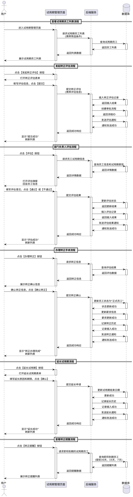

**主要交互流程：**

1. **查看试用期员工列表**：用户进入试用期管理页面，系统查询数据库返回试用期员工列表，支持按部门、入职日期、转正日期等条件筛选
2. **发起转正评估**：用户填写转正评估表单并提交，系统插入转正评估记录、创建审批流程、发送评估通知
3. **部门负责人评估**：评估人查看员工试用期信息，提交评估结果，系统更新评估状态、插入评估记录、发送评估结果通知
4. **办理转正手续**：HR确认转正信息并提交，系统更新员工状态为"正式员工"、更新薪资信息、记录转正历史、发送转正通知
5. **延长试用期**：HR填写延长原因和期限并提交，系统更新试用期结束日期、记录延长历史、发送延长通知
6. **查看转正提醒**：用户查看转正提醒列表，系统查询即将到期的试用期员工（提前30天、15天、7天）

###### 4. 业务规则

| 规则编号 | 规则描述 |
|---------|---------|
| PRO-001 | 试用期时长根据劳动合同约定自动设置，通常为1-6个月，不超过法定上限 |
| PRO-002 | 系统提前30天、15天、7天自动提醒HR发起转正评估，提醒方式包括系统消息、邮件等 |
| PRO-003 | 转正评估编号自动生成，格式为"PRO + 年月日 + 4位流水号"，如PRO202604030001 |
| PRO-004 | 转正评估需部门负责人填写评估意见，包括工作能力、工作态度、团队协作等维度评分 |
| PRO-005 | 评估结果包括：通过、不通过、延长试用期，不同结果触发不同的后续流程 |
| PRO-006 | 评估通过后，HR确认转正信息（转正日期、转正后薪资等），办理转正手续 |
| PRO-007 | 转正手续办理完成后，系统自动更新员工状态为"正式员工"，更新薪资信息 |
| PRO-008 | 评估不通过时，HR可选择延长试用期或发起离职流程 |
| PRO-009 | 试用期延长次数不超过1次，延长时长通常为1-3个月，符合劳动法规定 |
| PRO-010 | 延长试用期需填写延长原因，系统自动计算新的试用期结束日期 |
| PRO-011 | 转正日期已过但未办理转正手续的员工，系统持续提醒HR处理 |
| PRO-012 | 转正记录、评估记录、延长记录永久保存，支持查询和导出 |

##### （四）业务逻辑关联

试用期管理与其他模块存在以下关联关系：

| 关联模块 | 关联说明 |
|---------|---------|
| 员工档案 | 转正后自动更新员工档案中的员工状态、薪资信息、职级信息 |
| 入职管理 | 入职办理完成后，根据劳动合同约定的试用期时长自动创建试用期记录 |
| 合同管理 | 试用期时长根据劳动合同约定设置，转正后可能需要签订正式劳动合同 |
| 薪酬管理 | 转正后自动更新薪酬系统中的薪资标准，影响后续工资计算 |
| 绩效管理 | 转正评估可关联试用期绩效考核结果，作为转正决策的依据 |
| 离职管理 | 试用期评估不通过且不延长时，自动触发离职流程 |
| 员工异动 | 转正时如涉及岗位或职级变化，需同步创建员工异动记录 |

#### 5.3.6 证件到期提醒

##### （一）功能需求概述

证件到期提醒是HR系统中用于自动监控和提醒员工证件有效期的辅助功能模块。本模块通过定时扫描机制，自动识别即将到期的证件（身份证、劳动合同、资质证书、健康证等），并通过多渠道提醒HR和员工及时更新，避免因证件过期导致的合规风险和业务中断。系统支持自定义提醒周期、批量处理、历史记录查询等功能。

**核心功能包括：**

1. **证件信息管理**：维护员工的各类证件信息，包括证件类型、证件号码、有效期等
2. **自动扫描提醒**：定时扫描即将到期的证件，提前90天、60天、30天、15天、7天、3天、当天自动提醒
3. **多渠道通知**：通过系统消息、邮件、企业微信等多种方式通知HR和员工
4. **到期证件管理**：查看和管理即将到期的证件列表，支持按紧急程度排序
5. **证件更新记录**：记录证件更新历史，包括更新时间、更新人、新旧证件对比
6. **统计分析报表**：统计各类证件的到期情况，生成证件管理报表

##### （二）用户操作流程

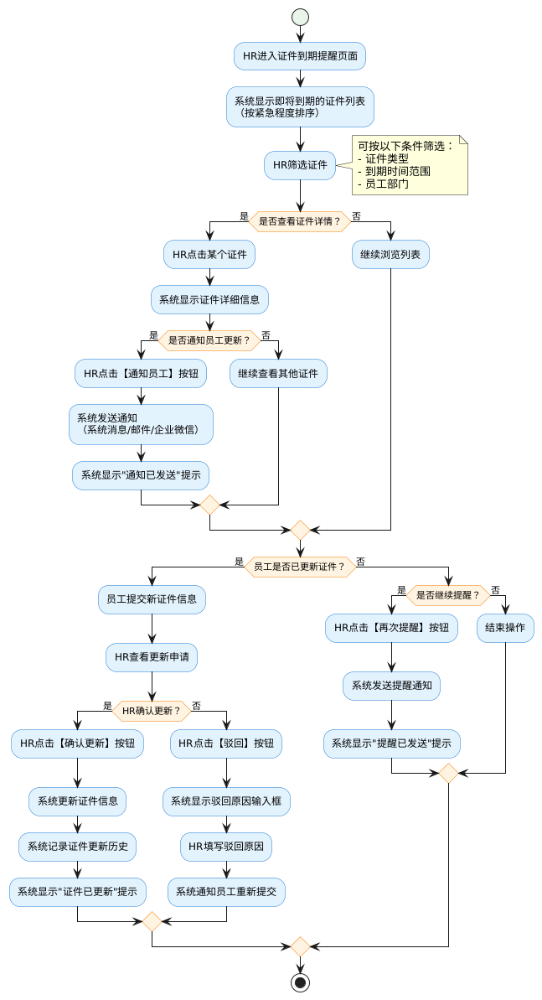

**操作流程说明：**

1. **进入页面**：HR进入证件到期提醒页面，系统自动显示即将到期的证件列表，按紧急程度排序（距离到期时间越近越靠前）

2. **筛选证件**：HR可以根据需要筛选证件，支持按以下条件筛选：
   - 证件类型（身份证、劳动合同、资质证书、健康证等）
   - 到期时间范围（7天内、15天内、30天内、60天内、90天内）
   - 员工部门（选择特定部门查看该部门员工的证件）

3. **查看详情**：HR点击某个证件，系统显示证件详细信息，包括证件类型、证件号码、有效期、所属员工、提醒次数等

4. **通知员工**：HR点击【通知员工】按钮，系统发送通知给员工（通过系统消息、邮件、企业微信等方式），提醒员工及时更新证件，系统显示"通知已发送"提示

5. **确认更新**：员工提交新证件信息后，HR查看更新申请，确认信息无误后点击【确认更新】按钮，系统更新证件信息并记录更新历史，显示"证件已更新"提示

6. **驳回申请**：如果员工提交的证件信息有误，HR点击【驳回】按钮，填写驳回原因，系统通知员工重新提交

7. **再次提醒**：如果员工长时间未更新证件，HR可以点击【再次提醒】按钮，系统发送提醒通知，显示"提醒已发送"提示

##### （三）功能设计

**系统交互时序**

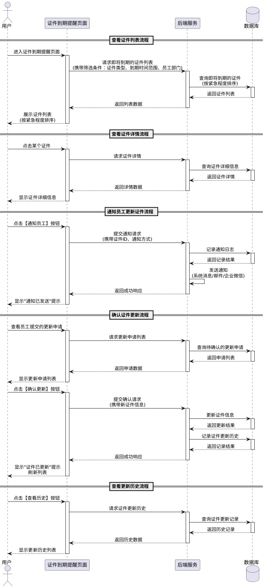

**核心功能**

- **证件列表展示**：分页展示即将到期的证件列表，默认按紧急程度排序（距离到期时间越近越靠前），支持按证件类型、到期时间范围、员工部门筛选
- **紧急程度标识**：根据距离到期时间显示不同颜色标识（红色：7天内，橙色：15天内，黄色：30天内，蓝色：60天内，灰色：90天内）
- **证件详情查看**：点击证件查看详细信息，包括证件类型、证件号码、有效期、所属员工、提醒次数、通知记录等
- **通知员工**：支持单个通知和批量通知，通知方式包括系统消息、邮件、企业微信，系统记录每次通知的时间和方式
- **更新申请管理**：查看员工提交的证件更新申请，支持确认更新或驳回申请，驳回时需填写驳回原因
- **证件更新确认**：HR确认员工提交的新证件信息，系统自动更新证件有效期，并记录更新历史（包括更新时间、更新人、旧证件信息、新证件信息）
- **更新历史查询**：查看证件的更新历史记录，支持按时间范围、更新人筛选，可导出历史记录
- **统计报表**：统计各类证件的到期情况，生成证件管理报表，包括即将到期证件数量、已通知未更新数量、已更新数量等
- **自动提醒设置**：配置自动提醒规则，设置提醒周期（90天、60天、30天、15天、7天、3天、当天），系统定时扫描并自动发送提醒

**数据字段**

| 字段名称 | 字段类型 | 长度限制 | 是否必填 | 说明 |
|---------|---------|---------|---------|------|
| 证件ID | 数字 | - | 自动生成 | 唯一标识 |
| 员工姓名 | 文本 | 50 | 是 | 所属员工姓名 |
| 员工工号 | 文本 | 20 | 是 | 所属员工工号 |
| 所属部门 | 文本 | 100 | 是 | 员工所在部门 |
| 证件类型 | 下拉选择 | - | 是 | 身份证、劳动合同、资质证书、健康证、驾驶证、护照等 |
| 证件号码 | 文本 | 50 | 是 | 证件编号 |
| 有效期开始日期 | 日期 | - | 是 | 证件生效日期 |
| 有效期结束日期 | 日期 | - | 是 | 证件到期日期 |
| 距离到期天数 | 数字 | - | 自动计算 | 当前日期距离到期日期的天数 |
| 紧急程度 | 标签 | - | 自动计算 | 根据距离到期天数自动判断（紧急、较紧急、一般、正常） |
| 提醒次数 | 数字 | - | 自动累计 | 已发送提醒的次数 |
| 最后提醒时间 | 日期时间 | - | 自动记录 | 最近一次发送提醒的时间 |
| 更新状态 | 下拉选择 | - | 是 | 待更新、已提交、已确认、已驳回 |
| 更新申请时间 | 日期时间 | - | 自动记录 | 员工提交更新申请的时间 |
| 新证件号码 | 文本 | 50 | 条件必填 | 员工提交的新证件号码（更新时必填） |
| 新有效期结束日期 | 日期 | - | 条件必填 | 员工提交的新证件到期日期（更新时必填） |
| 驳回原因 | 文本 | 200 | 条件必填 | HR驳回申请时填写的原因（驳回时必填） |
| 确认人 | 文本 | 50 | 自动记录 | 确认更新的HR姓名 |
| 确认时间 | 日期时间 | - | 自动记录 | 确认更新的时间 |
| 备注 | 文本 | 500 | 否 | 其他备注信息 |

**业务规则**

- 证件类型包括：身份证、劳动合同、资质证书、健康证、驾驶证、护照、社保卡、公积金卡等，可在系统设置中自定义
- 紧急程度根据距离到期天数自动判断：7天内为"紧急"（红色），15天内为"较紧急"（橙色），30天内为"一般"（黄色），60天内为"正常"（蓝色），90天内为"提前提醒"（灰色）
- 自动提醒规则：系统每天凌晨2点定时扫描即将到期的证件，根据提醒周期（90天、60天、30天、15天、7天、3天、当天）自动发送提醒
- 通知方式支持系统消息、邮件、企业微信，可在系统设置中配置默认通知方式，HR也可以在发送通知时选择通知方式
- 员工提交更新申请后，证件状态变为"已提交"，HR确认后状态变为"已确认"，驳回后状态变为"已驳回"
- HR确认更新后，系统自动更新证件有效期，并将旧证件信息归档到更新历史中
- 证件更新历史记录包括：更新时间、更新人、旧证件号码、旧有效期、新证件号码、新有效期，支持查询和导出
- 已过期的证件（有效期结束日期小于当前日期）在列表中标记为"已过期"，并在员工档案中显示警告标识
- 批量通知功能：HR可以勾选多个证件，点击【批量通知】按钮，系统一次性发送通知给所有相关员工
- 统计报表按证件类型、部门、紧急程度分组统计，支持导出Excel格式

##### （四）业务逻辑关联

证件到期提醒模块与其他模块的业务逻辑关联如下：

**与员工档案管理的关联：**

- **数据来源**：证件信息来源于【员工档案管理】模块，员工入职时录入的证件信息（身份证、学历证书、资质证书等）会自动同步到证件到期提醒模块
- **数据同步**：当HR在员工档案中更新证件信息时，证件到期提醒模块的数据会自动同步更新
- **档案关联**：点击证件列表中的员工姓名，可以直接跳转到该员工的档案详情页，查看完整的员工信息
- **证件状态反馈**：证件到期提醒模块会将证件状态（即将到期、已过期）反馈到员工档案中，在档案页面显示证件到期警告标识

**与合同管理的关联：**

- **劳动合同到期提醒**：劳动合同作为一种特殊的证件类型，其到期信息来源于【合同管理】模块，合同到期时间会自动同步到证件到期提醒模块
- **合同续签联动**：当劳动合同即将到期时，证件到期提醒模块会通知HR，HR可以直接从提醒页面跳转到合同管理模块发起合同续签流程
- **合同状态同步**：合同续签完成后，合同管理模块会自动更新证件到期提醒模块中的劳动合同有效期

**数据流向：**

员工档案管理 → 证件到期提醒（证件信息同步）
合同管理 → 证件到期提醒（劳动合同到期信息同步）
证件到期提醒 → 员工档案管理（证件状态反馈）
证件到期提醒 → 合同管理（触发合同续签流程）

**业务规则约束：**

- 证件信息的主数据维护在员工档案管理模块，证件到期提醒模块只读取和展示，不直接修改证件信息
- 员工提交的证件更新申请，需要HR在证件到期提醒模块中确认后，才会同步更新到员工档案管理模块
- 劳动合同的到期提醒优先级最高，系统会在合同到期前90天、60天、30天、15天、7天、3天、当天分别发送提醒
- 如果员工的身份证或劳动合同已过期，系统会在员工档案中显示红色警告标识，并限制该员工的部分操作（如请假、报销等）

## 六、合同管理

### 6.1 功能概述

合同管理模块为企业提供完整的劳动合同全生命周期管理功能，涵盖合同模板管理、合同签订、合同执行、合同归档与统计分析等核心业务场景。系统支持多种合同类型（劳动合同、保密协议、竞业限制协议等），提供合同模板配置、变量占位符替换、电子签章、合同续签、合同变更、合同终止、到期提醒、自动归档等功能，帮助HR高效管理企业合同，降低法律风险，提升管理效率。

**核心功能包括：**

1. **合同模板管理**：支持多种合同类型的模板配置，提供富文本编辑器和变量占位符功能，支持模板版本管理
2. **合同签订管理**：支持从模板创建合同、自动填充员工信息、合同审批流程、电子签章和纸质合同扫描上传
3. **合同执行管理**：支持合同续签、合同变更（薪资调整、岗位变动等）、合同终止，所有操作均需审批
4. **合同归档管理**：支持到期合同自动归档、手动归档、归档恢复、合同检索和批量导出
5. **合同统计分析**：提供合同到期统计、合同类型分布、续签率分析、合同数量趋势等统计报表

### 6.2 页面访问权限

| 功能模块 | 超级管理员 | HR管理员 | 部门负责人 | 普通员工 |
|---------|-----------|---------|-----------|---------|
| 合同模板管理 | ✓ | ✓ | ✗ | ✗ |
| 合同列表（新建/签订/执行） | ✓ | ✓ | ✓（本部门） | ✓（本人） |
| 合同归档 | ✓ | ✓ | ✓（本部门） | ✓（本人） |
| 合同统计 | ✓ | ✓ | ✓（本部门） | ✓（本人） |

**权限说明：**
- 超级管理员和HR管理员：拥有所有功能的完整权限
- 部门负责人：可查看和管理本部门员工的合同
- 普通员工：只能查看本人的合同信息

### 6.3 功能详细设计

#### 6.3.1 合同模板管理

**对应二级菜单：** 合同模板管理

**页面说明：** 本页面用于管理各类合同模板，支持模板的创建、编辑、启用/停用、版本管理等功能。

**页面按钮：**
- 【新建模板】- 创建新的合同模板
- 【编辑】- 编辑模板内容（表格操作列）
- 【删除】- 删除模板（表格操作列）
- 【启用/停用】- 切换模板状态（表格操作列）
- 【查看详情】- 查看模板详情（表格操作列）
- 【版本管理】- 管理模板版本（表格操作列）
- 【批量删除】- 批量删除选中的模板
- 【导出】- 导出模板数据

##### （一）功能需求概述

合同模板管理模块为HR提供合同模板的统一管理功能，支持多种合同类型（劳动合同、保密协议、竞业限制协议等）的模板配置。系统提供富文本编辑器，支持插入变量占位符（如{{员工姓名}}、{{工号}}等），在创建合同时自动替换为实际数据。模板支持版本管理，每次修改生成新版本，历史版本可查看但不可编辑。模板可设置启用/停用状态，停用后不可用于创建新合同，但不影响已创建的合同。

**核心功能包括：**

1. **模板创建与编辑**：使用富文本编辑器编辑合同内容，支持插入变量占位符
2. **变量占位符管理**：系统预定义17个常用变量，支持在模板中插入和预览
3. **模板版本管理**：每次修改生成新版本，保留历史版本记录
4. **模板状态管理**：支持启用/停用模板，停用后不可用于创建新合同
5. **模板分类管理**：按合同类型分类管理（劳动合同、保密协议、竞业限制协议等）

##### （二）用户操作流程

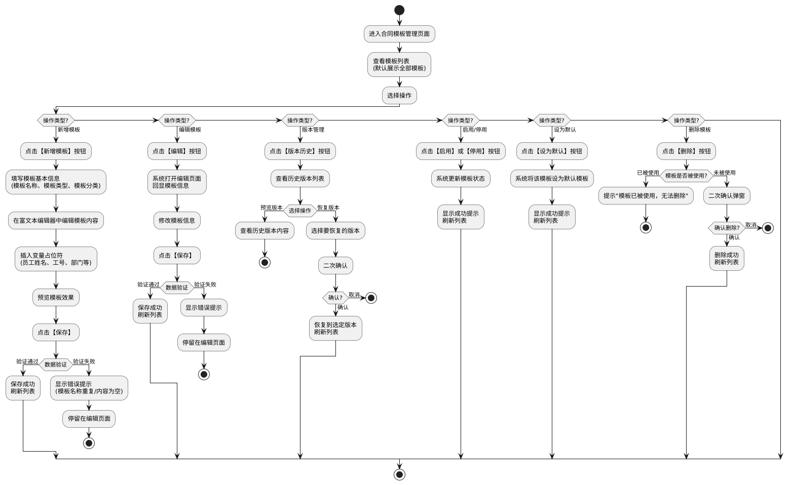

**主要操作流程说明：**

1. **查看模板列表**：
   - 用户进入合同模板管理页面，系统展示全部模板列表
   - 支持按模板名称、合同类型、模板状态等条件筛选
   - 列表显示模板名称、合同类型、当前版本号、状态、创建时间等信息

2. **新建模板流程**：
   - 用户点击【新建模板】按钮，系统打开模板编辑页面
   - 填写模板基本信息（模板名称、合同类型、适用范围等）
   - 使用富文本编辑器编辑合同内容
   - 点击【插入变量】按钮，从预定义变量列表中选择变量插入到光标位置
   - 点击【预览】按钮，查看变量替换后的效果（使用示例数据）
   - 点击【保存】按钮，系统验证数据完整性
   - 验证通过后保存模板，版本号自动设置为V1.0
   - 验证失败则显示错误提示

3. **编辑模板流程**：
   - 用户在模板列表中点击【编辑】按钮，系统打开模板编辑页面并回显数据
   - 修改模板内容（基本信息或合同内容）
   - 点击【保存】按钮，系统验证数据完整性
   - 验证通过后保存为新版本，版本号自动递增（如V1.0 → V1.1）
   - 原版本保留在版本历史中，可查看但不可编辑

4. **启用/停用模板**：
   - 用户在模板列表中点击【启用】或【停用】按钮
   - 系统弹出确认提示："确定要停用该模板吗？停用后将不可用于创建新合同"
   - 用户确认后，系统更新模板状态
   - 停用的模板在创建合同时不显示在模板选择列表中

5. **查看版本历史**：
   - 用户在模板列表中点击【版本管理】按钮，系统打开版本历史页面
   - 显示该模板的所有历史版本（版本号、修改时间、修改人、修改说明）
   - 用户可点击【查看】按钮查看历史版本的完整内容（只读模式）
   - 用户可点击【恢复】按钮将历史版本恢复为当前版本（生成新版本号）

6. **删除模板**：
   - 用户在模板列表中点击【删除】按钮
   - 系统检查该模板是否已被使用（是否有合同引用该模板）
   - 如果已被使用，系统提示"该模板已被使用，不可删除，建议停用"
   - 如果未被使用，系统弹出确认提示："确定要删除该模板吗？删除后不可恢复"
   - 用户确认后，系统删除模板及其所有版本

##### （三）功能设计

**系统交互时序**

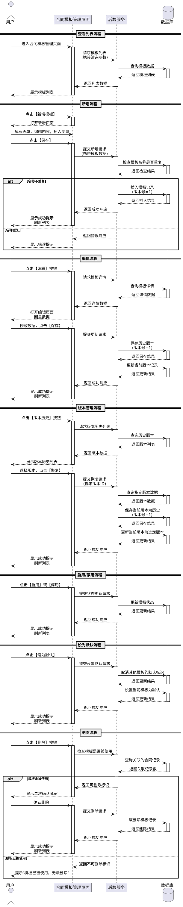

**核心功能**

- **富文本编辑器**：支持文本格式化（字体、字号、颜色、加粗、斜体、下划线等）、段落格式（对齐、缩进、行距等）、表格插入、图片上传等
- **变量占位符系统**：系统预定义17个常用变量，支持在模板中插入变量占位符，创建合同时自动替换为实际数据
- **模板预览功能**：支持使用示例数据预览变量替换后的效果，确保模板格式正确
- **版本管理机制**：每次修改生成新版本，版本号自动递增，历史版本可查看和恢复
- **模板状态控制**：支持启用/停用模板，停用后不可用于创建新合同，但不影响已创建的合同
- **模板分类管理**：按合同类型分类（劳动合同、保密协议、竞业限制协议等），便于查找和管理
- **权限控制**：只有HR管理员可以创建、编辑、删除模板

**预定义变量列表**

系统预定义以下17个变量，可在模板中使用：

| 变量名称 | 变量占位符 | 数据来源 | 说明 |
|---------|-----------|---------|------|
| 员工姓名 | {{员工姓名}} | 员工档案 | 员工的真实姓名 |
| 工号 | {{工号}} | 员工档案 | 员工的唯一工号 |
| 身份证号 | {{身份证号}} | 员工档案 | 员工的身份证号码 |
| 性别 | {{性别}} | 员工档案 | 员工的性别（男/女） |
| 出生日期 | {{出生日期}} | 员工档案 | 员工的出生日期 |
| 联系电话 | {{联系电话}} | 员工档案 | 员工的手机号码 |
| 电子邮箱 | {{电子邮箱}} | 员工档案 | 员工的电子邮箱 |
| 部门名称 | {{部门名称}} | 组织架构 | 员工所属部门 |
| 岗位名称 | {{岗位名称}} | 组织架构 | 员工的岗位名称 |
| 入职日期 | {{入职日期}} | 员工档案 | 员工的入职日期 |
| 合同开始日期 | {{合同开始日期}} | 合同信息 | 合同生效日期 |
| 合同结束日期 | {{合同结束日期}} | 合同信息 | 合同到期日期 |
| 试用期月数 | {{试用期月数}} | 合同信息 | 试用期时长（月） |
| 基本工资 | {{基本工资}} | 薪酬信息 | 员工的基本工资 |
| 工作地点 | {{工作地点}} | 员工档案 | 员工的工作地点 |
| 公司名称 | {{公司名称}} | 系统配置 | 企业的全称 |
| 签订日期 | {{签订日期}} | 合同信息 | 合同签订日期 |

**数据字段**

**合同模板字段：**

| 字段名称 | 字段类型 | 长度限制 | 是否必填 | 说明 |
|---------|---------|---------|---------|------|
| 模板ID | 数字 | - | 是 | 系统自动生成 |
| 模板名称 | 文本 | 100 | 是 | 模板的名称，如"劳动合同模板（通用版）" |
| 合同类型 | 下拉选择 | - | 是 | 劳动合同、保密协议、竞业限制协议、培训协议、其他 |
| 适用范围 | 文本 | 200 | 否 | 说明该模板适用的员工范围，如"全体员工"、"技术岗位" |
| 模板内容 | 富文本 | - | 是 | 合同的完整内容，包含变量占位符 |
| 当前版本号 | 文本 | 20 | 是 | 系统自动生成，格式：V1.0、V1.1、V2.0 |
| 模板状态 | 下拉选择 | - | 是 | 启用、停用 |
| 创建人 | 文本 | 50 | 是 | 系统自动记录 |
| 创建时间 | 日期时间 | - | 是 | 系统自动记录 |
| 更新人 | 文本 | 50 | 是 | 系统自动记录 |
| 更新时间 | 日期时间 | - | 是 | 系统自动记录 |

**模板版本字段：**

| 字段名称 | 字段类型 | 长度限制 | 是否必填 | 说明 |
|---------|---------|---------|---------|------|
| 版本ID | 数字 | - | 是 | 系统自动生成 |
| 模板ID | 数字 | - | 是 | 关联模板 |
| 版本号 | 文本 | 20 | 是 | 版本号，如V1.0、V1.1 |
| 模板内容 | 富文本 | - | 是 | 该版本的完整内容 |
| 修改说明 | 文本 | 500 | 否 | 本次修改的说明 |
| 创建人 | 文本 | 50 | 是 | 系统自动记录 |
| 创建时间 | 日期时间 | - | 是 | 系统自动记录 |

**业务规则**

- 模板名称不可重复
- 模板内容必须包含至少一个变量占位符
- 版本号规则：
  - 首次创建版本号为V1.0
  - 小改动（如修改文字、格式）版本号递增0.1（如V1.0 → V1.1）
  - 大改动（如修改合同结构、增删条款）版本号递增1.0（如V1.1 → V2.0）
  - 版本号由系统自动生成，用户可选择是小改动还是大改动
- 停用的模板不可用于创建新合同，但已创建的合同不受影响
- 已被使用的模板不可删除，只能停用
- 历史版本只读，不可编辑，但可以恢复为当前版本（生成新版本号）
- 恢复历史版本时，系统自动生成新版本号（在当前最新版本号基础上递增）

##### （四）业务逻辑关联

**与其他模块的关联关系：**

| 关联模块 | 关联说明 |
|---------|---------|
| 员工档案 | 创建合同时从员工档案获取员工信息，替换模板中的变量占位符 |
| 组织架构 | 获取部门名称、岗位名称等组织信息 |
| 薪酬管理 | 获取基本工资等薪酬信息 |
| 系统参数设置 | 获取公司名称等系统配置信息 |

#### 6.3.2 合同管理

**对应二级菜单：** 合同列表

**页面说明：** 本页面为合同全生命周期管理的核心页面，包含合同的新建、签订、执行管理等全生命周期功能。根据合同状态动态显示不同的操作按钮。

**页面按钮：**
- 【新建合同】- 创建新合同
- 【编辑】- 编辑合同（草稿状态，表格操作列）
- 【删除】- 删除合同（草稿状态，表格操作列）
- 【提交审批】- 提交合同审批（草稿状态，表格操作列）
- 【查看详情】- 查看合同详情（表格操作列）
- 【签订】- 签订合同（待签订状态，表格操作列）
- 【上传签订文件】- 上传已签订的合同文件（待签订状态）
- 【续签】- 续签合同（生效中状态，表格操作列）
- 【变更】- 变更合同（生效中状态，表格操作列）
- 【终止】- 终止合同（生效中状态，表格操作列）
- 【归档】- 手动归档合同（已终止状态，表格操作列）
- 【批量删除】- 批量删除选中的合同
- 【导出】- 导出合同数据

**按钮显示规则：**
- **草稿状态**：【编辑】【删除】【提交审批】【查看详情】
- **待审批状态**：【查看详情】
- **待签订状态**：【签订】【上传签订文件】【查看详情】
- **生效中状态**：【续签】【变更】【终止】【查看详情】
- **已终止状态**：【归档】【查看详情】
- **所有状态**：【查看详情】

##### 6.3.2.1 新建合同

**（一）功能概述**

新建合同功能支持HR从合同模板创建新合同，系统自动填充员工信息并替换模板中的变量占位符。支持选择待入职员工或在职员工创建合同，合同创建后进入草稿状态，可编辑和删除，提交审批后进入审批流程。

**核心功能包括：**

1. **从模板创建合同**：选择合同模板，系统自动加载模板内容
2. **员工信息自动填充**：选择员工后，系统自动填充员工基本信息和合同信息
3. **变量占位符替换**：系统自动将模板中的变量占位符替换为实际数据
4. **合同信息编辑**：支持编辑合同期限、试用期、薪资等关键信息
5. **草稿保存**：支持保存为草稿，后续可继续编辑

**（二）用户操作流程**

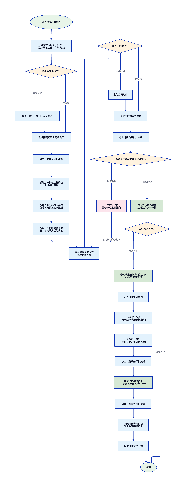

**主要操作流程说明：**

1. **进入新建合同页面**：
   - 用户在合同列表页面点击【新建合同】按钮
   - 系统打开新建合同页面

2. **选择合同模板**：
   - 用户从下拉列表中选择合同模板（只显示启用状态的模板）
   - 系统加载模板内容到富文本编辑器（只读模式）

3. **选择员工**：
   - 用户点击【选择员工】按钮，系统打开员工选择弹窗
   - 弹窗显示待入职员工和在职员工列表
   - 用户选择员工后，系统自动填充员工基本信息（姓名、工号、部门、岗位等）

4. **填写合同信息**：
   - 用户填写合同编号（系统自动生成，可修改）
   - 选择合同类型（劳动合同、保密协议、竞业限制协议等）
   - 选择合同期限类型（固定期限、无固定期限、以完成一定工作任务为期限）
   - 填写合同开始日期和结束日期（固定期限合同必填）
   - 填写试用期月数（0-6个月）
   - 填写基本工资
   - 填写工作地点
   - 填写签订日期

5. **预览合同内容**：
   - 系统自动将模板中的变量占位符替换为实际数据
   - 用户可在富文本编辑器中预览替换后的合同内容（只读模式）

6. **保存草稿或提交审批**：
   - 用户点击【保存草稿】按钮，系统保存合同为草稿状态
   - 用户点击【提交审批】按钮，系统验证数据完整性
   - 验证通过后提交审批流程，合同状态更新为"待审批"
   - 验证失败则显示错误提示

**（三）数据字段**

**合同基本信息字段：**

| 字段名称 | 字段类型 | 长度限制 | 是否必填 | 说明 |
|---------|---------|---------|---------|------|
| 合同ID | 数字 | - | 是 | 系统自动生成 |
| 合同编号 | 文本 | 50 | 是 | 系统自动生成，格式：HT + YYYYMMDD + 4位流水号，可修改 |
| 员工ID | 数字 | - | 是 | 关联员工档案 |
| 员工姓名 | 文本 | 50 | 是 | 从员工档案自动填充 |
| 工号 | 文本 | 50 | 是 | 从员工档案自动填充 |
| 身份证号 | 文本 | 18 | 是 | 从员工档案自动填充 |
| 部门名称 | 文本 | 100 | 是 | 从组织架构自动填充 |
| 岗位名称 | 文本 | 100 | 是 | 从组织架构自动填充 |
| 合同模板ID | 数字 | - | 是 | 关联合同模板 |
| 合同类型 | 下拉选择 | - | 是 | 劳动合同、保密协议、竞业限制协议、培训协议、其他 |
| 合同期限类型 | 下拉选择 | - | 是 | 固定期限、无固定期限、以完成一定工作任务为期限 |
| 合同开始日期 | 日期 | - | 是 | 合同生效日期 |
| 合同结束日期 | 日期 | - | 条件必填 | 固定期限合同必填 |
| 试用期月数 | 数字 | - | 是 | 0-6个月，0表示无试用期 |
| 基本工资 | 数字 | - | 是 | 员工的基本工资 |
| 工作地点 | 文本 | 200 | 是 | 员工的工作地点 |
| 签订日期 | 日期 | - | 是 | 合同签订日期 |
| 合同内容 | 富文本 | - | 是 | 变量替换后的完整合同内容 |
| 合同状态 | 下拉选择 | - | 是 | 草稿、待审批、审批通过、审批驳回、待签订、生效中、已到期、已终止、已归档 |
| 原合同编号 | 文本 | 50 | 否 | 续签合同时关联原合同编号 |
| 续签次数 | 数字 | - | 是 | 默认为0，续签时自动+1 |
| 创建人 | 文本 | 50 | 是 | 系统自动记录 |
| 创建时间 | 日期时间 | - | 是 | 系统自动记录 |
| 更新人 | 文本 | 50 | 是 | 系统自动记录 |
| 更新时间 | 日期时间 | - | 是 | 系统自动记录 |

**（四）业务规则**

- 合同编号自动生成，格式：HT + YYYYMMDD + 4位流水号（如HT202604090001）
- 合同编号可手动修改，但不可重复
- 固定期限合同必须填写合同结束日期，无固定期限合同不填写结束日期
- 合同开始日期不能早于当前日期
- 合同结束日期必须晚于合同开始日期
- 试用期月数范围：0-6个月，0表示无试用期
- 试用期规则：
  - 合同期限不满3个月的，不得约定试用期
  - 合同期限3个月以上不满1年的，试用期不得超过1个月
  - 合同期限1年以上不满3年的，试用期不得超过2个月
  - 合同期限3年以上或无固定期限的，试用期不得超过6个月
- 基本工资必须大于0
- 合同内容中的变量占位符自动替换为实际数据，替换后不可编辑
- 草稿状态的合同可编辑和删除
- 提交审批后不可编辑和删除，只能查看
- 审批驳回后可重新编辑并提交审批

##### 6.3.2.2 合同签订

**（一）功能概述**

合同签订功能支持HR对审批通过的合同进行签订操作。系统支持电子签章和纸质合同扫描上传两种签订方式。签订完成后，合同状态更新为"生效中"，合同正式生效。

**核心功能包括：**

1. **电子签章**：支持在线电子签章，系统自动生成签章后的合同PDF文件
2. **纸质合同上传**：支持上传已签订的纸质合同扫描件（PDF格式）
3. **签订记录**：记录签订时间、签订方式、签订人等信息
4. **合同生效**：签订完成后，合同状态自动更新为"生效中"

**（二）用户操作流程**


**主要操作流程说明：**

1. **查看待签订合同**：
   - 用户在合同列表页面筛选"待签订"状态的合同
   - 系统显示所有审批通过、待签订的合同

2. **电子签章流程**：
   - 用户点击【签订】按钮，系统打开签订确认弹窗
   - 用户选择"电子签章"方式
   - 系统显示合同预览（PDF格式）
   - 用户确认合同内容无误后，点击【确认签订】按钮
   - 系统自动在合同上添加电子签章（公司公章、HR签名）
   - 系统生成签章后的合同PDF文件并保存
   - 合同状态更新为"生效中"

3. **纸质合同上传流程**：
   - 用户点击【上传签订文件】按钮，系统打开上传弹窗
   - 用户上传已签订的纸质合同扫描件（PDF格式，最大20MB）
   - 系统验证文件格式和大小
   - 验证通过后保存文件，合同状态更新为"生效中"
   - 验证失败则显示错误提示

4. **查看签订记录**：
   - 用户点击【查看详情】按钮，系统打开合同详情页面
   - 显示签订记录（签订时间、签订方式、签订人、合同文件）
   - 用户可下载签订后的合同文件

**（三）数据字段**

**签订记录字段：**

| 字段名称 | 字段类型 | 长度限制 | 是否必填 | 说明 |
|---------|---------|---------|---------|------|
| 签订记录ID | 数字 | - | 是 | 系统自动生成 |
| 合同编号 | 文本 | 50 | 是 | 关联合同 |
| 签订方式 | 下拉选择 | - | 是 | 电子签章、纸质合同上传 |
| 签订时间 | 日期时间 | - | 是 | 系统自动记录 |
| 签订人 | 文本 | 50 | 是 | 系统自动记录 |
| 合同文件路径 | 文本 | 500 | 是 | 签订后的合同文件存储路径 |
| 合同文件名称 | 文本 | 200 | 是 | 签订后的合同文件名称 |
| 合同文件大小 | 数字 | - | 是 | 文件大小（字节） |

**（四）业务规则**

- 只有审批通过的合同才能进行签订操作
- 电子签章自动添加公司公章和HR签名，签章位置固定在合同末尾
- 纸质合同上传文件格式限制：PDF格式
- 纸质合同上传文件大小限制：最大20MB
- 签订完成后，合同状态自动更新为"生效中"
- 签订后的合同不可再次签订
- 签订记录不可删除，只能查看
- 合同文件存储路径：/uploads/contracts/YYYY/MM/合同编号.pdf

##### 6.3.2.3 合同执行管理

**（一）功能概述**

合同执行管理功能为HR提供合同生效后的全生命周期管理，包括合同续签、合同变更、合同终止三个核心操作。所有操作均需走审批流程，审批通过后才能生效。

**核心功能包括：**

1. **合同续签**：到期合同续签，生成新合同记录，原合同状态更新为"已续签"
2. **合同变更**：记录合同变更历史（薪资调整、岗位变动、工作地点变更等），保留变更轨迹
3. **合同终止**：记录合同终止原因和时间，合同状态更新为"已终止"
4. **审批流程**：续签、变更、终止操作均需提交审批，审批通过后才能生效
5. **状态管理**：跟踪合同状态变化（生效中 → 已续签/已变更/已终止）
6. **历史记录**：记录所有操作历史，支持查询和追溯

**（二）用户操作流程**

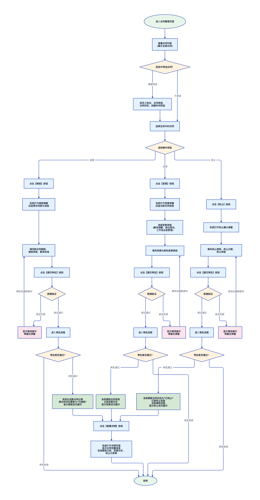

**主要操作流程说明：**

1. **查看合同列表**：
   - 用户进入合同管理页面，系统展示全部合同列表
   - 支持按员工姓名、合同类型、合同状态、到期时间等条件筛选
   - 针对生效中的合同，显示【续签】、【变更】、【终止】操作按钮

2. **合同续签流程**：
   - 用户点击【续签】按钮，系统打开续签弹窗并回显原合同部分信息
   - 填写新合同期限、续签条款、薪资标准等信息
   - 点击【提交审批】，系统验证数据完整性
   - 验证通过后进入审批流程，验证失败则显示错误提示
   - 审批通过后，系统自动生成新合同记录，原合同状态更新为"已续签"
   - 新合同的"原合同编号"字段关联原合同，"续签次数"字段自动+1

3. **合同变更流程**：
   - 用户点击【变更】按钮，系统打开变更弹窗并回显当前合同信息
   - 选择变更类型（薪资调整、岗位变动、工作地点变更等）
   - 填写变更内容和变更原因
   - 点击【提交审批】，系统验证数据完整性
   - 验证通过后进入审批流程，验证失败则显示错误提示
   - 审批通过后，系统更新合同信息，记录变更历史
   - 变更记录包含变更前后的对比信息、变更原因、审批记录等

4. **合同终止流程**：
   - 用户点击【终止】按钮，系统打开终止确认弹窗
   - 填写终止原因、终止日期、终止类型（到期终止、协商解除、单方解除等）
   - 点击【提交审批】，系统验证数据完整性
   - 验证通过后进入审批流程，验证失败则显示错误提示
   - 审批通过后，系统更新合同状态为"已终止"，记录终止信息
   - 如果员工有离职流程，系统自动关联离职记录

5. **查看操作历史**：
   - 用户点击【查看详情】按钮，系统打开详情页面
   - 显示合同完整信息，包括续签记录、变更历史、终止记录等
   - 支持查看每次操作的审批记录和操作人信息

**（三）数据字段**

**续签记录字段：**

| 字段名称 | 字段类型 | 长度限制 | 是否必填 | 说明 |
|---------|---------|---------|---------|------|
| 续签记录ID | 数字 | - | 是 | 系统自动生成 |
| 原合同编号 | 文本 | 50 | 是 | 关联原合同 |
| 新合同编号 | 文本 | 50 | 是 | 系统自动生成 |
| 续签次数 | 数字 | - | 是 | 原合同续签次数+1 |
| 新合同期限类型 | 下拉选择 | - | 是 | 固定期限、无固定期限 |
| 新合同开始日期 | 日期 | - | 是 | 新合同生效日期 |
| 新合同结束日期 | 日期 | - | 条件必填 | 固定期限合同必填 |
| 新薪资标准 | 数字 | - | 是 | 续签后的薪资标准 |
| 续签原因 | 文本 | 500 | 否 | 续签原因说明 |
| 审批状态 | 下拉选择 | - | 是 | 待审批、审批中、审批通过、审批驳回 |
| 操作人 | 文本 | 50 | 是 | 系统自动记录 |
| 操作时间 | 日期时间 | - | 是 | 系统自动记录 |

**变更记录字段：**

| 字段名称 | 字段类型 | 长度限制 | 是否必填 | 说明 |
|---------|---------|---------|---------|------|
| 变更记录ID | 数字 | - | 是 | 系统自动生成 |
| 合同编号 | 文本 | 50 | 是 | 关联合同 |
| 变更类型 | 下拉选择 | - | 是 | 薪资调整、岗位变动、工作地点变更、其他 |
| 变更内容 | 文本 | 1000 | 是 | 变更内容详细说明 |
| 变更前值 | 文本 | 500 | 是 | 变更前的值（薪资为数字类型，岗位/地点为文本类型） |
| 变更后值 | 文本 | 500 | 是 | 变更后的值（薪资为数字类型，岗位/地点为文本类型） |
| 变更原因 | 下拉选择+文本输入 | 500 | 是 | 下拉选择预设原因（绩效优秀、晋升、调岗、其他），选择"其他"时可输入自定义原因，最多500字 |
| 变更日期 | 日期 | - | 是 | 变更生效日期 |
| 审批状态 | 下拉选择 | - | 是 | 待审批、审批中、审批通过、审批驳回 |
| 审批意见 | 文本 | 500 | 否 | 审批人填写的审批意见，最多500字 |
| 操作人 | 文本 | 50 | 是 | 系统自动记录 |
| 操作时间 | 日期时间 | - | 是 | 系统自动记录 |

**终止记录字段：**

| 字段名称 | 字段类型 | 长度限制 | 是否必填 | 说明 |
|---------|---------|---------|---------|------|
| 终止记录ID | 数字 | - | 是 | 系统自动生成 |
| 合同编号 | 文本 | 50 | 是 | 关联合同 |
| 终止类型 | 下拉选择 | - | 是 | 到期终止、协商解除、单方解除、其他 |
| 终止日期 | 日期 | - | 是 | 合同终止日期 |
| 终止原因 | 下拉选择+文本输入 | 500 | 是 | 下拉选择预设原因（合同到期、员工辞职、公司裁员、违纪解除、协商一致、其他），选择"其他"时可输入自定义原因，最多500字 |
| 离职记录ID | 数字 | - | 否 | 关联离职记录（如有） |
| 审批状态 | 下拉选择 | - | 是 | 待审批、审批中、审批通过、审批驳回 |
| 审批意见 | 文本 | 500 | 否 | 审批人填写的审批意见，最多500字 |
| 操作人 | 文本 | 50 | 是 | 系统自动记录 |
| 操作时间 | 日期时间 | - | 是 | 系统自动记录 |

**（四）业务规则**

- 只有生效中的合同才能进行续签、变更、终止操作
- 续签操作：
  - 续签必须在原合同到期前完成（最早可在到期前90天发起续签）
  - 新合同编号自动生成，格式：HT + YYYYMMDD + 4位流水号
  - 新合同的"原合同编号"字段关联原合同
  - 新合同的"续签次数"字段为原合同续签次数+1
  - 新合同开始日期必须衔接原合同结束日期（即新合同开始日期 = 原合同结束日期 + 1天）
  - 续签时允许修改合同类型（如从固定期限改为无固定期限）、薪资、试用期等关键信息
  - 原合同状态更新时机：新合同审批通过且生效后，原合同状态自动更新为"已续签"
- 变更操作：
  - 变更记录必须包含变更前后的对比信息
  - 变更日期不能早于合同开始日期
  - 薪资调整变更需同步更新薪酬管理模块
  - 岗位变动变更需同步更新员工档案和组织架构
- 终止操作：
  - 终止日期不能早于合同开始日期
  - 终止日期不能晚于当前日期
  - 合同终止与离职管理联动规则：
    - 员工主动离职时，离职审批通过后系统自动发起合同终止流程，合同终止日期默认为离职日期
    - HR发起合同终止时，如果终止原因为"员工辞职"，系统自动关联离职记录，离职日期与合同终止日期保持一致
    - 如果合同终止日期与离职日期不一致，系统提示用户确认（允许差异，但需要说明原因）
  - 合同终止后不允许再进行续签和变更操作
- 所有操作均需提交审批，审批通过后才能生效
- 审批驳回后的处理机制：
  - 审批被驳回后，操作状态更新为"审批驳回"，合同状态保持不变
  - 操作人可以查看驳回原因（审批意见），修改信息后重新提交审批
  - 驳回记录保留在审批历史中，支持查询和追溯
  - 重新提交审批时，系统生成新的审批流程实例

**（五）业务逻辑关联**

**与其他模块的关联关系：**

| 关联模块 | 关联说明 |
|---------|---------|
| 员工档案 | 创建合同时从员工档案获取员工信息，合同变更（岗位变动、工作地点变更）需同步更新员工档案信息 |
| 入职管理 | 支持为待入职员工创建合同，入职审批通过后自动关联合同 |
| 离职管理 | 合同终止时关联离职流程，离职日期作为合同终止日期 |
| 薪酬管理 | 合同续签或变更中的薪资调整需同步更新薪酬管理模块 |
| 员工异动 | 岗位变动、工作地点变更等异动需同步创建员工异动记录 |
| 审批流引擎 | 合同审批、续签、变更、终止操作均需走审批流程，审批通过后才能生效 |
| 消息通知 | 操作提交审批后通知审批人，审批通过后通知操作人和员工 |

#### 6.3.3 合同归档

**对应二级菜单：** 合同归档

**页面说明：** 本页面用于管理已归档的合同，支持合同检索、归档恢复、批量导出等功能。

**页面按钮：**
- 【查看详情】- 查看归档合同详情（表格操作列）
- 【恢复】- 恢复归档合同（限HR管理员，表格操作列）
- 【批量导出】- 批量导出归档合同数据（Excel格式，单次最多1000条）
- 【批量下载】- 批量下载合同文件（ZIP压缩包）

##### （一）功能需求概述

合同归档功能为HR提供合同到期自动归档和手动归档功能。系统定时扫描到期的合同，自动更新状态为"已到期"并归档；已终止的合同支持手动归档。归档后的合同支持检索、查看详情、下载文件，HR管理员可恢复误归档的合同。

**核心功能包括：**

1. **自动归档**：到期合同自动更新状态为"已到期"并归档
2. **手动归档**：支持手动归档已终止的合同
3. **归档恢复**：支持归档合同的恢复（限HR管理员权限）
4. **合同检索**：支持按合同编号、员工姓名、合同类型、合同状态等条件检索归档合同
5. **批量操作**：支持批量导出合同数据（Excel格式，单次最多1000条）、批量下载合同文件（ZIP压缩包）

##### （二）用户操作流程

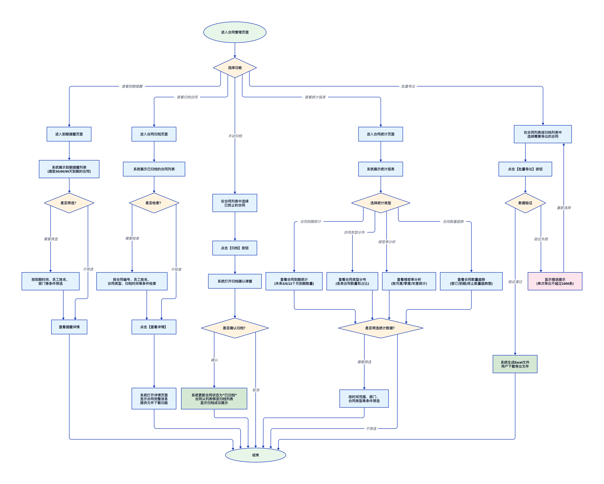

**主要操作流程说明：**

1. **查看归档合同**：
   - 用户进入合同归档页面，系统展示已归档的合同列表
   - 支持按合同编号、员工姓名、合同类型、归档时间等条件检索
   - 用户点击【查看详情】，系统打开详情页面
   - 显示合同完整信息，包括合同条款、签订记录、续签记录、变更历史、终止记录等
   - 提供合同文件下载功能

2. **恢复归档合同**（限HR管理员）：
   - HR管理员在归档列表中选择需要恢复的合同
   - 点击【恢复】按钮，系统打开恢复确认弹窗
   - 填写恢复原因（必填）
   - 确认后，系统将合同状态回滚为归档前的状态（已到期或已终止）
   - 恢复记录保存在操作历史中

3. **手动归档合同**：
   - 用户在合同列表中选择已终止的合同
   - 点击【归档】按钮，系统打开归档确认弹窗
   - 用户确认后，系统将合同状态更新为"已归档"
   - 归档后的合同从合同列表移至归档列表

4. **批量导出数据**：
   - 用户在归档列表中选择需要导出的合同（单次最多1000条）
   - 点击【批量导出】按钮，系统生成Excel文件（.xlsx格式）
   - 导出内容包括合同基本信息、签订记录、续签记录、变更历史、终止记录
   - 系统使用标准导出模板，暂不支持自定义模板
   - 用户下载导出文件

5. **批量下载合同文件**：
   - 用户在归档列表中选择需要下载的合同
   - 点击【批量下载】按钮，系统自动打包为ZIP压缩包
   - 压缩包内包含合同PDF文件和附件（如有）
   - 文件命名规则：合同编号_员工姓名_合同类型.pdf
   - 用户下载压缩包

##### （三）功能设计

**系统交互时序**

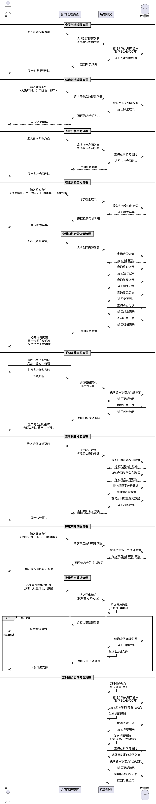

**核心功能**

- **定时任务扫描**：后端定时任务每天凌晨2点执行，扫描到期的合同，自动更新状态为"已到期"并归档
- **自动归档处理**：合同到期当天凌晨2点自动更新状态为"已到期"并归档（如到期日为节假日，归档时间不变，仍在到期当天执行）
- **手动归档功能**：支持手动归档已终止的合同，归档后从合同列表移至归档列表
- **归档恢复机制**：支持归档合同的恢复功能（限HR管理员权限），恢复后合同状态回滚为归档前的状态（已到期或已终止），恢复操作记录在操作历史中
- **合同检索功能**：支持按合同编号、员工姓名、合同类型、合同状态、归档时间等条件检索归档合同
- **批量导出功能**：支持批量导出合同数据为Excel文件（包含合同基本信息、签订记录、续签记录、变更历史），批量下载合同文件为ZIP压缩包（包含合同PDF文件和附件），单次导出限制1000条
- **权限控制**：不同角色查看和操作权限不同（HR可查看全部合同，员工只能查看本人合同）

**数据字段**

**归档记录字段：**

| 字段名称 | 字段类型 | 长度限制 | 是否必填 | 说明 |
|---------|---------|---------|---------|------|
| 归档记录ID | 数字 | - | 是 | 系统自动生成 |
| 合同编号 | 文本 | 50 | 是 | 关联合同 |
| 归档类型 | 下拉选择 | - | 是 | 自动归档、手动归档 |
| 归档原因 | 下拉选择 | - | 是 | 合同到期、合同终止 |
| 归档时间 | 日期时间 | - | 是 | 系统自动记录 |
| 归档人 | 文本 | 50 | 否 | 手动归档时记录操作人 |
| 是否已恢复 | 下拉选择 | - | 是 | 是、否 |
| 恢复时间 | 日期时间 | - | 否 | 恢复操作时记录 |
| 恢复人 | 文本 | 50 | 否 | 恢复操作人（HR管理员） |
| 恢复原因 | 文本 | 500 | 否 | 恢复原因说明，最多500字 |

**业务规则**

- 合同到期后自动归档规则：
  - 归档时机：合同到期当天凌晨2点自动执行
  - 节假日处理：如到期日为节假日，归档时间不变，仍在到期当天凌晨2点执行
  - 归档操作：系统自动更新合同状态为"已到期"并移至归档列表
  - 归档确认：自动归档无需人工确认，系统自动执行
- 已终止的合同支持手动归档，归档后从合同列表移至归档列表
- 归档后的合同不允许再进行任何操作（续签、变更、终止等）
- 归档合同恢复规则：
  - 恢复权限：仅HR管理员可操作
  - 恢复后状态：合同状态回滚为归档前的状态（已到期或已终止）
  - 恢复记录：系统记录恢复操作人、恢复时间、恢复原因
  - 恢复限制：恢复后的合同仍不允许续签、变更、终止操作，仅用于查看和纠正误操作
- 归档合同支持查看详情和下载文件，但不允许编辑和删除
- 批量导出功能：
  - 导出数量限制：单次导出不超过1000条
  - 导出格式：Excel（.xlsx）
  - 导出内容：合同基本信息、签订记录、续签记录、变更历史、终止记录
  - 导出模板：系统提供标准导出模板，暂不支持自定义模板
- 批量下载合同文件：
  - 下载格式：ZIP压缩包
  - 下载内容：合同PDF文件、合同附件（如有）
  - 文件命名规则：合同编号_员工姓名_合同类型.pdf

##### （四）业务逻辑关联

**与其他模块的关联关系：**

| 关联模块 | 关联说明 |
|---------|---------|
| 员工档案 | 归档合同关联员工档案，统计报表按部门、岗位等维度分析 |
| 消息通知 | 合同到期提醒通过消息通知模块发送给HR和员工 |

#### 6.3.4 合同统计

**对应二级菜单：** 合同统计

**页面说明：** 本页面用于展示合同统计分析报表，支持按时间范围、部门、合同类型等条件筛选统计数据。

**页面功能：**
- 统计报表展示（无操作按钮，主要是数据展示）
- 筛选功能（按时间范围、部门、合同类型等条件筛选）

**统计内容包括：**
- 合同到期统计（未来3/6/12个月即将到期的合同）
- 合同类型分布（饼图展示）
- 续签率分析（趋势图）
- 合同数量趋势（最近12个月的签订/到期/终止数量）

##### （一）功能需求概述

合同统计功能为HR提供合同统计分析报表，帮助HR掌握合同管理整体情况。系统提供合同到期统计、合同类型分布、续签率分析、合同数量趋势等统计报表，支持按月度、季度、年度或自定义时间范围筛选。同时，系统提供合同到期自动提醒功能，通过后台定时任务扫描即将到期的合同，自动发送提醒通知给相关人员。

**核心功能包括：**

1. **合同到期统计**：展示未来3个月、6个月、12个月即将到期的合同数量和明细
2. **合同类型分布**：展示各类合同（劳动合同、保密协议、竞业限制协议等）的数量和占比
3. **续签率分析**：展示合同续签率趋势，按月度、季度、年度统计
4. **合同数量趋势**：展示合同签订数量、到期数量、终止数量的趋势图
5. **合同到期提醒**（后台逻辑）：系统自动在合同到期前90天、60天、30天触发提醒，HR可配置提醒方式和提醒接收人

##### （二）用户操作流程


**主要操作流程说明：**

1. **查看统计报表**：
   - 用户进入合同统计页面，系统展示统计报表
   - **合同到期统计**：展示未来3个月、6个月、12个月即将到期的合同数量和明细，支持按月度、季度、年度或自定义时间范围筛选
   - **合同类型分布**：展示各类合同（劳动合同、保密协议、竞业限制协议等）的数量和占比，按当前时间点统计，实时更新
   - **续签率分析**：展示合同续签率趋势，按月度、季度、年度统计，支持自定义时间范围。续签率计算公式：续签率 = 已续签合同数 / （已续签合同数 + 已到期未续签合同数） × 100%，统计时排除试用期内到期的合同和员工主动离职导致的未续签合同
   - **合同数量趋势**：展示合同签订数量、到期数量、终止数量的趋势图，按月度统计，展示最近12个月的趋势
   - 支持按时间范围、部门、合同类型等条件筛选统计数据

2. **查看到期提醒列表**：
   - 系统定时任务每天凌晨1点扫描即将到期的合同（到期前90天、60天、30天）
   - 系统自动发送提醒通知给配置的接收人（HR管理员、部门负责人、员工本人）
   - 统计页面展示即将到期的合同列表（30天内到期的合同）
   - 支持按到期时间、员工姓名、部门等条件筛选

3. **配置提醒规则**（可选，系统管理员操作）：
   - 管理员进入系统参数设置，找到合同到期提醒配置
   - 配置提醒方式（站内消息、邮件、短信、企业微信、钉钉），支持多选
   - 配置提醒接收人（HR管理员、部门负责人、员工本人），支持多选
   - 设置全局开关（启用/停用），用于系统维护或特殊情况
   - 保存配置，系统验证数据并保存

##### （三）功能设计

**系统交互时序**


**核心功能**

- **合同到期统计**：统计未来指定时间范围内即将到期的合同，支持按月度、季度、年度或自定义时间范围筛选，展示合同数量和明细列表
- **合同类型分布**：统计各类合同的数量和占比，使用饼图展示，按当前时间点统计，实时更新
- **续签率分析**：统计合同续签率趋势，按月度、季度、年度统计，支持自定义时间范围，使用折线图展示趋势变化
- **合同数量趋势**：统计合同签订数量、到期数量、终止数量的趋势，按月度统计，展示最近12个月的趋势，使用柱状图展示
- **定时任务扫描**（后台逻辑）：后端定时任务每天凌晨1点执行，扫描即将到期的合同，系统自动在合同到期前90天、60天、30天触发提醒通知
- **提醒规则管理**（后台逻辑）：系统自动在合同到期前90天、60天、30天触发提醒，提醒周期固定不可修改。HR可在系统参数设置中配置提醒方式（站内消息、邮件、短信、企业微信、钉钉）和提醒接收人（HR管理员、部门负责人、员工本人），并可全局开启/关闭提醒功能
- **筛选功能**：支持按时间范围、部门、合同类型等条件筛选统计数据
- **数据实时计算**：统计数据实时计算，不缓存历史数据
- **权限控制**：不同角色查看权限不同（HR可查看全部数据，部门负责人只能查看本部门数据，员工只能查看本人数据）

**数据字段**

**提醒配置字段：**

| 字段名称 | 字段类型 | 长度限制 | 是否必填 | 说明 |
|---------|---------|---------|---------|------|
| 配置ID | 数字 | - | 是 | 系统自动生成 |
| 提醒周期 | 固定值 | - | 是 | 系统固定为90天、60天、30天，不可修改 |
| 提醒方式 | 多选 | - | 是 | 站内消息、邮件、短信、企业微信、钉钉 |
| 提醒接收人 | 多选 | - | 是 | HR管理员、部门负责人、员工本人 |
| 是否启用 | 下拉选择 | - | 是 | 启用、停用（全局开关） |
| 更新人 | 文本 | 50 | 是 | 系统自动记录 |
| 更新时间 | 日期时间 | - | 是 | 系统自动记录 |

**业务规则**

- **统计报表规则**：
  - 合同到期统计：按月度、季度、年度统计，支持自定义时间范围（如未来3个月、6个月、12个月）
  - 合同类型分布：按当前时间点统计，实时更新
  - 续签率分析：按月度、季度、年度统计，支持自定义时间范围
  - 续签率计算公式：续签率 = 已续签合同数 / （已续签合同数 + 已到期未续签合同数） × 100%
  - 续签率统计排除规则：排除试用期内到期的合同、排除员工主动离职导致的未续签合同
  - 合同数量趋势：按月度统计，展示最近12个月的趋势图
  - 统计报表数据实时计算，支持按时间范围、部门、合同类型等条件筛选

- **到期提醒规则**（后台逻辑）：
  - 定时任务每天凌晨1点执行，扫描即将到期的合同（到期前90天、60天、30天）
  - 提醒周期固定为90天、60天、30天，系统自动触发，不可修改
  - 提醒方式可配置为站内消息、邮件、短信、企业微信、钉钉，支持多选
  - 提醒接收人可配置为HR管理员、部门负责人、员工本人，支持多选
  - 提醒功能支持全局开启/关闭（用于系统维护或特殊情况）
  - 同一合同在同一提醒周期内只发送一次提醒，避免重复通知
  - 提醒内容包括：合同编号、员工姓名、合同类型、到期日期、剩余天数

##### （四）业务逻辑关联

**与其他模块的关联关系：**

| 关联模块 | 关联说明 |
|---------|---------|
| 员工档案 | 统计报表按部门、岗位等维度分析；到期提醒关联员工信息 |
| 组织架构 | 获取部门信息用于统计分析；按部门筛选统计数据 |
| 消息通知 | 合同到期提醒通过消息通知模块发送给HR和员工 |
| 系统参数设置 | 提醒周期、提醒方式、提醒接收人等配置存储在系统参数中 |

## 七、考勤管理

### 7.1 功能概述

考勤管理模块为企业提供全面的考勤管理功能，支持多种考勤规则配置（固定班制、弹性工作制、排班制），实现员工打卡、加班申请、外勤管理、补卡申请等全流程管理。系统自动统计考勤数据，生成考勤报表，支持迟到、早退、缺勤、加班等异常情况的自动识别和处理，为薪酬计算提供准确的考勤数据支持。

### 7.2 页面访问权限

| 功能模块 | 超级管理员 | HR管理员 | 部门负责人 | 普通员工 |
|---------|-----------|---------|-----------|---------|
| 考勤规则配置 | ✓ | ✓ | ✗ | ✗ |
| 员工打卡 | ✓ | ✓ | ✓ | ✓ |
| 补卡申请 | ✓ | ✓ | ✓ | ✓ |
| 加班申请 | ✓ | ✓ | ✓ | ✓ |
| 外勤管理 | ✓ | ✓ | ✓ | ✓ |
| 考勤统计 | ✓ | ✓ | ✓（本部门） | ✓（本人） |

### 7.3 功能详细设计

#### 7.3.1 用户操作流程

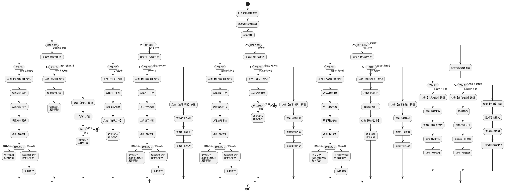

**考勤规则配置流程**：
1. 管理员进入考勤规则管理页面，查看考勤规则列表
2. 点击【新增规则】按钮，填写规则信息（规则名称、适用部门、考勤类型）
3. 设置考勤时间（上班时间、下班时间、弹性时间范围）
4. 设置打卡要求（打卡方式、打卡地点、允许迟到时长）
5. 点击【保存】，系统验证数据
6. 验证通过：保存成功，刷新列表；验证失败：显示错误提示，停留在表单

**员工打卡流程**：
1. 员工进入考勤管理页面，点击【打卡】按钮
2. 系统获取当前位置信息，拍摄打卡照片
3. 员工点击【确认打卡】
4. 系统判断打卡类型（上班/下班），计算是否迟到/早退
5. 插入打卡记录，显示打卡成功，刷新列表

**补卡申请流程**：
1. 员工点击【补卡申请】，填写补卡信息（补卡日期、补卡时间、补卡原因）
2. 上传证明材料，点击【提交】
3. 系统验证数据，验证通过：提交成功，发起审批流程，刷新列表
4. 验证失败：显示错误提示，停留在表单

**加班申请流程**：
1. 员工点击【加班申请】，填写加班信息（加班日期、加班时段、加班事由）
2. 点击【提交】，系统验证数据
3. 验证通过：提交成功，发起审批流程，刷新列表
4. 审批通过后，系统计算加班时长，判断转换方式（加班费/调休），更新员工加班时长或调休额度

**外勤打卡流程**：
1. 员工点击【外勤打卡】按钮，系统获取GPS定位信息
2. 拍摄现场照片，点击【确认打卡】
3. 系统验证打卡位置是否在允许范围内
4. 插入外勤打卡记录，显示打卡成功，刷新列表

**考勤统计流程**：
1. 管理员进入考勤统计页面，选择查询条件（部门、员工、时间范围）
2. 系统查询打卡记录、加班记录、请假记录
3. 统计出勤天数、迟到早退次数、加班时长、异常记录
4. 展示考勤统计报表，支持导出

#### 7.3.2 功能设计

**系统交互时序**

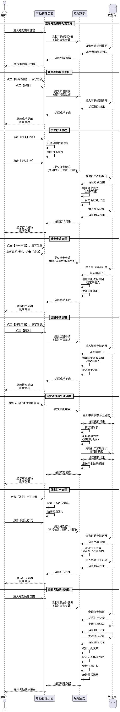

**核心功能**

- **考勤规则配置**：支持多种考勤类型（固定班制、弹性工作制、排班制），配置上下班时间、弹性时间范围、允许迟到时长、打卡方式（GPS定位、Wi-Fi、人脸识别）、打卡地点范围
- **打卡管理**：员工通过移动端或PC端打卡，系统自动获取位置信息和时间，拍摄打卡照片，自动判断打卡类型（上班/下班），计算是否迟到/早退，记录打卡异常原因
- **补卡申请**：员工提交补卡申请，填写补卡日期、时间、原因，上传证明材料，发起审批流程，审批通过后自动补充打卡记录
- **加班管理**：员工提交加班申请，填写加班日期、时段、事由，发起审批流程，审批通过后自动计算加班时长，根据公司政策转换为加班费或调休额度
- **外勤管理**：员工提交外勤申请，填写外勤地点、事由，审批通过后可在外勤地点打卡，系统验证GPS定位是否在允许范围内，记录外勤轨迹
- **考勤统计**：自动统计员工出勤天数、迟到次数、早退次数、缺勤次数、加班时长、请假天数，生成考勤月报、异常分析报表，支持按部门、员工、时间范围查询和导出
- **考勤异常处理**：自动识别考勤异常（未打卡、迟到、早退、缺勤），发送异常提醒，支持异常申诉和处理
- **排班管理**：支持多班次排班，配置班次时间、轮班规则，自动生成排班表，员工按排班表打卡

**数据字段**

| 字段名称 | 字段类型 | 长度限制 | 是否必填 | 说明 |
|---------|---------|---------|---------|------|
| 考勤规则ID | 数字 | - | 自动生成 | 唯一标识 |
| 规则名称 | 文本 | 50 | 是 | 考勤规则名称 |
| 考勤类型 | 下拉选择 | - | 是 | 固定班制/弹性工作制/排班制 |
| 适用部门 | 多选 | - | 是 | 关联部门表 |
| 上班时间 | 时间 | - | 是 | 上班打卡时间 |
| 下班时间 | 时间 | - | 是 | 下班打卡时间 |
| 弹性时间范围 | 数字 | - | 否 | 弹性工作制的时间范围（分钟） |
| 允许迟到时长 | 数字 | - | 是 | 允许迟到的时长（分钟） |
| 打卡方式 | 多选 | - | 是 | GPS定位/Wi-Fi/人脸识别/考勤机 |
| 打卡地点 | 文本 | 200 | 否 | 打卡地点名称 |
| 打卡范围 | 数字 | - | 否 | GPS定位允许的范围（米） |
| 状态 | 下拉选择 | - | 是 | 启用/停用 |
| 打卡记录ID | 数字 | - | 自动生成 | 唯一标识 |
| 员工ID | 数字 | - | 是 | 关联员工表 |
| 打卡类型 | 下拉选择 | - | 是 | 上班打卡/下班打卡 |
| 打卡时间 | 日期时间 | - | 是 | 打卡时间 |
| 打卡地点 | 文本 | 200 | 是 | 打卡地点名称 |
| 打卡位置 | 文本 | 100 | 是 | GPS经纬度 |
| 打卡照片 | 文件 | - | 否 | 打卡照片URL |
| 打卡方式 | 下拉选择 | - | 是 | GPS定位/Wi-Fi/人脸识别/考勤机 |
| 是否迟到 | 下拉选择 | - | 是 | 是/否 |
| 迟到时长 | 数字 | - | 否 | 迟到时长（分钟） |
| 是否早退 | 下拉选择 | - | 是 | 是/否 |
| 早退时长 | 数字 | - | 否 | 早退时长（分钟） |
| 异常原因 | 文本 | 200 | 否 | 打卡异常原因 |
| 补卡申请ID | 数字 | - | 自动生成 | 唯一标识 |
| 员工ID | 数字 | - | 是 | 关联员工表 |
| 补卡日期 | 日期 | - | 是 | 补卡日期 |
| 补卡时间 | 时间 | - | 是 | 补卡时间 |
| 补卡类型 | 下拉选择 | - | 是 | 上班打卡/下班打卡 |
| 补卡原因 | 文本 | 500 | 是 | 补卡原因说明 |
| 证明材料 | 文件 | - | 否 | 证明材料附件 |
| 审批状态 | 下拉选择 | - | 是 | 待审批/审批中/已通过/已拒绝/已撤回 |
| 审批意见 | 文本 | 500 | 否 | 审批意见 |
| 加班申请ID | 数字 | - | 自动生成 | 唯一标识 |
| 员工ID | 数字 | - | 是 | 关联员工表 |
| 加班日期 | 日期 | - | 是 | 加班日期 |
| 加班开始时间 | 时间 | - | 是 | 加班开始时间 |
| 加班结束时间 | 时间 | - | 是 | 加班结束时间 |
| 加班时长 | 数字 | - | 自动计算 | 加班时长（小时） |
| 加班事由 | 文本 | 500 | 是 | 加班事由说明 |
| 转换方式 | 下拉选择 | - | 是 | 加班费/调休 |
| 审批状态 | 下拉选择 | - | 是 | 待审批/审批中/已通过/已拒绝/已撤回 |
| 审批意见 | 文本 | 500 | 否 | 审批意见 |
| 外勤申请ID | 数字 | - | 自动生成 | 唯一标识 |
| 员工ID | 数字 | - | 是 | 关联员工表 |
| 外勤日期 | 日期 | - | 是 | 外勤日期 |
| 外勤地点 | 文本 | 200 | 是 | 外勤地点名称 |
| 外勤位置 | 文本 | 100 | 是 | GPS经纬度 |
| 外勤事由 | 文本 | 500 | 是 | 外勤事由说明 |
| 审批状态 | 下拉选择 | - | 是 | 待审批/审批中/已通过/已拒绝/已撤回 |
| 外勤打卡记录ID | 数字 | - | 自动生成 | 唯一标识 |
| 外勤申请ID | 数字 | - | 是 | 关联外勤申请表 |
| 打卡时间 | 日期时间 | - | 是 | 打卡时间 |
| 打卡位置 | 文本 | 100 | 是 | GPS经纬度 |
| 打卡照片 | 文件 | - | 否 | 打卡照片URL |
| 是否在范围内 | 下拉选择 | - | 是 | 是/否 |

**业务规则**

- 考勤规则必须配置上班时间和下班时间，弹性工作制需配置弹性时间范围
- 打卡时间在上班时间之后视为迟到，在下班时间之前视为早退
- 允许迟到时长内的迟到不计入迟到次数，超过允许时长的迟到计入迟到次数
- 员工每天必须完成上班打卡和下班打卡，缺少任一打卡记录视为异常
- 补卡申请必须在打卡日期后的3个工作日内提交，超期不允许补卡
- 补卡申请需上传证明材料（如会议通知、出差单等），审批通过后自动补充打卡记录
- 加班申请必须在加班日期前提交，加班时长自动计算（结束时间-开始时间）
- 加班审批通过后，根据公司政策自动转换为加班费或调休额度（如工作日1.5倍、周末2倍、节假日3倍）
- 外勤申请必须在外勤日期前提交，审批通过后才能在外勤地点打卡
- 外勤打卡时系统验证GPS定位是否在申请的外勤地点范围内（默认500米），超出范围不允许打卡
- 考勤统计按自然月统计，每月1号自动生成上月考勤报表
- 考勤异常（未打卡、迟到、早退）自动发送提醒通知给员工和直属上级
- 考勤数据作为薪酬计算的依据，迟到、早退、缺勤按公司政策扣除相应工资
- 排班制员工按排班表打卡，系统自动匹配当天的班次时间进行考勤判断

#### 7.3.3 业务逻辑关联

| 关联模块 | 关联说明 |
|---------|---------|
| 员工管理 | 考勤管理模块的员工数据来源于员工管理模块，包括员工基本信息、所属部门、岗位等，考勤规则按部门或岗位配置 |
| 假勤管理 | 考勤管理模块的请假数据来源于假勤管理模块，员工请假期间不计入缺勤，考勤统计时自动扣除请假天数 |
| 薪酬管理 | 考勤管理模块的考勤数据（出勤天数、迟到次数、早退次数、加班时长）作为薪酬计算的依据，自动传递给薪酬管理模块进行工资计算 |
| 审批流引擎 | 考勤管理模块的补卡申请、加班申请、外勤申请都通过审批流引擎进行审批，审批通过后自动更新考勤数据 |
| 系统管理 | 考勤管理模块的考勤规则、打卡方式、异常处理规则由系统管理员在系统管理模块中配置 |
| 数据报表与分析 | 考勤管理模块的考勤统计数据（出勤率、迟到率、加班时长、异常统计）作为数据报表与分析模块的数据源，生成考勤分析报表 |

---

## 八、假勤管理

### 8.1 功能概述

假勤管理模块为企业提供全面的假期和考勤管理功能，包括假期类型配置、假期额度管理、请假申请审批、调休管理等功能。系统支持多种假期类型（年假、病假、事假、婚假、产假、陪产假、丧假等），支持按工龄自动发放年假额度，支持假期余额实时查询，支持请假申请的多级审批流程，支持调休额度自动生成和使用，确保企业假勤管理的规范化和自动化。

### 8.2 页面访问权限

| 功能模块 | 超级管理员 | HR管理员 | 部门负责人 | 普通员工 |
|---------|-----------|---------|-----------|---------|
| 假期配置管理 | ✓ | ✓ | ✗ | ✗ |
| 假期额度管理 | ✓ | ✓ | ✗ | ✗ |
| 请假申请管理 | ✓ | ✓ | ✓（本部门） | ✓（本人） |
| 调休管理 | ✓ | ✓ | ✓（本部门） | ✓（本人） |
| 假期台账 | ✓ | ✓ | ✓（本部门） | ✓（本人） |

### 8.3 功能详细设计

#### 8.3.1 用户操作流程

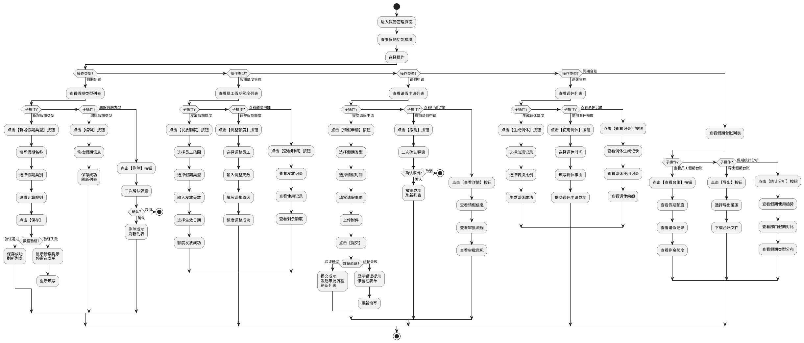

**假期配置管理流程：**
1. 管理员进入假勤管理页面，选择"假期配置管理"
2. 系统展示假期类型列表，支持按假期名称、状态筛选
3. 管理员点击【新增假期类型】按钮，系统打开新增弹窗
4. 管理员填写假期类型信息：假期名称、假期代码、假期单位（天/小时）、是否需要审批、是否扣减工资、是否计入出勤、假期规则说明
5. 管理员设置假期规则：最小请假单位、最大请假天数、是否允许跨年使用、是否允许累积、有效期等
6. 管理员点击【保存】按钮
7. 系统验证数据：
   - 验证通过：保存假期类型，显示成功提示，关闭弹窗，刷新列表
   - 验证失败：显示错误提示，停留在弹窗
8. 管理员可以点击【编辑】按钮修改假期类型信息，或点击【删除】按钮删除假期类型（需二次确认）

**假期额度管理流程：**
1. 管理员进入假勤管理页面，选择"假期额度管理"
2. 系统展示假期额度列表，支持按员工姓名、部门、假期类型筛选
3. 管理员点击【发放额度】按钮，系统打开发放弹窗
4. 管理员选择发放对象（单个员工/批量员工/按部门/按职级）
5. 管理员选择假期类型（如年假、调休等）
6. 管理员设置发放额度（天数或小时数）
7. 管理员填写发放原因（如"2026年度年假发放"）
8. 管理员点击【确定】按钮
9. 系统插入假期额度记录，更新员工假期余额，显示发放成功提示，刷新列表
10. 管理员可以点击【调整额度】按钮调整员工假期额度（增加或减少），需填写调整原因
11. 管理员可以点击【查看明细】按钮查看员工假期额度的发放记录、使用记录、调整记录

**请假申请管理流程：**
1. 员工进入假勤管理页面，选择"请假申请管理"
2. 系统展示请假申请列表，支持按请假类型、审批状态、请假时间筛选
3. 员工点击【请假申请】按钮，系统打开请假申请弹窗
4. 员工选择请假类型（年假/病假/事假/婚假/产假/陪产假/丧假等）
5. 员工选择请假时间（开始时间、结束时间），系统自动计算请假天数
6. 员工填写请假事由
7. 员工上传请假附件（如病假需上传病假条）
8. 员工点击【提交】按钮
9. 系统验证数据：
   - 检查假期余额是否充足
   - 检查请假时间是否与已有请假冲突
   - 检查请假天数是否超过最大请假天数
   - 验证通过：提交请假申请，创建审批流程实例，发送审批通知，显示提交成功提示，刷新列表
   - 验证失败：显示错误提示，停留在弹窗
10. 员工可以点击【撤回】按钮撤回请假申请（仅审批未开始处理时可撤回，需二次确认）
11. 员工可以点击【查看详情】按钮查看请假信息、审批进度、审批历史
12. 审批人审批通过后，系统自动扣减员工假期余额，插入假期使用记录

**调休管理流程：**
1. 员工进入假勤管理页面，选择"调休管理"
2. 系统展示调休记录列表，支持按调休状态、调休时间筛选
3. 员工点击【申请调休】按钮，系统打开调休申请弹窗
4. 员工选择调休时间（开始时间、结束时间），系统自动计算调休天数
5. 员工选择调休来源（加班调休/节假日加班调休）
6. 员工填写调休事由
7. 员工点击【提交】按钮
8. 系统验证数据：
   - 检查调休额度是否充足
   - 检查调休时间是否与已有请假冲突
   - 验证通过：提交调休申请，创建审批流程实例，发送审批通知，显示提交成功提示，刷新列表
   - 验证失败：显示错误提示，停留在弹窗
9. 员工可以点击【调休额度】按钮查看调休额度来源、调休额度余额、调休使用记录
10. 员工可以点击【导出】按钮导出调休记录，选择导出格式（Excel/PDF），下载调休记录文件

#### 8.3.2 功能设计

**系统交互时序：**

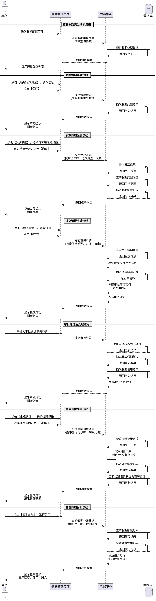

**核心功能：**

- **假期类型配置**：支持创建、编辑、删除假期类型，配置假期名称、假期代码、假期单位、是否需要审批、是否扣减工资、是否计入出勤、假期规则等
- **假期规则设置**：支持设置最小请假单位（0.5天/1小时）、最大请假天数、是否允许跨年使用、是否允许累积、有效期等规则
- **假期额度发放**：支持按员工、部门、职级批量发放假期额度，支持设置发放原因和发放时间
- **假期额度调整**：支持手动调整员工假期额度（增加或减少），需填写调整原因，系统记录调整历史
- **假期余额查询**：员工可以实时查询各类假期的余额，包括已发放额度、已使用额度、剩余额度
- **请假申请提交**：员工可以提交请假申请，选择请假类型、请假时间、填写请假事由、上传请假附件
- **请假审批流程**：请假申请提交后自动创建审批流程实例，根据审批流程模板确定审批人，发送审批通知
- **请假申请撤回**：员工可以撤回未开始处理的请假申请，撤回后审批流程终止
- **假期余额扣减**：请假审批通过后，系统自动扣减员工假期余额，插入假期使用记录
- **调休额度生成**：员工加班后，系统自动生成调休额度，调休额度可以用于申请调休
- **调休申请提交**：员工可以提交调休申请，选择调休时间、调休来源、填写调休事由
- **调休审批流程**：调休申请提交后自动创建审批流程实例，根据审批流程模板确定审批人，发送审批通知
- **调休额度扣减**：调休审批通过后，系统自动扣减员工调休额度，插入调休使用记录
- **假期额度明细查询**：员工可以查看假期额度的发放记录、使用记录、调整记录，了解假期额度的变化情况
- **调休记录导出**：员工可以导出调休记录，支持Excel和PDF格式，方便存档和打印
- **假期冲突检测**：系统自动检测请假时间是否与已有请假冲突，避免重复请假
- **假期余额预警**：系统自动检测假期余额是否充足，余额不足时提示员工
- **假期统计报表**：管理员可以查看假期使用统计报表，包括各部门假期使用情况、各类假期使用情况、假期使用趋势等

**数据字段：**

| 字段名称 | 字段类型 | 长度限制 | 是否必填 | 说明 |
|---------|---------|---------|---------|------|
| 假期类型ID | 数字 | - | 自动生成 | 唯一标识 |
| 假期名称 | 文本 | 50 | 是 | 假期类型名称（如年假、病假、事假） |
| 假期代码 | 文本 | 20 | 是 | 假期类型代码（如ANNUAL_LEAVE、SICK_LEAVE） |
| 假期单位 | 下拉选择 | - | 是 | 天/小时 |
| 是否需要审批 | 单选 | - | 是 | 是/否 |
| 是否扣减工资 | 单选 | - | 是 | 是/否 |
| 是否计入出勤 | 单选 | - | 是 | 是/否 |
| 最小请假单位 | 数字 | - | 是 | 最小请假单位（如0.5天、1小时） |
| 最大请假天数 | 数字 | - | 否 | 最大请假天数（0表示不限制） |
| 是否允许跨年使用 | 单选 | - | 是 | 是/否 |
| 是否允许累积 | 单选 | - | 是 | 是/否 |
| 有效期 | 数字 | - | 否 | 有效期（月），0表示永久有效 |
| 假期规则说明 | 多行文本 | 500 | 否 | 假期规则说明 |
| 假期状态 | 下拉选择 | - | 是 | 启用/停用 |
| 创建时间 | 日期时间 | - | 自动生成 | 创建时间 |
| 更新时间 | 日期时间 | - | 自动更新 | 最后更新时间 |
| 假期额度ID | 数字 | - | 自动生成 | 唯一标识 |
| 员工ID | 数字 | - | 是 | 员工ID |
| 员工姓名 | 文本 | - | 自动填充 | 员工姓名 |
| 部门名称 | 文本 | - | 自动填充 | 部门名称 |
| 假期类型 | 下拉选择 | - | 是 | 假期类型 |
| 发放额度 | 数字 | - | 是 | 发放额度（天数或小时数） |
| 已使用额度 | 数字 | - | 自动计算 | 已使用额度 |
| 剩余额度 | 数字 | - | 自动计算 | 剩余额度 |
| 发放原因 | 文本 | 200 | 是 | 发放原因 |
| 发放时间 | 日期时间 | - | 自动生成 | 发放时间 |
| 有效期开始时间 | 日期 | - | 是 | 有效期开始时间 |
| 有效期结束时间 | 日期 | - | 是 | 有效期结束时间 |
| 请假申请ID | 数字 | - | 自动生成 | 唯一标识 |
| 申请人ID | 数字 | - | 自动填充 | 申请人ID |
| 申请人姓名 | 文本 | - | 自动填充 | 申请人姓名 |
| 请假类型 | 下拉选择 | - | 是 | 请假类型 |
| 开始时间 | 日期时间 | - | 是 | 请假开始时间 |
| 结束时间 | 日期时间 | - | 是 | 请假结束时间 |
| 请假天数 | 数字 | - | 自动计算 | 请假天数 |
| 请假事由 | 多行文本 | 500 | 是 | 请假事由 |
| 请假附件 | 文件上传 | - | 否 | 请假附件（如病假条） |
| 审批状态 | 下拉选择 | - | 自动更新 | 待审批/审批中/已通过/已驳回/已撤回 |
| 审批流程实例ID | 数字 | - | 自动生成 | 审批流程实例ID |
| 申请时间 | 日期时间 | - | 自动生成 | 申请时间 |
| 审批完成时间 | 日期时间 | - | 自动更新 | 审批完成时间 |
| 调休申请ID | 数字 | - | 自动生成 | 唯一标识 |
| 调休开始时间 | 日期时间 | - | 是 | 调休开始时间 |
| 调休结束时间 | 日期时间 | - | 是 | 调休结束时间 |
| 调休天数 | 数字 | - | 自动计算 | 调休天数 |
| 调休来源 | 下拉选择 | - | 是 | 加班调休/节假日加班调休 |
| 调休事由 | 多行文本 | 500 | 是 | 调休事由 |
| 调休状态 | 下拉选择 | - | 自动更新 | 待审批/审批中/已通过/已驳回/已撤回 |
| 假期使用记录ID | 数字 | - | 自动生成 | 唯一标识 |
| 使用类型 | 下拉选择 | - | 是 | 请假/调休 |
| 使用额度 | 数字 | - | 是 | 使用额度（天数或小时数） |
| 使用时间 | 日期时间 | - | 自动生成 | 使用时间 |
| 关联申请ID | 数字 | - | 是 | 关联的请假申请ID或调休申请ID |

**业务规则：**

| 规则编号 | 规则描述 |
|---------|---------|
| LEA-001 | 假期类型名称和假期代码必须唯一，不能重复 |
| LEA-002 | 假期类型启用后不可删除，只能停用；停用后不影响已有的假期额度和请假申请 |
| LEA-003 | 假期额度发放时，有效期开始时间不能晚于有效期结束时间 |
| LEA-004 | 假期额度发放后，员工的剩余额度自动增加；假期使用后，员工的剩余额度自动减少 |
| LEA-005 | 请假申请时，系统自动检查假期余额是否充足，余额不足时不允许提交 |
| LEA-006 | 请假申请时，系统自动检查请假时间是否与已有请假冲突，冲突时不允许提交 |
| LEA-007 | 请假申请时，系统自动检查请假天数是否超过最大请假天数，超过时不允许提交 |
| LEA-008 | 请假申请提交后，系统自动创建审批流程实例，根据审批流程模板确定审批人 |
| LEA-009 | 请假申请只能由申请人撤回，且只能在审批未开始处理时撤回 |
| LEA-010 | 请假审批通过后，系统自动扣减员工假期余额，插入假期使用记录 |
| LEA-011 | 请假审批驳回后，员工可以修改请假申请后重新提交 |
| LEA-012 | 调休额度由加班记录自动生成，加班1小时生成1小时调休额度，加班1天生成1天调休额度 |
| LEA-013 | 调休申请时，系统自动检查调休额度是否充足，额度不足时不允许提交 |
| LEA-014 | 调休申请时，系统自动检查调休时间是否与已有请假冲突，冲突时不允许提交 |
| LEA-015 | 调休审批通过后，系统自动扣减员工调休额度，插入调休使用记录 |
| LEA-016 | 假期额度调整时，必须填写调整原因，系统记录调整历史 |
| LEA-017 | 假期额度有效期到期后，剩余额度自动清零（如果假期类型不允许累积） |
| LEA-018 | 年假额度按工龄自动发放，工龄1-10年发放5天，工龄10-20年发放10天，工龄20年以上发放15天 |
| LEA-019 | 病假需要上传病假条附件，否则不允许提交 |
| LEA-020 | 请假时间的最小单位由假期类型的"最小请假单位"决定，如0.5天或1小时 |

#### 8.3.3 业务逻辑关联

假勤管理模块与其他模块存在以下关联关系：

| 关联模块 | 关联说明 |
|---------|---------|
| 组织管理 | 假期额度发放时，发放对象（部门、职级）来源于组织管理模块；员工的部门信息来源于组织管理模块 |
| 员工管理 | 假期额度发放对象、请假申请人、调休申请人来源于员工管理模块的员工列表；员工的工龄信息来源于员工管理模块，用于自动发放年假额度 |
| 审批流引擎 | 请假申请和调休申请的审批流程由审批流引擎管理，审批通过后自动更新假勤管理模块的申请状态和假期余额 |
| 考勤管理 | 调休额度来源于考勤管理模块的加班记录，加班审批通过后自动生成调休额度 |
| 系统管理 | 假期类型配置、假期规则设置由系统管理员在系统管理模块中配置 |
| 数据报表与分析 | 假期使用统计、假期余额分析、请假审批效率分析等数据来源于假勤管理模块 |

## 九、薪酬管理

### 9.1 功能概述

薪酬管理模块为企业提供完整的薪酬管理解决方案，涵盖薪资结构配置、薪酬计算、工资条发放、个税申报和调薪管理等核心功能。系统支持自定义薪资结构，灵活配置薪酬项目和计算公式，与考勤、绩效、社保等模块深度联动，实现工资的自动化计算。支持电子工资条推送（邮件/短信/企业微信），个税专项附加扣除和累计预扣法计算，以及完整的调薪申请审批流程。通过薪酬管理模块，企业可以规范薪酬体系，提高薪酬计算准确性，降低人力成本，提升员工满意度。

### 9.2 页面访问权限

| 功能模块 | 超级管理员 | HR管理员 | 部门负责人 | 普通员工 |
|---------|-----------|---------|-----------|---------|
| 薪资结构配置 | ✓ | ✓ | ✗ | ✗ |
| 薪酬计算 | ✓ | ✓ | ✗ | ✗ |
| 工资条发放 | ✓ | ✓ | ✗ | ✗ |
| 个税申报 | ✓ | ✓ | ✗ | ✗ |
| 调薪管理 | ✓ | ✓ | ✓（本部门） | ✗ |
| 工资条查询 | ✓ | ✓ | ✓ | ✓（本人） |

### 9.3 功能详细设计

#### 9.3.1 用户操作流程

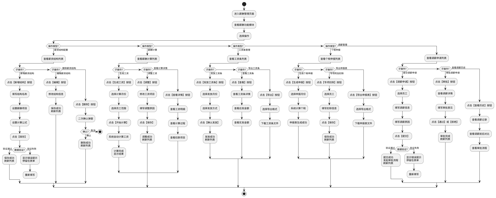

**薪资结构配置流程：**
1. HR管理员进入薪酬管理页面，选择"薪资结构配置"
2. 查看薪资结构列表，显示所有已配置的薪资结构
3. 点击【新增结构】按钮，打开新增弹窗
4. 填写结构名称、设置薪酬项目（基本工资、绩效工资、岗位津贴、加班费、社保扣款、个税扣款等）
5. 设置计算公式（如：实发工资 = 应发工资 - 社保个人缴纳 - 个税）
6. 点击【保存】按钮
7. 系统验证数据：
   - 验证通过：保存成功，显示成功提示，刷新列表
   - 验证失败：显示错误提示，停留在表单，用户重新填写

**薪酬计算流程：**
1. HR管理员进入薪酬管理页面，选择"薪酬计算"
2. 查看薪酬计算列表，显示历史计算记录
3. 点击【生成工资】按钮，打开生成弹窗
4. 选择计算月份、选择员工范围（全部员工/指定部门/指定员工）
5. 点击【开始计算】按钮
6. 系统自动计算工资（查询员工基本信息、薪资结构、考勤数据、社保数据，计算应发工资、扣款项目、实发工资）
7. 计算完成，显示工资计算结果，支持查看明细和调整

**工资条管理流程：**
1. HR管理员进入薪酬管理页面，选择"工资条管理"
2. 查看工资条列表，显示各月份工资条发放状态
3. 点击【发放工资条】按钮，打开发放弹窗
4. 选择发放月份、选择发放方式（邮件/短信/企业微信）
5. 点击【确认发放】按钮
6. 系统生成工资条并发送给员工
7. 发放成功，显示成功提示，刷新列表

**个税申报流程：**
1. HR管理员进入薪酬管理页面，选择"个税申报"
2. 查看个税申报列表，显示历史申报记录
3. 点击【生成申报】按钮，打开生成弹窗
4. 选择申报月份
5. 点击【确认】按钮
6. 系统计算个税（查询工资记录、专项附加扣除，计算应纳税所得额、累计预扣税额、本期应缴税额）
7. 申报表生成成功，支持预览和导出

**调薪管理流程：**
1. HR管理员或部门负责人进入薪酬管理页面，选择"调薪管理"
2. 查看调薪申请列表，显示所有调薪申请及审批状态
3. 点击【调薪申请】按钮，打开申请弹窗
4. 选择员工、填写调薪信息（调薪类型、调薪前薪资、调薪后薪资、调薪原因、生效日期）
5. 点击【提交】按钮
6. 系统验证数据：
   - 验证通过：提交成功，发起审批流程，发送审批通知，刷新列表
   - 验证失败：显示错误提示，停留在表单，用户重新填写
7. 审批人审批通过后，系统自动更新员工薪资信息，插入调薪历史记录，发送审批结果通知

#### 9.3.2 功能设计

**系统交互时序：**

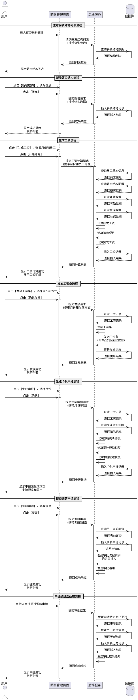

**核心功能：**

- **薪资结构配置**：支持自定义薪资结构，灵活配置薪酬项目（基本工资、绩效工资、岗位津贴、加班费、社保扣款、个税扣款等），设置计算公式，支持新增、编辑、删除薪资结构
- **薪酬计算引擎**：与考勤、绩效、社保模块深度联动，自动查询员工基本信息、薪资结构配置、考勤数据、社保数据，按照薪资结构的计算公式自动计算应发工资、扣款项目、实发工资，支持批量计算和单个调整
- **工资条管理**：支持电子工资条生成和推送，支持多种发放方式（邮件/短信/企业微信），员工可在员工自助模块查看工资条，支持工资条导出和打印
- **个税申报**：支持专项附加扣除配置（子女教育、继续教育、大病医疗、住房贷款利息、住房租金、赡养老人），采用累计预扣法计算个税，自动生成个税申报表，支持预览和导出
- **调薪管理**：支持调薪申请提交，记录调薪类型（晋升调薪、年度调薪、绩效调薪、市场调薪等）、调薪前后薪资、调薪原因、生效日期，发起审批流程，审批通过后自动更新员工薪资信息，记录调薪历史
- **薪酬统计分析**：支持薪酬数据统计和分析，包括部门薪酬总额、人均薪酬、薪酬结构分布、薪酬趋势分析等，为管理层提供决策支持

**数据字段：**

**薪资结构表：**

| 字段名称 | 字段类型 | 长度限制 | 是否必填 | 说明 |
|---------|---------|---------|---------|------|
| 结构ID | 数字 | - | 自动生成 | 唯一标识 |
| 结构名称 | 文本 | 50 | 是 | 薪资结构名称 |
| 薪酬项目配置 | JSON | - | 是 | 薪酬项目列表（项目名称、项目类型、计算方式、是否参与个税计算） |
| 计算公式 | 文本 | 500 | 是 | 实发工资计算公式 |
| 适用范围 | 文本 | 200 | 是 | 适用部门或岗位 |
| 状态 | 数字 | - | 是 | 1-启用，0-停用 |
| 创建时间 | 日期时间 | - | 自动生成 | 创建时间 |
| 更新时间 | 日期时间 | - | 自动更新 | 最后更新时间 |

**工资记录表：**

| 字段名称 | 字段类型 | 长度限制 | 是否必填 | 说明 |
|---------|---------|---------|---------|------|
| 工资ID | 数字 | - | 自动生成 | 唯一标识 |
| 员工ID | 数字 | - | 是 | 关联员工表 |
| 工资月份 | 文本 | 7 | 是 | 格式：YYYY-MM |
| 薪资结构ID | 数字 | - | 是 | 关联薪资结构表 |
| 基本工资 | 数字 | - | 是 | 基本工资金额 |
| 绩效工资 | 数字 | - | 否 | 绩效工资金额 |
| 岗位津贴 | 数字 | - | 否 | 岗位津贴金额 |
| 加班费 | 数字 | - | 否 | 加班费金额 |
| 其他收入 | 数字 | - | 否 | 其他收入金额 |
| 应发工资 | 数字 | - | 是 | 应发工资总额 |
| 社保个人缴纳 | 数字 | - | 是 | 社保个人缴纳金额 |
| 公积金个人缴纳 | 数字 | - | 是 | 公积金个人缴纳金额 |
| 个税 | 数字 | - | 是 | 个人所得税金额 |
| 其他扣款 | 数字 | - | 否 | 其他扣款金额 |
| 实发工资 | 数字 | - | 是 | 实发工资金额 |
| 工资条状态 | 数字 | - | 是 | 1-未发放，2-已发放 |
| 发放时间 | 日期时间 | - | 否 | 工资条发放时间 |
| 创建时间 | 日期时间 | - | 自动生成 | 创建时间 |

**个税申报表：**

| 字段名称 | 字段类型 | 长度限制 | 是否必填 | 说明 |
|---------|---------|---------|---------|------|
| 申报ID | 数字 | - | 自动生成 | 唯一标识 |
| 员工ID | 数字 | - | 是 | 关联员工表 |
| 申报月份 | 文本 | 7 | 是 | 格式：YYYY-MM |
| 本期收入 | 数字 | - | 是 | 本期工资收入 |
| 累计收入 | 数字 | - | 是 | 累计工资收入 |
| 本期专项扣除 | 数字 | - | 是 | 本期社保公积金扣除 |
| 累计专项扣除 | 数字 | - | 是 | 累计社保公积金扣除 |
| 本期专项附加扣除 | 数字 | - | 是 | 本期专项附加扣除 |
| 累计专项附加扣除 | 数字 | - | 是 | 累计专项附加扣除 |
| 本期应纳税所得额 | 数字 | - | 是 | 本期应纳税所得额 |
| 累计应纳税所得额 | 数字 | - | 是 | 累计应纳税所得额 |
| 本期应缴税额 | 数字 | - | 是 | 本期应缴个税 |
| 累计已缴税额 | 数字 | - | 是 | 累计已缴个税 |
| 本期实缴税额 | 数字 | - | 是 | 本期实际缴纳个税 |
| 创建时间 | 日期时间 | - | 自动生成 | 创建时间 |

**调薪申请表：**

| 字段名称 | 字段类型 | 长度限制 | 是否必填 | 说明 |
|---------|---------|---------|---------|------|
| 申请ID | 数字 | - | 自动生成 | 唯一标识 |
| 员工ID | 数字 | - | 是 | 关联员工表 |
| 调薪类型 | 数字 | - | 是 | 1-晋升调薪，2-年度调薪，3-绩效调薪，4-市场调薪 |
| 调薪前薪资 | 数字 | - | 是 | 调薪前基本工资 |
| 调薪后薪资 | 数字 | - | 是 | 调薪后基本工资 |
| 调薪幅度 | 数字 | - | 自动计算 | 调薪幅度百分比 |
| 调薪原因 | 文本 | 500 | 是 | 调薪原因说明 |
| 生效日期 | 日期 | - | 是 | 调薪生效日期 |
| 申请人ID | 数字 | - | 是 | 关联用户表 |
| 申请时间 | 日期时间 | - | 自动生成 | 申请提交时间 |
| 审批状态 | 数字 | - | 是 | 1-待审批，2-审批通过，3-审批拒绝 |
| 审批人ID | 数字 | - | 否 | 关联用户表 |
| 审批时间 | 日期时间 | - | 否 | 审批完成时间 |
| 审批意见 | 文本 | 500 | 否 | 审批意见 |

**业务规则**

- 薪资结构名称不能为空，最多50字
- 薪酬项目配置至少包含基本工资项，计算公式必须合法
- 工资计算时，应发工资 = 基本工资 + 绩效工资 + 岗位津贴 + 加班费 + 其他收入
- 工资计算时，实发工资 = 应发工资 - 社保个人缴纳 - 公积金个人缴纳 - 个税 - 其他扣款
- 个税计算采用累计预扣法，应纳税所得额 = 累计收入 - 累计专项扣除 - 累计专项附加扣除 - 累计减除费用（5000元/月）
- 个税税率采用七级超额累进税率（3%、10%、20%、25%、30%、35%、45%）
- 工资条发放后不允许修改工资数据，如需调整需要撤销发放后重新计算
- 调薪申请提交后进入审批流程，审批通过后自动更新员工薪资信息
- 调薪生效日期不能早于申请日期，调薪后薪资必须大于0
- 调薪幅度自动计算：调薪幅度 = (调薪后薪资 - 调薪前薪资) / 调薪前薪资 × 100%

#### 9.3.3 业务逻辑关联

薪酬管理模块与其他模块的关联关系：

| 关联模块 | 关联说明 |
|---------|---------|
| 员工管理 | 薪酬管理模块的员工数据来源于员工管理模块，员工入职时需要配置薪资结构，员工离职时停止工资计算 |
| 考勤管理 | 薪酬管理模块的加班费计算依赖考勤管理模块的加班数据，缺勤扣款依赖考勤管理模块的缺勤数据 |
| 绩效管理 | 薪酬管理模块的绩效工资计算依赖绩效管理模块的绩效评分数据，绩效系数影响绩效工资金额 |
| 社保管理 | 薪酬管理模块的社保公积金扣款数据来源于社保管理模块，社保个人缴纳金额和公积金个人缴纳金额作为工资扣款项 |
| 审批流引擎 | 薪酬管理模块的调薪申请通过审批流引擎进行审批，审批通过后自动更新员工薪资信息 |
| 员工自助 | 薪酬管理模块的工资条数据推送到员工自助模块，员工可在员工自助模块查看工资条和调薪历史 |
| 数据报表与分析 | 薪酬管理模块的工资数据、个税数据、调薪数据作为数据报表与分析模块的数据源，生成薪酬分析报表 |

---

## 十、绩效管理

### 10.1 功能概述

绩效管理模块为企业提供**端到端的绩效管理体系**，覆盖从"目标设定 → 过程跟踪 → 多维评估 → 校准决策 → 面谈沟通 → 持续反馈 → 结果应用"的完整生命周期。本模块面向企业中高级 HR 场景，支持 **OKR（目标与关键成果）+ KPI（关键绩效指标）** 并行模式，提供评估表模板可配置、360 度多角色评估、强制分布校准、绩效面谈、1on1 持续反馈、绩效改进计划 PIP、能力模型评估、人才盘点 9-box 等 17 大核心功能。系统与薪酬管理、培训管理、晋升管理深度集成，将绩效结果应用于薪资调整、晋升决策、培训规划等场景，形成完整的人才发展闭环。

**17 大核心功能：**

**【基础层 · 目标与模板】**
1. **绩效周期管理**：配置绩效周期（月/季度/半年/年度/自定义），设置关键节点与状态流转
2. **评估表模板管理**：按"岗位族 + 职级"组合配置多套评估表模板；维度、权重、评分规则可定制
3. **目标管理（OKR + KPI 双模式）**：按岗位族自动匹配模式；OKR 三层分解（公司→部门→个人）；KPI 扁平化指标
4. **目标对齐视图（OKR 树）**：可视化公司 / 部门 / 个人目标之间的上下级支撑关系

**【评估环 · 多维评估与校准】**
5. **绩效评估流程**：4 级串行评审（自评 → 直属上级 → 隔级上级 → HR 归档），每级节点由模板定义
6. **360 度评估**：下属 / 同事匿名评 + 上级实名评；员工自选评估人 + 直属上级核准 + HR 可增减
7. **绩效校准**：强制分布校准 + 校准会 + 校准卡可视化拖拽调档
8. **绩效面谈记录**：面谈计划 + 提纲 + 纪要 + 员工确认；关联绩效结果

**【持续反馈 · PIP 与档案】**
9. **1on1 / 持续反馈**：建议双周；员工/Leader 任一方可发起；CFR（对话-反馈-认可）
10. **绩效改进计划 PIP**：HR 手动发起为主；评为 D 自动建议启动；默认 3 个月周期
11. **绩效档案**：历年绩效记录 + 趋势图 + 绩效画像；数据保留 5 年以上

**【运营层 · 分析与应用】**
12. **绩效数据分析**：HR 驾驶舱：分布 / 部门均分 / 优秀占比 / 趋势 / 部门对比
13. **绩效任务中心**：自动提醒到期任务、节点推送、待办聚合
14. **绩效结果应用联动**：联动薪酬（调薪系数 / 绩效奖金）、培训（发展计划）、晋升（晋升候选池）

**【进阶层 · 人才发展】**
15. **能力模型与人才盘点 9-box**：每个岗位族 6~10 个胜任力；绩效×潜力 9 宫格年度盘点
16. **绩效申诉**：结果公示后 5 个工作日内可申诉；二次评议机制

**【可选增强】**
17. **AI 辅助 / 徽章认可**：AI 辅助评语生成；同事互发认可徽章

### 10.2 页面访问权限

| 功能模块 | 超级管理员 | HR管理员 | 部门负责人 | 普通员工 |
|---------|-----------|---------|-----------|---------|
| 绩效周期管理 | ✓ | ✓ | ✗ | ✗ |
| 评估表模板管理 | ✓ | ✓ | ✗ | ✗ |
| 目标管理（设定/审批） | ✓ | ✓ | ✓（审批下属目标） | ✓（设定个人目标） |
| 目标对齐视图 | ✓ | ✓ | ✓（本部门及下属） | ✓（本人 + 直属上级） |
| 绩效评估（填写） | ✓ | ✓ | ✓（评分下属） | ✓（自评 + 被 360 评） |
| 绩效评估（查看全部） | ✓ | ✓ | ✓（本部门） | ✗ |
| 360 度评估 | ✓ | ✓ | ✓（审核评估人名单） | ✓（自选评估人 + 被评）|
| 绩效校准 | ✓ | ✓ | ✓（仅本部门） | ✗ |
| 绩效面谈 | ✓ | ✓ | ✓（与下属面谈） | ✓（查看本人记录 + 确认）|
| 1on1 / 持续反馈 | ✓ | ✓ | ✓（与下属进行） | ✓（发起 + 参与） |
| 绩效改进计划 PIP | ✓ | ✓ | ✓（跟进下属） | ✓（本人 PIP 查看） |
| 绩效档案 | ✓ | ✓ | ✓（仅本部门） | ✓（仅个人） |
| 绩效数据分析 | ✓ | ✓ | ✓（本部门指标） | ✗ |
| 绩效任务中心 | ✓ | ✓ | ✓（本部门待办） | ✓（个人待办） |
| 绩效结果应用联动 | ✓ | ✓ | ✗ | ✗ |
| 能力模型配置 | ✓ | ✓ | ✗ | ✗ |
| 人才盘点 9-box | ✓ | ✓ | ✓（参与本部门盘点） | ✗ |
| 绩效申诉 | ✓ | ✓（审批） | ✓（一级审批） | ✓（发起 + 查看个人） |

> **角色分工说明**：
> - **HR 管理员**：流程配置、模板维护、强制分布校准、结果归档、报表分析、申诉审批
> - **部门负责人**：评分下属、主持下属面谈/1on1、本部门校准会、目标审批、人才盘点
> - **普通员工**：设定个人目标、自评、参与 360 评估、接受面谈、发起 1on1、提交申诉
> - **隔级上级**（部门负责人的上级）：对下属的下属进行复核评分（通过评估流程的第 3 级节点）

### 10.3 功能详细设计

<!-- 10.3 详细设计占位 - 将由 10.3.1 ~ 10.3.17 依次填充 -->

#### 10.3.1 绩效周期管理

##### （一）功能需求概述

绩效周期管理定义企业绩效运营的时间框架。系统支持 **月度 / 季度 / 半年 / 年度 / 自定义** 5 种周期类型；每个周期包含 6 个关键节点（目标设定截止、过程跟踪开始、评估开始、评估截止、校准完成、归档完成），节点到期前自动向相关角色推送提醒。

##### （二）核心功能

- **周期类型支持**：月 / 季度 / 半年 / 年度 / 自定义
- **关键节点配置**：目标设定截止日 / 过程跟踪周期节点 / 评估开始日 / 评估截止日 / 校准完成日 / 归档完成日
- **周期状态机**：未开始 → 目标设定中 → 过程跟踪中 → 评估中 → 校准中 → 公示中 → 已归档（按顺序流转，不可跳过或回退）
- **周期复用**：复制上一周期配置快速创建新周期
- **多周期并行**：支持 OKR 季度 + KPI 年度并行存在
- **周期可视化甘特图**：所有周期 / 节点在一张时间轴上总览
- **自动结转**：未完成任务自动流转到下一周期

##### （三）字段定义 · 绩效周期

| 字段 | 类型 | 必填 | 说明 |
|---|---|---|---|
| 周期编号 | 字符串 | 是 | 格式：PERF + 年 + 周期类型 + 序号（PERF2026Q1） |
| 周期名称 | 字符串 | 是 | 如"2026 年第一季度 OKR" |
| 周期类型 | 枚举 | 是 | month / quarter / half / year / custom |
| 开始日期 / 结束日期 | 日期 | 是 | 周期起止 |
| 目标设定截止 | 日期 | 是 | 员工必须在此日前完成目标设定 |
| 过程跟踪节点 | 日期数组 | 否 | 季度周期默认月末 1 次，年度周期默认双月 1 次 |
| 评估开始 / 截止 | 日期 | 是 | 评估窗口 |
| 校准完成日 | 日期 | 是 | 校准会议结束时间 |
| 归档完成日 | 日期 | 是 | 结果公示 + 申诉期结束后归档 |
| 周期状态 | 枚举 | 是 | 7 态状态机 |
| 适用范围 | JSON | 否 | 指定部门 / 岗位族 / 职级；不指定为全员 |
| 关联评估表模板组 | JSON | 是 | 关联一组评估表模板 ID |

##### （四）业务规则

- PERF-001：同一时间段内同一适用范围不能有重叠周期
- PERF-002：周期状态严格按顺序流转，不可跳过或回退；状态变更触发对应节点通知
- PERF-003：目标设定截止日 < 评估开始日 < 评估截止日 < 校准完成日 < 归档完成日
- PERF-004：周期进入"评估中"后，目标不能新增、删除或修改权重
- PERF-005：周期归档后数据进入只读状态，仅 HRD 可解除归档

---

#### 10.3.2 评估表模板管理

##### （一）功能需求概述

评估表模板是绩效评估的骨架，定义了"评什么 / 怎么评 / 谁来评 / 如何加权"。不同岗位族、不同职级需要不同的评估维度。系统提供可视化模板编辑器，支持按 **岗位族 + 职级** 组合配置模板，模板可继承、可版本化、可复用。

##### （二）核心功能

- **多模板并存**：按"岗位族 × 职级"组合配置（如技术-P5-P7、产品-P5-P7、管理-总监以上 等）
- **模板结构**：模板由多个评估维度组成，每个维度包含子指标
- **评分方式**：每个子指标 1~5 分（支持 0.5 小数），支持评分描述引导
- **权重机制**：维度间加权 + 维度内子指标加权，自动校验权重和 = 100%
- **评估节点配置**：模板级指定评估流程（自评 → 直属上级 → 隔级 → HR），可精简或扩展
- **等级映射**：模板级配置分数区间 → S/A/B/C/D 映射（默认 90+=S, 80+=A, 70+=B, 60+=C, <60=D）
- **模板版本化**：每次修改生成新版本；已使用的模板不能编辑，必须新版本
- **模板引用**：绩效周期选择模板组，评估时自动按员工所属岗位族 × 职级命中模板
- **模板预览**：模板创建/编辑过程中随时预览评估表最终呈现

##### （三）字段定义 · 评估表模板

| 字段 | 类型 | 必填 | 说明 |
|---|---|---|---|
| 模板编号 | 字符串 | 是 | 格式：TPL + 年月 + 序号 |
| 模板名称 | 字符串 | 是 | 如"技术研发-P5-P7 绩效评估表" |
| 适用岗位族 | 字符串 | 是 | 技术研发 / 产品设计 / 运营市场 / 管理岗位 / 职能支持 |
| 适用职级 | 字符串 | 是 | 如 P5-P7 / P8+ / 总监及以上 |
| 评估类型 | 枚举 | 是 | OKR 评估 / KPI 评估 / 混合 |
| 评估维度 | JSON | 是 | 维度名 / 权重 / 子指标列表 / 评分引导文案 |
| 评估节点 | JSON | 是 | 自评→直属上级→隔级→HR 的节点链，每节点可指定评分权重 |
| 等级映射 | JSON | 是 | 分数区间到 S/A/B/C/D 的映射 |
| 启用状态 | 枚举 | 是 | 启用 / 禁用 |
| 版本号 | 数字 | 是 | 每次保存更新的版本号 |

##### （四）字段定义 · 评估维度（模板子结构）

| 字段 | 类型 | 必填 | 说明 |
|---|---|---|---|
| 维度名 | 字符串 | 是 | 如"业绩成果"、"专业能力"、"团队协作" |
| 维度权重 | 数字 | 是 | 0-100 之间，所有维度权重之和 = 100 |
| 子指标 | 数组 | 是 | 每个子指标含：名称、权重、评分引导（1 分/3 分/5 分的具体描述） |

##### （五）业务规则

- TPL-001：模板创建后首次保存即启用；必须经过 HR 管理员启用后才可被周期引用
- TPL-002：已被周期引用的模板不能编辑字段结构，只能复制为新版本
- TPL-003：维度权重和 + 子指标权重和均必须 = 100
- TPL-004：评估节点至少包含"自评"和"直属上级"两级
- TPL-005：等级映射分数区间不能重叠或留空

---

#### 10.3.3 目标管理（OKR + KPI 双模式）

##### （一）功能需求概述

目标管理是绩效的起点。系统采用"**按岗位族自动匹配模式**"：技术 / 产品 / 研发默认 OKR；销售 / 运营 / 职能默认 KPI；员工可提交后变更申请。

- **OKR 模式**：目标（Objective）+ 关键成果（Key Results, 3~5 个）；强调挑战性、公开透明、不直接与薪酬挂钩
- **KPI 模式**：关键绩效指标，强调可量化、与业务目标和薪酬直接挂钩

##### （二）核心功能

- **双模式并行**：按岗位族自动匹配（规则可配置）
- **OKR 三层分解**：公司 OKR → 部门 OKR → 个人 OKR
- **KR 数量控制**：单个 O 下 3~5 个 KR（建议值，可调）
- **KPI 扁平化**：指标 + 目标值 + 权重 + 评分规则
- **目标权重**：所有目标权重之和 = 100%
- **目标审批**：提交后触发直属上级审批；驳回可修改后重新提交
- **目标冻结**：评估开始后目标不能新增、删除或改权重
- **目标模板库**：常见岗位的 OKR / KPI 模板库，一键引用
- **进度追踪**：季度周期月末、年度周期双月末强制更新（对应决策 7）
- **进度可视化**：燃尽图 / 进度条 / 历史趋势
- **目标调整**：周期中不可改目标；可记录"调整说明"作为校准参考

##### （三）字段定义 · 绩效目标

| 字段 | 类型 | 必填 | 说明 |
|---|---|---|---|
| 目标编号 | 字符串 | 是 | 格式：GOAL + 年月日 + 4 位流水 |
| 周期编号 | 字符串 | 是 | 所属周期 |
| 员工工号 / 姓名 | 字符串 | 是 | 目标归属 |
| 部门名称 | 字符串 | 是 | 员工部门 |
| 目标类型 | 枚举 | 是 | OKR / KPI |
| 目标描述 | 文本 | 是 | ≤ 500 字 |
| 父目标编号 | 字符串 | 否 | 对齐到的上级目标（OKR 才有） |
| 关键成果 | JSON 数组 | 是 | OKR：[{描述, 目标值, 当前值, 权重}]；KPI：[{指标, 目标值, 计分规则}] |
| 权重 | 数字 | 是 | 所有目标权重 = 100 |
| 当前进度 | 数字 | 否 | 0-100，来自进度更新 |
| 审批状态 | 枚举 | 是 | 待审批 / 已批准 / 已驳回 |
| 审批人 / 时间 / 意见 | - | 否 | 审批信息 |
| 最近更新时间 / 更新人 | - | 是 | 便于跟踪 |

##### （四）字段定义 · 进度更新记录

| 字段 | 类型 | 必填 | 说明 |
|---|---|---|---|
| 更新编号 | 字符串 | 是 | 自动生成 |
| 目标编号 | 字符串 | 是 | 关联目标 |
| 更新时间 | 日期时间 | 是 | 记录时间 |
| 更新前进度 / 更新后进度 | 数字 | 是 | 进度变化 |
| 关键成果更新 | JSON | 否 | 各 KR 的当前值变化 |
| 亮点 / 问题 / 下阶段计划 | 文本 | 否 | 描述性信息 |
| 更新人 | 字符串 | 是 | 通常是员工本人 |

##### （五）业务规则

- GOAL-001：员工必须在"目标设定截止日"前完成目标设定，否则 HR 告警
- GOAL-002：所有目标的权重之和必须等于 100%
- GOAL-003：目标必须经直属上级审批通过后才生效；驳回后可修改重新提交
- GOAL-004：OKR 子目标可选择性对齐父目标（非强制）
- GOAL-005：进度更新必须在每个过程跟踪节点前完成（默认月末 / 双月末）
- GOAL-006：评估开始后目标冻结（结构不可改、权重不可调）
- GOAL-007：KR 数量建议 3~5 个，超过 5 个系统提示但不限制

---

#### 10.3.4 目标对齐视图（OKR 树）

##### （一）功能需求概述

目标对齐视图将公司 → 部门 → 个人的 OKR 呈现为可视化树状图，帮助员工理解"我的目标如何支撑公司目标"，便于管理者检查对齐情况、识别目标盲区。

##### （二）核心功能

- **三层树状图**：公司 OKR（根）→ 部门 OKR（中间层）→ 个人 OKR（叶子）
- **横向对齐关系**：一个个人 OKR 可关联多个上级 OKR（多对多关系）
- **节点筛选**：按部门 / 负责人 / 进度 / 完成度筛选
- **节点展开收起**：逐层展开查看细节
- **进度热力图**：节点颜色反映完成度（红 / 黄 / 绿）
- **目标孤岛识别**：未对齐到任何父目标的个人 OKR 标记为"孤岛"，便于复核
- **部门对齐率**：统计某部门员工目标对齐公司 OKR 的比例
- **时间维度切换**：查看历史周期的对齐树

##### （三）字段定义 · 目标对齐关系

| 字段 | 类型 | 必填 | 说明 |
|---|---|---|---|
| 对齐编号 | 字符串 | 是 | 自动生成 |
| 子目标编号 | 字符串 | 是 | 下级 OKR |
| 父目标编号 | 字符串 | 是 | 上级 OKR |
| 支撑权重 | 数字 | 否 | 子目标对父目标的支撑程度（%，可选） |
| 创建人 / 时间 | - | 是 | 建立对齐关系的人 |

##### （四）业务规则

- ALIGN-001：个人 OKR 可对齐到部门 OKR 或直属上级的个人 OKR；部门 OKR 可对齐到公司 OKR 或上级部门 OKR
- ALIGN-002：一个子目标可对齐多个父目标，一个父目标可被多个子目标对齐
- ALIGN-003：不允许循环对齐（A → B → A）
- ALIGN-004：对齐关系可随时新增 / 修改 / 删除，不改变原始目标数据

---

#### 10.3.5 绩效评估流程

##### （一）功能需求概述

绩效评估是整个绩效周期的核心环节。系统采用**模板级可配置的 4 级串行评审**机制：自评 → 直属上级 → 隔级上级 → HR 归档。每个节点的评分权重由评估表模板决定；节点间串行流转，前一节点未完成时后续节点不可填写。

##### （二）核心功能

- **评估任务分发**：周期进入"评估中"状态时，系统根据每位员工的岗位族×职级自动匹配评估表模板、生成评估任务、分发给对应节点
- **自评节点（Level 1）**：员工按模板维度逐项评分 + 撰写工作总结、亮点、不足；草稿自动保存
- **直属上级节点（Level 2）**：可见员工自评内容；按模板评分；可针对自评进行反馈评论
- **隔级上级节点（Level 3）**：可见自评 + 直属上级评分；主要做"把关 / 复核"，可调整等级或写复核意见
- **HR 归档节点（Level 4）**：HR 审核整体评估完整性、计算综合得分 + 初步等级、提交到校准环节
- **节点权重**：每个节点对最终综合得分的权重由模板定义（典型：自评 10% + 上级 60% + 隔级 30%）
- **评估看板**：员工视角看"我待完成的评估"；管理者视角看"我的下属的评估进度"；HR 视角看"全员评估进度分布"
- **评估进度提醒**：节点到期前 3 天、1 天、截止当天自动推送
- **评估草稿 / 历史版本**：保存草稿；提交前可多次修改；提交后进入下一节点
- **360 度评估插入**：在直属上级节点之前并行执行（详见 10.3.6）
- **评估数据导出**：HR 可按周期导出全部评估数据（Excel / PDF）

##### （三）字段定义 · 绩效评估任务

| 字段 | 类型 | 必填 | 说明 |
|---|---|---|---|
| 评估编号 | 字符串 | 是 | 格式：EVAL + 年月日 + 4 位流水 |
| 周期编号 | 字符串 | 是 | 关联周期 |
| 员工工号 / 姓名 | 字符串 | 是 | 被评估员工 |
| 岗位族 / 职级 | 字符串 | 是 | 用于匹配模板 |
| 模板编号 | 字符串 | 是 | 匹配到的评估表模板 |
| 当前节点 | 枚举 | 是 | self / direct / skip / hr / done |
| 各节点状态 | JSON | 是 | 每个节点的填写状态 + 提交时间 + 评分人 |
| 各节点评分 | JSON | 是 | 每个节点对各维度的评分 |
| 综合得分 | 数字 | 否 | HR 节点归档后计算 |
| 初步等级 | 枚举 | 否 | 按模板等级映射得出 |
| 最终等级 | 枚举 | 否 | 经校准后写回 |
| 整体状态 | 枚举 | 是 | 待开始 / 进行中 / 已归档 / 已校准 / 已公示 |

##### （四）字段定义 · 评估节点记录

| 字段 | 类型 | 必填 | 说明 |
|---|---|---|---|
| 节点记录编号 | 字符串 | 是 | 自动生成 |
| 评估编号 | 字符串 | 是 | 关联评估 |
| 节点类型 | 枚举 | 是 | self / direct / skip / hr |
| 评分人工号 / 姓名 | 字符串 | 是 | 本节点的填写人 |
| 各维度评分 | JSON | 是 | 维度名 → 分数 |
| 评语 / 总结 / 亮点 / 不足 | 文本 | 否 | 文字反馈 |
| 提交时间 | 日期时间 | 否 | 节点提交时刻 |
| 复核意见 | 文本 | 否 | 隔级上级专用 |

##### （五）业务规则

- EVAL-001：自评必须在评估开始日后才能提交；未提交不能进入直属上级节点
- EVAL-002：评估节点严格串行，前一节点未完成不能填写后续节点
- EVAL-003：节点负责人离职 / 调岗时，HR 可重新指派评估人（需填调整原因，系统留痕）
- EVAL-004：评估综合得分 = Σ(节点权重 × 节点加权评分)；节点加权评分 = Σ(维度权重 × 维度得分)
- EVAL-005：初步等级根据模板定义的分数区间自动映射
- EVAL-006：节点超期未提交时系统每日提醒 + 超期 7 天后升级至 HRBP
- EVAL-007：评估归档后不可再编辑，如需修改必须走"申诉流程"（详见 10.3.16）

---

#### 10.3.6 360 度评估

##### （一）功能需求概述

360 度评估是绩效评估的重要补充，通过收集下属、同事、跨部门协作者的多角度反馈，形成对员工更立体的评价。系统采用"**员工自选 + 上级核准 + HR 可增减**"的评估人指定机制；下属评和同事评**匿名汇总**、上级评**实名**；被评估人看总分和文字反馈但不看来源。

##### （二）核心功能

- **评估人自选**：员工在周期开始后提交 5~8 位评估人候选名单
- **上级核准 / HR 调整**：直属上级核准评估人名单，可要求员工增减；HR 可干预调整（如避免"友好评估"）
- **评估人类型**：下属（subordinate）/ 同事（peer）/ 跨部门协作者（cross）/ 上级（上级是必选且实名）
- **匿名规则**：下属 / 同事 / 跨部门三种类型的评估匿名聚合；上级评分实名
- **加权计算**：不同类型评估人的权重可由模板配置（典型：下属 15% + 同事 30% + 跨部门 15% + 上级 40%）
- **评估入口**：评估人收到任务后在"我的待办"看到需要评估的人员列表
- **聚合展示**：被评估人看到汇总后的各类平均分 + 文字反馈（不显示评估人姓名，除上级外）
- **反馈质量校验**：文字反馈少于 20 字系统提示"请更具体"；全员给同一分数时标为"低质量反馈"，HR 可回退
- **拒绝评估**：评估人可拒绝评估（需填原因），系统自动通知员工 + 上级补选

##### （三）字段定义 · 360 评估关系

| 字段 | 类型 | 必填 | 说明 |
|---|---|---|---|
| 关系编号 | 字符串 | 是 | 自动生成 |
| 评估编号 | 字符串 | 是 | 关联员工的绩效评估任务 |
| 被评估人 | 字符串 | 是 | 员工工号 |
| 评估人工号 / 姓名 | 字符串 | 是 | 评估人 |
| 评估人类型 | 枚举 | 是 | subordinate / peer / cross / superior |
| 状态 | 枚举 | 是 | pending / submitted / rejected |
| 提名来源 | 枚举 | 是 | self / superior / hr |
| 核准人 | 字符串 | 是 | 核准该评估人的直属上级 |
| 核准时间 | 日期时间 | 是 | 核准时刻 |
| 拒绝原因 | 文本 | 否 | 评估人拒绝时填写 |

##### （四）字段定义 · 360 评估反馈

| 字段 | 类型 | 必填 | 说明 |
|---|---|---|---|
| 反馈编号 | 字符串 | 是 | 自动生成 |
| 关系编号 | 字符串 | 是 | 关联评估关系 |
| 各维度评分 | JSON | 是 | 按模板维度评分 |
| 亮点反馈 | 文本 | 否 | 员工表现突出的地方 |
| 改进建议 | 文本 | 否 | 员工可提升的地方 |
| 匿名标记 | 布尔 | 是 | 是否匿名（除上级外默认 true） |
| 提交时间 | 日期时间 | 是 | 反馈提交时刻 |

##### （五）业务规则

- 360-001：员工可选的 5~8 人包含下属 / 同事 / 跨部门任意组合；直属上级必选
- 360-002：下属和同事评估反馈强制匿名聚合；聚合需至少 3 人反馈才展示，少于 3 人时隐藏以保护匿名性
- 360-003：评估人离职、跨部门调岗时系统自动剔除，HR 需补选
- 360-004：评估人对同一员工的评估反馈只能提交一次；提交后不可修改
- 360-005：被评估人不可看到 360 反馈的评估人姓名（上级评除外）；HR / 部门负责人有完整视图
- 360-006：文字反馈少于 20 字或全维度同分时触发质量提示，HR 可回退要求补充

---

#### 10.3.7 绩效校准

##### （一）功能需求概述

绩效校准是 HR / 管理者对评估结果的整体复核与调整，目的是确保"**绩效评定符合强制分布比例**"、"**跨部门跨团队的标准一致**"。系统提供**强制分布可视化 + 校准会 + 校准卡可视化拖拽**三种工具支持校准过程。

##### （二）核心功能

- **强制分布配置**：默认 S 10% / A 20% / B 40% / C 20% / D 10%；可按部门或岗位族差异化配置
- **分布实时监控**：初步评估归档后实时展示各等级占比与强制分布的偏差
- **校准会议管理**：创建校准会（参会人：HR + 相关部门负责人 + HRD），会前准备资料、会中记录讨论、会后确认结果
- **校准卡可视化**：9-box 样式的看板，员工以卡片呈现，可直接拖拽调档
- **校准前后对比**：并排展示校准前 vs 校准后的等级分布变化
- **校准批量调整**：HR 可按"边界分数优先"策略批量建议调整对象
- **校准记录留痕**：每次调档都记录调整前 / 调整后 / 调整人 / 调整理由
- **校准冻结 / 解冻**：HR 可冻结某部门评定结果防止误改；HRD 可解冻
- **跨部门对标**：相同职级在不同部门之间分数分布的对标可视化，发现"打分宽 / 严"的部门

##### （三）字段定义 · 强制分布配置

| 字段 | 类型 | 必填 | 说明 |
|---|---|---|---|
| 配置编号 | 字符串 | 是 | 自动生成 |
| 周期编号 | 字符串 | 是 | 关联周期 |
| 适用范围 | JSON | 是 | 部门 / 岗位族 / 全员 |
| 等级比例 | JSON | 是 | S/A/B/C/D 各等级目标比例 |
| 容差范围 | 数字 | 否 | ± x%（默认 2%） |

##### （四）字段定义 · 校准记录

| 字段 | 类型 | 必填 | 说明 |
|---|---|---|---|
| 校准记录编号 | 字符串 | 是 | 格式：CAL + 年月日 + 4 位流水 |
| 评估编号 | 字符串 | 是 | 被校准的评估任务 |
| 调整前等级 | 枚举 | 是 | S/A/B/C/D |
| 调整后等级 | 枚举 | 是 | S/A/B/C/D |
| 调整原因 | 文本 | 是 | 必填，便于回溯 |
| 校准会议编号 | 字符串 | 否 | 若在某次校准会中调整则关联 |
| 调整人 | 字符串 | 是 | 通常是 HR 或部门负责人 |
| 调整时间 | 日期时间 | 是 | 记录时刻 |

##### （五）字段定义 · 校准会议

| 字段 | 类型 | 必填 | 说明 |
|---|---|---|---|
| 会议编号 | 字符串 | 是 | 格式：CALMTG + 年月日 + 序号 |
| 周期编号 | 字符串 | 是 | 关联周期 |
| 会议主题 | 字符串 | 是 | 如"2026 Q1 技术部校准会" |
| 会议时间 | 日期时间 | 是 | 会议发生时刻 |
| 参会人列表 | JSON | 是 | 工号 + 姓名列表 |
| 覆盖范围 | JSON | 是 | 哪些部门 / 员工 |
| 会议纪要 | 文本 | 否 | 关键讨论内容、共识、行动项 |
| 会议状态 | 枚举 | 是 | 计划中 / 进行中 / 已完成 |

##### （六）业务规则

- CAL-001：强制分布允许容差（默认 ±2%）；超出容差系统拦截提交并提示
- CAL-002：校准必须在校准完成日之前执行；超期后 HR 告警
- CAL-003：每次调档必须填写调整原因；调档记录永久留存，可审计
- CAL-004：校准完成后进入"公示期"（默认 5 工作日），此期间结果对员工可见且可申诉
- CAL-005：D 等级员工调档需 HRBP + 部门负责人双确认
- CAL-006：跨等级大幅调整（如 B→S 或 B→D）需填写详细理由 + HRD 确认

---

#### 10.3.8 绩效面谈记录

##### （一）功能需求概述

绩效面谈是员工和直属上级之间的**正式沟通环节**，通常在评估完成、结果公示之后进行。面谈涵盖过去周期的回顾（亮点 / 不足）、发展计划、下周期目标预设等。系统提供完整的"面谈计划 → 提纲 → 纪要 → 员工确认"闭环。

##### （二）核心功能

- **面谈任务自动生成**：评估归档后系统自动为每个员工创建面谈任务，指派给直属上级
- **面谈时间预约**：直属上级发起面谈邀约，员工确认时间
- **面谈提纲模板**：系统提供标准提纲（过去周期回顾 / 不足改进 / 发展计划 / 下周期目标 / 员工诉求），上级可修改
- **面谈前资料聚合**：自动聚合员工的目标达成、自评、360 反馈、历史绩效供面谈参考
- **面谈纪要记录**：面谈过程中实时记录要点；支持结构化字段（优点 / 不足 / 改进 / 发展 / 员工反馈 / 上级承诺）
- **员工确认机制**：面谈纪要提交后员工必须在 5 工作日内确认（或提出异议）
- **异议处理**：员工对纪要有异议可申请修改；双方协商后二次签署
- **面谈质量检查**：HR 可抽查面谈纪要，识别"敷衍面谈"（纪要过短 / 无具体内容）
- **面谈数据分析**：统计面谈完成率、平均时长、员工确认率、异议率

##### （三）字段定义 · 绩效面谈

| 字段 | 类型 | 必填 | 说明 |
|---|---|---|---|
| 面谈编号 | 字符串 | 是 | 格式：TALK + 年月日 + 4 位流水 |
| 周期编号 | 字符串 | 是 | 关联周期 |
| 评估编号 | 字符串 | 是 | 关联评估任务 |
| 员工工号 / 姓名 | 字符串 | 是 | 被面谈员工 |
| 面谈人工号 / 姓名 | 字符串 | 是 | 直属上级（或替代者） |
| 预约时间 | 日期时间 | 否 | 双方约定的时间 |
| 实际面谈时间 | 日期时间 | 否 | 实际发生时刻 |
| 面谈时长 | 数字 | 否 | 分钟 |
| 优点总结 | 文本 | 是 | 过去周期亮点 |
| 不足分析 | 文本 | 是 | 过去周期不足 |
| 改进建议 | 文本 | 是 | 针对不足的改进措施 |
| 发展计划 | 文本 | 否 | 培训 / 技能 / 晋升路径 |
| 下周期目标预设 | 文本 | 否 | 下一周期目标建议 |
| 员工反馈 | 文本 | 否 | 员工补充意见 |
| 上级承诺 | 文本 | 否 | 如指导培训、调整职责等 |
| 员工确认状态 | 枚举 | 是 | 未确认 / 已确认 / 有异议 / 异议处理中 |
| 员工异议 | 文本 | 否 | 异议内容 |
| 面谈状态 | 枚举 | 是 | 待预约 / 已预约 / 已完成 / 已确认 |

##### （四）业务规则

- TALK-001：绩效面谈必须在评估归档后 15 个工作日内完成
- TALK-002：面谈纪要至少包含"优点总结 / 不足分析 / 改进建议"3 项必填字段
- TALK-003：员工必须在纪要提交后 5 工作日内确认；逾期未确认视为默认同意
- TALK-004：员工有异议时自动通知直属上级 + HRBP 介入协商
- TALK-005：面谈纪要对员工可见；面谈人上级（隔级）可见；HR 可见
- TALK-006：面谈数据作为员工档案重要组成，永久保留

---

#### 10.3.9 1on1 / 持续反馈

##### （一）功能需求概述

1on1（一对一谈话）是员工和直属上级**在绩效周期外的日常持续沟通**，用于即时反馈、职业发展、问题解决。相比年度 / 季度的正式绩效面谈，1on1 更轻量、更高频（建议双周一次）。系统还支持 **CFR（Conversation 对话 / Feedback 反馈 / Recognition 认可）**三位一体的持续反馈文化。

##### （二）核心功能

- **1on1 计划**：员工或 Leader 任一方可发起；设置频率（每周 / 双周 / 月度）+ 默认时长（30 / 45 / 60 分钟）
- **1on1 提纲**：系统提供提纲模板库（职业发展 / 工作反馈 / 项目回顾 / 个人问题 / 自由讨论）
- **1on1 准备**：双方各自在线填写准备内容（待讨论话题 / 待提出问题 / 待反馈事项）
- **1on1 纪要**：会谈过程中共同编辑；关键决定 / 承诺 / 下次议题自动生成后续待办
- **1on1 历史**：时间线展示所有 1on1 记录，便于追踪议题的连续性
- **即时反馈 Feedback**：员工 / Leader / 同事之间随时发起"给某人的反馈"，文字或评分
- **认可 Recognition**：同事间互发"认可徽章"（如"团队合作之星 / 问题解决专家"），积分化运营
- **1on1 频率监控**：HR 可查看团队 1on1 覆盖率、频率，识别"1on1 缺失"的团队
- **反馈数据应用**：即时反馈 / 认可记录汇总到员工档案，作为评估参考

##### （三）字段定义 · 1on1 记录

| 字段 | 类型 | 必填 | 说明 |
|---|---|---|---|
| 1on1 编号 | 字符串 | 是 | 格式：O2O + 年月日 + 序号 |
| 员工工号 / 姓名 | 字符串 | 是 | 员工一方 |
| Leader 工号 / 姓名 | 字符串 | 是 | 上级一方 |
| 发起方 | 枚举 | 是 | employee / leader |
| 计划时间 | 日期时间 | 否 | 双方约定时间 |
| 实际时间 | 日期时间 | 否 | 实际发生时刻 |
| 时长 | 数字 | 否 | 分钟 |
| 员工准备 | 文本 | 否 | 员工会前填写 |
| Leader 准备 | 文本 | 否 | Leader 会前填写 |
| 纪要 | 文本 | 是 | 会后共同编辑 |
| 关键决定 | 文本 | 否 | 双方达成的决定 |
| 后续待办 | JSON | 否 | 生成的后续任务列表 |
| 状态 | 枚举 | 是 | 待进行 / 已完成 / 已取消 |

##### （四）字段定义 · 即时反馈 Feedback

| 字段 | 类型 | 必填 | 说明 |
|---|---|---|---|
| 反馈编号 | 字符串 | 是 | 格式：FB + 年月日 + 序号 |
| 反馈发起人 | 字符串 | 是 | 工号 |
| 反馈对象 | 字符串 | 是 | 员工工号 |
| 反馈类型 | 枚举 | 是 | 赞赏 / 建议 / 纠偏 |
| 反馈内容 | 文本 | 是 | 具体描述 |
| 关联项目 / 事件 | 字符串 | 否 | 上下文 |
| 可见范围 | 枚举 | 是 | 仅双方 / 双方+ Leader / 团队公开 |
| 创建时间 | 日期时间 | 是 | 反馈时刻 |

##### （五）字段定义 · 认可徽章

| 字段 | 类型 | 必填 | 说明 |
|---|---|---|---|
| 徽章编号 | 字符串 | 是 | 自动生成 |
| 徽章类型 | 枚举 | 是 | 如 团队合作之星 / 创新先锋 / 用户至上 等 |
| 授予人 | 字符串 | 是 | 工号 |
| 接收人 | 字符串 | 是 | 员工工号 |
| 授予理由 | 文本 | 是 | 具体事例 |
| 积分值 | 数字 | 否 | 徽章关联的积分 |
| 创建时间 | 日期时间 | 是 | 授予时刻 |

##### （六）业务规则

- O2O-001：1on1 不强制但建议双周一次；HR 监控覆盖率但不强制执行
- O2O-002：1on1 纪要对双方可见；隔级上级可见；HR 可见（HR 的可见权由配置决定）
- O2O-003：即时反馈按可见范围展示；纠偏类反馈默认仅双方可见
- O2O-004：反馈 / 认可数据汇总到员工画像，作为正式评估的参考（不直接打分）
- O2O-005：认可徽章积分可与薪酬模块联动（年度奖金加成），由 HR 配置决定

---

#### 10.3.10 绩效改进计划 PIP

##### （一）功能需求概述

PIP（Performance Improvement Plan）是针对**绩效未达标员工的系统化改进机制**。目的不是"变相辞退"，而是给员工 3 个月的改进机会 + 明确的指导，改进后可回归正常绩效轨道。系统提供"**发起 → 目标制定 → 周跟踪 → 月评估 → 结果判定**"全流程。

##### （二）核心功能

- **PIP 发起**：HR 手动发起为主；评为 D 的员工系统自动建议启动（HR 可接受或忽略）
- **PIP 目标制定**：HR + 直属上级 + 员工三方共同制定 3~5 个改进目标，每个目标含：具体指标 / 时间节点 / 可衡量标准
- **PIP 周跟踪**：员工每周更新进度；直属上级每周给反馈
- **PIP 月评估**：每月 HR + 上级评估 PIP 执行情况；给出"超预期 / 达预期 / 低于预期"三档
- **PIP 结果判定**：3 个月结束时根据整体情况判定结果
  - **通过**：员工改进达标，回归正常绩效轨道
  - **延期**：改进有进展但未完全达标，延长 1 个月
  - **不通过**：改进未达标，进入离职流程（由 HR 和法务协同处理）
- **PIP 全程文档化**：每次评估、每次反馈、每次沟通全部留痕，作为员工档案一部分
- **PIP 员工申诉**：员工对 PIP 启动或结果有异议时可申诉（详见 10.3.16）
- **PIP 合规性保障**：默认周期 3 个月（可延长 1 次至 4 个月）；不允许"1 个月速通不通过"的滥用
- **PIP 数据分析**：统计启动率 / 通过率 / 延期率；识别部门 PIP 异常高的情况

##### （三）字段定义 · PIP 计划

| 字段 | 类型 | 必填 | 说明 |
|---|---|---|---|
| PIP 编号 | 字符串 | 是 | 格式：PIP + 年月日 + 4 位流水 |
| 员工工号 / 姓名 | 字符串 | 是 | PIP 对象 |
| 部门 / 岗位 | 字符串 | 是 | 员工所属 |
| 启动日期 | 日期 | 是 | PIP 开始日 |
| 预计结束日期 | 日期 | 是 | 默认启动日 + 3 个月 |
| 发起原因 | 文本 | 是 | 关联的绩效评估结果 / 重大绩效事件 |
| 关联评估 | 字符串 | 否 | 关联的绩效评估编号 |
| 改进目标 | JSON 数组 | 是 | 3~5 个目标，每个含指标 / 时间 / 标准 |
| 周跟踪记录 | JSON | 否 | 每周的进度更新和反馈 |
| 月评估记录 | JSON | 否 | 每月的整体评估：超预期 / 达预期 / 低于预期 |
| 最终结果 | 枚举 | 否 | passed / extended / failed |
| 结果判定时间 | 日期时间 | 否 | 判定时刻 |
| 参与 HR / 直属上级 | 字符串 | 是 | HR 和上级工号列表 |
| 状态 | 枚举 | 是 | planning / in_progress / extended / completed / closed |
| 员工签署状态 | 枚举 | 是 | 未签署 / 已签署 / 拒绝签署（拒绝需 HR 介入协商） |

##### （四）字段定义 · PIP 周跟踪

| 字段 | 类型 | 必填 | 说明 |
|---|---|---|---|
| 跟踪编号 | 字符串 | 是 | 自动生成 |
| PIP 编号 | 字符串 | 是 | 关联 PIP |
| 跟踪周 | 数字 | 是 | 第 N 周 |
| 员工更新 | 文本 | 是 | 员工本周进展 |
| 上级反馈 | 文本 | 是 | 上级本周反馈 |
| 各目标进度 | JSON | 是 | 各改进目标的当前进度 |
| 提交时间 | 日期时间 | 是 | 提交时刻 |

##### （五）业务规则

- PIP-001：PIP 启动必须由 HR 发起（员工自愿申请的"主动改进"走 1on1 + 发展计划，不走 PIP）
- PIP-002：员工对 PIP 启动有 3 个工作日申诉期；申诉期内 PIP 暂不开始
- PIP-003：PIP 启动后员工必须签署《改进计划书》，拒绝签署视为不认可，HR + HRBP + 法务介入
- PIP-004：PIP 期间员工不参与当前周期绩效评估（评估结果标记为 "PIP 中"），PIP 完成后再评
- PIP-005：PIP 周跟踪 + 月评估必须真实记录，不得补录或篡改
- PIP-006：PIP 默认 3 个月，可延期 1 次至 4 个月；不得超过 4 个月
- PIP-007：PIP 不通过的员工进入离职流程前必须经 HRD + 法务审核，确保合规

---

#### 10.3.11 绩效档案

##### （一）功能需求概述

绩效档案记录员工的**完整历史绩效数据**，包含历年周期的目标、评估、面谈、PIP、认可记录等，是员工晋升、调薪、培训规划的重要依据。档案数据至少保留 5 年，支持员工本人、直属上级、HR 三种视角查询。

##### （二）核心功能

- **档案综合视图**：一张完整的员工绩效画像，包含历年周期 / 评估 / 目标 / 面谈 / PIP / 反馈 / 认可等
- **绩效趋势图**：折线图展示历年 / 各周期的综合得分、等级、目标完成率
- **等级分布**：饼图展示历次评估等级的分布
- **能力雷达图**：展示员工各维度（业绩 / 能力 / 协作 / 创新等）的趋势
- **成长轨迹**：关键事件（晋升 / 调岗 / 荣誉 / PIP / 重大项目）按时间线展示
- **档案导出**：HR / 直属上级可导出 PDF 格式档案（含员工照片、基础信息、绩效汇总、个人陈述）
- **晋升推荐**：基于档案数据自动识别"高潜员工"（连续 2+ 周期 S/A 且无 PIP 历史）
- **档案权限**：员工只看本人；直属上级看直接下属和 HR 授权的其他员工；HR 看全员
- **数据保留**：5 年以上；员工离职后档案转入历史归档库

##### （三）字段定义 · 绩效档案快照

| 字段 | 类型 | 必填 | 说明 |
|---|---|---|---|
| 档案编号 | 字符串 | 是 | 格式：ARCH + 工号 + 年月 |
| 员工工号 / 姓名 | 字符串 | 是 | 员工信息 |
| 周期编号 | 字符串 | 是 | 关联的周期 |
| 综合得分 | 数字 | 是 | 该周期最终综合分 |
| 最终等级 | 枚举 | 是 | S/A/B/C/D |
| 各维度得分 | JSON | 是 | 各评估维度分数 |
| 目标完成率 | 数字 | 否 | 所有目标完成率均值 |
| 亮点 | 文本 | 否 | 周期亮点摘要 |
| 不足 | 文本 | 否 | 周期不足摘要 |
| 发展计划 | 文本 | 否 | 来自面谈纪要 |
| 关联 PIP | 字符串 | 否 | 若有 PIP 则关联 |
| 归档时间 | 日期时间 | 是 | 记录归档时刻 |

##### （四）业务规则

- ARCH-001：周期归档后自动生成档案快照，永久保留
- ARCH-002：员工查看本人档案；上级查看直接下属档案；HR 查看全员档案；隔级可选开放（按 HR 配置）
- ARCH-003：员工离职后档案转入历史库，保留至少 5 年，仅 HRD 可查
- ARCH-004：档案导出操作记录到系统日志（导出人 / 时间 / 范围）
- ARCH-005：档案数据不可删除 / 修改，如有错误必须通过 HR 提交"修正申请"走审批流程

---

#### 10.3.12 绩效数据分析

##### （一）功能需求概述

绩效数据分析为 HR 管理层和业务负责人提供**全局绩效洞察**，覆盖分布 / 趋势 / 对标 / 异常检测。通过数据驱动发现"宽严不一"、"高 / 低绩效部门"等问题，支持后续的管理优化。

##### （二）核心功能

- **绩效分布看板**：当前周期全员等级分布（饼图）+ 目标强制分布对比
- **部门对比分析**：各部门平均分 / 等级分布 / 目标完成率 横向对比
- **周期趋势**：最近 4~8 个周期的整体分布变化、优秀员工占比变化
- **岗位族对比**：不同岗位族的评估特征（是否有岗位族打分偏宽 / 偏严）
- **评估人画像**：各管理者的打分分布 / 平均分 / 标准差；识别"打分宽 / 严 / 严格中庸"的管理者
- **异常检测**：
  - 打分"撞墙"（大量扎堆某一分数的评估人）
  - 团队 0% S / A 比例过高 / 过低
  - 同一员工历次评估分数剧烈波动
- **高潜 / 低潜员工识别**：基于历年分数识别"连续 S/A"和"需关注"员工
- **面谈 / 1on1 完成率**：各部门 / Leader 的面谈覆盖率 / 1on1 频率
- **PIP 分析**：启动率 / 通过率 / 通过后回归表现
- **导出报告**：按部门 / 周期 / 维度导出 Excel / PDF 分析报表
- **自定义仪表盘**：HR 可自定义仪表盘卡片组合，按需保存"我的视图"

##### （三）字段定义 · 分析报表

| 字段 | 类型 | 必填 | 说明 |
|---|---|---|---|
| 报表编号 | 字符串 | 是 | 自动生成 |
| 报表名称 | 字符串 | 是 | 如"2026 Q1 技术部绩效分析" |
| 报表类型 | 枚举 | 是 | 分布 / 趋势 / 对比 / 异常 / 自定义 |
| 查询范围 | JSON | 是 | 周期 / 部门 / 岗位族 / 职级 |
| 查询指标 | JSON | 是 | 指标列表 |
| 查询结果 | JSON | 是 | 数据快照 |
| 创建人 / 时间 | - | 是 | - |

##### （四）业务规则

- ANALYTICS-001：默认 HR 看全员，部门负责人看本部门，隔级上级看直接下属部门
- ANALYTICS-002：所有导出操作留痕（导出人 / 时间 / 范围 / 格式）
- ANALYTICS-003：敏感指标（如个人具体分数）对部门负责人脱敏展示（展示区间而非具体分）
- ANALYTICS-004：异常检测触发阈值可配置，命中后推送到 HR 待办

---

#### 10.3.13 绩效任务中心

##### （一）功能需求概述

绩效任务中心是员工 / 管理者 / HR 三类角色的"**绩效待办聚合面板**"。自动根据周期节点、评估状态、面谈进度、PIP 进展、1on1 计划等，生成待办任务并推送提醒。目的是避免"绩效截止日前一天才集中催办"的被动情况。

##### （二）核心功能

- **员工视角待办**：设定目标 / 更新进度 / 完成自评 / 选择 360 评估人 / 对他人 360 评估 / 面谈确认 / 1on1 准备 / PIP 周更
- **Leader 视角待办**：审批下属目标 / 下属目标进度跟进 / 给下属评分 / 核准 360 评估人 / 主持面谈 / 校准会 / 1on1 / PIP 月评
- **HR 视角待办**：周期节点推进 / 评估进度监控 / 校准组织 / 公示管理 / 申诉审批 / 异常跟进 / PIP 审核
- **待办分类**：按"紧急 / 重要 / 常规"分级；按"到期时间"排序
- **自动提醒机制**：到期前 3 天 / 1 天 / 当天邮件 + 站内通知 + 飞书/钉钉推送（可配置）
- **待办一键跳转**：每条待办提供跳转链接，一键进入对应操作页
- **待办完成标记**：任务完成后自动关闭待办
- **延期处理**：员工可申请延期（需 Leader 批准）；PIP 和校准类任务不可延期
- **统计仪表盘**：个人待办数量 / 团队待办完成率 / 部门待办积压情况

##### （三）字段定义 · 绩效待办

| 字段 | 类型 | 必填 | 说明 |
|---|---|---|---|
| 待办编号 | 字符串 | 是 | 格式：TODO + 年月日 + 序号 |
| 任务类型 | 枚举 | 是 | 22 种任务类型（设定目标 / 自评 / 评分 / 面谈 / PIP 周更 等） |
| 分配对象 | 字符串 | 是 | 任务接收人工号 |
| 关联业务对象 | JSON | 是 | 周期 / 评估 / 面谈 / PIP 等对应 ID |
| 优先级 | 枚举 | 是 | 紧急 / 重要 / 常规 |
| 截止时间 | 日期时间 | 是 | 任务截止 |
| 提醒时间点 | JSON | 是 | 截止前 3 天 / 1 天 / 当天 |
| 状态 | 枚举 | 是 | 待完成 / 已完成 / 已延期 / 已取消 / 已过期 |
| 跳转 URL | 字符串 | 是 | 一键跳转链接 |
| 完成时间 | 日期时间 | 否 | 实际完成时刻 |
| 延期记录 | JSON | 否 | 延期申请历史 |

##### （四）业务规则

- TODO-001：所有绩效业务状态变更都自动生成对应待办
- TODO-002：待办接收后 48 小时内未查看会升级提醒级别
- TODO-003：逾期待办不会自动消失，会持续提醒并升级至上级
- TODO-004：PIP / 校准 / 归档类待办不能延期，过期 HR 介入
- TODO-005：待办数据保留 2 年供追溯

---

#### 10.3.14 绩效结果应用联动

##### （一）功能需求概述

绩效结果不是目的，而是**驱动后续人才决策的输入**。系统将绩效结果与薪酬管理、培训管理、晋升管理、员工管理四大模块深度联动，形成"绩效 → 调薪 / 奖金 / 培训 / 晋升"的完整闭环。

##### （二）核心功能

**与薪酬管理联动**：
- **绩效奖金计算**：系数由等级决定（默认 S=1.5 / A=1.2 / B=1.0 / C=0.6 / D=0），支持按周期、部门、岗位族配置不同系数
- **年度调薪联动**：年度绩效 S/A 触发调薪建议（S 10~20% / A 5~10% / B 3~5% / C 0~3% / D 不调），HR 最终决策
- **薪酬带宽校验**：调薪建议与薪酬带宽联动，超出带宽自动拦截

**与培训管理联动**：
- **发展计划推送**：面谈中识别的能力短板 → 自动推送到培训需求池
- **必修课指派**：C/D 员工或 PIP 员工自动指派"能力提升必修课"
- **培训效果回查**：员工完成培训后，下一周期绩效结果回查培训效果

**与晋升管理联动**：
- **晋升候选池**：连续 2+ 周期 S/A 的员工自动进入晋升候选池
- **晋升条件校验**：晋升申请时自动校验"历年绩效要求"（如 3 年内 S/A 占比 ≥ 50%）
- **晋升结果反写**：晋升后员工档案 + 职级更新自动生效

**与员工档案联动**：
- **人才标签**：绩效结果自动打标签（高潜 / 核心骨干 / 关注对象 / 观察对象）
- **能力画像**：各维度长期趋势存入员工画像

##### （三）字段定义 · 绩效应用规则

| 字段 | 类型 | 必填 | 说明 |
|---|---|---|---|
| 应用规则编号 | 字符串 | 是 | 自动生成 |
| 规则类型 | 枚举 | 是 | bonus / raise / training / promotion / tag |
| 触发条件 | JSON | 是 | 如"等级=S"或"连续 2 周期 A 以上" |
| 执行动作 | JSON | 是 | 如"奖金系数 1.5"或"推送培训课 X" |
| 适用范围 | JSON | 是 | 部门 / 岗位族 / 职级 |
| 状态 | 枚举 | 是 | 启用 / 禁用 |
| 优先级 | 数字 | 是 | 多规则命中时按优先级执行 |
| 配置人 / 时间 | - | 是 | - |

##### （四）业务规则

- APPLY-001：绩效应用规则由 HR 在"应用联动配置"页统一配置
- APPLY-002：薪酬联动需 HRBP + HRD 双确认后生效
- APPLY-003：自动推送到培训模块的必修课由培训管理员最终确认（可取消）
- APPLY-004：晋升候选池为建议，最终由晋升委员会决策
- APPLY-005：C/D 员工的联动动作（培训指派 / 奖金削减）通知员工时附带改进建议

---

#### 10.3.15 能力模型与人才盘点 9-box

##### （一）功能需求概述

能力模型（胜任力模型）和人才盘点是**基于绩效数据的进阶人才洞察工具**。能力模型定义"每个岗位应具备的核心能力"；人才盘点用"业绩 × 潜力"9 宫格对所有员工做系统性归类，识别明日之星、核心骨干、需关注等人群。

##### （二）核心功能 · 能力模型

- **岗位族能力字典**：每个岗位族配 6~10 个核心能力项（如技术研发：技术深度 / 系统设计 / 代码质量 / 问题解决 / 团队协作 / 学习能力 / 技术分享 / ...）
- **能力项定义**：每个能力项含名称 / 描述 / 5 级行为化描述（L1 新手 ~ L5 专家）
- **能力评估**：绩效评估表模板嵌入能力项评分，评估节点包含能力评估
- **能力雷达图**：员工个人能力现状可视化；与岗位要求对比
- **能力缺口识别**：自动对比员工实际能力和岗位要求，识别缺口维度

##### （三）核心功能 · 人才盘点 9-box

- **年度盘点**：每年一次，HR + HRD + 各业务负责人参与
- **两轴定义**：X 轴"业绩"（来自绩效等级，S/A=高、B=中、C/D=低）；Y 轴"潜力"（由上级评估或能力评估综合得出：高 / 中 / 低）
- **9 宫格分类**：
  - 高业绩 + 高潜力 = **明日之星**（重点培养，晋升候选）
  - 高业绩 + 中潜力 = **核心骨干**（保留 + 激励）
  - 高业绩 + 低潜力 = **专家型员工**（专业通道发展）
  - 中业绩 + 高潜力 = **潜力新秀**（加速培养）
  - 中业绩 + 中潜力 = **稳健贡献者**（保持）
  - 中业绩 + 低潜力 = **瓶颈员工**（激励突破）
  - 低业绩 + 高潜力 = **错位员工**（调岗尝试）
  - 低业绩 + 中潜力 = **待观察员工**（持续关注）
  - 低业绩 + 低潜力 = **不合格员工**（PIP 或淘汰）
- **盘点流程**：HR 准备数据 → 业务线盘点会议 → HR 汇总 → 结果归档
- **盘点可视化**：9 宫格拖拽调档；支持按部门 / 岗位族切换视图
- **盘点结果应用**：
  - 明日之星 / 潜力新秀 → 加入后备人才池
  - 错位员工 → 启动调岗评估
  - 不合格员工 → 启动 PIP

##### （四）字段定义 · 能力项

| 字段 | 类型 | 必填 | 说明 |
|---|---|---|---|
| 能力编号 | 字符串 | 是 | 自动生成 |
| 能力名称 | 字符串 | 是 | 如"系统设计能力" |
| 所属岗位族 | 字符串 | 是 | 技术研发 / 产品设计 等 |
| 能力描述 | 文本 | 是 | 简要说明 |
| 5 级行为描述 | JSON | 是 | L1~L5 每级的具体行为描述 |
| 启用状态 | 枚举 | 是 | 启用 / 禁用 |

##### （五）字段定义 · 人才盘点结果

| 字段 | 类型 | 必填 | 说明 |
|---|---|---|---|
| 盘点编号 | 字符串 | 是 | 格式：TR + 年 + 序号 |
| 盘点年度 | 数字 | 是 | 2026 等 |
| 员工工号 / 姓名 | 字符串 | 是 | 被盘点员工 |
| 部门 / 岗位族 | 字符串 | 是 | 员工所属 |
| 业绩维度 | 枚举 | 是 | 高 / 中 / 低 |
| 潜力维度 | 枚举 | 是 | 高 / 中 / 低 |
| 9-box 分类 | 枚举 | 是 | 9 种分类之一 |
| 盘点建议 | 文本 | 否 | 培养方向 / 使用建议 |
| 参与盘点人 | JSON | 是 | 参会人名单 |
| 盘点时间 | 日期时间 | 是 | 会议时间 |
| 状态 | 枚举 | 是 | 进行中 / 已完成 / 已归档 |

##### （六）业务规则

- TALENT-001：能力模型由 HR 配合业务部门定义，每年最多调整 1 次
- TALENT-002：人才盘点年度进行；季度可做 mini-review（简化版）
- TALENT-003：盘点结果对员工不公开；仅参会人 + HR + 员工直属上级可见
- TALENT-004：9-box 分类结果作为晋升 / 调薪 / 培训的重要参考
- TALENT-005：错位员工的调岗建议需与员工沟通并取得同意

---

#### 10.3.16 绩效申诉

##### （一）功能需求概述

绩效申诉是员工对**评估结果、校准结果、PIP 启动、或面谈内容**有异议时的正式救济通道。系统提供"**公示期内申诉 → 一级审批（部门负责人）→ 二级审批（HR + HRD）→ 结果反馈**"的完整流程，保障评估的公平性和员工权益。

##### （二）核心功能

- **申诉窗口**：结果公示后 5 个工作日内可申诉（其他时间申诉需填特殊说明）
- **申诉类型**：
  - 对评估结果不认可（分数 / 等级）
  - 对 360 反馈异常不服
  - 对校准调档有异议
  - 对 PIP 启动不认可
  - 对面谈纪要有异议
- **申诉提交**：员工填写申诉理由 + 支持证据（文档 / 截图 / 数据）
- **申诉审批一级**：部门负责人审批；可维持原判、部分修正、或请求二级审批
- **申诉审批二级**：HR + HRD 联合审批；可维持、部分修正、推翻重审
- **二次评议**：必要时组织二次评议会，邀请第三方（跨部门主管 / HRBP）参与
- **申诉结果通知**：结果在 10 个工作日内反馈给员工；附详细理由
- **申诉数据分析**：统计申诉数量 / 推翻率 / 按部门 / 按原因，识别评估体系问题
- **申诉冷却期**：同一员工同一周期只能申诉 1 次；结果出来后不可再申诉

##### （三）字段定义 · 绩效申诉

| 字段 | 类型 | 必填 | 说明 |
|---|---|---|---|
| 申诉编号 | 字符串 | 是 | 格式：APPEAL + 年月日 + 4 位流水 |
| 周期编号 | 字符串 | 是 | 关联周期 |
| 员工工号 / 姓名 | 字符串 | 是 | 申诉人 |
| 申诉类型 | 枚举 | 是 | 5 种申诉类型 |
| 申诉对象 | 字符串 | 是 | 关联的评估 / PIP / 面谈 编号 |
| 申诉理由 | 文本 | 是 | 至少 100 字 |
| 支持证据 | JSON | 否 | 上传的附件 URL 列表 |
| 提交时间 | 日期时间 | 是 | 申诉时刻 |
| 一级审批人 / 意见 / 结果 | - | 否 | 部门负责人审批信息 |
| 二级审批人 / 意见 / 结果 | - | 否 | HR + HRD 审批信息 |
| 二次评议记录 | JSON | 否 | 若有二次评议则记录参会人 + 讨论内容 |
| 最终结果 | 枚举 | 否 | 维持 / 部分修正 / 推翻重审 / 驳回申诉 |
| 结果反馈时间 | 日期时间 | 否 | 反馈时刻 |
| 员工签收 | 枚举 | 否 | 已签收 / 未签收 |
| 状态 | 枚举 | 是 | 待一级审批 / 待二级审批 / 二次评议中 / 已完成 |

##### （四）业务规则

- APPEAL-001：公示期内（5 工作日）员工可正常申诉，超期申诉需说明特殊原因
- APPEAL-002：申诉期间原评估结果状态锁定，薪酬联动、晋升联动暂缓
- APPEAL-003：一级审批在 3 工作日内完成，二级审批在 5 工作日内完成
- APPEAL-004：同一员工同一周期申诉 1 次；同一申诉对象终审结果出来后不可再申
- APPEAL-005：申诉推翻原结果时，必须重新走评估 / 校准 / 面谈流程（视申诉类型）
- APPEAL-006：被申诉的评估人（如直属上级）不参与本次申诉审批

---

#### 10.3.17 AI 辅助 / 徽章认可（可选增强）

##### （一）功能需求概述

AI 辅助和徽章认可是绩效管理的**差异化增强能力**，非刚需但显著提升用户体验和组织文化建设。AI 辅助降低评估人的文字工作量；徽章系统让"即时认可"可视化、可积累、可激励。

##### （二）核心功能 · AI 辅助

- **AI 评语生成**：基于员工的自评、目标完成、360 反馈、历史记录，AI 自动起草评语（上级可修改后使用）
- **AI 面谈提纲生成**：基于员工绩效数据生成个性化的面谈讨论要点
- **AI OKR 质量检查**：员工提交 OKR 时 AI 检查"是否 SMART"、"KR 是否可衡量"、"是否太保守 / 太激进"
- **AI 反馈改写**：将粗糙的文字反馈改写为更建设性的表述
- **AI 高风险员工预警**：识别"潜在流失高潜员工"、"PIP 后未改进员工"等高风险
- **模型选择**：对接外部集成配置中心的 AI 服务（OpenAI / Claude / 讯飞星火 / 文心一言）

##### （三）核心功能 · 徽章认可

- **徽章类型**：基础徽章（团队合作 / 用户至上 / 追求极致 / 拥抱变化 等企业文化价值观）+ 特殊徽章（季度 MVP / 年度创新 / 最佳导师 等）
- **授予方式**：同事互授（消耗积分）+ HR / Leader 额外颁发（无积分限制）
- **积分体系**：每个徽章对应积分；徽章积分可兑换（如培训假期 / 书籍 / 小礼品）
- **徽章墙**：员工个人主页展示历年获得的徽章墙
- **团队排行**：按月 / 季度展示徽章数量排行
- **联动绩效**：年度 Top 10% 徽章获得者 → 年终奖金加成（HR 可配置）

##### （四）字段定义 · AI 生成记录

| 字段 | 类型 | 必填 | 说明 |
|---|---|---|---|
| 记录编号 | 字符串 | 是 | 自动生成 |
| 生成类型 | 枚举 | 是 | 评语 / 提纲 / OKR 检查 / 改写 / 预警 |
| 关联业务对象 | JSON | 是 | 关联的评估 / 面谈 / OKR ID |
| AI 模型 | 字符串 | 是 | 使用的模型名称 |
| 输入内容 | 文本 | 是 | 喂给 AI 的上下文 |
| 生成结果 | 文本 | 是 | AI 返回的内容 |
| 用户采纳 | 枚举 | 是 | 全部采纳 / 修改后采纳 / 弃用 |
| 用户修改后的最终版本 | 文本 | 否 | 用户最终使用的内容 |
| 生成时间 | 日期时间 | 是 | AI 调用时刻 |

##### （五）字段定义 · 徽章记录

（复用 10.3.9 的"认可徽章"字段定义）

##### （六）业务规则

- AI-001：AI 生成的内容必须经用户审阅、修改后才能正式使用
- AI-002：AI 调用记录留痕，用于后续模型效果评估和合规审计
- AI-003：敏感信息（薪资 / 身份证）不传入 AI 模型
- BADGE-001：普通员工每月可授予徽章总积分有上限（防止刷分）
- BADGE-002：Leader 和 HR 的额外颁发不消耗积分，但有数量限制（每月 N 次）
- BADGE-003：徽章类型由 HR 定义，和企业文化价值观对齐

---

### 10.4 业务规则汇总

本模块业务规则前缀索引（详见各子章节）：

| 前缀 | 范围 | 说明 |
|---|---|---|
| **PERF-xxx** | 10.3.1 周期管理 | 周期并行性、状态流转、日期顺序、归档只读 |
| **TPL-xxx** | 10.3.2 模板管理 | 模板启用、权重和、节点最少 2 级 |
| **GOAL-xxx** | 10.3.3 目标管理 | 权重和 = 100、审批通过才生效、评估后冻结 |
| **ALIGN-xxx** | 10.3.4 目标对齐 | 多对多对齐、不允许循环 |
| **EVAL-xxx** | 10.3.5 评估流程 | 串行节点、综合得分公式、超期升级 |
| **360-xxx** | 10.3.6 360 评估 | 5~8 人、匿名 3 人起、文字反馈质量校验 |
| **CAL-xxx** | 10.3.7 校准 | 容差 ±2%、调档留痕、D 级双确认 |
| **TALK-xxx** | 10.3.8 面谈 | 归档后 15 工作日内完成、员工 5 日确认 |
| **O2O-xxx** | 10.3.9 1on1 / 反馈 | 不强制但建议、纠偏仅双方可见 |
| **PIP-xxx** | 10.3.10 PIP | HR 发起、默认 3 月、延期最多 1 次 |
| **ARCH-xxx** | 10.3.11 档案 | 永久保留 5 年、导出留痕、不可直改 |
| **ANALYTICS-xxx** | 10.3.12 数据分析 | 分级可见、导出留痕、异常告警 |
| **TODO-xxx** | 10.3.13 任务中心 | 自动生成、48h 升级、PIP/校准不可延 |
| **APPLY-xxx** | 10.3.14 结果应用 | HRBP+HRD 双确认、建议性而非强制 |
| **TALENT-xxx** | 10.3.15 能力 / 9-box | 年度盘点、结果不公开、调岗需员工同意 |
| **APPEAL-xxx** | 10.3.16 申诉 | 5 工作日窗口、一级 3 日、二级 5 日 |
| **AI-xxx** | 10.3.17 AI 辅助 | 必须人工审阅、调用留痕、敏感信息脱敏 |
| **BADGE-xxx** | 10.3.17 徽章 | 月度积分上限、Leader 额外颁发配额 |

### 10.5 业务逻辑关联

| 关联模块 | 关联说明 |
|---|---|
| **组织管理** | 员工的部门、岗位、直属上级、隔级上级、岗位族、职级信息；用于目标对齐、评估节点指派、权限校验；绩效统计按部门、岗位族维度汇总 |
| **员工管理** | 员工档案存储历年绩效快照（10.3.11）；绩效结果作为晋升、调薪、培训决策依据；人才盘点 9-box 分类写入员工档案标签 |
| **薪酬管理** | 绩效等级直接驱动奖金系数计算（10.3.14）；年度 S/A 触发调薪建议；薪酬带宽校验调薪合规性 |
| **培训管理** | 面谈中识别的能力短板 → 自动推送培训需求池；C/D 员工指派必修课；培训效果回查 |
| **招聘管理** | 晋升候选池（10.3.14）可作为内部招聘候选；绩效结果作为试用期转正的重要参考 |
| **审批流引擎** | 目标审批、评估调整、PIP 启动 / 结果判定、申诉、调薪建议、晋升建议等均通过审批流引擎实现多级审批与流程跟踪 |
| **数据报表** | 绩效数据为 HR 驾驶舱提供关键指标（绩效分布 / 部门均分 / 优秀占比 / 面谈完成率 / PIP 执行率 等）；支持多维度报表生成与导出 |
| **员工自助** | 员工在自助平台查看本人目标、评估、面谈、1on1、档案、待办、徽章墙等 |
| **外部集成（招聘配置中心）** | AI 辅助（10.3.17）的模型凭证统一由外部集成配置中心管理，与招聘模块共用 AI 服务配置 |

### 10.6 未来扩展方向（非本期）

- **继任计划**：基于 9-box 明日之星识别关键岗位继任候选人
- **绩效激励积分商城**：徽章积分可兑换实物 / 培训假期 / 企业定制周边
- **OKR 跨部门对齐自动推荐**：AI 根据目标描述自动建议跨部门对齐关系
- **个人成长仪表盘**：员工自助查看"我的成长轨迹"，包含能力提升、认可徽章、培训完成等

---

### 11.1 功能概述

招聘管理模块为企业提供全流程的招聘管理能力，涵盖 **12 大功能子模块**：招聘需求管理、职位发布、简历管理、面试管理、Offer管理、入职衔接（核心六大模块），以及人才库管理、内推体系、背调集成、招聘数据分析、招聘配置与模板管理、招聘官网与候选人门户（扩展六大模块）。

系统支持招聘需求的审批流程，支持一键发布职位到多个招聘平台（Boss直聘、猎聘、智联招聘等）及内部内推渠道；支持简历的**智能解析**、自动查重与 JD 匹配；支持**多位面试官协同打分**与自定义评价模板；支持**Offer 模板引擎**与**电子签**在线签署；支持**入职资料在线自助填报**与背调流程；支持**全链路招聘漏斗、渠道 ROI 与招聘周期数据分析**；同时提供面向候选人的 **C 端门户**（含招聘官网、投递入口、进度查询）。通过全流程的数据记录和智能辅助，帮助企业提升招聘效率，优化招聘质量，降低招聘成本。

### 11.2 页面访问权限

| 功能模块 | 超级管理员 | HR管理员 | 部门负责人 | 普通员工 |
|---------|-----------|---------|-----------|---------|
| 招聘需求管理（发起） | ✗ | ◐（协助发起） | ✓（发起人） | ✗ |
| 招聘需求管理（查看/HR 侧管理） | ✓ | ✓ | ✓（本部门及下属部门） | ✗ |
| 职位发布管理 | ✓ | ✓（发布人） | ✗（仅查看本部门职位） | ✗ |
| 简历管理 | ✓ | ✓ | ✓（本部门） | ✗ |
| 面试管理 | ✓ | ✓ | ✓（本部门） | ✗ |
| Offer管理 | ✓ | ✓ | ✗ | ✗ |
| 入职衔接 | ✓ | ✓ | ✗ | ✗ |
| 人才库管理 | ✓ | ✓ | ✓（本部门推荐候选人） | ✗ |
| 内推体系 | ✓ | ✓ | ✓（本部门内推记录） | ✓（个人内推+奖励查询） |
| 背调集成 | ✓ | ✓ | ✗ | ✗ |
| 招聘数据分析 | ✓ | ✓ | ✓（本部门数据） | ✗ |
| 招聘配置与模板管理 | ✓ | ✓ | ✗ | ✗ |
| 招聘官网与候选人门户（后台配置） | ✓ | ✓ | ✗ | ✗ |
| 候选人 C 端门户（对外） | — | — | — | 候选人公开访问，无需登录 |

> **角色分工说明（核心）**：招聘模块遵循业界标准的角色分工——
> - **用人部门负责人**是招聘需求的**发起人**，最清楚岗位需求与任职要求
> - **HR 管理员 / HR 招聘官**是招聘流程的**执行与协调者**，负责职位发布、渠道管理、简历初筛、面试组织、Offer 发放
> - **审批人（各级 Leader + HRBP + HRD）**基于预配置的审批链**自动触发**，审批期间需求不可编辑
> - 用人部门负责人**不能直接发布职位到外部渠道**（由 HR 统一发布），但可在系统内**参与候选人筛选与面试**
>
> 说明：表中 ◐ 表示"有限权限"（如 HR 管理员可在发起人授权下代填需求但不能绕过流程创建）。

### 11.3 功能详细设计

#### 11.3.1 用户操作流程

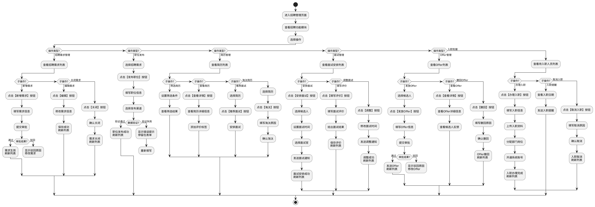

**招聘需求管理流程（发起人：用人部门负责人 / 部门 HRBP）：**

招聘需求遵循"**业务方发起 → 系统自动触发审批 → 审批通过 → 需求进入招聘池**"的标准流转。

1. **用人部门负责人**登录系统，进入招聘管理页面
2. 用人部门负责人点击【新增需求】，填写招聘需求信息（招聘部门、招聘岗位、招聘人数、任职要求、薪资范围、到岗日期、紧急程度、招聘原因等），上传岗位 JD 附件（可选）
3. 用人部门负责人点击【提交】按钮
4. **系统自动校验**：
   - 校验所填部门是否为发起人所在部门或下属部门（非本部门/下属部门时拒绝提交）
   - 校验编制情况（联动组织管理-编制管理模块），若该部门已超编则提示并拦截提交
   - 校验薪资范围是否在企业薪资带宽内（若超出上限则自动提升审批层级）
5. **系统自动触发审批流**（无需人工点击"提交审批"）：
   - 默认审批链：**直属上级 → 用人部门负责人的上级（一级/二级负责人）→ HRBP → HRD**
   - 特殊情况（如高管岗 / 薪资超限 / 增编性质需求）自动增加一级 CEO 审批
   - 审批流配置由 11.3.7 招聘流程配置统一维护
6. **审批节点各方处理**：
   - 各审批人在"我的待办"收到审批通知，可在 PC / 移动端审批
   - 审批人可批准、拒绝、加签、转审；驳回时必须填写驳回意见
7. **审批结果处理**：
   - 审批通过：需求状态变更为"已通过"，进入 HR 招聘池，HR 管理员收到通知
   - 审批驳回：需求状态变更为"已驳回"，发起人收到驳回原因通知，可在原基础上修改后重新提交（系统重新触发审批，不需要发起人再次点击"提交审批"）
8. **需求进入 HR 工作台**：审批通过的需求自动出现在 HR 招聘官的"待处理招聘需求"列表中

**职位发布流程（发布人：HR 招聘官 / HR 管理员）：**

职位发布**必须基于已审批通过的招聘需求**创建，用人部门负责人无权限直接发布职位到外部渠道（这是行业标准实践，避免部门绕过 HR 直接触达外部候选人）。

1. HR 招聘官登录系统，进入招聘需求列表，筛选"已通过审批但未发布职位"的需求
2. HR 招聘官选中目标需求，点击【创建职位】按钮
3. 系统自动从招聘需求中预填关键字段（岗位名称、部门、人数、薪资范围、任职要求、工作地点等）
4. HR 招聘官补全对外展示信息（职位描述 JD、福利待遇、亮点卖点、联系邮箱等），可引用职位模板快速生成
5. HR 招聘官选择**发布渠道**，支持：
   - **外部招聘平台**：Boss直聘、猎聘、智联招聘、前程无忧、拉勾等（通过 API 集成或手工登记发布记录）
   - **招聘官网**：同步到企业招聘官网（详见 11.3.8）
   - **内推渠道**：开启内推后自动生成内推专属链接和海报（详见 11.3.4）
   - **内部职位公告**：仅对公司在职员工可见（用于内部转岗/晋升）
6. HR 招聘官点击【发布】：
   - 系统调用各渠道 API 同步职位信息（已集成渠道）
   - 未集成渠道自动生成发布任务提醒 HR 手工去对应平台发布，HR 完成后回到系统登记发布记录
7. 发布成功后职位状态变更为"已发布"，开始接收候选人投递
8. **发布后的职位跟踪**：HR 可查看各渠道的浏览量、投递量、转化数据；需要时可下架、修改或复制为新职位

**简历管理流程：**
1. 用户进入简历管理页面，查看简历列表
2. 用户设置筛选条件（职位、来源渠道、投递时间、简历状态等）
3. 系统展示筛选结果
4. 用户可执行以下操作：
   - 查看简历：点击【查看详情】按钮，查看简历详细信息，添加评价标签
   - 推荐面试：选择简历，点击【推荐面试】按钮，安排面试
   - 淘汰简历：选择简历，点击【淘汰】按钮，填写淘汰原因，确认淘汰

**面试管理流程：**
1. 用户进入面试管理页面，查看面试安排列表
2. 用户可执行以下操作：
   - 安排面试：点击【安排面试】按钮，选择候选人，设置面试时间，选择面试官，发送面试通知，面试安排成功并刷新列表
   - 填写评价：点击【填写评价】按钮，填写面试评价，给出面试结果（通过/不通过），保存评价并刷新列表
   - 调整面试：点击【调整】按钮，修改面试时间，发送调整通知，调整成功并刷新列表

**Offer管理流程：**
1. 用户进入Offer管理页面，查看Offer列表
2. 用户可执行以下操作：
   - 发放Offer：选择候选人，点击【发放Offer】按钮，填写Offer信息（入职岗位、薪资待遇、入职日期等），提交审批，审批通过后发送Offer并刷新列表；审批驳回后，显示驳回原因，修改后重新提交
   - 查看Offer：点击【查看详情】按钮，查看Offer详细信息，查看候选人反馈（接受/拒绝）
   - 撤回Offer：点击【撤回】按钮，填写撤回原因，确认撤回，Offer撤回并刷新列表

**入职衔接流程：**
1. 用户进入入职衔接页面，查看待入职人员列表
2. 用户可执行以下操作：
   - 办理入职：点击【办理入职】按钮，填写入职信息（员工编号、入职日期、试用期等），上传入职资料（身份证、学历证明、离职证明等），分配部门岗位，开通系统账号，入职办理完成并刷新列表
   - 入职提醒：查看入职日期，发送入职提醒（邮件/短信）
   - 取消入职：点击【取消入职】按钮，填写取消原因，确认取消，入职取消并刷新列表

#### 11.3.2 功能设计（核心六大模块）

**系统交互时序：**

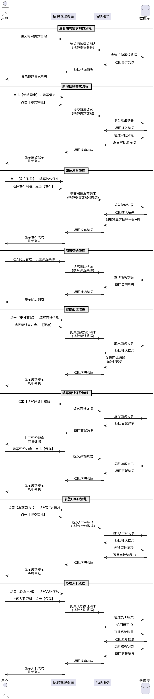

**核心功能：**

1. **招聘需求管理**

   > **角色分工（重要）**：招聘需求由**用人部门负责人/HRBP**发起；HR 管理员**不代业务方发起需求**，但可在发起人授权下代填。审批流由系统自动触发，无需人工操作。

   - 招聘需求列表展示：分页展示招聘需求，支持按部门、岗位、状态筛选
     - 用人部门负责人默认看到本部门及下属部门的所有需求（含子部门）
     - HR 管理员看到全公司的需求
     - 普通员工无权访问
   - **新增招聘需求（用人部门负责人专属）**：
     - 发起人为"登录用户"且必须是部门负责人/HRBP 角色
     - 招聘部门必须是发起人所在部门或下属部门
     - 填写完整后提交，系统**自动触发审批流**（不需要人工点击"提交审批"）
   - **编辑招聘需求**：仅发起人本人在"草稿"或"已驳回"状态下可编辑；已进入审批中或审批通过的需求不可编辑（如需调整人数/薪资等可发起变更申请）
   - **招聘需求审批**：
     - 系统自动触发多级审批流（详见 11.3.7 招聘流程配置）
     - 默认审批链：直属上级 → 部门负责人 → HRBP → HRD
     - 特殊触发条件追加高级审批：薪资超带宽 / 增编性质 / 高管岗等
     - 审批人可批准/拒绝/加签/转审
     - 审批结果实时通知发起人
   - **需求变更申请**：已审批通过的需求如需调整人数、薪资、JD 等关键字段，需发起人通过【发起变更】提交变更说明，重新走审批流（可配置轻量审批）
   - **关闭招聘需求**：
     - HR 招聘官在需求完成招聘（已招满人数）或不再需要时，点击【关闭需求】并选择关闭原因
     - 关闭原因：已招满、需求取消、业务变动、预算调整、其他
   - **编制联动校验**：需求所在部门超编时，提交阶段自动拦截并提示"当前部门已超编，需先调整编制计划"
   - **HR 侧待办**：审批通过的需求自动进入 HR 招聘官的"待发布职位"待办列表
   - **需求池管理（HR 侧）**：HR 可查看全公司在招需求，按部门/岗位族/紧急程度排序，支持指派招聘官负责人

2. **职位发布管理**

   > **角色分工（重要）**：职位发布**仅限 HR 招聘官/HR 管理员**操作，用人部门负责人**无权直接发布**（行业标准实践：避免业务方绕过 HR 直接与外部候选人接触，保证对外品牌统一、渠道成本可控、简历数据沉淀）。职位发布**必须基于已审批通过的招聘需求**创建，不允许凭空发布。

   - **职位创建（仅 HR 可操作）**：HR 招聘官从"待发布职位"列表（已审批通过但未发布的需求）选择需求，点击【创建职位】
     - 系统从需求自动预填关键字段（岗位名称、部门、人数、薪资范围、任职要求、工作地点）
     - HR 补全对外展示信息（JD 文案、福利亮点、卖点、联系邮箱等）
     - 支持引用职位模板快速生成
     - 一个招聘需求可以对应多个职位发布（如同一需求分别发布到社招职位与校招职位）
   - **多渠道发布**：支持一键发布到Boss直聘、猎聘、智联招聘、内推等多个渠道
   - **第三方渠道 API 集成**：支持配置第三方渠道账号授权（Boss直聘 / 猎聘 / 智联招聘 / 前程无忧 / 拉勾 等），通过 API 自动同步职位信息、候选人投递数据；首期如无法对接 API 的渠道支持**手工登记发布记录**（渠道、发布时间、岗位）以便后续 ROI 统计
   - **内推渠道发布**：职位发布时可勾选"开放内推"，系统自动生成专属内推链接与海报二维码；员工在内推体系中可获取专属推广链接（详见 11.3.4）
   - **招聘官网同步**：发布的职位自动同步至招聘官网（详见 11.3.8）
   - **内部职位公告**：HR 可选择"仅内部可见"，职位仅对公司在职员工开放（用于内部转岗/晋升）
   - **用人部门可见性**：虽然用人部门不能发布职位，但可在系统内查看本部门已发布职位的候选人情况、投递数据，参与候选人初筛与面试
   - 职位克隆：HR 可基于历史职位快速复制创建新职位
   - 职位编辑：HR 修改职位信息，同步更新到各发布渠道
   - 职位下架：HR 关闭职位发布，从各渠道下架
   - 发布记录：记录职位在各渠道的发布状态和效果数据（浏览量、投递量、转化率）
   - **职位发布校验**：发布前自动校验关联需求状态（已撤销/已关闭的需求不允许发布职位）

3. **简历管理**
   - 简历列表展示：分页展示简历，支持按职位、来源、状态、投递时间筛选
   - 简历详情查看：查看简历完整信息，包括基本信息、教育经历、工作经历、项目经验等
   - 简历筛选：根据学历、工作年限、期望薪资等条件筛选简历
   - **简历智能解析**：支持上传 PDF / Word / 图片（OCR）格式的简历，系统自动解析为结构化字段（姓名、联系方式、学历、工作经历、项目经历、技能等），解析准确率要求 ≥ 85%；支持解析失败后人工编辑修正；支持批量上传简历（单次最多 50 份）
   - **简历查重**：新简历入库时基于**手机号 / 邮箱 / 身份证号**三要素进行自动查重，识别已存在候选人后提示合并/覆盖/忽略；支持同一候选人多次投递不同职位的关联合并（同一人投递多岗位视为不同投递记录但共享候选人档案）
   - **JD 匹配度评分（可选增强）**：系统基于 JD 关键词与简历内容自动计算匹配度（0-100 分），辅助 HR 初筛；低于阈值（默认 60 分）的简历可配置自动淘汰规则
   - 简历标签：为简历添加标签（如"技术能力强"、"沟通能力好"等），支持自定义标签库与标签颜色
   - 简历评价：HR和面试官可对简历添加评价备注
   - **候选人笔记与内部评论**：在候选人详情页内置评论区，支持 HR/面试官/用人部门 Boss **@提醒**他人、回复讨论；所有评论只对内部可见，不对候选人展示；评论支持附件上传（作品集、沟通截图等）
   - 简历推荐：将合适的简历推荐给用人部门或面试官，支持批量操作
   - 简历淘汰：淘汰不合适的简历，记录**淘汰原因**（基于标准化淘汰原因字典，详见 11.3.7）；支持批量淘汰
   - 简历转推：将不适合当前职位的候选人转推到其他合适职位
   - 人才库沉淀：将优质简历沉淀到人才库，供后续招聘使用（详见 11.3.3 人才库管理）

4. **面试管理**
   - 面试安排：选择候选人，设置面试时间、面试官、面试地点、面试方式（现场/视频）
   - **面试官日历冲突校验**：安排面试时检查面试官的已有面试安排，冲突时提示并建议备选时段
   - 面试通知：自动发送面试通知（邮件/短信/站内信/微信/钉钉/企业微信），包含面试时间、地点、联系人等信息，通知内容基于标准化模板（详见 11.3.7）
   - 面试提醒：面试前1天 / 2小时自动提醒面试官和候选人
   - **候选人自助改期**：候选人可通过 C 端门户（详见 11.3.8）申请改期，HR 审核后生效
   - **面试评价模板**：支持按岗位族自定义评价维度（如"专业能力 / 沟通能力 / 学习能力 / 抗压能力 / 文化匹配度"等），每个维度可配置 1-5 星评分+文字评语；不同岗位族引用不同评价模板（详见 11.3.7）
   - **多面试官协同打分**：同一场面试支持多位面试官**独立打分**，系统自动汇总各维度均分、总分、通过率；面试官在未提交自己评价前**无法查看其他面试官评价**，避免互相影响判断
   - **面试评价待办**：面试官登录后在"我的待办"查看未完成的面试评价任务，支持移动端填写
   - 多轮面试：支持多轮面试流程（初面/复面/终面/HR面），记录每轮面试的评价和结果
   - 面试调整：支持调整面试时间，自动发送调整通知
   - 面试取消：支持取消面试并记录取消原因
   - 面试记录：完整记录面试过程，包括面试官、面试时间、面试评价、面试结果等
   - **视频面试接入**：支持生成视频面试链接（对接腾讯会议 / Zoom 等第三方），候选人和面试官点击链接即可加入面试；支持面试录屏（需候选人授权）
   - **面试官协同门户**：业务部门 Boss / 用人经理通过专属门户查看：被推荐候选人、待安排面试、待填写评价、面试通过决策待办；支持移动端访问

5. **Offer管理**
   - Offer发放：基于面试通过的候选人创建Offer，填写Offer详细信息
   - **Offer 模板引擎**：提供富文本+变量占位符的 Offer 模板，支持按**岗位职级 / 工作地 / 合同类型**维护不同模板；预置变量包括 `{{候选人姓名}}、{{入职岗位}}、{{入职部门}}、{{薪资}}、{{入职日期}}、{{工作地点}}、{{试用期}}、{{汇报对象}}` 等；Offer 模板统一在 11.3.7 管理
   - **薪资测算建议**：根据候选人职级、内部薪酬带宽、预算范围，自动建议薪资区间，避免薪资倒挂；提供同部门同职级员工薪酬对标参考
   - Offer审批：支持多级审批流程（HRBP / HRD / CEO 按职级规则分级审批），审批通过后发送Offer
   - **Offer 电子签**：集成第三方电子签服务（如 e签宝 / 法大大 / DocuSign），候选人收到 Offer 后可直接在线签署，签署完成后 Offer 原件存档到候选人档案；未集成前支持候选人**在线点击"接受/拒绝"按钮**并回传签名图片
   - Offer发送：通过邮件/短信/站内信发送Offer，通知候选人查看并签署
   - Offer跟踪：跟踪候选人对Offer的反馈（接受/拒绝/考虑中/已签署）
   - **Offer 到期提醒**：若候选人在规定期限（默认 3 个工作日）内未反馈，系统自动提醒 HR
   - Offer撤回：支持撤回已发送的Offer，记录撤回原因
   - **Offer 版本管理**：Offer 协商过程中可基于前一版本复制生成新版本，记录每次变更差异（薪资调整、职级调整等）
   - Offer统计：统计Offer发放数量、接受率、拒绝率、放鸽率等数据（详见 11.3.6）

6. **入职衔接**
   - 待入职人员列表：展示已接受Offer的候选人，按入职日期排序
   - **Pre-Onboarding 入职资料在线收集**：候选人接受 Offer 后，系统自动发送**入职资料填报链接**（H5/小程序），候选人可在入职前自助填写个人信息（基础信息、紧急联系人、银行卡、社保基数、家庭成员等）、上传证件照片（身份证正反面、学历证明、离职证明、体检报告、照片等），HR 端可查看填报进度与资料完整度
   - **入职资料模板配置**：HR 可在 11.3.7 中配置入职资料填报清单（必填/选填字段、需上传的证件类型），不同岗位可配置不同资料清单
   - **入职通知书自动发送**：Offer 签署后自动推送入职通知书（报到时间/地点/所需材料/着装要求/联系人）
   - **入职前关怀推送**：定时推送公司文化、新员工指南、部门介绍、导师信息等
   - 入职办理：填写入职信息，核验候选人自助上传的资料，分配部门岗位，开通系统账号
   - 入职提醒：入职前3天、1天自动发送入职提醒
   - 入职资料管理：管理候选人提交的入职资料（身份证、学历证明、离职证明、体检报告等）
   - **入职任务分派**：入职办理触发多部门协同任务（IT 开通账号与配发设备、行政准备工位与门禁卡、HRBP 安排导师等），任务进度可视化
   - **鸽子预警**：已接受 Offer 但入职日期前 3 天未确认报到的候选人自动预警
   - **爽约归档**：入职失败的候选人归档并记录爽约原因（用于后续招聘质量分析）
   - 入职流程跟踪：跟踪入职办理进度，确保入职流程顺利完成
   - 自动创建员工档案：入职办理完成后，自动在员工管理模块创建员工档案
   - 自动开通系统账号：入职办理完成后，自动为新员工开通系统账号

**数据字段：**

**（1）招聘需求**

| 字段名称 | 字段类型 | 长度限制 | 是否必填 | 说明 |
|---------|---------|---------|---------|------|
| 需求ID | 字符串 | - | 是 | 系统自动生成，唯一标识 |
| 需求编号 | 字符串 | 50 | 是 | 招聘需求编号，格式如"REC202604001" |
| 招聘部门 | 字符串 | - | 是 | 关联组织管理模块的部门ID |
| 招聘岗位 | 字符串 | 100 | 是 | 招聘岗位名称 |
| 招聘人数 | 数字 | - | 是 | 计划招聘人数 |
| 任职要求 | 文本 | 2000 | 是 | 岗位任职要求，包括学历、专业、工作年限、技能要求等 |
| 薪资范围 | 字符串 | 50 | 是 | 薪资范围，如"10K-15K"、"面议" |
| 工作地点 | 字符串 | 100 | 是 | 工作地点 |
| 招聘原因 | 枚举 | - | 是 | 新增编制、离职补缺、业务扩张、项目需求 |
| 紧急程度 | 枚举 | - | 是 | 紧急、一般、不紧急 |
| 需求状态 | 枚举 | - | 是 | 草稿、审批中、已通过、已驳回、已关闭 |
| 申请人 | 字符串 | - | 是 | 关联用户ID |
| 申请时间 | 日期时间 | - | 是 | 需求申请时间 |
| 审批流程ID | 字符串 | - | 否 | 关联审批流引擎的流程ID |
| 创建时间 | 日期时间 | - | 是 | 需求创建时间 |
| 更新时间 | 日期时间 | - | 是 | 需求最后更新时间 |

**（2）职位信息**

| 字段名称 | 字段类型 | 长度限制 | 是否必填 | 说明 |
|---------|---------|---------|---------|------|
| 职位ID | 字符串 | - | 是 | 系统自动生成，唯一标识 |
| 招聘需求ID | 字符串 | - | 是 | 关联招聘需求ID |
| 职位名称 | 字符串 | 100 | 是 | 职位名称 |
| 职位描述 | 文本 | 5000 | 是 | 职位详细描述，包括工作职责、任职要求等 |
| 工作地点 | 字符串 | 100 | 是 | 工作地点 |
| 薪资范围 | 字符串 | 50 | 是 | 薪资范围 |
| 福利待遇 | 文本 | 1000 | 否 | 福利待遇描述 |
| 发布渠道 | 字符串 | 200 | 是 | 发布渠道列表，多个渠道用逗号分隔 |
| 职位状态 | 枚举 | - | 是 | 草稿、已发布、已下架 |
| 发布时间 | 日期时间 | - | 否 | 职位发布时间 |
| 下架时间 | 日期时间 | - | 否 | 职位下架时间 |
| 创建人 | 字符串 | - | 是 | 关联用户ID |
| 创建时间 | 日期时间 | - | 是 | 职位创建时间 |
| 更新时间 | 日期时间 | - | 是 | 职位最后更新时间 |

**（3）简历信息**

| 字段名称 | 字段类型 | 长度限制 | 是否必填 | 说明 |
|---------|---------|---------|---------|------|
| 简历ID | 字符串 | - | 是 | 系统自动生成，唯一标识 |
| 职位ID | 字符串 | - | 是 | 关联职位ID |
| 候选人姓名 | 字符串 | 50 | 是 | 候选人姓名 |
| 性别 | 枚举 | - | 是 | 男、女 |
| 出生日期 | 日期 | - | 否 | 候选人出生日期 |
| 手机号码 | 字符串 | 20 | 是 | 候选人手机号码 |
| 邮箱地址 | 字符串 | 100 | 是 | 候选人邮箱地址 |
| 最高学历 | 枚举 | - | 是 | 高中、大专、本科、硕士、博士 |
| 毕业院校 | 字符串 | 100 | 否 | 毕业院校名称 |
| 专业 | 字符串 | 100 | 否 | 所学专业 |
| 工作年限 | 数字 | - | 否 | 工作年限（年） |
| 当前公司 | 字符串 | 100 | 否 | 当前所在公司 |
| 当前职位 | 字符串 | 100 | 否 | 当前职位 |
| 期望薪资 | 字符串 | 50 | 否 | 期望薪资 |
| 简历来源 | 枚举 | - | 是 | Boss直聘、猎聘、智联招聘、前程无忧、拉勾、内推、招聘官网、主动搜寻、猎头推荐、其他 |
| 简历来源详情 | 字符串 | 200 | 否 | 来源详情（如内推人姓名、猎头名称、活动名称） |
| 简历状态 | 枚举 | - | 是 | 待筛选、已筛选、已推荐、面试中、待定、已淘汰、已录用、入职放弃 |
| 简历标签 | 字符串 | 200 | 否 | 简历标签，多个标签用逗号分隔 |
| 简历附件 | 字符串 | 500 | 否 | 简历文件路径（原始文件） |
| 解析状态 | 枚举 | - | 是 | 未解析、解析中、解析成功、解析失败、人工修正 |
| 解析原始数据 | JSON | - | 否 | 简历智能解析结果的结构化 JSON 数据 |
| JD 匹配度 | 数字 | - | 否 | 简历与 JD 的匹配度评分（0-100） |
| 淘汰原因 | 字符串 | - | 否 | 关联淘汰原因字典（详见 11.3.7） |
| 候选人档案ID | 字符串 | - | 是 | 关联人才库中的候选人唯一档案ID（详见 11.3.3） |
| 投递时间 | 日期时间 | - | 是 | 简历投递时间 |
| 创建时间 | 日期时间 | - | 是 | 简历创建时间 |
| 更新时间 | 日期时间 | - | 是 | 简历最后更新时间 |

**（4）面试信息**

| 字段名称 | 字段类型 | 长度限制 | 是否必填 | 说明 |
|---------|---------|---------|---------|------|
| 面试ID | 字符串 | - | 是 | 系统自动生成，唯一标识 |
| 简历ID | 字符串 | - | 是 | 关联简历ID |
| 面试轮次 | 数字 | - | 是 | 面试轮次（1、2、3...） |
| 面试时间 | 日期时间 | - | 是 | 面试时间 |
| 面试地点 | 字符串 | 200 | 是 | 面试地点 |
| 面试方式 | 枚举 | - | 是 | 现场面试、视频面试、电话面试 |
| 视频面试链接 | 字符串 | 500 | 否 | 面试方式为视频面试时的会议链接（腾讯会议/Zoom等） |
| 面试官 | 字符串 | - | 是 | 面试官用户ID，多个面试官用逗号分隔 |
| 评价模板ID | 字符串 | - | 是 | 关联面试评价模板ID（详见 11.3.7） |
| 面试状态 | 枚举 | - | 是 | 待面试、进行中、已完成、已取消、候选人爽约 |
| 面试综合结果 | 枚举 | - | 否 | 通过、不通过、待定、复试 |
| 面试综合评价 | 文本 | 2000 | 否 | 面试综合评价内容（多位面试官评价汇总结论） |
| 创建人 | 字符串 | - | 是 | 关联用户ID |
| 创建时间 | 日期时间 | - | 是 | 面试创建时间 |
| 更新时间 | 日期时间 | - | 是 | 面试最后更新时间 |

**（4-补）面试评价记录（多人协同打分记录）**

| 字段名称 | 字段类型 | 长度限制 | 是否必填 | 说明 |
|---------|---------|---------|---------|------|
| 评价ID | 字符串 | - | 是 | 系统自动生成，唯一标识 |
| 面试ID | 字符串 | - | 是 | 关联面试ID |
| 面试官ID | 字符串 | - | 是 | 关联面试官用户ID |
| 维度评分明细 | JSON | - | 是 | 各维度的打分明细（格式：{维度ID: 分数, ...}） |
| 总分 | 数字 | - | 是 | 本面试官的总评分（各维度加权） |
| 评语 | 文本 | 2000 | 否 | 本面试官的评语 |
| 结果建议 | 枚举 | - | 是 | 通过、不通过、待定、强烈推荐 |
| 提交时间 | 日期时间 | - | 否 | 评价提交时间（未提交为空） |
| 是否可见 | 枚举 | - | 是 | 是否对其他面试官可见（提交后自动设为可见） |
| 创建时间 | 日期时间 | - | 是 | 评价记录创建时间 |
| 更新时间 | 日期时间 | - | 是 | 评价记录最后更新时间 |

**（5）Offer信息**

| 字段名称 | 字段类型 | 长度限制 | 是否必填 | 说明 |
|---------|---------|---------|---------|------|
| Offer ID | 字符串 | - | 是 | 系统自动生成，唯一标识 |
| 简历ID | 字符串 | - | 是 | 关联简历ID |
| 入职岗位 | 字符串 | 100 | 是 | 入职岗位名称 |
| 入职部门 | 字符串 | - | 是 | 关联组织管理模块的部门ID |
| 薪资待遇 | 字符串 | 200 | 是 | 薪资待遇详情 |
| 入职日期 | 日期 | - | 是 | 预计入职日期 |
| 工作地点 | 字符串 | 100 | 是 | 工作地点 |
| Offer模板ID | 字符串 | - | 是 | 关联 Offer 模板（详见 11.3.7） |
| Offer版本号 | 数字 | - | 是 | Offer 版本号，默认 1，协商调整时递增 |
| 试用期 | 字符串 | 20 | 是 | 试用期长度（如"3个月"、"6个月"） |
| 汇报对象 | 字符串 | 100 | 否 | 汇报上级姓名 |
| Offer状态 | 枚举 | - | 是 | 草稿、审批中、已审批、已发送、已查看、已接受、已签署、已拒绝、已撤回、已失效 |
| Offer原件URL | 字符串 | 500 | 否 | 生成的 Offer PDF 文件URL |
| 电子签状态 | 枚举 | - | 否 | 未发起、待签署、已签署、已过期、已撤销 |
| 电子签流程ID | 字符串 | - | 否 | 第三方电子签平台（e签宝/法大大）的流程ID |
| 签署完成时间 | 日期时间 | - | 否 | 候选人完成电子签的时间 |
| 反馈截止时间 | 日期时间 | - | 否 | 候选人反馈截止时间（默认发放后 3 个工作日） |
| 候选人反馈 | 枚举 | - | 否 | 接受、拒绝、考虑中 |
| 反馈时间 | 日期时间 | - | 否 | 候选人反馈时间 |
| 拒绝原因 | 字符串 | 500 | 否 | 候选人拒绝 Offer 时填写的原因 |
| 审批流程ID | 字符串 | - | 否 | 关联审批流引擎的流程ID |
| 创建人 | 字符串 | - | 是 | 关联用户ID |
| 创建时间 | 日期时间 | - | 是 | Offer创建时间 |
| 更新时间 | 日期时间 | - | 是 | Offer最后更新时间 |

**（6）入职信息**

| 字段名称 | 字段类型 | 长度限制 | 是否必填 | 说明 |
|---------|---------|---------|---------|------|
| 入职ID | 字符串 | - | 是 | 系统自动生成，唯一标识 |
| Offer ID | 字符串 | - | 是 | 关联Offer ID |
| 员工编号 | 字符串 | 50 | 是 | 员工编号 |
| 实际入职日期 | 日期 | - | 是 | 实际入职日期 |
| 试用期月数 | 数字 | - | 是 | 试用期月数 |
| 入职资料 | JSON | - | 否 | 入职资料清单（JSON格式） |
| 资料填报模板ID | 字符串 | - | 是 | 关联入职资料填报模板（详见 11.3.7） |
| 资料填报进度 | 数字 | - | 是 | 候选人自助填报完成度（0-100） |
| 资料填报链接 | 字符串 | 500 | 否 | 候选人 H5 自助填报链接 |
| 填报完成时间 | 日期时间 | - | 否 | 候选人完成资料填报的时间 |
| 入职状态 | 枚举 | - | 是 | 待填报资料、资料已提交、资料已核验、待入职、已入职、已取消、候选人爽约 |
| 爽约原因 | 字符串 | 500 | 否 | 候选人入职爽约时的原因 |
| 办理人 | 字符串 | - | 是 | 关联用户ID |
| 办理时间 | 日期时间 | - | 否 | 入职办理时间 |
| 多部门任务JSON | JSON | - | 否 | IT/行政/导师等多部门入职任务及进度 |
| 创建时间 | 日期时间 | - | 是 | 入职信息创建时间 |
| 更新时间 | 日期时间 | - | 是 | 入职信息最后更新时间 |

**业务规则：**

| 规则编号 | 规则描述 |
|---------|---------|
| REC-001 | 招聘需求的招聘人数必须大于0 |
| REC-002 | 招聘需求提交后**自动触发审批流**（无需人工点击"提交审批"），状态变更为"审批中"，审批期间不允许编辑 |
| REC-003 | 招聘需求审批通过后，状态变更为"已通过"，可以基于该需求创建职位 |
| REC-004 | 招聘需求审批驳回后，状态变更为"已驳回"，发起人可修改后重新提交（重新触发审批流） |
| REC-005 | 职位发布时，必须选择至少一个发布渠道 |
| REC-006 | 职位发布后，状态变更为"已发布"，不允许删除，只能下架 |
| REC-021 | 招聘需求**只能由用人部门负责人或 HRBP 发起**，招聘部门必须是发起人所在部门或其下属部门 |
| REC-022 | HR 管理员不能独立发起招聘需求（仅可在发起人授权并备注说明下代填） |
| REC-023 | 职位发布**仅限 HR 管理员/HR 招聘官**操作，用人部门负责人无权发布职位到外部渠道 |
| REC-024 | 职位发布**必须基于已审批通过的招聘需求**创建，不允许凭空发布职位 |
| REC-025 | 一个招聘需求可以对应多个职位发布（如社招+校招分别发布），但所有职位的合计招聘人数不得超过需求人数 |
| REC-026 | 招聘需求发起时自动校验编制：若部门当前在编人数 + 需求人数 > 编制计划，需求提交被拦截并提示"超编" |
| REC-027 | 薪资范围超过企业薪资带宽上限时，审批流自动增加一级 HRD 或 CEO 审批 |
| REC-028 | 已审批通过的招聘需求如需调整核心字段（人数、薪资、JD），需通过【发起变更】走变更审批流程，不可直接编辑 |
| REC-029 | 已审批通过但未关闭的招聘需求进入"HR 招聘池"，由 HR 管理员/HR 招聘官统一调度 |
| REC-030 | 关联需求已撤销或已关闭的职位，不允许执行"发布"操作，只能下架或删除草稿 |
| REC-007 | 简历投递后，默认状态为"待筛选" |
| REC-008 | 简历推荐面试后，状态变更为"已推荐"或"面试中" |
| REC-009 | 简历淘汰后，状态变更为"已淘汰"，不允许再次推荐面试 |
| REC-010 | 面试安排时，面试时间不能早于当前时间 |
| REC-011 | 面试完成后，必须填写面试评价和面试结果 |
| REC-012 | 面试结果为"通过"的候选人，可以发放Offer |
| REC-013 | Offer发放前，必须经过审批流程 |
| REC-014 | Offer审批通过后，自动发送Offer邮件给候选人 |
| REC-015 | 候选人接受Offer后，Offer状态变更为"已接受"，可以办理入职 |
| REC-016 | 候选人拒绝Offer后，Offer状态变更为"已拒绝"，简历状态变更为"已淘汰" |
| REC-017 | 入职办理完成后，自动在员工管理模块创建员工档案 |
| REC-018 | 入职办理完成后，自动为新员工开通系统账号，初始密码为"123456" |
| REC-019 | 入职资料必须包含身份证、学历证明、离职证明（如有）等必要文件 |
| REC-020 | 入职取消后，Offer状态更新为"已撤回"，简历状态更新为"已淘汰" |

---

#### 11.3.3 人才库管理

##### （一）功能需求概述

人才库是企业所有候选人信息的**统一存储中心**，将历次投递、猎头推荐、主动搜寻、内推、招聘活动等渠道进入的候选人沉淀为可复用的人才资产。通过人才分池、标签管理、黑/红名单、智能推荐等能力，HR 可快速从历史候选人中定位合适人选，降低重复招聘成本，提升招聘效率。

##### （二）用户操作流程

**候选人入库流程：**
1. 候选人简历通过简历投递 / 猎头推荐 / HR 手工录入等方式进入系统
2. 系统基于手机号/邮箱/身份证三要素查重：
   - 若为新候选人，自动创建候选人档案，分配唯一档案ID
   - 若为已有候选人，自动关联到已有档案，并新增一条投递记录
3. 候选人档案自动加入默认"总人才库"，HR 可手工分配到子池（如"后端人才池"、"校招人才池"）

**人才搜索与复用流程：**
1. HR 在人才库搜索页面设置筛选条件（岗位/技能/城市/学历/工作年限/标签等）
2. 系统返回匹配的候选人列表
3. HR 可对候选人发起：再次沟通（通过邮件/短信模板）、推荐到新职位、加入定向招聘活动、拉入黑名单

**候选人激活（唤醒）流程：**
1. HR 选定"近 6 个月内投递过但未录用"的候选人
2. 系统通过邮件/短信批量发送唤醒模板（"我们有新职位可能适合你"）
3. 候选人点击链接可查看新职位并重新投递

##### （三）核心功能

1. **候选人档案**
   - 基础信息：姓名、性别、出生日期、手机号、邮箱、身份证号（脱敏存储）、所在城市
   - 教育经历、工作经历、项目经历、专业技能、证书、作品集
   - 投递历史：该候选人历次投递的职位、时间、面试记录、最终结果
   - 档案附件：原始简历、作品集、背调报告、测评报告等

2. **人才分池（Talent Pool）**
   - 系统预置"总人才库"池，新入库候选人默认归属
   - 支持手工创建子池（如按岗位族 / 按事业部 / 按招聘活动 / 猎头独立池）
   - 一个候选人可同时属于多个人才池
   - 支持按池维度做权限控制（如猎头只能看自己的池）

3. **查重与合并**
   - 新简历入库时自动基于手机号/邮箱/身份证做三要素查重
   - 检测到重复时提示"合并/覆盖/忽略"操作
   - 支持手工发起候选人档案合并（多档案合一）

4. **标签管理**
   - 自定义标签（如"985/211 院校"、"字节前员工"、"技术栈 Go"），标签可设置颜色
   - 支持为候选人批量打/去标签
   - 标签作为筛选条件高频使用

5. **黑名单 / 红名单**
   - 黑名单：曾入职表现差、爽约多次、背调不通过的候选人，拉黑后新投递自动淘汰并提示 HR
   - 红名单：核心人才、高潜候选人，有新岗位时优先匹配提醒

6. **冷冻/激活**
   - 暂不合适的候选人可手工/自动冷冻一段时间（默认 6 个月），冷冻期内不出现在主搜索结果
   - 冷冻到期自动解冻；HR 可提前手工解冻
   - 冷冻候选人可批量激活推荐新职位

7. **候选人档案归属权**
   - 候选人档案有"所属 HR"字段，其他 HR 访问时有权限边界（可配置为全员可见或 HRBP 可见）
   - 猎头推荐的候选人归属猎头，有保护期（默认 30 天）内不得被其他 HR 抢单

##### （四）数据字段

**（1）候选人档案（Talent Profile）**

| 字段名称 | 字段类型 | 长度限制 | 是否必填 | 说明 |
|---------|---------|---------|---------|------|
| 档案ID | 字符串 | - | 是 | 系统自动生成，唯一标识 |
| 候选人编号 | 字符串 | 50 | 是 | 候选人编号，格式如"TP202604001" |
| 姓名 | 字符串 | 50 | 是 | 候选人姓名 |
| 性别 | 枚举 | - | 否 | 男、女、未填写 |
| 出生日期 | 日期 | - | 否 | 候选人出生日期 |
| 手机号码 | 字符串 | 20 | 是 | 候选人手机号码（唯一） |
| 邮箱地址 | 字符串 | 100 | 否 | 候选人邮箱地址（唯一） |
| 身份证号 | 字符串 | 20 | 否 | 候选人身份证号（脱敏存储） |
| 所在城市 | 字符串 | 50 | 否 | 候选人所在城市 |
| 期望城市 | 字符串 | 100 | 否 | 期望工作城市（多个用逗号分隔） |
| 最高学历 | 枚举 | - | 否 | 高中、大专、本科、硕士、博士 |
| 毕业院校 | 字符串 | 100 | 否 | 毕业院校名称 |
| 专业 | 字符串 | 100 | 否 | 所学专业 |
| 工作年限 | 数字 | - | 否 | 工作年限（年） |
| 当前公司 | 字符串 | 100 | 否 | 当前所在公司 |
| 当前职位 | 字符串 | 100 | 否 | 当前职位 |
| 期望薪资 | 字符串 | 50 | 否 | 期望薪资 |
| 教育经历 | JSON | - | 否 | 教育经历数组 |
| 工作经历 | JSON | - | 否 | 工作经历数组 |
| 项目经历 | JSON | - | 否 | 项目经历数组 |
| 技能列表 | 字符串 | 500 | 否 | 候选人技能（多个用逗号分隔） |
| 候选人标签 | 字符串 | 500 | 否 | 候选人标签（多个用逗号分隔） |
| 人才池IDs | 字符串 | 500 | 否 | 所属人才池ID（多个用逗号分隔） |
| 所属HR | 字符串 | - | 否 | 关联用户ID（候选人归属 HR） |
| 来源 | 枚举 | - | 是 | 投递、推荐、猎头、主动搜寻、内推、活动、其他 |
| 来源详情 | 字符串 | 200 | 否 | 来源详情（如猎头名称） |
| 档案状态 | 枚举 | - | 是 | 活跃、冷冻、黑名单、红名单 |
| 冷冻到期时间 | 日期 | - | 否 | 冷冻到期时间（冷冻状态必填） |
| 档案附件 | JSON | - | 否 | 档案附件列表（原始简历、作品集等） |
| 投递次数 | 数字 | - | 是 | 历史投递总次数 |
| 最近投递时间 | 日期时间 | - | 否 | 最近一次投递时间 |
| 创建时间 | 日期时间 | - | 是 | 档案创建时间 |
| 更新时间 | 日期时间 | - | 是 | 档案最后更新时间 |

**（2）人才池（Talent Pool）**

| 字段名称 | 字段类型 | 长度限制 | 是否必填 | 说明 |
|---------|---------|---------|---------|------|
| 人才池ID | 字符串 | - | 是 | 系统自动生成，唯一标识 |
| 池名称 | 字符串 | 100 | 是 | 人才池名称 |
| 池类型 | 枚举 | - | 是 | 系统预置、岗位族、事业部、招聘活动、猎头专属 |
| 池描述 | 文本 | 500 | 否 | 人才池描述 |
| 负责人 | 字符串 | - | 是 | 池负责人用户ID |
| 池状态 | 枚举 | - | 是 | 启用、禁用 |
| 可见范围 | 枚举 | - | 是 | 全员可见、部门可见、指定用户可见、仅负责人 |
| 候选人数 | 数字 | - | 是 | 池内候选人数量 |
| 创建时间 | 日期时间 | - | 是 | 人才池创建时间 |
| 更新时间 | 日期时间 | - | 是 | 人才池最后更新时间 |

##### （五）业务规则

| 规则编号 | 规则描述 |
|---------|---------|
| TP-001 | 候选人档案唯一性基于手机号、邮箱、身份证三要素的任一匹配即判定为同一人 |
| TP-002 | 新简历入库时若查重命中已有档案，必须提示操作人"合并/覆盖/忽略"，不可静默覆盖 |
| TP-003 | 候选人档案一旦创建，档案ID不可修改，档案删除需管理员权限且保留操作日志 |
| TP-004 | 档案状态为"黑名单"的候选人再次投递时自动淘汰，并提示 HR 原因 |
| TP-005 | 档案状态为"红名单"的候选人有新投递或人才激活时，优先推送给所属 HR |
| TP-006 | 冷冻到期后系统自动将档案状态切回"活跃" |
| TP-007 | 猎头推荐的候选人保护期为 30 天，保护期内其他 HR 不得基于同一候选人创建新投递 |
| TP-008 | 删除人才池前需确认池内候选人如何处理（转移到其他池/移回总池） |
| TP-009 | 系统预置"总人才库"不允许删除，所有候选人必须归属至少一个人才池 |

---

#### 11.3.4 内推体系

##### （一）功能需求概述

内推体系面向企业全员，鼓励员工将身边的合适人选推荐到公司职位。通过内推专属链接、海报、奖励机制与进度跟踪，提升内推投递量与质量，降低对外部招聘渠道的依赖。内推是企业招聘渠道中**成本最低、质量最高**的渠道之一，需要独立的体系支撑。

##### （二）用户操作流程

**员工发起内推流程：**
1. 员工登录 HR 系统进入"内推中心"
2. 浏览当前开放内推的职位列表（HR 在 11.3.2 职位发布时勾选"开放内推"）
3. 员工选择职位，点击【生成内推链接】，系统生成员工专属链接与海报
4. 员工将链接/海报分享至微信/朋友圈/脉脉等社交渠道
5. 候选人通过该链接投递后，系统自动关联到该员工内推记录

**员工手动录入内推流程：**
1. 员工在"我的内推"页面点击【手动录入】
2. 员工填写被推荐人信息（姓名/手机/邮箱/关系/推荐理由）并上传简历
3. 系统查重后创建候选人档案与投递记录，简历来源标记为"内推"

**HR 处理内推流程：**
1. HR 在简历管理中看到来源为"内推"的简历，可查看推荐人信息
2. HR 处理投递（推荐面试 / 淘汰 / 录用）
3. 系统自动更新内推记录的状态，并触发奖励结算

**奖励结算流程：**
1. 候选人入职且完成试用期（默认 3 个月）后，系统自动触发内推奖励
2. 奖励规则可配置：基础奖励（候选人简历被推荐面试）、中级奖励（Offer 发放）、全额奖励（候选人入职+通过试用期）
3. 奖励发放通知内推人，并联动薪酬模块发放到薪资

##### （三）核心功能

1. **内推职位池**
   - 显示所有开放内推的职位（来源于 11.3.2 职位发布）
   - 展示职位详情、奖励金额、已内推人数

2. **内推链接生成**
   - 为每个员工+职位生成唯一专属链接
   - 链接包含推荐人ID标识，投递时自动关联
   - 支持生成内推海报（含职位信息、推荐人信息、二维码）

3. **手动录入内推**
   - 员工直接填写候选人信息并上传简历
   - 内置查重逻辑，避免抢单纠纷

4. **内推激励配置**
   - HR 可按岗位族/职级配置差异化奖励金额
   - 奖励阶段可配置：推荐面试奖、Offer 奖、入职奖、试用期通过奖
   - 支持现金奖励、积分奖励、礼品奖励多形式

5. **内推进度追踪**
   - 员工在"我的内推"中查看所有推荐候选人的当前状态（投递/面试/Offer/入职/淘汰）
   - 透明化让员工持续关注

6. **内推排行榜**
   - 按季度/年度展示 Top 内推员工
   - 激发员工积极性

7. **内推规则管控**
   - 同一候选人在 90 天内只能被一位员工内推（防止抢单）
   - 员工不能内推自己的直系亲属到本部门（合规要求，可配置）
   - 员工离职后，其未完成的内推记录仍继续流转并发放奖励

8. **奖励结算与发放**
   - 自动触发：满足奖励条件时系统生成奖励单
   - 审批流：奖励单走审批后发放
   - 联动薪酬：奖励金联动到下月薪资或一次性奖金

##### （四）数据字段

**（1）内推记录**

| 字段名称 | 字段类型 | 长度限制 | 是否必填 | 说明 |
|---------|---------|---------|---------|------|
| 内推ID | 字符串 | - | 是 | 系统自动生成，唯一标识 |
| 内推编号 | 字符串 | 50 | 是 | 内推编号，格式如"REF202604001" |
| 推荐人ID | 字符串 | - | 是 | 关联员工用户ID |
| 推荐人姓名 | 字符串 | 50 | 是 | 推荐人姓名 |
| 候选人档案ID | 字符串 | - | 是 | 关联候选人档案 |
| 被推荐人姓名 | 字符串 | 50 | 是 | 被推荐人姓名 |
| 被推荐人手机 | 字符串 | 20 | 是 | 被推荐人手机号码 |
| 推荐职位ID | 字符串 | - | 是 | 关联职位ID |
| 推荐理由 | 文本 | 500 | 否 | 推荐理由 |
| 与推荐人关系 | 字符串 | 50 | 否 | 如"前同事"、"同学"、"朋友" |
| 录入方式 | 枚举 | - | 是 | 链接投递、手动录入、海报扫码 |
| 当前状态 | 枚举 | - | 是 | 待处理、面试中、已Offer、已入职、试用期通过、已淘汰、已过期 |
| 基础奖励金额 | 数字 | - | 否 | 推荐面试奖 |
| Offer奖励金额 | 数字 | - | 否 | Offer 奖 |
| 入职奖励金额 | 数字 | - | 否 | 入职奖 |
| 全额奖励金额 | 数字 | - | 否 | 试用期通过奖 |
| 奖励发放状态 | 枚举 | - | 是 | 待结算、部分发放、已全额发放、无奖励 |
| 创建时间 | 日期时间 | - | 是 | 内推记录创建时间 |
| 更新时间 | 日期时间 | - | 是 | 内推记录最后更新时间 |

**（2）内推奖励规则**

| 字段名称 | 字段类型 | 长度限制 | 是否必填 | 说明 |
|---------|---------|---------|---------|------|
| 规则ID | 字符串 | - | 是 | 系统自动生成，唯一标识 |
| 规则名称 | 字符串 | 100 | 是 | 规则名称，如"技术岗P7内推奖励规则" |
| 适用岗位族 | 字符串 | 200 | 否 | 适用岗位族（多个用逗号分隔，为空代表全适用） |
| 适用职级 | 字符串 | 100 | 否 | 适用职级范围 |
| 基础奖励 | 数字 | - | 否 | 推荐面试奖金额 |
| Offer奖励 | 数字 | - | 否 | Offer奖金额 |
| 入职奖励 | 数字 | - | 否 | 入职奖金额 |
| 全额奖励 | 数字 | - | 否 | 试用期通过奖金额 |
| 奖励形式 | 枚举 | - | 是 | 现金、积分、礼品、组合 |
| 规则状态 | 枚举 | - | 是 | 启用、禁用 |
| 生效时间 | 日期 | - | 是 | 规则生效时间 |
| 失效时间 | 日期 | - | 否 | 规则失效时间（不填为永久有效） |
| 创建人 | 字符串 | - | 是 | 关联用户ID |
| 创建时间 | 日期时间 | - | 是 | 规则创建时间 |
| 更新时间 | 日期时间 | - | 是 | 规则最后更新时间 |

##### （五）业务规则

| 规则编号 | 规则描述 |
|---------|---------|
| REF-001 | 同一候选人（基于手机号）在 90 天内只能被一位员工内推，二次内推自动归属首位推荐人 |
| REF-002 | 候选人通过内推链接投递时，系统自动关联到链接对应的推荐人 |
| REF-003 | 手动录入内推时，若候选人已在过去 90 天内被推荐，系统提示"该候选人已被推荐，不可重复推荐" |
| REF-004 | 员工不能内推自己的直系亲属到本部门（可配置开关） |
| REF-005 | 员工离职后，其内推记录状态保留，奖励按已发放阶段结算；未达发放阶段的奖励根据配置决定是否继续发放 |
| REF-006 | 奖励发放必须经过审批流程（默认 HRBP + 财务审批） |
| REF-007 | 候选人入职后 3 个月内离职的，HR 可发起奖励追回流程 |
| REF-008 | 内推记录创建后 180 天内候选人无进展，状态自动变更为"已过期" |

---

#### 11.3.5 背调集成

##### （一）功能需求概述

背景调查（Background Check）是在候选人发放 Offer 前的重要风控环节。系统通过集成第三方背调服务平台（如北森背调 / i背调 / 坦白说等），实现一键发起背调、在线获取候选人授权、自动回写背调报告等功能，辅助 HR 做出录用决策，降低招聘风险。

##### （二）用户操作流程

**背调发起流程：**
1. HR 在候选人详情页（面试通过后、Offer 发放前）点击【发起背调】
2. 系统弹出背调套餐选择界面（根据岗位类型配置不同套餐：身份核验 / 学历验证 / 工作履历 / 司法记录 / 金融信用等）
3. HR 确认套餐与费用，提交背调订单
4. 系统调用第三方背调平台 API 创建订单，并向候选人发送授权链接
5. 候选人点击链接，在线填写确认信息并电子签授权书
6. 第三方平台开始调查，系统实时同步进度（进行中 / 已完成 / 异常）

**背调结果处理流程：**
1. 背调完成后，第三方平台回调接口推送报告
2. 系统自动下载背调报告 PDF 并存档到候选人档案
3. HR 在"背调中心"查看报告，包括：核验结论（通过/不通过/异常）、详细风险点
4. HR 根据结果决定录用/不录用，结果联动 Offer 流程

##### （三）核心功能

1. **背调平台接入**
   - 支持对接多家第三方背调平台，首期建议对接 1-2 家（北森背调 / i背调）
   - 配置页面维护平台账号、API Key、回调地址等

2. **背调套餐管理**
   - 预置多种套餐：基础套餐（身份+学历）、标准套餐（+工作履历）、高管套餐（+司法+金融）
   - HR 可按岗位族/职级配置默认套餐
   - 套餐费用展示，支持预算控制

3. **候选人授权管理**
   - 背调订单创建后自动发送授权链接给候选人
   - 候选人在线查看背调范围、签署授权书
   - 未授权超期（默认 7 天）订单自动取消

4. **背调订单管理**
   - 订单列表展示：候选人姓名、岗位、套餐、状态、进度、费用
   - 订单详情：包含调查项明细、进度流转、报告下载

5. **背调报告**
   - 报告 PDF 存档到候选人档案
   - 核验结论展示：每个调查项的结论（通过/异常/存疑）
   - 风险提示：按严重程度分级展示（高风险/中风险/低风险）

6. **背调费用统计**
   - 按月/季度/年度统计背调费用
   - 按渠道/平台统计，支持预算管理

7. **无第三方集成时的手工模式**
   - 如暂未集成第三方，支持 HR 手工上传背调报告、填写核验结论

##### （四）数据字段

**（1）背调订单**

| 字段名称 | 字段类型 | 长度限制 | 是否必填 | 说明 |
|---------|---------|---------|---------|------|
| 背调ID | 字符串 | - | 是 | 系统自动生成，唯一标识 |
| 背调编号 | 字符串 | 50 | 是 | 背调编号，格式如"BG202604001" |
| 候选人档案ID | 字符串 | - | 是 | 关联候选人档案 |
| 关联职位ID | 字符串 | - | 是 | 关联招聘职位 |
| 背调平台 | 枚举 | - | 是 | 北森背调、i背调、手工、其他 |
| 第三方订单ID | 字符串 | 100 | 否 | 第三方平台订单ID |
| 背调套餐 | 字符串 | 100 | 是 | 套餐名称 |
| 调查项目 | JSON | - | 是 | 调查项明细（身份/学历/工作履历等） |
| 订单金额 | 数字 | - | 是 | 订单费用 |
| 授权状态 | 枚举 | - | 是 | 待授权、已授权、已拒绝授权、已过期 |
| 授权书URL | 字符串 | 500 | 否 | 候选人签署的授权书URL |
| 订单状态 | 枚举 | - | 是 | 已创建、进行中、已完成、已取消、异常 |
| 报告状态 | 枚举 | - | 否 | 未出具、已出具、已作废 |
| 报告URL | 字符串 | 500 | 否 | 背调报告PDF URL |
| 核验结论 | 枚举 | - | 否 | 通过、存疑、不通过 |
| 风险等级 | 枚举 | - | 否 | 无风险、低风险、中风险、高风险 |
| 风险明细 | JSON | - | 否 | 各调查项的结论明细 |
| 发起人 | 字符串 | - | 是 | 关联用户ID |
| 发起时间 | 日期时间 | - | 是 | 背调发起时间 |
| 完成时间 | 日期时间 | - | 否 | 背调完成时间 |
| 创建时间 | 日期时间 | - | 是 | 订单创建时间 |
| 更新时间 | 日期时间 | - | 是 | 订单最后更新时间 |

**（2）背调套餐配置**

| 字段名称 | 字段类型 | 长度限制 | 是否必填 | 说明 |
|---------|---------|---------|---------|------|
| 套餐ID | 字符串 | - | 是 | 系统自动生成，唯一标识 |
| 套餐名称 | 字符串 | 100 | 是 | 套餐名称 |
| 背调平台 | 枚举 | - | 是 | 对接的第三方平台 |
| 调查项目 | JSON | - | 是 | 调查项明细 |
| 套餐单价 | 数字 | - | 是 | 单次背调费用 |
| 适用职级 | 字符串 | 100 | 否 | 默认适用职级范围 |
| 适用岗位族 | 字符串 | 200 | 否 | 默认适用岗位族 |
| 套餐状态 | 枚举 | - | 是 | 启用、禁用 |
| 创建时间 | 日期时间 | - | 是 | 套餐创建时间 |
| 更新时间 | 日期时间 | - | 是 | 套餐最后更新时间 |

##### （五）业务规则

| 规则编号 | 规则描述 |
|---------|---------|
| BG-001 | 背调订单必须经过候选人授权才能启动，未授权订单在 7 天后自动取消 |
| BG-002 | 背调费用超过预算阈值（默认 2000 元/单）时需审批 |
| BG-003 | 核验结论为"不通过"或风险等级为"高风险"时，Offer 流程自动暂停并提示 HR |
| BG-004 | 背调报告属于候选人敏感信息，仅 HR / 用人部门 Boss 可查看，查看行为计入审计日志 |
| BG-005 | 背调报告保留期为 2 年，超过保留期自动归档或删除（符合 GDPR/个保法要求） |
| BG-006 | 候选人拒绝授权时，Offer 流程由 HR 决策是否继续（可配置强制要求背调） |

---

#### 11.3.6 招聘数据分析

##### （一）功能需求概述

招聘数据分析模块提供**全链路招聘数据可视化**，覆盖从招聘需求提出到候选人入职全流程的关键指标。通过漏斗转化、渠道 ROI、周期分析、面试官效率等多维度报表，帮助招聘团队发现流程瓶颈、优化招聘渠道投入、评估招聘质量，驱动招聘决策数据化。

> **说明**：本模块业务指标定义与数据源为主权威，第十六章"数据报表与分析"中的"招聘漏斗报表"作为跨模块聚合展示，复用本模块数据源。

##### （二）用户操作流程

**查看招聘驾驶舱流程：**
1. HR / HRBP 进入"招聘数据分析"页面
2. 默认展示当前时间段（本月/本季度）的核心指标看板：在招职位数、投递数、面试数、Offer 数、入职数、漏斗转化率
3. 用户可切换时间范围、部门范围、岗位族范围进行钻取

**渠道 ROI 分析流程：**
1. 用户切换到"渠道分析"页签
2. 系统按渠道（Boss直聘/猎聘/智联/内推/猎头/招聘官网）展示：投递量、面试数、Offer 数、入职数、入职成本、CPH（单人招聘成本）
3. 用户可导出渠道 ROI 报表

**招聘周期分析流程：**
1. 用户切换到"周期分析"页签
2. 系统展示各岗位族/部门的 Time-to-Hire（需求提出到入职）、Time-to-Fill（职位发布到 Offer）平均值
3. 识别周期异常（超过行业均值 50% 的岗位）并提示

##### （三）核心功能

1. **招聘漏斗分析**
   - 展示全流程各阶段数量：投递 → 初筛 → 面试（各轮次）→ Offer → 签署 → 入职
   - 各阶段转化率可视化（漏斗图）
   - 支持按时间范围/部门/岗位/渠道钻取

2. **渠道效果分析**
   - 按渠道维度统计各阶段数量
   - 渠道 ROI：入职数 / 渠道投入成本
   - CPH（Cost Per Hire）：各渠道单人招聘成本
   - 渠道质量：各渠道入职员工的试用期通过率

3. **招聘周期分析**
   - Time-to-Fill：职位发布到 Offer 发放
   - Time-to-Hire：招聘需求提出到入职
   - 按岗位族/部门分布
   - 周期异常预警

4. **面试官效率分析**
   - 面试量、通过率、延期率
   - 评价准确性（面试评价 vs 试用期绩效对照）

5. **招聘质量分析**
   - 新员工试用期通过率（联动员工管理-试用期模块）
   - 6/12 个月留存率（联动员工档案-离职数据）
   - 入职员工绩效对照招聘渠道（联动绩效模块）

6. **放鸽率/爽约率分析**
   - Offer 接受但未入职的比例
   - 分析爽约原因分布，支持优化招聘流程

7. **招聘需求完成率**
   - 在招职位完成情况
   - 延期招聘需求识别
   - 各部门招聘需求对比

8. **招聘驾驶舱**
   - 一屏多卡片展示核心指标
   - 支持自定义布局与指标展示

9. **报表导出**
   - 支持 Excel / PDF 格式导出
   - 支持按时间调度自动发送到邮箱

##### （四）数据字段

**（1）招聘指标快照（按日粒度汇总）**

| 字段名称 | 字段类型 | 是否必填 | 说明 |
|---------|---------|---------|---------|
| 快照ID | 字符串 | 是 | 系统自动生成，唯一标识 |
| 统计日期 | 日期 | 是 | 统计所属日期 |
| 统计维度 | 枚举 | 是 | 全公司、部门、岗位族、渠道、面试官 |
| 维度ID | 字符串 | 否 | 关联维度实体的ID |
| 在招职位数 | 数字 | 是 | 当日在招职位数量 |
| 投递数 | 数字 | 是 | 当日新增简历数 |
| 初筛通过数 | 数字 | 是 | 当日初筛通过数 |
| 面试邀约数 | 数字 | 是 | 当日面试邀约数 |
| 面试完成数 | 数字 | 是 | 当日面试完成数 |
| Offer发放数 | 数字 | 是 | 当日 Offer 发放数 |
| Offer接受数 | 数字 | 是 | 当日 Offer 接受数 |
| 入职数 | 数字 | 是 | 当日入职数 |
| 放鸽数 | 数字 | 是 | 当日放鸽数（Offer 接受但未入职） |
| 平均TTH | 数字 | 否 | 平均 Time-to-Hire（天） |
| 平均TTF | 数字 | 否 | 平均 Time-to-Fill（天） |
| 渠道投入 | 数字 | 否 | 当日渠道投入金额（仅渠道维度） |
| 创建时间 | 日期时间 | 是 | 快照生成时间 |

**（2）渠道成本记录**

| 字段名称 | 字段类型 | 是否必填 | 说明 |
|---------|---------|---------|---------|
| 成本ID | 字符串 | 是 | 系统自动生成，唯一标识 |
| 渠道 | 枚举 | 是 | Boss直聘、猎聘、智联招聘、前程无忧、拉勾、内推、猎头、招聘官网等 |
| 成本类型 | 枚举 | 是 | 套餐费、单次发布费、猎头佣金、内推奖励、其他 |
| 成本金额 | 数字 | 是 | 成本金额（元） |
| 关联职位ID | 字符串 | 否 | 关联职位（若可归属单个职位） |
| 关联候选人档案ID | 字符串 | 否 | 关联候选人（如猎头佣金） |
| 发生日期 | 日期 | 是 | 成本发生日期 |
| 录入人 | 字符串 | 是 | 录入人用户ID |
| 创建时间 | 日期时间 | 是 | 成本记录创建时间 |
| 更新时间 | 日期时间 | 是 | 成本记录最后更新时间 |

##### （五）业务规则

| 规则编号 | 规则描述 |
|---------|---------|
| RA-001 | 招聘指标快照每日凌晨 02:00 自动生成，数据来源于招聘相关业务表 |
| RA-002 | 漏斗转化率 = 下阶段数量 / 上阶段数量，保留 2 位小数 |
| RA-003 | Time-to-Fill 计算口径：职位首次发布时间 → 首个 Offer 发放时间（天） |
| RA-004 | Time-to-Hire 计算口径：招聘需求审批通过时间 → 首个候选人实际入职时间（天） |
| RA-005 | CPH 计算口径：渠道总投入 / 该渠道入职人数，入职人数为 0 时展示为"-" |
| RA-006 | 数据权限：部门负责人只能查看本部门数据，HRBP 可查看所辖范围，HR 管理员可查看全公司 |
| RA-007 | 数据导出操作计入审计日志，包括导出人、导出时间、导出范围 |

---

#### 11.3.7 招聘配置与模板管理

##### （一）功能需求概述

招聘配置与模板管理是招聘模块的**配置中心**，集中管理招聘业务特有的模板、流程配置与第三方渠道账号等。简单的枚举型字典（如淘汰原因、简历来源、招聘渠道代码）统一归入第十七章"系统管理 - 数据字典"；业务模板（面试评价模板、Offer 模板、邮件短信模板、入职资料模板）因配置复杂且与招聘业务紧耦合，由本模块独立管理。

##### （二）用户操作流程

**配置面试评价模板流程：**
1. HR 管理员进入"招聘配置 - 面试评价模板"页面
2. 点击【新增模板】，填写模板名称、适用岗位族、评价维度（维度名称、权重、评分范围）
3. 保存后模板可被面试安排引用

**配置 Offer 模板流程：**
1. HR 管理员进入"招聘配置 - Offer 模板"页面
2. 新增模板：填写名称、适用职级、富文本内容（含变量占位符）
3. 支持模板预览：填入样例数据展示最终效果

**配置渠道账号流程：**
1. HR 管理员进入"招聘配置 - 渠道账号管理"
2. 选择平台（Boss直聘 / 猎聘 / 智联等），填写账号、API Key 或授权 OAuth
3. 系统测试连通性后保存

##### （三）核心功能

1. **面试评价模板管理**
   - 模板库：预置通用模板（技术岗 / 产品岗 / 销售岗 / 管理岗等）
   - 评价维度配置：维度名称、说明文字、权重、评分区间（默认 1-5 星）
   - 总分计算规则：加权平均/简单求和
   - 结果建议选项：通过、不通过、待定、强烈推荐

2. **Offer 模板管理**
   - 富文本编辑器编辑模板正文
   - 变量占位符库：`{{候选人姓名}}`、`{{入职岗位}}`、`{{入职部门}}`、`{{薪资}}`、`{{入职日期}}`、`{{工作地点}}`、`{{试用期}}`、`{{汇报对象}}` 等
   - 多版本管理：模板调整时保留历史版本，历史 Offer 不受新模板影响
   - 预览与测试：填充样例数据预览

3. **邮件 / 短信 / 消息模板管理**
   - 场景覆盖：面试邀约、面试取消、面试改期、Offer 发放、Offer 接受确认、入职通知、拒信关怀等
   - 模板支持变量：`{{候选人姓名}}`、`{{面试时间}}`、`{{面试地点}}`、`{{联系人}}` 等
   - 多渠道：邮件（HTML）、短信（文本）、站内信、企业微信 / 钉钉 / 飞书

4. **入职资料填报模板**
   - 配置候选人入职前需填报的字段（基础信息、紧急联系人、银行卡、社保基数等）
   - 配置需上传的证件（身份证、学历证明、离职证明、体检报告、照片等）
   - 按岗位族配置不同模板

5. **招聘流程配置**
   - 按岗位族配置招聘流程阶段（如"初筛→电话面→技术面→业务面→HR面→Offer"）
   - 每个阶段可配置默认面试评价模板、默认面试官角色
   - 支持配置流程 SLA（各阶段最长停留天数，超时自动提醒）

6. **渠道账号管理**
   - 第三方渠道账号授权：Boss 直聘、猎聘、智联、前程无忧、拉勾等
   - 账号余额查询、发布次数统计
   - 账号状态监控（正常/异常/过期）

7. **自动化规则引擎（预留）**
   - 触发器示例：简历投递 X 天未处理自动提醒、Offer 发放 Y 天未反馈自动提醒、JD 匹配度 < 阈值自动淘汰
   - 配置触发条件 + 执行动作 + 通知对象

##### （四）数据字段

**（1）面试评价模板**

| 字段名称 | 字段类型 | 长度限制 | 是否必填 | 说明 |
|---------|---------|---------|---------|------|
| 模板ID | 字符串 | - | 是 | 系统自动生成，唯一标识 |
| 模板名称 | 字符串 | 100 | 是 | 模板名称 |
| 适用岗位族 | 字符串 | 200 | 否 | 适用岗位族（多个用逗号分隔） |
| 评价维度 | JSON | - | 是 | 评价维度数组（维度名称、说明、权重、评分范围） |
| 总分计算规则 | 枚举 | - | 是 | 加权平均、简单求和 |
| 结果建议选项 | JSON | - | 是 | 结果建议选项列表 |
| 模板状态 | 枚举 | - | 是 | 启用、禁用 |
| 创建人 | 字符串 | - | 是 | 关联用户ID |
| 创建时间 | 日期时间 | - | 是 | 模板创建时间 |
| 更新时间 | 日期时间 | - | 是 | 模板最后更新时间 |

**（2）Offer 模板**

| 字段名称 | 字段类型 | 长度限制 | 是否必填 | 说明 |
|---------|---------|---------|---------|------|
| 模板ID | 字符串 | - | 是 | 系统自动生成，唯一标识 |
| 模板名称 | 字符串 | 100 | 是 | 模板名称 |
| 适用职级 | 字符串 | 100 | 否 | 适用职级范围 |
| 适用岗位族 | 字符串 | 200 | 否 | 适用岗位族 |
| 适用语言 | 枚举 | - | 是 | 中文、英文、双语 |
| 模板正文 | 文本 | - | 是 | 模板正文内容（富文本+变量占位符） |
| 版本号 | 数字 | - | 是 | 模板版本号 |
| 模板状态 | 枚举 | - | 是 | 启用、禁用、已废弃 |
| 创建人 | 字符串 | - | 是 | 关联用户ID |
| 创建时间 | 日期时间 | - | 是 | 模板创建时间 |
| 更新时间 | 日期时间 | - | 是 | 模板最后更新时间 |

**（3）通知模板（邮件/短信/消息）**

| 字段名称 | 字段类型 | 长度限制 | 是否必填 | 说明 |
|---------|---------|---------|---------|------|
| 模板ID | 字符串 | - | 是 | 系统自动生成，唯一标识 |
| 场景编码 | 字符串 | 50 | 是 | 场景编码，如"interview_invite"、"offer_send" |
| 场景名称 | 字符串 | 100 | 是 | 场景名称 |
| 通知渠道 | 枚举 | - | 是 | 邮件、短信、站内信、企业微信、钉钉、飞书 |
| 模板标题 | 字符串 | 200 | 否 | 模板标题（邮件/站内信） |
| 模板内容 | 文本 | - | 是 | 模板内容（含变量占位符） |
| 支持变量 | 字符串 | 500 | 否 | 支持的变量列表说明 |
| 模板状态 | 枚举 | - | 是 | 启用、禁用 |
| 创建时间 | 日期时间 | - | 是 | 模板创建时间 |
| 更新时间 | 日期时间 | - | 是 | 模板最后更新时间 |

**（4）入职资料填报模板**

| 字段名称 | 字段类型 | 长度限制 | 是否必填 | 说明 |
|---------|---------|---------|---------|------|
| 模板ID | 字符串 | - | 是 | 系统自动生成，唯一标识 |
| 模板名称 | 字符串 | 100 | 是 | 模板名称 |
| 适用岗位族 | 字符串 | 200 | 否 | 适用岗位族 |
| 表单字段 | JSON | - | 是 | 表单字段配置（字段名、类型、是否必填、校验规则） |
| 附件清单 | JSON | - | 是 | 需上传的附件清单配置 |
| 模板状态 | 枚举 | - | 是 | 启用、禁用 |
| 创建时间 | 日期时间 | - | 是 | 模板创建时间 |
| 更新时间 | 日期时间 | - | 是 | 模板最后更新时间 |

**（5）招聘流程配置**

| 字段名称 | 字段类型 | 长度限制 | 是否必填 | 说明 |
|---------|---------|---------|---------|------|
| 流程ID | 字符串 | - | 是 | 系统自动生成，唯一标识 |
| 流程名称 | 字符串 | 100 | 是 | 流程名称 |
| 适用岗位族 | 字符串 | 200 | 否 | 适用岗位族 |
| 流程阶段 | JSON | - | 是 | 流程阶段配置（阶段名称、默认评价模板、默认面试官角色、SLA天数） |
| 流程状态 | 枚举 | - | 是 | 启用、禁用 |
| 创建时间 | 日期时间 | - | 是 | 流程创建时间 |
| 更新时间 | 日期时间 | - | 是 | 流程最后更新时间 |

**（6）渠道账号**

| 字段名称 | 字段类型 | 长度限制 | 是否必填 | 说明 |
|---------|---------|---------|---------|------|
| 账号ID | 字符串 | - | 是 | 系统自动生成，唯一标识 |
| 渠道平台 | 枚举 | - | 是 | Boss直聘、猎聘、智联招聘、前程无忧、拉勾等 |
| 账号名称 | 字符串 | 100 | 是 | 账号名称 |
| 账号配置 | JSON | - | 是 | 账号配置（API Key、OAuth Token 等，加密存储） |
| 账号余额 | 数字 | - | 否 | 账号余额（元） |
| 发布次数 | 数字 | - | 否 | 累计发布次数 |
| 账号状态 | 枚举 | - | 是 | 正常、异常、已过期、已禁用 |
| 最后同步时间 | 日期时间 | - | 否 | 最后一次同步数据时间 |
| 创建时间 | 日期时间 | - | 是 | 账号创建时间 |
| 更新时间 | 日期时间 | - | 是 | 账号最后更新时间 |

##### （五）业务规则

| 规则编号 | 规则描述 |
|---------|---------|
| CFG-001 | 面试评价模板的维度权重之和必须为 100%（加权平均模式下） |
| CFG-002 | Offer 模板中的变量占位符格式统一为 `{{变量名}}`，不支持嵌套与条件语句 |
| CFG-003 | 模板删除前需检查是否被活跃的面试/Offer 引用，有引用时不允许删除，只能禁用 |
| CFG-004 | 渠道账号的 API Key / OAuth Token 必须加密存储（AES-256），日志中不得明文输出 |
| CFG-005 | 招聘流程配置修改后，已进行中的招聘流程仍按旧配置执行，新启动的流程按新配置执行 |
| CFG-006 | 通知模板变量校验：模板内使用的变量必须在"支持变量"列表中，否则保存失败 |

---

#### 11.3.8 招聘官网与候选人门户

##### （一）功能需求概述

招聘官网与候选人门户是企业面向**外部候选人的 C 端入口**，包括公开访问的招聘官网（展示企业品牌、在招职位、企业文化），以及候选人登录后可使用的个人中心（投递进度查询、面试安排查看、改期申请、Offer 查看与签署）。通过良好的候选人体验，提升雇主品牌形象与候选人满意度。

##### （二）用户操作流程

**招聘官网访问流程（未登录候选人）：**
1. 候选人通过搜索引擎 / 内推链接 / 分享链接访问招聘官网首页
2. 浏览企业介绍、团队风采、福利待遇
3. 进入"加入我们"，按部门 / 岗位族 / 工作地点筛选在招职位
4. 查看职位详情（JD、薪资范围、福利等），点击【立即投递】
5. 填写个人信息、上传简历，提交投递
6. 系统自动创建候选人档案、简历记录，候选人收到投递成功确认（短信/邮件）

**候选人门户使用流程（已投递候选人）：**
1. 候选人通过投递后收到的链接 + 手机验证码登录 C 端门户（无需注册账号）
2. 查看"我的投递"：所有投递记录、当前状态、面试安排
3. 面试前确认 / 申请改期：对已安排的面试，候选人可在规定时间前（默认 24 小时）申请改期
4. Offer 查看与响应：收到 Offer 时在门户内查看 Offer 详情，点击接受/拒绝（或跳转电子签）
5. 入职资料填报：接受 Offer 后在门户内完成入职资料自助填报

##### （三）核心功能

1. **招聘官网 CMS**
   - 首页：Banner 轮播、企业介绍、核心数据展示
   - 关于我们：公司介绍、企业文化、团队风采、发展历程
   - 加入我们：职位搜索与筛选（部门/岗位/地点/职级）、职位详情
   - 联系我们：HR 联系方式、公司地址、地图嵌入
   - 新闻/活动（可选）：公司动态、招聘活动展示

2. **职位展示与搜索**
   - 职位自动从 11.3.2 的发布职位同步
   - 支持关键词搜索、多维度筛选
   - 职位详情页可一键投递

3. **简历投递入口**
   - 支持上传简历（PDF/Word/图片），系统自动解析
   - 支持手动填写简历（如候选人无电子版）
   - 投递完成后触发简历入库流程

4. **候选人门户（C 端）**
   - 免注册登录：手机号 + 验证码 / 邮箱 + 验证码
   - 我的投递：列表展示所有投递及当前状态
   - 我的面试：面试安排、接受/改期/取消操作
   - 我的 Offer：Offer 查看、接受/拒绝、电子签入口
   - 我的资料：入职资料自助填报
   - 消息中心：接收来自企业的所有通知

5. **移动端适配**
   - 招聘官网响应式设计，兼容 PC/平板/手机
   - 候选人门户提供 H5 版本 + 微信小程序

6. **SEO 支持**
   - 职位详情页自动生成 SEO 友好 URL
   - Meta 标签、结构化数据支持
   - sitemap.xml 自动生成

7. **数据收集与分析**
   - 官网访问 PV/UV 统计
   - 职位浏览量、投递转化率
   - 投递来源追踪（UTM 参数）

8. **后台管理配置**
   - 官网内容配置（Banner、企业介绍、团队风采）
   - 导航菜单配置
   - 主题色配置
   - SEO 配置（站点标题、描述、关键词）

##### （四）数据字段

**（1）官网页面配置**

| 字段名称 | 字段类型 | 长度限制 | 是否必填 | 说明 |
|---------|---------|---------|---------|------|
| 页面ID | 字符串 | - | 是 | 系统自动生成，唯一标识 |
| 页面编码 | 字符串 | 50 | 是 | 页面编码，如"home"、"about"、"jobs" |
| 页面名称 | 字符串 | 100 | 是 | 页面名称 |
| 页面内容 | JSON | - | 是 | 页面内容（Banner、图文、富文本） |
| SEO标题 | 字符串 | 200 | 否 | SEO Title |
| SEO描述 | 字符串 | 500 | 否 | SEO Description |
| SEO关键词 | 字符串 | 200 | 否 | SEO Keywords |
| 页面状态 | 枚举 | - | 是 | 启用、禁用 |
| 创建时间 | 日期时间 | - | 是 | 页面创建时间 |
| 更新时间 | 日期时间 | - | 是 | 页面最后更新时间 |

**（2）候选人门户登录记录**

| 字段名称 | 字段类型 | 长度限制 | 是否必填 | 说明 |
|---------|---------|---------|---------|------|
| 记录ID | 字符串 | - | 是 | 系统自动生成，唯一标识 |
| 候选人档案ID | 字符串 | - | 是 | 关联候选人档案 |
| 登录方式 | 枚举 | - | 是 | 手机验证码、邮箱验证码、小程序授权 |
| 登录账号 | 字符串 | 100 | 是 | 登录账号（手机号/邮箱） |
| 登录IP | 字符串 | 50 | 是 | 登录IP |
| 登录设备 | 字符串 | 200 | 否 | 登录设备（User Agent） |
| 登录时间 | 日期时间 | - | 是 | 登录时间 |
| 登录结果 | 枚举 | - | 是 | 成功、验证码错误、账号异常 |

**（3）官网访问统计**

| 字段名称 | 字段类型 | 是否必填 | 说明 |
|---------|---------|---------|---------|
| 统计ID | 字符串 | 是 | 系统自动生成，唯一标识 |
| 统计日期 | 日期 | 是 | 统计所属日期 |
| 页面编码 | 字符串 | 是 | 页面编码 |
| PV | 数字 | 是 | 页面浏览量 |
| UV | 数字 | 是 | 独立访客数 |
| 投递数 | 数字 | 是 | 当日从该页面产生的投递数 |
| 平均停留时长 | 数字 | 否 | 平均停留时长（秒） |
| 创建时间 | 日期时间 | 是 | 统计记录创建时间 |

##### （五）业务规则

| 规则编号 | 规则描述 |
|---------|---------|
| PT-001 | 候选人门户采用免注册登录机制，以手机号/邮箱为唯一身份标识 |
| PT-002 | 候选人登录验证码有效期 5 分钟，同一账号每分钟最多发送 1 次，每日最多 10 次 |
| PT-003 | 候选人只能查看自己名下的投递、面试、Offer 数据，不可跨账号访问 |
| PT-004 | 面试改期申请必须在面试时间 24 小时前提交，超过时限仅可联系 HR 手动改期 |
| PT-005 | 简历投递频次限制：同一手机号每 30 天内对同一职位只能投递 1 次 |
| PT-006 | 官网访问统计数据保留 2 年，超过保留期自动归档 |
| PT-007 | 候选人提交的个人信息受《个人信息保护法》保护，采集前须展示并获得隐私政策同意 |

---

#### 11.3.9 业务逻辑关联

招聘管理模块与其他模块存在以下关联关系：

| 关联模块 | 关联说明 |
|---------|---------|
| 组织管理 | 招聘需求的招聘部门、Offer的入职部门、入职信息的入职部门均来源于组织管理模块；**招聘需求的发起人必须是所在部门或下属部门的负责人**（基于部门负责人字段校验）；编制管理的超编状态会拦截招聘需求的提交 |
| 审批流引擎 | **招聘需求提交后系统自动触发审批流**（不依赖人工点击），审批链基于组织管理的汇报线自动生成（默认：直属上级→部门负责人→HRBP→HRD）；薪资超带宽/增编性质/高管岗等特殊情况自动追加 CEO 审批节点。招聘需求、Offer 发放、内推奖励结算、背调费用超额、需求变更申请等场景均复用审批流引擎，审批流引擎统一维护节点配置、超时提醒、加签转审、代理审批等通用能力 |
| 员工管理 | 入职办理完成后，自动在员工管理模块创建员工档案，员工信息从入职信息和Offer信息中获取；候选人档案与员工档案通过"员工ID"关联，便于后续晋升/转岗复用简历数据 |
| 薪酬管理 | Offer 薪资测算参考内部同级员工薪酬带宽；内推奖励发放联动薪酬模块计入薪资或一次性奖金 |
| 绩效管理 | 新员工试用期绩效结果回写到招聘数据分析，用于评估招聘渠道质量（详见 11.3.6） |
| 系统管理 | 入职办理完成后，自动在系统管理模块创建用户账号，账号信息关联员工档案；淘汰原因、简历来源、招聘渠道代码、内推状态等枚举字典由系统管理-数据字典维护（详见第十七章） |
| 数据报表与分析 | 第十六章"招聘漏斗报表"从 11.3.6 数据源聚合展示；跨模块综合报表（如 HR 驾驶舱招聘指标）从本模块取数 |
| 员工自助 | 全员员工通过员工自助进入"内推中心"参与内推（详见 11.3.4）；员工自助的"待办任务"聚合面试评价待办、内推审批待办等 |
| 消息中心 | 面试邀约/改期、Offer 发放、入职通知等场景通过消息中心按候选人/面试官/HR 发送多渠道通知（邮件/短信/站内信/企业微信/钉钉/飞书） |
| 电子签平台（外部） | Offer 签署集成 e签宝 / 法大大 / DocuSign 等第三方电子签服务（详见 11.3.2 Offer 管理） |
| 背调平台（外部） | 背调集成对接北森背调 / i背调等第三方平台（详见 11.3.5） |
| 第三方招聘渠道（外部） | Boss直聘 / 猎聘 / 智联招聘 / 前程无忧 / 拉勾等，通过 API 同步职位与候选人（详见 11.3.2、11.3.7） |
| 视频面试平台（外部） | 面试接入腾讯会议 / Zoom 等第三方视频会议服务（详见 11.3.2 面试管理） |

---

## 十二、培训管理

### 12.1 功能概述

培训管理模块为企业提供完整的培训管理能力，涵盖培训计划管理、课程管理、培训记录管理、培训评估四大核心功能。系统支持年度培训计划的制定和执行跟踪，支持内部课程库和外训记录的统一管理，支持培训签到和学时统计，支持培训效果的评估和反馈收集。通过培训数据的记录和分析，帮助企业建立完善的培训体系，提升员工能力，促进组织发展。

### 12.2 页面访问权限

| 功能模块 | 超级管理员 | HR管理员 | 部门负责人 | 普通员工 |
|---------|-----------|---------|-----------|---------|
| 培训计划管理 | ✓ | ✓ | ✗ | ✗ |
| 课程管理 | ✓ | ✓ | ✗ | ✗ |
| 培训记录管理 | ✓ | ✓ | ✓（本部门） | ✗ |
| 培训评估 | ✓ | ✓ | ✗ | ✗ |
| 培训统计 | ✓ | ✓ | ✓（本部门） | ✗ |

### 12.3 功能详细设计

#### 12.3.1 用户操作流程

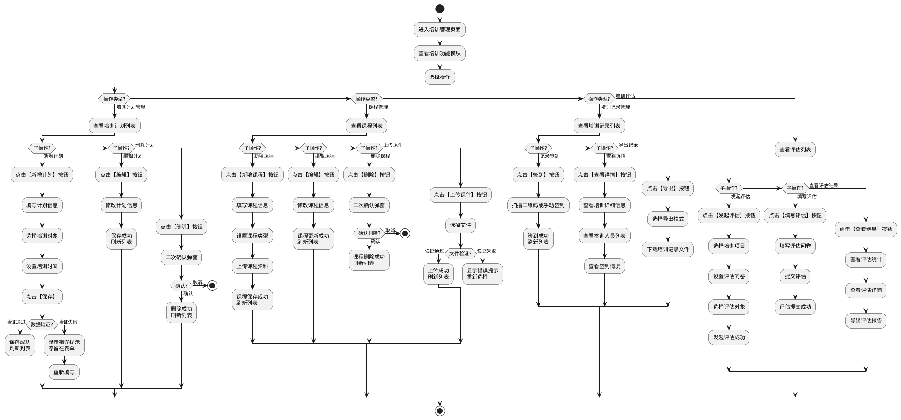

**培训计划管理流程：**
1. HR管理员进入培训管理页面，选择"培训计划管理"
2. 系统展示培训计划列表，支持按年度、部门、状态筛选
3. 管理员点击【新增计划】按钮，系统打开新增计划弹窗
4. 管理员填写计划信息：计划名称、培训对象、培训时间、培训内容、预算金额等
5. 管理员点击【保存】按钮，系统验证数据
   - 验证通过：保存计划，显示成功提示，关闭弹窗，刷新列表
   - 验证失败：显示错误提示，停留在弹窗，管理员重新填写
6. 对于已有计划，管理员可以点击【编辑】修改计划信息，或点击【删除】删除计划（需二次确认）

**课程管理流程：**
1. HR管理员进入培训管理页面，选择"课程管理"
2. 系统展示课程列表，支持按课程类型、状态筛选
3. 管理员点击【新增课程】按钮，系统打开新增课程弹窗
4. 管理员填写课程信息：课程名称、课程类型（内部/外部）、课程时长、讲师信息、课程简介等
5. 管理员上传课程资料（PPT、视频、文档等）
6. 管理员点击【保存】按钮，系统保存课程信息和资料文件，显示成功提示，刷新列表
7. 对于已有课程，管理员可以点击【编辑】修改课程信息，点击【上传课件】补充课程资料，或点击【删除】删除课程（需二次确认）

**培训记录管理流程：**
1. HR管理员进入培训管理页面，选择"培训记录管理"
2. 系统展示培训记录列表，支持按培训项目、时间范围、部门筛选
3. 管理员点击【签到】按钮，系统生成签到二维码或打开手动签到界面
4. 参训人员扫描二维码或管理员手动录入签到信息
5. 系统记录签到时间，更新签到状态，显示签到成功提示
6. 管理员可以点击【查看详情】查看培训详细信息、参训人员列表、签到情况
7. 管理员可以点击【导出】按钮，选择导出格式（Excel/PDF），下载培训记录文件

**培训评估流程：**
1. HR管理员进入培训管理页面，选择"培训评估"
2. 系统展示评估列表，支持按培训项目、评估状态筛选
3. 管理员点击【发起评估】按钮，系统打开评估设置弹窗
4. 管理员选择培训项目，设置评估问卷（选择题、问答题等），选择评估对象（参训人员）
5. 管理员点击【发起】按钮，系统创建评估任务，发送评估通知（邮件/短信），显示发起成功提示
6. 参训人员收到通知后，点击【填写评估】按钮，系统展示评估问卷
7. 参训人员填写问卷内容，点击【提交】按钮，系统保存评估答案，显示提交成功提示
8. 管理员可以点击【查看结果】查看评估统计数据、评估详情，点击【导出评估报告】下载评估报告

#### 12.3.2 功能设计

**系统交互时序：**

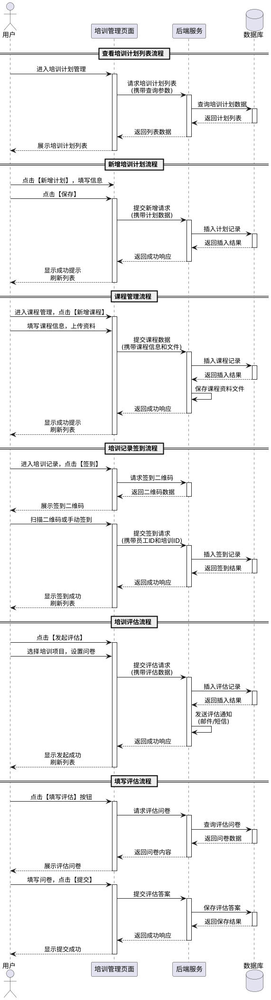

**核心功能：**

- **培训计划管理**：支持年度培训计划的制定、执行跟踪、预算管理，支持按部门、岗位、员工维度制定培训计划
- **课程管理**：支持内部课程库和外训记录的统一管理，支持课程分类、课程资料上传、讲师信息维护
- **培训记录管理**：支持培训签到（二维码扫描/手动录入）、学时统计、参训人员管理、培训记录导出
- **培训评估**：支持培训效果评估问卷设计、评估任务发起、评估数据收集、评估报告生成
- **培训提醒**：支持培训开始前自动提醒参训人员（邮件/短信/系统通知）
- **培训统计**：支持培训数据统计分析，包括培训覆盖率、人均培训学时、培训费用统计等

**数据字段：**

**培训计划表：**

| 字段名称 | 字段类型 | 长度限制 | 是否必填 | 说明 |
|---------|---------|---------|---------|------|
| 计划ID | 数字 | - | 自动生成 | 唯一标识 |
| 计划名称 | 文本 | 100 | 是 | 培训计划名称 |
| 培训对象 | 下拉多选 | - | 是 | 部门/岗位/员工 |
| 培训时间 | 日期时间范围 | - | 是 | 开始时间-结束时间 |
| 培训内容 | 文本域 | 500 | 是 | 培训内容描述 |
| 培训类型 | 下拉选择 | - | 是 | 内部培训/外部培训 |
| 培训地点 | 文本 | 100 | 是 | 培训地点 |
| 预算金额 | 数字 | - | 否 | 培训预算（元） |
| 实际费用 | 数字 | - | 否 | 实际支出（元） |
| 负责人 | 下拉选择 | - | 是 | 培训负责人 |
| 计划状态 | 下拉选择 | - | 是 | 待执行/执行中/已完成/已取消 |
| 创建时间 | 日期时间 | - | 自动生成 | 创建时间 |
| 更新时间 | 日期时间 | - | 自动更新 | 最后更新时间 |

**课程表：**

| 字段名称 | 字段类型 | 长度限制 | 是否必填 | 说明 |
|---------|---------|---------|---------|------|
| 课程ID | 数字 | - | 自动生成 | 唯一标识 |
| 课程名称 | 文本 | 100 | 是 | 课程名称 |
| 课程类型 | 下拉选择 | - | 是 | 内部课程/外部课程 |
| 课程分类 | 下拉选择 | - | 是 | 专业技能/管理能力/通用素质等 |
| 课程时长 | 数字 | - | 是 | 课程时长（小时） |
| 讲师姓名 | 文本 | 50 | 否 | 讲师姓名 |
| 讲师简介 | 文本域 | 500 | 否 | 讲师简介 |
| 课程简介 | 文本域 | 500 | 是 | 课程简介 |
| 课程资料 | 文件上传 | - | 否 | 课程资料文件 |
| 课程状态 | 下拉选择 | - | 是 | 启用/停用 |
| 创建时间 | 日期时间 | - | 自动生成 | 创建时间 |
| 更新时间 | 日期时间 | - | 自动更新 | 最后更新时间 |

**培训记录表：**

| 字段名称 | 字段类型 | 长度限制 | 是否必填 | 说明 |
|---------|---------|---------|---------|------|
| 记录ID | 数字 | - | 自动生成 | 唯一标识 |
| 培训计划ID | 数字 | - | 是 | 关联培训计划 |
| 课程ID | 数字 | - | 是 | 关联课程 |
| 参训人员 | 下拉多选 | - | 是 | 参训员工列表 |
| 培训时间 | 日期时间范围 | - | 是 | 实际培训时间 |
| 培训地点 | 文本 | 100 | 是 | 实际培训地点 |
| 签到方式 | 下拉选择 | - | 是 | 二维码扫描/手动录入 |
| 签到人数 | 数字 | - | 自动计算 | 实际签到人数 |
| 应到人数 | 数字 | - | 自动计算 | 应到人数 |
| 培训学时 | 数字 | - | 是 | 培训学时（小时） |
| 培训费用 | 数字 | - | 否 | 培训费用（元） |
| 培训备注 | 文本域 | 500 | 否 | 培训备注 |
| 创建时间 | 日期时间 | - | 自动生成 | 创建时间 |
| 更新时间 | 日期时间 | - | 自动更新 | 最后更新时间 |

**培训评估表：**

| 字段名称 | 字段类型 | 长度限制 | 是否必填 | 说明 |
|---------|---------|---------|---------|------|
| 评估ID | 数字 | - | 自动生成 | 唯一标识 |
| 培训记录ID | 数字 | - | 是 | 关联培训记录 |
| 评估问卷 | JSON | - | 是 | 问卷题目和选项 |
| 评估对象 | 下拉多选 | - | 是 | 参训人员 |
| 评估状态 | 下拉选择 | - | 是 | 待填写/已完成 |
| 发起人 | 下拉选择 | - | 是 | 评估发起人 |
| 发起时间 | 日期时间 | - | 自动生成 | 发起时间 |
| 截止时间 | 日期时间 | - | 是 | 评估截止时间 |
| 提交人数 | 数字 | - | 自动计算 | 已提交人数 |
| 应提交人数 | 数字 | - | 自动计算 | 应提交人数 |
| 创建时间 | 日期时间 | - | 自动生成 | 创建时间 |
| 更新时间 | 日期时间 | - | 自动更新 | 最后更新时间 |

**业务规则：**

- 培训计划名称不能为空，最多100字
- 培训时间的开始时间必须早于结束时间
- 培训对象至少选择一个部门、岗位或员工
- 课程名称不能为空，最多100字
- 课程时长必须大于0
- 课程资料文件大小不超过100MB，支持格式：PDF、PPT、PPTX、DOC、DOCX、MP4、AVI
- 培训记录的签到人数不能超过应到人数
- 培训学时必须大于0，最多保留1位小数
- 评估问卷至少包含1个题目
- 评估截止时间必须晚于发起时间
- 删除培训计划时，如果已有培训记录，则不允许删除，只能取消
- 删除课程时，如果已被培训计划引用，则不允许删除，只能停用

#### 12.3.3 业务逻辑关联

- **培训计划与课程关联**：培训计划关联课程表，一个培训计划可以包含多个课程，课程数据来源于课程管理模块
- **培训记录与员工关联**：培训记录关联员工表，记录参训人员的培训历史，用于员工档案的培训经历展示
- **培训评估与培训记录关联**：培训评估关联培训记录，一个培训记录可以发起多次评估（如培训前评估、培训后评估）
- **培训数据与绩效关联**：培训学时数据可以作为绩效考核的参考指标，参训情况影响员工绩效评分
- **培训费用与薪酬关联**：培训费用数据可以关联到薪酬管理模块，用于培训补贴的发放
- **培训提醒与消息通知关联**：培训开始前自动发送提醒通知，通过系统消息通知模块推送给参训人员
- **数据流向**：培训计划管理 → 课程管理 → 培训记录管理 → 培训评估 → 员工档案/绩效管理/数据报表

---

## 十三、社保管理

### 13.1 功能概述

社保管理模块为HR提供社会保险和公积金的全生命周期管理功能，包括参保配置、增减员管理、公积金管理、社保账单生成、申报导出等操作。支持多城市参保政策配置，自动计算缴纳金额，确保企业社保公积金管理的规范化和自动化。

### 13.2 页面访问权限

| 功能模块 | 超级管理员 | HR管理员 | 部门负责人 | 普通员工 |
|---------|-----------|---------|-----------|---------|
| 参保配置管理 | ✓ | ✓ | ✗ | ✗ |
| 增减员管理 | ✓ | ✓ | ✗ | ✗ |
| 公积金管理 | ✓ | ✓ | ✗ | ✗ |
| 社保账单 | ✓ | ✓ | ✗ | ✗ |
| 申报导出 | ✓ | ✓ | ✗ | ✗ |

### 13.3 功能详细设计

#### 13.3.1 用户操作流程

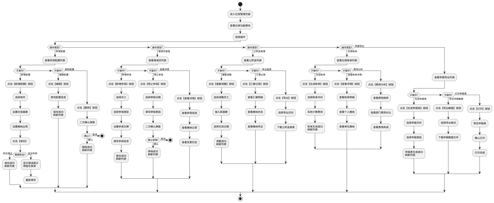

**参保配置流程**：
1. HR进入参保配置管理页面
2. 点击【新增配置】按钮
3. 选择城市（如北京、上海、深圳等）
4. 设置社保基数（养老、医疗、失业、工伤、生育）
5. 设置缴纳比例（个人比例、单位比例）
6. 点击【保存】按钮
7. 系统验证数据：
   - 验证通过：保存配置，显示成功提示，刷新列表
   - 验证失败：显示错误提示，停留在表单

**新增参保流程**：
1. HR进入增减员管理页面
2. 点击【新增参保】按钮
3. 选择员工（支持搜索和批量选择）
4. 选择参保类型（五险一金、五险、一金）
5. 设置参保日期（默认为入职日期）
6. 填写参保信息（社保卡号、公积金账号等）
7. 点击【提交】按钮
8. 系统自动计算缴纳金额，显示参保成功，刷新列表

**停止参保流程**：
1. HR在增减员列表中找到目标员工
2. 点击【停止参保】按钮
3. 选择停保日期（默认为离职日期）
4. 填写停保原因（离职、调出等）
5. 点击【确认】按钮
6. 系统弹出二次确认对话框："确定要停止该员工的参保吗？"
7. HR点击【确定】
8. 系统更新参保状态，显示停保成功，刷新列表

**公积金基数调整流程**：
1. HR进入公积金管理页面
2. 点击【基数调整】按钮
3. 选择需要调整的员工（支持批量选择）
4. 输入新的公积金基数
5. 选择生效日期（默认为下月1号）
6. 点击【确认】按钮
7. 系统保存调整记录，显示调整成功，刷新列表

**生成社保账单流程**：
1. HR进入社保账单页面
2. 点击【生成账单】按钮
3. 选择账单月份（默认为上月）
4. 系统自动计算各项社保费用（养老、医疗、失业、工伤、生育、公积金）
5. 系统生成账单，显示账单明细（个人缴纳、单位缴纳、合计）
6. HR可查看账单详情、导出账单、进行费用分析

**生成申报表流程**：
1. HR进入申报导出页面
2. 点击【生成申报表】按钮
3. 选择申报月份（默认为当月）
4. 选择申报类型（社保申报、公积金申报）
5. 点击【确认】按钮
6. 系统按申报格式组织数据，生成申报表
7. HR可预览申报表、导出为Excel、打印申报表

#### 13.3.2 功能设计

**系统交互时序**

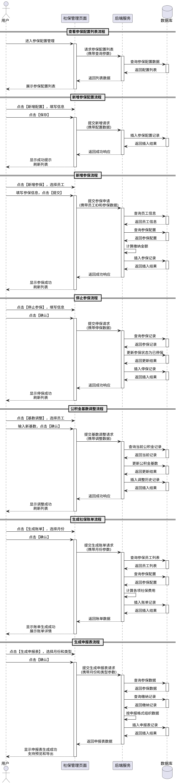

**核心功能**

- 参保配置管理：维护各城市的社保公积金缴纳基数和比例，支持按年度调整
- 增减员管理：员工参保登记、停保办理、参保信息查询、参保历史记录
- 公积金管理：公积金基数调整、汇缴记录查询、缴纳凭证下载、报表导出
- 社保账单：按月生成社保账单、账单明细查询、个人/单位缴纳金额统计、费用分析
- 申报导出：生成社保申报表、公积金申报表、导出申报数据、打印申报表
- 缴纳记录：记录每月社保公积金缴纳情况、缴纳凭证上传、缴纳状态跟踪
- 数据统计：参保人数统计、缴纳金额统计、费用趋势分析、部门费用对比

**数据字段**

| 字段名称 | 字段类型 | 长度限制 | 是否必填 | 说明 |
|---------|---------|---------|---------|------|
| 参保配置ID | 数字 | - | 自动生成 | 唯一标识 |
| 城市名称 | 文本 | 50 | 是 | 参保城市（如北京、上海） |
| 养老保险基数 | 数字 | - | 是 | 养老保险缴纳基数 |
| 养老保险个人比例 | 数字 | - | 是 | 个人缴纳比例（%） |
| 养老保险单位比例 | 数字 | - | 是 | 单位缴纳比例（%） |
| 医疗保险基数 | 数字 | - | 是 | 医疗保险缴纳基数 |
| 医疗保险个人比例 | 数字 | - | 是 | 个人缴纳比例（%） |
| 医疗保险单位比例 | 数字 | - | 是 | 单位缴纳比例（%） |
| 失业保险基数 | 数字 | - | 是 | 失业保险缴纳基数 |
| 失业保险个人比例 | 数字 | - | 是 | 个人缴纳比例（%） |
| 失业保险单位比例 | 数字 | - | 是 | 单位缴纳比例（%） |
| 工伤保险基数 | 数字 | - | 是 | 工伤保险缴纳基数 |
| 工伤保险单位比例 | 数字 | - | 是 | 单位缴纳比例（%） |
| 生育保险基数 | 数字 | - | 是 | 生育保险缴纳基数 |
| 生育保险单位比例 | 数字 | - | 是 | 单位缴纳比例（%） |
| 公积金基数 | 数字 | - | 是 | 公积金缴纳基数 |
| 公积金个人比例 | 数字 | - | 是 | 个人缴纳比例（%） |
| 公积金单位比例 | 数字 | - | 是 | 单位缴纳比例（%） |
| 生效日期 | 日期 | - | 是 | 配置生效日期 |
| 失效日期 | 日期 | - | 否 | 配置失效日期 |
| 参保记录ID | 数字 | - | 自动生成 | 唯一标识 |
| 员工ID | 数字 | - | 是 | 关联员工表 |
| 参保类型 | 下拉选择 | - | 是 | 五险一金/五险/一金 |
| 参保日期 | 日期 | - | 是 | 参保开始日期 |
| 停保日期 | 日期 | - | 否 | 停保日期 |
| 参保状态 | 下拉选择 | - | 是 | 正常参保/已停保 |
| 社保卡号 | 文本 | 50 | 否 | 社保卡号 |
| 公积金账号 | 文本 | 50 | 否 | 公积金账号 |
| 养老保险个人缴纳 | 数字 | - | 自动计算 | 个人缴纳金额 |
| 养老保险单位缴纳 | 数字 | - | 自动计算 | 单位缴纳金额 |
| 医疗保险个人缴纳 | 数字 | - | 自动计算 | 个人缴纳金额 |
| 医疗保险单位缴纳 | 数字 | - | 自动计算 | 单位缴纳金额 |
| 失业保险个人缴纳 | 数字 | - | 自动计算 | 个人缴纳金额 |
| 失业保险单位缴纳 | 数字 | - | 自动计算 | 单位缴纳金额 |
| 工伤保险单位缴纳 | 数字 | - | 自动计算 | 单位缴纳金额 |
| 生育保险单位缴纳 | 数字 | - | 自动计算 | 单位缴纳金额 |
| 公积金个人缴纳 | 数字 | - | 自动计算 | 个人缴纳金额 |
| 公积金单位缴纳 | 数字 | - | 自动计算 | 单位缴纳金额 |
| 停保原因 | 文本 | 200 | 否 | 停保原因说明 |
| 公积金调整记录ID | 数字 | - | 自动生成 | 唯一标识 |
| 员工ID | 数字 | - | 是 | 关联员工表 |
| 调整前基数 | 数字 | - | 是 | 调整前的公积金基数 |
| 调整后基数 | 数字 | - | 是 | 调整后的公积金基数 |
| 生效日期 | 日期 | - | 是 | 调整生效日期 |
| 调整原因 | 文本 | 200 | 否 | 调整原因说明 |
| 社保账单ID | 数字 | - | 自动生成 | 唯一标识 |
| 账单月份 | 文本 | 10 | 是 | 账单月份（YYYY-MM） |
| 参保人数 | 数字 | - | 自动计算 | 参保员工人数 |
| 养老保险个人合计 | 数字 | - | 自动计算 | 个人缴纳合计 |
| 养老保险单位合计 | 数字 | - | 自动计算 | 单位缴纳合计 |
| 医疗保险个人合计 | 数字 | - | 自动计算 | 个人缴纳合计 |
| 医疗保险单位合计 | 数字 | - | 自动计算 | 单位缴纳合计 |
| 失业保险个人合计 | 数字 | - | 自动计算 | 个人缴纳合计 |
| 失业保险单位合计 | 数字 | - | 自动计算 | 单位缴纳合计 |
| 工伤保险单位合计 | 数字 | - | 自动计算 | 单位缴纳合计 |
| 生育保险单位合计 | 数字 | - | 自动计算 | 单位缴纳合计 |
| 公积金个人合计 | 数字 | - | 自动计算 | 个人缴纳合计 |
| 公积金单位合计 | 数字 | - | 自动计算 | 单位缴纳合计 |
| 个人缴纳总计 | 数字 | - | 自动计算 | 个人缴纳总金额 |
| 单位缴纳总计 | 数字 | - | 自动计算 | 单位缴纳总金额 |
| 合计金额 | 数字 | - | 自动计算 | 总缴纳金额 |
| 生成时间 | 日期时间 | - | 自动生成 | 账单生成时间 |
| 申报表ID | 数字 | - | 自动生成 | 唯一标识 |
| 申报月份 | 文本 | 10 | 是 | 申报月份（YYYY-MM） |
| 申报类型 | 下拉选择 | - | 是 | 社保申报/公积金申报 |
| 申报数据 | 文本 | - | 是 | 申报数据（JSON格式） |
| 生成时间 | 日期时间 | - | 自动生成 | 申报表生成时间 |

**业务规则**

- 参保配置必须按城市维护，同一城市同一时间只能有一套有效配置
- 参保配置的生效日期不能早于当前日期，失效日期必须晚于生效日期
- 员工参保日期默认为入职日期，可手动调整但不能早于入职日期
- 员工停保日期默认为离职日期，可手动调整但不能早于参保日期
- 社保公积金缴纳金额自动计算：个人缴纳 = 基数 × 个人比例，单位缴纳 = 基数 × 单位比例
- 工伤保险和生育保险只有单位缴纳，没有个人缴纳
- 公积金基数调整生效日期默认为下月1号，可手动调整但不能早于当前日期
- 公积金基数调整后，系统自动记录调整历史，保留调整前后的基数和生效日期
- 社保账单按月生成，每月1号自动生成上月账单，也可手动生成指定月份账单
- 社保账单生成后不可修改，如需调整需重新生成
- 申报表按申报格式组织数据，支持导出为Excel格式，符合各地社保局申报要求
- 申报表生成后支持预览、导出、打印，导出的Excel文件可直接用于社保局申报
- 缴纳记录需上传缴纳凭证（如银行回单、缴费发票等），作为缴纳证明
- 参保人数统计按月统计，包括新增参保人数、停保人数、当前参保人数
- 费用趋势分析按月展示社保公积金缴纳金额变化趋势，支持按年度对比
- 部门费用对比展示各部门的社保公积金缴纳金额，支持按部门、按险种统计

#### 13.3.3 业务逻辑关联

| 关联模块 | 关联说明 |
|---------|---------|
| 员工管理 | 社保管理模块的员工数据来源于员工管理模块，员工入职时自动触发参保流程，员工离职时自动触发停保流程 |
| 薪酬管理 | 社保管理模块的社保公积金缴纳数据（个人缴纳金额）作为薪酬计算的扣款项，自动传递给薪酬管理模块进行工资计算 |
| 系统管理 | 社保管理模块的参保配置、缴纳比例、申报格式由系统管理员在系统管理模块中配置 |
| 数据报表与分析 | 社保管理模块的参保数据、缴纳数据、费用统计作为数据报表与分析模块的数据源，生成社保分析报表 |

---

## 十四、员工自助

### 14.1 功能概述

员工自助（ESS，Employee Self-Service）模块为员工提供自助服务平台，员工可以通过该模块查看和管理个人信息、查询工资条、查看假期余额、提交各类申请（请假、加班、报销等）、查看审批进度、处理待办任务等。员工自助模块提升了员工的工作效率，减少了HR部门的工作量，实现了员工信息的自主管理和业务流程的在线化处理。

员工自助模块的核心价值在于：
- **信息透明化**：员工可以随时查看个人信息、工资条、假期余额等数据，提升信息透明度
- **流程在线化**：员工可以在线提交各类申请，实时查看审批进度，减少线下沟通成本
- **自主管理**：员工可以自主修改个人信息、上传头像，减少HR部门的工作量
- **移动办公**：支持移动端访问，员工可以随时随地处理工作事务
- **数据准确性**：员工自主维护个人信息，确保数据的准确性和及时性

### 14.2 页面访问权限

| 功能模块 | 超级管理员 | HR管理员 | 部门负责人 | 普通员工 |
|---------|-----------|---------|-----------|---------|
| 个人信息管理 | ✓ | ✓ | ✓ | ✓ |
| 工资条查询 | ✓ | ✓ | ✓ | ✓ |
| 假期余额查询 | ✓ | ✓ | ✓ | ✓ |
| 申请提交 | ✓ | ✓ | ✓ | ✓ |
| 审批进度查询 | ✓ | ✓ | ✓ | ✓ |
| 待办任务处理 | ✓ | ✓ | ✓ | ✓ |

### 14.3 功能详细设计

#### 14.3.1 用户操作流程

员工自助模块的用户操作流程如下图所示：

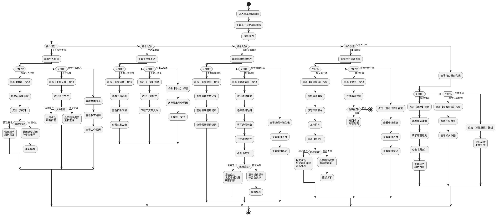

**个人信息管理流程：**
1. 员工进入员工自助页面，查看个人信息
2. 员工可以选择以下操作：
   - **修改个人信息**：点击【编辑】按钮，修改可编辑字段（如联系方式、紧急联系人等），点击【保存】，系统验证数据，验证通过后保存成功并刷新页面，验证失败则显示错误提示并停留在表单
   - **上传头像**：点击【上传头像】按钮，选择图片文件，系统验证文件格式和大小，验证通过后上传成功并刷新页面，验证失败则显示错误提示并重新选择
   - **查看详细信息**：查看基本信息、教育经历、工作经历等详细信息

**工资条查询流程：**
1. 员工进入工资条查询页面，查看工资条列表
2. 员工可以选择以下操作：
   - **查看工资详情**：点击【查看详情】按钮，查看工资明细、扣款明细、实发工资等详细信息
   - **下载工资条**：点击【下载】按钮，选择下载格式（PDF/Excel），下载工资条文件
   - **导出工资条**：点击【导出】按钮，选择导出月份范围，下载导出文件

**假期余额查询流程：**
1. 员工进入假期余额查询页面，查看假期余额列表
2. 员工可以选择以下操作：
   - **查看假期明细**：点击【查看明细】按钮，查看假期发放记录、假期使用记录、假期调整记录
   - **申请请假**：点击【申请请假】按钮，选择请假类型、请假时间，填写请假事由，上传请假附件，点击【提交】，系统验证数据，验证通过后提交成功并发起审批流程，验证失败则显示错误提示并停留在表单
   - **查看请假记录**：查看请假申请列表、审批进度、审批历史

**申请管理流程：**
1. 员工进入申请管理页面，查看我的申请列表
2. 员工可以选择以下操作：
   - **提交新申请**：点击【新建申请】按钮，选择申请类型（加班申请、报销申请、出差申请等），填写申请表单，上传附件，点击【提交】，系统验证数据，验证通过后提交成功并发起审批流程，验证失败则显示错误提示并停留在表单
   - **撤回申请**：点击【撤回】按钮，系统弹出二次确认弹窗，员工确认后撤回成功并刷新列表，取消则停止操作
   - **查看申请详情**：点击【查看详情】按钮，查看申请信息、审批进度、审批意见

**待办任务流程：**
1. 员工进入待办任务页面，查看待办任务列表
2. 员工可以选择以下操作：
   - **处理待办**：点击【处理】按钮，查看任务详情，填写处理意见，点击【提交】，处理成功并刷新列表
   - **查看任务详情**：点击【查看详情】按钮，查看任务信息、相关数据
   - **标记已读**：点击【标记已读】按钮，标记成功并刷新列表

#### 14.3.2 功能设计

**系统交互时序：**

员工自助模块的系统交互时序如下图所示：

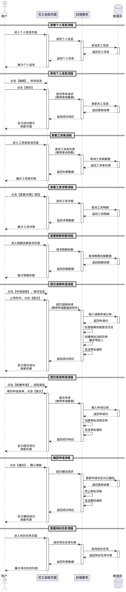

**核心功能：**

- **个人信息查看**：员工可以查看个人基本信息、教育经历、工作经历、证件信息等，信息来源于员工管理模块
- **个人信息修改**：员工可以修改部分可编辑字段（如联系方式、紧急联系人、家庭住址等），修改后需要HR审核确认
- **头像上传**：员工可以上传个人头像，支持JPG/PNG格式，文件大小不超过2MB，系统自动裁剪为正方形
- **工资条查询**：员工可以查询历史工资条，查看工资明细、扣款明细、实发工资等信息
- **工资条下载**：员工可以下载工资条文件，支持PDF和Excel格式
- **工资条导出**：员工可以批量导出指定月份范围的工资条，支持PDF和Excel格式
- **假期余额查询**：员工可以查询各类假期的剩余额度、已使用额度、总额度等信息
- **假期明细查询**：员工可以查看假期发放记录、假期使用记录、假期调整记录等明细信息
- **请假申请**：员工可以提交请假申请，选择请假类型、请假时间，填写请假事由，上传请假附件，系统自动检查假期余额是否充足
- **请假记录查询**：员工可以查看自己的请假申请列表、审批进度、审批历史
- **申请提交**：员工可以提交各类申请（加班申请、报销申请、出差申请、调岗申请等），填写申请表单，上传附件
- **申请撤回**：员工可以撤回未开始审批的申请，撤回后申请状态变为"已撤回"
- **申请详情查看**：员工可以查看申请的详细信息、审批进度、审批意见、审批历史
- **待办任务查询**：员工可以查看自己的待办任务列表，包括待审批的申请、待处理的任务等
- **待办任务处理**：员工可以处理待办任务，填写处理意见，提交处理结果
- **待办任务标记已读**：员工可以将待办任务标记为已读，已读任务不再显示在待办列表中

**数据字段：**

| 字段名称 | 字段类型 | 长度限制 | 是否必填 | 说明 |
|---------|---------|---------|---------|------|
| 员工ID | 数字 | - | 自动生成 | 唯一标识 |
| 员工姓名 | 文本 | 50 | 是 | 员工姓名 |
| 员工工号 | 文本 | 50 | 是 | 员工工号 |
| 部门名称 | 文本 | 100 | 是 | 所属部门 |
| 职位名称 | 文本 | 100 | 是 | 职位名称 |
| 联系电话 | 文本 | 20 | 是 | 联系电话 |
| 电子邮箱 | 文本 | 100 | 是 | 电子邮箱 |
| 紧急联系人 | 文本 | 50 | 否 | 紧急联系人姓名 |
| 紧急联系电话 | 文本 | 20 | 否 | 紧急联系人电话 |
| 家庭住址 | 文本 | 200 | 否 | 家庭住址 |
| 头像URL | 文本 | 500 | 否 | 头像文件URL |
| 工资条ID | 数字 | - | 自动生成 | 唯一标识 |
| 工资月份 | 文本 | 10 | 是 | 工资月份（YYYY-MM） |
| 基本工资 | 数字 | - | 是 | 基本工资 |
| 绩效工资 | 数字 | - | 是 | 绩效工资 |
| 岗位津贴 | 数字 | - | 是 | 岗位津贴 |
| 加班工资 | 数字 | - | 是 | 加班工资 |
| 应发工资 | 数字 | - | 自动计算 | 应发工资合计 |
| 个人所得税 | 数字 | - | 是 | 个人所得税 |
| 社保扣款 | 数字 | - | 是 | 社保扣款 |
| 公积金扣款 | 数字 | - | 是 | 公积金扣款 |
| 其他扣款 | 数字 | - | 是 | 其他扣款 |
| 实发工资 | 数字 | - | 自动计算 | 实发工资 |
| 假期类型ID | 数字 | - | 是 | 假期类型ID |
| 假期类型名称 | 文本 | 50 | 是 | 假期类型名称 |
| 总额度 | 数字 | - | 是 | 总额度（天数或小时数） |
| 已使用额度 | 数字 | - | 自动计算 | 已使用额度 |
| 剩余额度 | 数字 | - | 自动计算 | 剩余额度 |
| 有效期开始时间 | 日期 | - | 是 | 有效期开始时间 |
| 有效期结束时间 | 日期 | - | 是 | 有效期结束时间 |
| 请假申请ID | 数字 | - | 自动生成 | 唯一标识 |
| 请假类型 | 下拉选择 | - | 是 | 请假类型（年假/病假/事假等） |
| 请假开始时间 | 日期时间 | - | 是 | 请假开始时间 |
| 请假结束时间 | 日期时间 | - | 是 | 请假结束时间 |
| 请假天数 | 数字 | - | 自动计算 | 请假天数 |
| 请假事由 | 多行文本 | 500 | 是 | 请假事由 |
| 请假附件 | 文件上传 | - | 否 | 请假附件（病假条等） |
| 请假状态 | 下拉选择 | - | 自动更新 | 待审批/审批中/已通过/已驳回/已撤回 |
| 申请ID | 数字 | - | 自动生成 | 唯一标识 |
| 申请类型 | 下拉选择 | - | 是 | 加班申请/报销申请/出差申请/调岗申请等 |
| 申请标题 | 文本 | 100 | 是 | 申请标题 |
| 申请内容 | 多行文本 | 2000 | 是 | 申请内容 |
| 申请附件 | 文件上传 | - | 否 | 申请附件 |
| 申请时间 | 日期时间 | - | 自动生成 | 申请时间 |
| 申请状态 | 下拉选择 | - | 自动更新 | 待审批/审批中/已通过/已驳回/已撤回 |
| 审批进度 | 文本 | - | 自动更新 | 当前审批节点和审批人 |
| 待办任务ID | 数字 | - | 自动生成 | 唯一标识 |
| 任务类型 | 下拉选择 | - | 是 | 审批任务/处理任务/通知任务 |
| 任务标题 | 文本 | 100 | 是 | 任务标题 |
| 任务内容 | 多行文本 | 500 | 是 | 任务内容 |
| 任务状态 | 下拉选择 | - | 自动更新 | 待处理/已处理/已读 |
| 任务创建时间 | 日期时间 | - | 自动生成 | 任务创建时间 |
| 任务处理时间 | 日期时间 | - | 自动更新 | 任务处理时间 |

**业务规则：**

| 规则编号 | 规则描述 |
|---------|---------|
| ESS-001 | 员工只能查看和修改自己的个人信息，不能查看其他员工的信息 |
| ESS-002 | 员工修改个人信息时，只能修改可编辑字段（如联系方式、紧急联系人等），不能修改基本信息（如姓名、工号、部门等） |
| ESS-003 | 员工上传头像时，文件格式必须为JPG或PNG，文件大小不超过2MB，系统自动裁剪为正方形 |
| ESS-004 | 员工查询工资条时，只能查询自己的工资条，不能查询其他员工的工资条 |
| ESS-005 | 员工下载工资条时，系统自动生成PDF或Excel文件，文件名格式为"工资条_姓名_月份.pdf" |
| ESS-006 | 员工导出工资条时，最多可以导出12个月的工资条，超过12个月需要分批导出 |
| ESS-007 | 员工查询假期余额时，只能查询自己的假期余额，不能查询其他员工的假期余额 |
| ESS-008 | 员工提交请假申请时，系统自动检查假期余额是否充足，余额不足时不允许提交 |
| ESS-009 | 员工提交请假申请时，系统自动检查请假时间是否与已有请假冲突，冲突时不允许提交 |
| ESS-010 | 员工提交请假申请时，病假必须上传病假条附件，否则不允许提交 |
| ESS-011 | 员工只能撤回自己提交的申请，且只能在审批未开始处理时撤回 |
| ESS-012 | 员工查看申请详情时，可以查看申请的详细信息、审批进度、审批意见、审批历史 |
| ESS-013 | 员工提交申请时，系统自动创建审批流程实例，根据审批流程模板确定审批人 |
| ESS-014 | 员工查看待办任务时，只能查看分配给自己的待办任务，不能查看其他员工的待办任务 |
| ESS-015 | 员工处理待办任务时，必须填写处理意见，处理意见不能为空 |
| ESS-016 | 员工标记待办任务为已读后，任务不再显示在待办列表中，但可以在已读列表中查看 |
| ESS-017 | 员工自助模块支持移动端访问，移动端界面自适应不同屏幕尺寸 |
| ESS-018 | 员工自助模块的所有操作都记录操作日志，包括操作人、操作时间、操作内容等 |
| ESS-019 | 员工自助模块的敏感信息（如工资条）需要二次身份验证，确保信息安全 |
| ESS-020 | 员工自助模块的数据更新实时同步到其他模块，确保数据一致性 |

#### 14.3.3 业务逻辑关联

员工自助模块与其他模块存在以下关联关系：

| 关联模块 | 关联说明 |
|---------|---------|
| 员工管理 | 员工自助模块的个人信息来源于员工管理模块，员工修改个人信息后需要HR审核确认，审核通过后更新员工管理模块的数据 |
| 薪酬管理 | 员工自助模块的工资条数据来源于薪酬管理模块，员工可以查询和下载工资条，但不能修改工资条数据 |
| 假勤管理 | 员工自助模块的假期余额数据来源于假勤管理模块，员工可以查询假期余额、提交请假申请，请假审批通过后自动更新假勤管理模块的假期余额 |
| 考勤管理 | 员工自助模块的加班申请数据提交到考勤管理模块，加班审批通过后自动生成调休额度 |
| 审批流引擎 | 员工自助模块的所有申请（请假、加班、报销、出差等）都通过审批流引擎进行审批，审批通过后自动更新相关模块的数据 |
| 系统管理 | 员工自助模块的权限配置、功能开关由系统管理员在系统管理模块中配置 |
| 数据报表与分析 | 员工自助模块的使用统计、申请统计、审批效率分析等数据来源于员工自助模块 |

## 十五、审批流引擎

### 15.1 功能概述

审批流引擎模块为企业提供灵活、可配置的审批流程管理功能，支持自定义审批流程模板、多级审批节点、条件分支路由、代理审批等功能。通过可视化的流程设计器，管理员可以拖拽配置审批节点、设置审批人、定义条件分支规则，实现各类业务审批流程的快速搭建和灵活调整。系统支持审批实例的全生命周期管理，包括发起审批、审批处理、流程流转、状态跟踪等，确保审批流程的规范化和透明化。

### 15.2 页面访问权限

| 功能模块 | 超级管理员 | HR管理员 | 部门负责人 | 普通员工 |
|---------|-----------|---------|-----------|---------|
| 流程模板管理 | ✓ | ✓ | ✗ | ✗ |
| 审批实例管理 | ✓ | ✓ | ✓（本部门） | ✓（本人） |
| 待办审批 | ✓ | ✓ | ✓ | ✓ |
| 代理设置 | ✓ | ✓ | ✓ | ✓ |
| 审批统计 | ✓ | ✓ | ✓（本部门） | ✗ |

### 15.3 功能详细设计

#### 15.3.1 用户操作流程

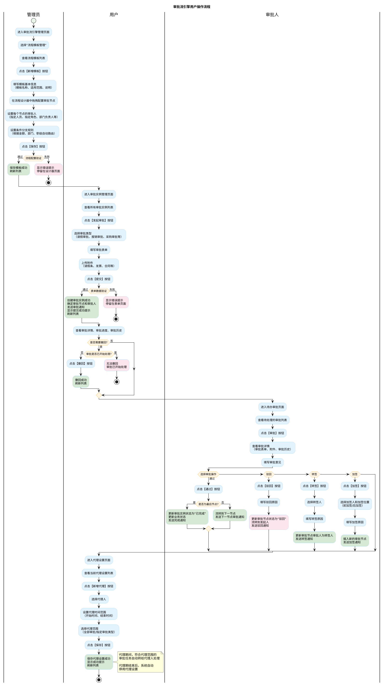

**流程模板管理流程：**
1. 管理员进入审批流引擎管理页面，选择"流程模板管理"
2. 系统展示流程模板列表，支持按模板名称、状态筛选
3. 管理员点击【新增模板】按钮，填写模板基本信息（模板名称、适用范围、说明）
4. 管理员在流程设计器中拖拽配置审批节点，设置每个节点的审批人（指定人员、指定角色、部门负责人、发起人上级等）
5. 管理员设置条件分支规则（如根据金额、部门、职级自动路由到不同审批节点）
6. 管理员点击【保存】按钮，系统验证流程配置的完整性和合理性
7. 验证通过后，系统保存模板并刷新列表；验证失败则显示错误提示，停留在设计器页面

**审批实例管理流程：**
1. 用户进入审批实例管理页面，查看所有审批实例列表
2. 用户点击【发起审批】按钮，选择审批类型（如请假审批、报销审批、采购审批等）
3. 系统根据选择的审批类型加载对应的审批表单
4. 用户填写审批表单，上传附件（如请假条、发票、合同等）
5. 用户点击【提交】按钮，系统验证表单数据的完整性和合理性
6. 验证通过后，系统创建审批实例，根据流程模板确定审批节点和审批人，发送审批通知（邮件/短信/企业微信），显示提交成功提示并刷新列表
7. 用户可以查看审批详情、审批进度、审批历史，也可以撤回审批（仅限审批未开始处理时）或催办审批

**待办审批流程：**
1. 审批人进入待办审批页面，查看待处理的审批列表
2. 审批人点击【审批】按钮，系统打开审批详情页面，展示审批表单、附件、审批历史等信息
3. 审批人填写审批意见，选择审批操作：
   - **通过**：审批人点击【通过】按钮，系统判断是否为最后一个审批节点。如果是最后节点，则更新审批实例状态为"已完成"，更新业务状态，发送完成通知；如果不是最后节点，则流转到下一节点，发送下一节点审批通知
   - **驳回**：审批人点击【驳回】按钮，填写驳回原因，系统更新审批节点状态为"驳回"，流转到发起人，发送驳回通知
   - **转签**：审批人点击【转签】按钮，选择转签人，填写转签原因，系统更新审批节点审批人为转签人，发送转签通知
   - **加签**：审批人点击【加签】按钮，选择加签人和加签位置（前加签/后加签），填写加签原因，系统在当前节点前或后插入新的审批节点，发送加签通知

**代理设置流程：**
1. 用户进入代理设置页面，查看当前代理设置列表
2. 用户点击【新增代理】按钮，系统打开代理设置弹窗
3. 用户选择代理人，设置代理时间范围（开始时间、结束时间），选择代理范围（全部审批/指定审批类型）
4. 用户点击【保存】按钮，系统保存代理设置，显示成功提示，刷新列表
5. 在代理期间，所有符合代理范围的审批任务自动转给代理人处理
6. 代理期结束后，系统自动停用代理设置

#### 15.3.2 功能设计

##### 系统交互时序

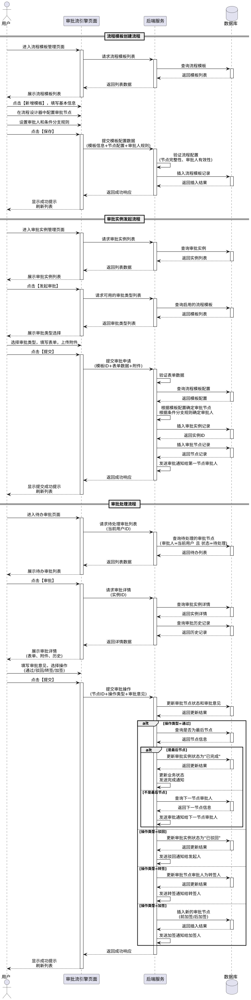

**流程模板创建时序：**
1. 管理员在流程模板管理页面点击【新增模板】
2. 前端打开流程设计器，加载流程设计器组件
3. 管理员拖拽配置审批节点，设置审批人和条件分支
4. 管理员点击【保存】，前端验证流程配置的完整性
5. 前端发送 POST /admin/approval/template/add 请求，携带模板配置数据
6. 后端验证流程配置的合理性（节点连接、审批人设置、条件表达式等）
7. 后端保存流程模板到数据库
8. 后端返回保存结果
9. 前端显示成功提示，刷新模板列表

**审批实例发起时序：**
1. 用户在审批实例管理页面点击【发起审批】
2. 前端打开审批表单弹窗，加载对应的审批类型表单
3. 用户填写审批表单，上传附件
4. 用户点击【提交】，前端验证表单数据
5. 前端发送 POST /admin/approval/instance/create 请求，携带审批数据
6. 后端根据审批类型查询对应的流程模板
7. 后端根据流程模板和条件分支规则确定审批节点和审批人
8. 后端创建审批实例，保存审批数据到数据库
9. 后端发送审批通知（邮件/短信/企业微信）给第一个审批节点的审批人
10. 后端返回创建结果
11. 前端显示成功提示，刷新审批实例列表

**审批处理时序：**
1. 审批人在待办审批页面点击【审批】
2. 前端发送 GET /admin/approval/instance/{id} 请求，获取审批详情
3. 后端查询审批实例数据、审批历史、附件等信息
4. 后端返回审批详情数据
5. 前端展示审批详情页面
6. 审批人填写审批意见，选择审批操作（通过/驳回/转签/加签）
7. 审批人点击【提交】，前端发送 POST /admin/approval/instance/process 请求
8. 后端更新审批节点状态，记录审批意见
9. 后端根据审批操作执行流程流转逻辑：
   - 通过：判断是否为最后节点，是则完成审批，否则流转到下一节点
   - 驳回：流转到发起人，更新审批实例状态为"驳回"
   - 转签：更新当前节点审批人为转签人
   - 加签：在当前节点前或后插入新的审批节点
10. 后端发送审批通知给相关人员
11. 后端返回处理结果
12. 前端显示成功提示，刷新待办审批列表

##### 核心功能

**流程模板管理：**
- 流程模板列表展示，支持按模板名称、状态筛选
- 新增流程模板，填写模板基本信息（模板名称、适用范围、说明）
- 可视化流程设计器，支持拖拽配置审批节点
- 审批节点类型：审批节点、条件分支节点、并行节点、结束节点
- 审批人设置：指定人员、指定角色、部门负责人、发起人上级、发起人自选
- 条件分支规则设置：根据金额、部门、职级、自定义字段等条件自动路由
- 流程模板启用/停用，停用后不能用于新的审批实例
- 流程模板编辑，支持修改流程配置（仅限未启用或已停用的模板）
- 流程模板删除，仅限未启用的模板
- 流程模板复制，快速创建相似流程

**审批实例管理：**
- 审批实例列表展示，支持按审批类型、状态、发起人、发起时间筛选
- 发起审批，选择审批类型，填写审批表单，上传附件
- 审批详情查看，展示审批表单、附件、审批历史、审批进度
- 审批撤回，仅限审批未开始处理时
- 审批催办，向当前审批节点的审批人发送催办通知
- 审批实例状态：待审批、审批中、已通过、已驳回、已撤回
- 审批历史记录：审批节点、审批人、审批时间、审批意见、审批操作

**待办审批：**
- 待办审批列表展示，支持按审批类型、发起人、发起时间筛选
- 审批详情查看，展示审批表单、附件、审批历史
- 审批操作：通过、驳回、转签、加签
- 审批意见填写，支持富文本编辑
- 批量审批，支持批量通过或驳回多个审批

**代理设置：**
- 代理设置列表展示，支持按代理人、代理时间筛选
- 新增代理设置，选择代理人，设置代理时间范围，选择代理范围
- 代理设置编辑，修改代理人、代理时间、代理范围
- 代理设置删除，删除代理设置
- 代理设置启用/停用，手动控制代理设置的生效状态
- 代理期间，符合代理范围的审批任务自动转给代理人
- 代理期结束后，系统自动停用代理设置

**审批统计：**
- 审批统计报表，展示审批数量、审批通过率、平均审批时长等指标
- 审批类型分布统计，展示各审批类型的数量和占比
- 审批人效率统计，展示各审批人的审批数量和平均审批时长
- 审批时效统计，展示审批实例的平均审批时长和超时率

##### 数据字段

**流程模板表（approval_template）：**

| 字段名称 | 字段类型 | 长度限制 | 是否必填 | 说明 |
|---------|---------|---------|---------|------|
| 模板名称 | 文本 | 50字符 | 是 | 流程模板的名称 |
| 适用范围 | 下拉选择 | - | 是 | 流程模板的适用范围（全公司/指定部门） |
| 说明 | 多行文本 | 200字符 | 否 | 流程模板的说明 |
| 流程配置 | JSON | - | 是 | 流程节点配置数据（节点类型、审批人、条件分支等） |
| 状态 | 下拉选择 | - | 是 | 流程模板状态（未启用/已启用/已停用） |
| 创建人 | 文本 | - | 是 | 创建流程模板的用户 |
| 创建时间 | 日期时间 | - | 是 | 流程模板创建时间 |
| 更新时间 | 日期时间 | - | 是 | 流程模板最后更新时间 |

**审批实例表（approval_instance）：**

| 字段名称 | 字段类型 | 长度限制 | 是否必填 | 说明 |
|---------|---------|---------|---------|------|
| 审批编号 | 文本 | 30字符 | 是 | 审批实例的唯一编号 |
| 审批类型 | 下拉选择 | - | 是 | 审批类型（请假审批/报销审批/采购审批等） |
| 审批标题 | 文本 | 100字符 | 是 | 审批实例的标题 |
| 发起人 | 文本 | - | 是 | 发起审批的用户 |
| 发起时间 | 日期时间 | - | 是 | 审批发起时间 |
| 审批表单数据 | JSON | - | 是 | 审批表单的数据 |
| 附件 | 文件列表 | - | 否 | 审批附件（支持多个文件） |
| 流程模板ID | 文本 | - | 是 | 关联的流程模板ID |
| 当前节点 | 文本 | - | 是 | 当前审批节点ID |
| 审批状态 | 下拉选择 | - | 是 | 审批实例状态（待审批/审批中/已通过/已驳回/已撤回） |
| 完成时间 | 日期时间 | - | 否 | 审批完成时间 |

**审批节点记录表（approval_node_record）：**

| 字段名称 | 字段类型 | 长度限制 | 是否必填 | 说明 |
|---------|---------|---------|---------|------|
| 审批实例ID | 文本 | - | 是 | 关联的审批实例ID |
| 节点ID | 文本 | - | 是 | 审批节点ID |
| 节点名称 | 文本 | 50字符 | 是 | 审批节点名称 |
| 审批人 | 文本 | - | 是 | 审批人用户ID |
| 审批时间 | 日期时间 | - | 否 | 审批处理时间 |
| 审批意见 | 多行文本 | 500字符 | 否 | 审批意见 |
| 审批操作 | 下拉选择 | - | 是 | 审批操作（通过/驳回/转签/加签） |
| 节点状态 | 下拉选择 | - | 是 | 节点状态（待审批/已通过/已驳回/已转签） |

**代理设置表（approval_delegate）：**

| 字段名称 | 字段类型 | 长度限制 | 是否必填 | 说明 |
|---------|---------|---------|---------|------|
| 委托人 | 文本 | - | 是 | 设置代理的用户 |
| 代理人 | 文本 | - | 是 | 代理审批的用户 |
| 开始时间 | 日期时间 | - | 是 | 代理开始时间 |
| 结束时间 | 日期时间 | - | 是 | 代理结束时间 |
| 代理范围 | 下拉选择 | - | 是 | 代理范围（全部审批/指定审批类型） |
| 审批类型 | 多选 | - | 否 | 指定的审批类型（当代理范围为"指定审批类型"时必填） |
| 状态 | 下拉选择 | - | 是 | 代理设置状态（启用/停用） |
| 创建时间 | 日期时间 | - | 是 | 代理设置创建时间 |

##### 业务规则

**流程模板配置规则：**
- 流程模板必须包含至少一个审批节点和一个结束节点
- 审批节点必须设置审批人（指定人员、指定角色、部门负责人、发起人上级、发起人自选）
- 条件分支节点必须设置条件表达式，且所有分支的条件不能重叠
- 并行节点的所有分支必须汇聚到同一个节点
- 流程模板启用后不能编辑，只能停用后再编辑
- 流程模板删除前必须确认没有关联的审批实例

**审批实例创建规则：**
- 审批实例必须关联一个已启用的流程模板
- 审批表单数据必须符合流程模板定义的表单结构
- 审批实例创建后，系统根据流程模板和条件分支规则确定第一个审批节点和审批人
- 审批实例创建后，系统自动发送审批通知给第一个审批节点的审批人

**审批处理规则：**
- 审批人只能处理分配给自己的审批任务
- 审批通过后，系统判断是否为最后一个审批节点：
  - 如果是最后节点，则更新审批实例状态为"已通过"，更新业务状态，发送完成通知
  - 如果不是最后节点，则流转到下一节点，发送下一节点审批通知
- 审批驳回后，系统更新审批实例状态为"已驳回"，流转到发起人，发送驳回通知
- 审批转签后，系统更新当前节点审批人为转签人，发送转签通知
- 审批加签后，系统在当前节点前或后插入新的审批节点，发送加签通知

**审批撤回规则：**
- 审批实例只能由发起人撤回
- 审批实例只能在"待审批"状态下撤回
- 审批实例撤回后，状态更新为"已撤回"，不能再次提交

**代理设置规则：**
- 代理时间范围不能与已有的代理设置重叠
- 代理范围为"指定审批类型"时，必须选择至少一个审批类型
- 代理期间，符合代理范围的审批任务自动转给代理人
- 代理期结束后，系统自动停用代理设置
- 代理人不能再设置代理（不支持二级代理）

**审批通知规则：**
- 审批实例创建后，系统发送审批通知给第一个审批节点的审批人
- 审批通过后，系统发送审批通知给下一节点的审批人
- 审批驳回后，系统发送驳回通知给发起人
- 审批转签后，系统发送转签通知给转签人
- 审批加签后，系统发送加签通知给加签人
- 审批完成后，系统发送完成通知给发起人
- 审批通知支持多种渠道：邮件、短信、企业微信、钉钉、系统站内信

##### （四）业务逻辑关联

审批流引擎模块是企业HR系统的核心基础设施，为各业务模块提供统一的审批流程管理能力。作为横向贯穿整个HR系统的工作流引擎，审批流引擎不仅仅是一个独立的功能模块，更是连接各业务模块、驱动业务流转、保障流程规范的关键枢纽。以下从审批流引擎的核心作用、业务流转机制、数据联动关系三个维度，深入阐述审批流引擎与其他模块的业务逻辑关联。

**一、审批流引擎的核心作用**

审批流引擎在HR系统中扮演着"流程中枢"的角色，其核心作用体现在以下几个方面：

1. **统一流程管理**：为所有需要审批的业务提供统一的流程配置、流程执行、流程监控能力，避免各业务模块重复开发审批功能，确保审批流程的一致性和规范性

2. **灵活流程配置**：通过可视化的流程设计器，支持管理员根据企业实际需求灵活配置审批流程，包括审批节点、审批人、条件分支、审批规则等，无需修改代码即可快速调整流程

3. **流程状态跟踪**：实时记录审批流程的每个节点状态、审批意见、审批时间等信息，为业务模块提供完整的审批历史记录，支持流程追溯和审计

4. **业务状态联动**：审批流程的状态变化（如审批通过、驳回、撤回等）自动触发业务模块的状态更新和数据变更，实现审批流程与业务流程的无缝衔接

5. **权限控制集成**：与系统管理模块的权限体系深度集成，根据用户角色、部门、职级等信息动态确定审批人，确保审批权限的合理分配

6. **消息通知推送**：审批流程的关键节点（如审批发起、审批通过、审批驳回等）自动触发消息通知，通过邮件、短信、企业微信等多种渠道及时通知相关人员

**二、业务流转机制**

审批流引擎通过以下机制实现业务流转：

1. **流程模板绑定**：每个业务类型（如请假申请、调薪申请、招聘需求等）绑定一个流程模板，流程模板定义了该业务的审批节点、审批人、条件分支等信息

2. **审批实例创建**：当业务模块发起审批时，审批流引擎根据业务类型查询对应的流程模板，创建审批实例，并根据条件分支规则确定审批路径和审批人

3. **节点流转控制**：审批人处理审批后，审批流引擎根据审批结果（通过/驳回/转签/加签）自动流转到下一节点或返回发起人，确保流程按照预定路径执行

4. **业务回调触发**：审批流程完成后，审批流引擎通过回调机制通知业务模块，业务模块根据审批结果执行相应的业务逻辑（如更新数据、发送通知、生成记录等）

5. **异常处理机制**：支持审批撤回、审批超时提醒、审批代理等异常处理机制，确保审批流程在各种情况下都能正常运行

**三、与各业务模块的数据联动关系**

**与员工管理模块的关联：**
- **入职审批流程**：新员工入职申请需要经过部门负责人、HR、分管领导等多级审批。审批通过后，审批流引擎触发回调，员工管理模块自动创建员工档案，生成员工编号，开通系统账号，分配初始权限，并触发入职欢迎邮件发送
- **离职审批流程**：员工离职申请需要经过直属上级、HR、财务等多部门审批，确保工作交接、财务结算、资产归还等事项完成。审批通过后，员工管理模块更新员工状态为"已离职"，冻结系统账号，归档员工档案，并触发离职手续清单生成
- **调岗审批流程**：员工调岗申请需要经过原部门负责人、新部门负责人、HR等审批。审批通过后，员工管理模块更新员工的部门、岗位、汇报关系等信息，同时触发权限重新分配、工位调整通知等后续流程
- **转正审批流程**：试用期员工转正申请需要经过直属上级评估、HR审核、分管领导审批。审批通过后，员工管理模块更新员工状态为"正式员工"，调整薪资待遇，更新合同信息，并触发转正通知和福利开通

**与考勤假勤模块的关联：**
- **请假审批流程**：员工请假申请根据请假类型（年假/病假/事假等）和请假天数自动路由到不同审批节点。审批通过后，假勤管理模块扣减对应假期余额，生成请假记录，更新考勤日历，并同步到考勤统计报表。如果请假跨月，系统自动拆分为多条记录分别扣减
- **加班审批流程**：员工加班申请需要经过直属上级审批。审批通过后，考勤管理模块生成加班记录，根据加班时长和加班类型（工作日加班/周末加班/节假日加班）计算加班费或调休额度，并更新到员工的调休余额中
- **外勤审批流程**：员工外勤申请需要经过直属上级审批，并记录外勤地点、外勤事由、外勤时长等信息。审批通过后，考勤管理模块生成外勤记录，标记该时段为外勤状态，避免被系统判定为缺勤
- **补卡审批流程**：员工忘记打卡后可以提交补卡申请，说明原因并提供证明材料。审批通过后，考勤管理模块更新考勤记录，补充打卡时间，并标记为"补卡"状态，避免影响考勤统计

**与薪酬管理模块的关联：**
- **调薪审批流程**：员工调薪申请（晋升调薪/年度调薪/特殊调薪等）需要经过直属上级、HR、财务、分管领导等多级审批，并根据调薪金额设置不同的审批路径（如调薪幅度超过20%需要总经理审批）。审批通过后，薪酬管理模块更新员工薪资信息，生成调薪记录，并从指定月份开始按新薪资计算工资
- **奖金发放审批流程**：部门负责人提交奖金发放申请，列明奖金类型（绩效奖金/项目奖金/年终奖等）、发放对象、发放金额等信息。审批通过后，薪酬管理模块生成奖金发放记录，并在下次工资发放时一并发放
- **补贴申请审批流程**：员工提交各类补贴申请（交通补贴/通讯补贴/餐补等），上传相关凭证。审批通过后，薪酬管理模块生成补贴发放记录，并在工资中体现

**与招聘管理模块的关联：**
- **招聘需求审批流程**：部门负责人提交招聘需求申请，说明招聘岗位、招聘人数、任职要求、薪资范围等信息。审批通过后，招聘管理模块创建招聘职位，发布到招聘渠道，并分配招聘负责人
- **Offer发放审批流程**：HR向候选人发放Offer前需要经过用人部门负责人、HR总监、分管领导等审批，并根据Offer薪资设置不同的审批路径。审批通过后，招聘管理模块生成Offer记录，发送Offer邮件给候选人，并跟踪Offer接受情况
- **入职办理审批流程**：候选人接受Offer后，HR发起入职办理流程，审批通过后自动触发员工档案创建、系统账号开通、入职培训安排等一系列入职流程

**与合同管理模块的关联：**
- **合同签订审批流程**：新员工入职或合同到期续签时，HR发起合同签订申请。审批通过后，合同管理模块生成合同记录，打印合同文本，安排合同签署，并设置合同到期提醒
- **合同续签审批流程**：合同到期前，系统自动提醒HR发起合同续签申请。审批通过后，合同管理模块更新合同信息，延长合同期限，并重新设置到期提醒
- **合同终止审批流程**：员工离职或合同提前终止时，HR发起合同终止申请。审批通过后，合同管理模块更新合同状态为"已终止"，记录终止原因和终止时间

**与绩效管理模块的关联：**
- **绩效目标设定审批流程**：员工与直属上级沟通确定绩效目标后，提交绩效目标设定申请。审批通过后，绩效管理模块生成绩效目标记录，并在绩效考核周期结束时作为考核依据
- **绩效评估结果审批流程**：直属上级完成绩效评估后，评估结果需要经过HR审核、分管领导审批。审批通过后，绩效管理模块更新绩效评估记录，并触发绩效奖金计算、绩效面谈安排等后续流程
- **绩效申诉审批流程**：员工对绩效评估结果有异议时，可以提交绩效申诉。审批通过后，绩效管理模块重新评估绩效，更新评估结果

**与培训管理模块的关联：**
- **培训申请审批流程**：员工或部门负责人提交培训申请，说明培训课程、培训时间、培训费用等信息。审批通过后，培训管理模块生成培训记录，安排培训课程，并跟踪培训完成情况
- **外训申请审批流程**：员工申请参加外部培训时，需要提交外训申请，上传培训课程介绍、费用明细等材料。审批通过后，培训管理模块生成外训记录，并在培训完成后发起费用报销流程

**与社保管理模块的关联：**
- **社保增员审批流程**：新员工入职后，HR发起社保增员申请。审批通过后，社保管理模块办理社保增员手续，生成社保账号，并从指定月份开始缴纳社保
- **社保减员审批流程**：员工离职后，HR发起社保减员申请。审批通过后，社保管理模块办理社保减员手续，停止社保缴纳
- **社保基数调整审批流程**：每年社保基数调整时，HR发起社保基数调整申请。审批通过后，社保管理模块更新社保基数，并从指定月份开始按新基数缴纳社保

**与员工自助模块的关联：**
- **申请发起入口**：员工在员工自助模块发起的各类申请（请假、加班、报销、调岗、培训等）都通过审批流引擎进行审批。员工自助模块提供统一的申请发起入口，根据申请类型加载对应的申请表单，并调用审批流引擎的API创建审批实例
- **审批进度查询**：员工可以在员工自助模块查看自己发起的审批实例的审批进度、当前审批节点、审批人、审批意见等信息。审批流引擎提供审批进度查询接口，员工自助模块调用接口获取审批进度数据并展示
- **审批撤回功能**：员工可以在员工自助模块撤回自己发起的审批实例（仅限审批未开始处理的情况）。审批流引擎提供审批撤回接口，撤回后审批实例状态更新为"已撤回"，并通知审批人
- **待办任务处理**：员工作为审批人时，可以在员工自助模块的待办任务列表中查看待处理的审批任务，点击进入审批详情页面进行审批。审批流引擎提供待办任务查询接口和审批处理接口，员工自助模块调用接口完成审批操作

**与系统管理模块的关联：**
- **权限控制集成**：审批流引擎的权限控制依赖系统管理模块的角色和权限配置。审批流引擎在确定审批人时，需要查询系统管理模块的用户角色、部门、职级等信息，根据流程模板中配置的审批人规则（指定人员/指定角色/部门负责人/发起人上级等）动态确定审批人
- **消息通知配置**：审批通知的发送依赖系统管理模块的消息通知配置。系统管理模块配置了邮件服务器、短信网关、企业微信接口等通知渠道的参数，审批流引擎调用系统管理模块的消息通知接口发送审批通知
- **操作日志记录**：审批流引擎的所有操作（流程模板创建/修改/删除、审批实例创建、审批处理、审批撤回等）都记录操作日志到系统管理模块的操作日志表，包括操作人、操作时间、操作内容、操作结果等信息，支持审计和追溯

**与数据报表与分析模块的关联：**
- **审批统计数据源**：数据报表与分析模块的审批统计报表数据来源于审批流引擎模块，包括审批数量、审批通过率、平均审批时长、审批超时率等核心指标
- **审批类型分布分析**：统计各类审批类型（请假/调薪/招聘/培训等）的申请数量、通过率、驳回率等指标，帮助管理层了解各类业务的审批情况
- **审批人效率分析**：统计各审批人的审批数量、平均审批时长、审批超时次数等指标，评估审批人的工作效率
- **审批时效分析**：统计审批流程从发起到完成的平均时长、各节点的平均审批时长等指标，识别审批流程中的瓶颈节点，优化审批流程

**四、审批流引擎的扩展性设计**

审批流引擎采用插件化设计，支持业务模块灵活扩展：

1. **审批类型注册机制**：业务模块可以向审批流引擎注册新的审批类型，定义审批表单字段、验证规则、回调接口等信息，无需修改审批流引擎代码即可支持新的审批业务

2. **条件表达式引擎**：支持使用表达式语言（如SpEL）定义条件分支规则，根据申请数据（如金额、部门、职级等）动态路由到不同审批节点，实现灵活的审批路径控制

3. **审批人动态计算**：支持通过脚本或规则引擎动态计算审批人，如"发起人的上级的上级"、"财务部门负责人"、"薪资在某个范围内的员工"等复杂审批人规则

4. **审批事件监听机制**：业务模块可以监听审批流程的关键事件（如审批发起、审批通过、审批驳回等），在事件触发时执行自定义逻辑，实现审批流程与业务流程的深度集成

通过以上机制，审批流引擎不仅是一个独立的功能模块，更是整个HR系统的"神经中枢"，连接各业务模块，驱动业务流转，保障流程规范，为企业提供高效、灵活、可靠的审批流程管理能力。

---

## 十六、数据报表与分析

### 16.1 功能概述

数据报表与分析模块为管理层和HR人员提供全方位的数据可视化和分析能力，通过HR驾驶舱、人员分析报表、薪酬分析报表、招聘漏斗报表、考勤报表等多维度报表，实时掌握企业人力资源状况，支持数据驱动的决策。系统支持多种筛选条件和分析维度，并提供Excel/PDF格式的报表导出功能，满足不同场景的数据分析需求。

**核心功能包括：**

1. **HR驾驶舱**：展示企业人力资源核心指标的实时统计数据，包括在职人数、离职率、招聘进度、出勤率、人力成本等关键指标
2. **人员分析报表**：提供多维度的人员数据分析，支持司龄分布、学历分布、年龄分布、性别比例、部门人员构成等分析图表
3. **薪酬分析报表**：分析企业薪酬结构和人力成本趋势，展示薪酬带宽分布、薪酬结构占比、人力成本趋势等图表
4. **招聘漏斗报表**：面向管理层（HRD / HR VP / CEO / 业务线负责人）的招聘业务月度体检报告，以"本期 vs 上期"对比视角呈现核心指标。
   - **定位**：管理层一屏快照，用于经营会汇报、季度复盘、向上汇报场景；**不做明细钻取、不做多维筛选**
   - **与第十一章 11.3.6 招聘数据分析的分工**：
     - 本报表（第十六章）= 招聘业务的**月度体检报告**，强调宏观指标 + 环比同比 + 趋势
     - 招聘数据分析（第十一章 11.3.6）= 招聘业务的**日常运营仪表盘**，强调多维度钻取 + 明细分析
   - **业务指标权威源**：所有指标定义、计算口径、数据源均以第十一章 11.3.6 为准，本报表仅作聚合展示
   - **引流机制**：页面底部设置"进入招聘数据分析中心"入口，当管理层需要钻取到渠道 ROI、面试官效率、周期分析等明细时，一键跳转至 `/recruitment/analytics`
5. **考勤报表**：统计员工考勤数据，包括出勤天数、迟到次数、早退次数、缺勤次数、加班时长等
6. **报表导出**：支持将报表数据导出为Excel或PDF格式，方便离线查看和分享
7. **数据刷新**：支持手动刷新数据，确保查看的是最新数据

### 16.2 页面访问权限

| 功能模块 | 超级管理员 | HR管理员 | 部门负责人 | 普通员工 |
|---------|-----------|---------|-----------|---------|
| HR驾驶舱 | ✓ | ✓ | ✓（仅本部门数据） | ✗ |
| 人员分析报表 | ✓ | ✓ | ✓（仅本部门数据） | ✗ |
| 薪酬分析报表 | ✓ | ✓ | ✓（仅本部门数据） | ✗ |
| 招聘漏斗报表 | ✓ | ✓ | ✓（仅本部门数据） | ✗ |
| 考勤报表 | ✓ | ✓ | ✓（仅本部门数据） | ✗ |

### 16.3 功能详细设计

#### 16.3.1 HR驾驶舱

##### （一）功能需求概述

HR驾驶舱为管理层和HR人员提供企业人力资源核心指标的实时统计数据，通过统计卡片和趋势图表直观呈现在职人数、离职率、招聘进度、出勤率、人力成本等关键指标，帮助管理层快速掌握企业人力资源状况。

##### （二）用户操作流程

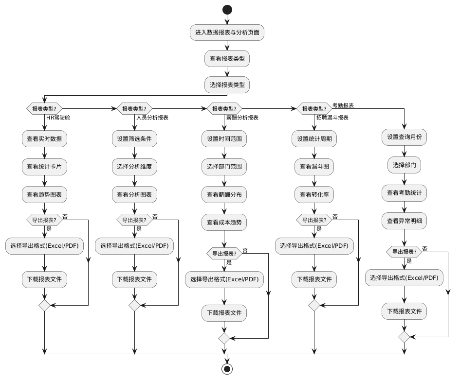

**HR驾驶舱查看流程：**
1. 用户进入数据报表与分析页面
2. 系统默认展示HR驾驶舱
3. 用户查看实时统计数据（在职人数、离职率、招聘进度、出勤率等）
4. 用户查看统计卡片和趋势图表
5. 如需导出，点击【导出报表】按钮，选择导出格式（Excel/PDF），下载报表文件

**人员分析报表查看流程：**
1. 用户点击【人员分析报表】标签
2. 用户设置筛选条件（部门、职级、入职时间等）
3. 用户选择分析维度（司龄分布、学历分布、部门人员构成等）
4. 系统展示分析图表（柱状图、饼图、折线图等）
5. 如需导出，点击【导出报表】按钮，选择导出格式，下载报表文件

**薪酬分析报表查看流程：**
1. 用户点击【薪酬分析报表】标签
2. 用户设置时间范围（月度、季度、年度）
3. 用户选择部门范围（全公司或指定部门）
4. 系统展示薪酬分布图和人力成本趋势图
5. 如需导出，点击【导出报表】按钮，选择导出格式，下载报表文件

**招聘漏斗报表查看流程：**
1. 用户点击【招聘漏斗报表】标签
2. 用户设置统计周期（本月、本季度、本年度、自定义时间段）；系统自动匹配上一周期用于环比（本月 → 上月，本季度 → 上季度，本年度 → 去年），并可切换同比对照（去年同期）
3. 用户可选设置部门范围（全公司 / 指定部门多选）
4. 系统顶部展示**核心 KPI 带环比箭头**（6 张卡片：本期入职人数、总转化率、平均招聘周期、Offer 接受率、需求完成率、单人招聘成本 CPH；每张卡片右上角显示 ↑x% 或 ↓x% 与上周期对比，绿升红降）
5. 系统中部展示**双周期漏斗对比**（本期漏斗 + 上期漏斗并排或叠加展示；5 阶段：投递 → 初筛 → 面试 → Offer → 入职；每阶段标注转化率及其变化）
6. 系统下部展示**近 6 个月月度趋势**（月度入职数 + 月度招聘完成率双折线图）
7. 系统下部展示**渠道贡献 TOP5 饼图**（仅显示入职数前 5 大渠道的占比，其余归入"其他"）
8. 页面底部展示**"进入招聘数据分析中心 →"引导卡片**，列出深度能力入口（全渠道 ROI / CPH 明细、面试官效率、周期分析、需求完成详情、渠道成本登记）
9. 如需导出，点击【导出报表】按钮，选择导出格式（Excel/PDF/PPT），下载报表文件；导出内容为"管理层汇报版"，聚焦核心 KPI 与趋势；如需明细数据（渠道清单、面试官清单等）请跳转至招聘数据分析中心导出 Excel

**考勤报表查看流程：**
1. 用户点击【考勤报表】标签
2. 用户设置查询月份
3. 用户选择部门（全公司或指定部门）
4. 系统展示考勤统计（出勤天数、迟到次数、早退次数、缺勤次数、加班时长等）
5. 系统展示考勤异常明细列表
6. 如需导出，点击【导出报表】按钮，选择导出格式，下载报表文件

##### （三）功能设计

**系统交互时序：**

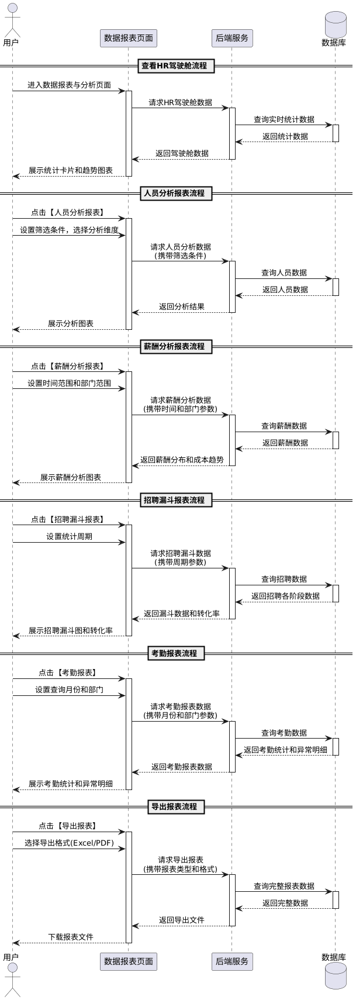

**核心功能：**

- **HR驾驶舱**：展示企业人力资源核心指标的实时统计数据，包括在职人数、离职率、招聘进度、出勤率、人力成本等关键指标，通过统计卡片和趋势图表直观呈现
- **人员分析报表**：提供多维度的人员数据分析，支持按部门、职级、入职时间等条件筛选，展示司龄分布、学历分布、年龄分布、性别比例、部门人员构成等分析图表
- **薪酬分析报表**：分析企业薪酬结构和人力成本趋势，支持按时间范围和部门范围筛选，展示薪酬带宽分布、薪酬结构占比、人力成本趋势等图表
- **招聘漏斗报表**：面向管理层的招聘业务月度体检报告，以"本期 vs 上期"对比视角呈现核心指标；包含 5 个模块：
  1. **核心 KPI 带环比**（6 张卡片：本期入职人数、总转化率、平均招聘周期、Offer 接受率、需求完成率、单人招聘成本 CPH，每张卡片显示与上周期的环比变化箭头）
  2. **双周期漏斗对比**（本期 + 上期 5 阶段漏斗并排展示，快速定位瓶颈变化）
  3. **月度趋势**（近 6 个月月度入职数 + 月度招聘完成率双折线图，观察节奏稳定性和季节性）
  4. **渠道贡献 TOP5 饼图**（只显示前 5 大渠道的入职占比，避免信息过载）
  5. **招聘数据分析中心引流入口**（页面底部的跳转卡片，引导管理层深入钻取）
  - **明确不做**：多维度钻取、面试官明细、渠道明细表、需求明细列表、渠道成本登记 CRUD（以上能力由第十一章 11.3.6 招聘数据分析提供）
- **考勤报表**：统计员工考勤数据，包括出勤天数、迟到次数、早退次数、缺勤次数、加班时长等，支持按月份和部门查询，展示考勤异常明细
- **报表导出**：支持将报表数据导出为Excel或PDF格式，方便离线查看和分享
- **数据刷新**：支持手动刷新数据，确保查看的是最新数据
- **时间范围选择**：支持选择不同的时间范围（日、周、月、季度、年度、自定义时间段）进行数据分析
- **部门筛选**：支持选择全公司或指定部门进行数据分析
- **图表类型切换**：支持在柱状图、折线图、饼图、漏斗图等不同图表类型之间切换

**数据字段：**

**HR驾驶舱统计指标：**

| 字段名称 | 字段类型 | 长度限制 | 是否必填 | 说明 |
|---------|---------|---------|---------|------|
| 在职人数 | 数字 | - | 是 | 当前在职员工总数 |
| 离职率 | 百分比 | - | 是 | 本月/本季度/本年度离职率 |
| 招聘进度 | 百分比 | - | 是 | 招聘计划完成进度 |
| 出勤率 | 百分比 | - | 是 | 本月平均出勤率 |
| 人力成本 | 金额 | - | 是 | 本月/本季度/本年度人力成本总额 |
| 新增人数 | 数字 | - | 是 | 本月/本季度/本年度新增员工数 |
| 离职人数 | 数字 | - | 是 | 本月/本季度/本年度离职员工数 |
| 平均司龄 | 数字 | - | 是 | 全员平均司龄（年） |

**人员分析报表字段：**

| 字段名称 | 字段类型 | 长度限制 | 是否必填 | 说明 |
|---------|---------|---------|---------|------|
| 分析维度 | 下拉选择 | - | 是 | 司龄分布/学历分布/年龄分布/性别比例/部门人员构成 |
| 筛选部门 | 下拉选择 | - | 否 | 选择分析的部门范围 |
| 筛选职级 | 下拉选择 | - | 否 | 选择分析的职级范围 |
| 入职时间范围 | 日期范围 | - | 否 | 选择入职时间范围 |
| 统计数据 | 数字 | - | 是 | 各维度的统计数据 |

**薪酬分析报表字段：**

| 字段名称 | 字段类型 | 长度限制 | 是否必填 | 说明 |
|---------|---------|---------|---------|------|
| 时间范围 | 下拉选择 | - | 是 | 本月/本季度/本年度/自定义 |
| 部门范围 | 下拉选择 | - | 是 | 全公司/指定部门 |
| 薪酬总额 | 金额 | - | 是 | 选定范围内的薪酬总额 |
| 平均薪酬 | 金额 | - | 是 | 选定范围内的平均薪酬 |
| 薪酬中位数 | 金额 | - | 是 | 选定范围内的薪酬中位数 |
| 薪酬分布 | 图表数据 | - | 是 | 不同薪酬区间的人数分布 |
| 成本趋势 | 图表数据 | - | 是 | 人力成本随时间的变化趋势 |

**招聘漏斗报表字段：**

*筛选条件：*

| 字段名称 | 字段类型 | 长度限制 | 是否必填 | 说明 |
|---------|---------|---------|---------|------|
| 统计周期 | 下拉选择 | - | 是 | 本月/本季度/本年度/自定义时间段 |
| 对比模式 | 下拉选择 | - | 是 | 环比（上周期）/ 同比（去年同期）；默认环比 |
| 部门范围 | 多选下拉 | - | 否 | 全公司 / 指定部门多选（最多 10 个）|

*核心 KPI 卡片（均需同时返回本期值与上期值，用于计算环比）：*

| 字段名称 | 字段类型 | 是否必填 | 说明 |
|---------|---------|---------|------|
| 本期入职人数 | 数字 | 是 | 当前周期实际入职人数 |
| 上期入职人数 | 数字 | 是 | 对比周期的入职人数 |
| 总转化率 | 百分比 | 是 | 入职人数 / 投递人数 × 100% |
| 平均招聘周期 | 数字（天）| 是 | 需求提出日 → 入职日的平均间隔 |
| Offer 接受率 | 百分比 | 是 | Offer 接受数 / Offer 发放数 × 100% |
| 需求完成率 | 百分比 | 是 | 已入职人数 / 需求招聘名额总数 × 100% |
| 单人招聘成本 CPH | 金额（元）| 是 | 本期渠道总投入 / 本期入职人数 |

*双周期漏斗数据（本期 + 上期各 5 阶段）：*

| 字段名称 | 字段类型 | 是否必填 | 说明 |
|---------|---------|---------|------|
| 简历投递数 | 数字 | 是 | 本期 / 上期各一个值 |
| 初筛通过数 | 数字 | 是 | 本期 / 上期各一个值 |
| 面试安排数 | 数字 | 是 | 本期 / 上期各一个值 |
| Offer 发放数 | 数字 | 是 | 本期 / 上期各一个值 |
| 入职确认数 | 数字 | 是 | 本期 / 上期各一个值 |
| 各阶段转化率 | 百分比 | 是 | 本期 / 上期各一个值，供对比 |

*月度趋势数据（近 6 个月）：*

| 字段名称 | 字段类型 | 是否必填 | 说明 |
|---------|---------|---------|------|
| 月份 | 字符串 | 是 | 格式 YYYY-MM |
| 月度入职数 | 数字 | 是 | 当月实际入职人数 |
| 月度招聘完成率 | 百分比 | 是 | 当月入职数 / 当月需求名额 × 100% |

*渠道贡献 TOP5：*

| 字段名称 | 字段类型 | 是否必填 | 说明 |
|---------|---------|---------|------|
| 渠道名称 | 字符串 | 是 | 前 5 大渠道名称（如 Boss直聘、猎聘、内推）|
| 入职人数 | 数字 | 是 | 该渠道本期入职人数 |
| 占比 | 百分比 | 是 | 该渠道入职数 / 本期总入职数 × 100% |
| 其他 | 聚合项 | 否 | 除 TOP5 外所有渠道合并展示为"其他"|

**考勤报表字段：**

| 字段名称 | 字段类型 | 长度限制 | 是否必填 | 说明 |
|---------|---------|---------|---------|------|
| 查询月份 | 月份选择 | - | 是 | 选择查询的月份 |
| 部门范围 | 下拉选择 | - | 是 | 全公司/指定部门 |
| 应出勤天数 | 数字 | - | 是 | 选定范围内的应出勤天数 |
| 实际出勤天数 | 数字 | - | 是 | 选定范围内的实际出勤天数 |
| 迟到次数 | 数字 | - | 是 | 选定范围内的迟到总次数 |
| 早退次数 | 数字 | - | 是 | 选定范围内的早退总次数 |
| 缺勤次数 | 数字 | - | 是 | 选定范围内的缺勤总次数 |
| 加班时长 | 数字 | - | 是 | 选定范围内的加班总时长（小时） |
| 出勤率 | 百分比 | - | 是 | 实际出勤天数/应出勤天数 |
| 异常明细 | 列表 | - | 是 | 考勤异常记录列表（员工姓名、异常类型、异常日期、异常说明） |

**业务规则：**

| 规则编号 | 规则描述 |
|---------|---------|
| RPT-001 | HR驾驶舱数据每小时自动刷新一次，确保数据实时性 |
| RPT-002 | 离职率计算公式：离职人数 / (期初人数 + 期末人数) / 2 × 100% |
| RPT-003 | 出勤率计算公式：实际出勤天数 / 应出勤天数 × 100% |
| RPT-004 | 人员分析报表支持多维度交叉分析，最多支持3个维度同时分析 |
| RPT-005 | 薪酬分析报表中的薪酬数据脱敏显示，只有HR总监及以上权限可查看明细 |
| RPT-006 | 招聘漏斗报表的转化率保留2位小数 |
| RPT-006-1 | 招聘漏斗报表环比计算规则：本期值 ÷ 上期值 - 1，结果保留 1 位小数；上期值为 0 时显示为"—"而非计算百分比 |
| RPT-006-2 | 招聘漏斗报表同比计算规则：本期值 ÷ 去年同期值 - 1，口径与环比一致；数据不足 1 年时同比选项灰置不可选 |
| RPT-006-3 | 招聘漏斗报表环比箭头色值规则：正向指标（入职人数、总转化率、Offer 接受率、需求完成率）上升为绿色、下降为红色；负向指标（平均招聘周期、CPH）上升为红色、下降为绿色 |
| RPT-006-4 | 招聘漏斗报表的业务指标定义、计算口径、数据源以第十一章 11.3.6 招聘数据分析为权威源；如出现口径不一致必须以 11.3.6 为准 |
| RPT-006-5 | 招聘漏斗报表不提供明细钻取能力（渠道清单、面试官清单、需求清单等）；用户需要明细时一律跳转至 `/recruitment/analytics` |
| RPT-006-6 | 招聘漏斗报表的"渠道贡献 TOP5"固定展示前 5 大渠道；第 6 名及以后合并为"其他"项展示 |
| RPT-006-7 | 招聘漏斗报表的月度趋势固定展示近 6 个月；如需更长时间范围请跳转至招聘数据分析中心 |
| RPT-006-8 | 招聘漏斗报表的"管理层导出版"与"招聘数据分析中心明细导出"文件名前缀区分：前者为 `招聘漏斗报表_管理层版`，后者为 `招聘数据分析_明细版`，避免混淆 |
| RPT-007 | 考勤报表的异常明细最多显示1000条记录，超过部分需导出查看 |
| RPT-008 | 报表导出为Excel格式时，包含原始数据和图表；导出为PDF格式时，只包含图表 |
| RPT-009 | 自定义时间范围最长不超过1年 |
| RPT-010 | 报表数据缓存30分钟，30分钟内重复查询相同条件的报表直接返回缓存数据 |
| RPT-011 | 部门筛选支持多选，最多选择10个部门 |
| RPT-012 | 图表数据点超过100个时，自动进行数据聚合显示 |
| RPT-013 | 报表导出文件命名格式：报表类型_时间范围_导出时间.扩展名 |
| RPT-014 | 用户只能查看自己有权限的部门数据，HR总监可查看全公司数据 |
| RPT-015 | 报表导出操作需记录操作日志，包括导出人、导出时间、导出范围 |

##### （四）业务逻辑关联

数据报表与分析模块与其他模块存在以下关联关系：

| 关联模块 | 关联说明 |
|---------|---------|
| 组织管理 | HR驾驶舱和人员分析报表的部门数据来源于组织管理模块，部门筛选基于组织架构树 |
| 员工管理 | 人员分析报表的员工数据（司龄、学历、年龄、性别等）来源于员工管理模块 |
| 考勤管理 | 考勤报表的数据来源于考勤管理模块，包括出勤记录、迟到早退记录、加班记录等 |
| 薪酬管理 | 薪酬分析报表的数据来源于薪酬管理模块，包括工资发放记录、薪酬结构数据等 |
| 招聘管理 | 招聘漏斗报表的数据来源于招聘管理模块，包括简历投递、面试安排、Offer发放、入职确认等各阶段数据；**与第十一章 11.3.6 招聘数据分析的分工边界**：本报表（第十六章）定位为"管理层一屏快照"（核心 KPI + 环比 + 双周期漏斗对比 + 月度趋势 + TOP5 渠道），仅做聚合展示与趋势对比，不做明细钻取；第十一章 11.3.6 定位为"运营人员深度分析工具"，提供全渠道 ROI 明细、面试官效率、周期分析、需求完成详情、渠道成本登记等完整能力；所有业务指标的定义、计算口径、数据源均以 11.3.6 为权威源，本报表仅复用 |
| 系统管理 | 报表的访问权限由系统管理模块的角色权限控制，报表导出操作记录在操作日志中 |
| 员工档案 | 用户账号关联员工档案，员工入职时自动创建系统账号 |
| 组织架构 | 用户账号关联组织架构，用户所属部门决定数据权限范围 |
| 审批流引擎 | 角色权限决定用户在审批流中的审批权限 |
| 考勤管理 | 数据字典维护考勤类型、假期类型等枚举值 |
| 薪酬管理 | 数据字典维护薪酬项类型、扣款项类型等枚举值 |
| 合同管理 | 通知配置用于合同到期提醒 |
| 绩效管理 | 通知配置用于绩效评估提醒、绩效面谈提醒 |

---

## 十七、系统管理

### 17.1 功能概述

系统管理模块为管理员提供系统级配置和维护功能，包括用户账号与权限管理（RBAC）、角色权限配置、数据字典维护、操作日志审计、消息通知配置、系统参数设置等核心功能。通过精细化的权限控制，确保系统安全性和数据隔离；通过数据字典管理，实现业务枚举值的灵活配置；通过操作日志审计，追溯用户操作历史，满足合规要求；通过消息通知配置，实现多渠道消息推送；通过系统参数设置，支持企业个性化配置。本模块是整个HR系统的基础支撑模块，为其他业务模块提供统一的权限控制、数据管理和系统配置服务。

**核心功能包括：**

1. **用户账号管理**：创建、编辑、禁用/启用用户账号，分配用户角色
2. **角色权限管理**：创建角色，配置菜单权限、按钮权限、数据权限
3. **数据字典管理**：维护系统枚举值和业务字典数据
4. **操作日志审计**：记录和查询用户操作历史，支持日志导出
5. **消息通知配置**：配置通知场景、通知渠道、通知模板
6. **系统参数设置**：配置公司信息、业务规则参数、第三方集成参数

### 17.2 页面访问权限

| 功能模块 | 超级管理员 | HR管理员 | 部门负责人 | 普通员工 |
|---------|-----------|---------|-----------|---------|
| 用户账号管理 | ✓ | ✗ | ✗ | ✗ |
| 角色权限管理 | ✓ | ✗ | ✗ | ✗ |
| 数据字典管理 | ✓ | ✗ | ✗ | ✗ |
| 操作日志审计 | ✓ | ✓（仅查看） | ✗ | ✗ |
| 消息通知配置 | ✓ | ✓ | ✗ | ✗ |
| 系统参数设置 | ✓ | ✗ | ✗ | ✗ |

### 17.3 功能详细设计

#### 17.3.1 用户账号管理

##### （一）功能需求概述

用户账号管理为系统管理员提供用户账号的全生命周期管理功能，包括创建用户、编辑用户信息、分配角色、禁用/启用账号等操作。

##### （二）用户操作流程

系统管理的用户操作流程如下图所示：

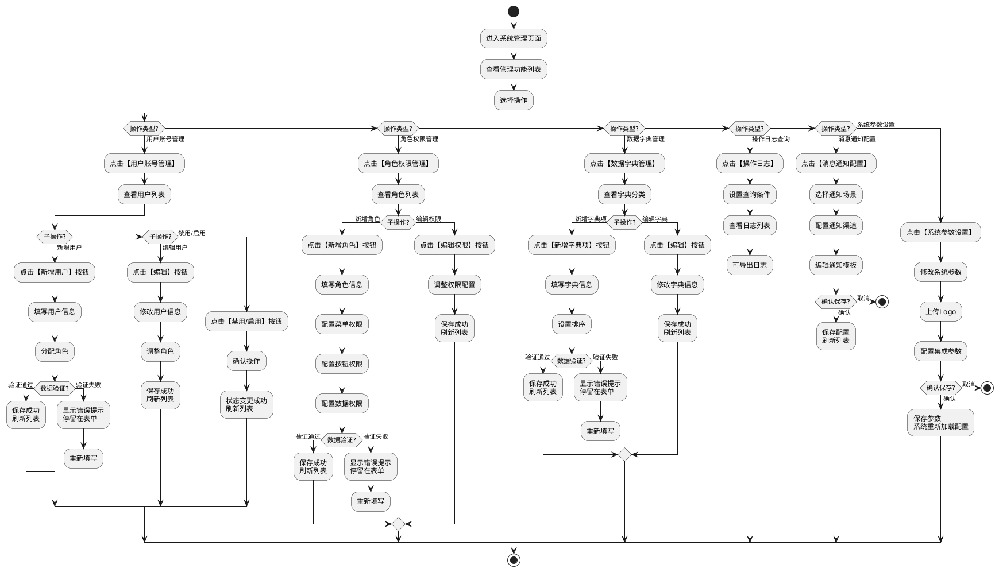

**主要操作流程说明：**

1. **用户账号管理流程**：
   - 管理员进入用户账号管理页面，查看用户列表
   - 新增用户：点击【新增用户】按钮，填写用户信息（用户名、姓名、手机号、邮箱等），分配角色，保存成功后刷新列表
   - 编辑用户：点击【编辑】按钮，修改用户信息或调整角色，保存成功后刷新列表
   - 禁用/启用用户：点击【禁用/启用】按钮，确认操作后状态变更成功，刷新列表

2. **角色权限管理流程**：
   - 管理员进入角色权限管理页面，查看角色列表
   - 新增角色：点击【新增角色】按钮，填写角色信息（角色名称、角色描述），配置菜单权限、按钮权限、数据权限，保存成功后刷新列表
   - 编辑权限：点击【编辑权限】按钮，调整权限配置（勾选/取消勾选权限树节点），保存成功后刷新列表

3. **数据字典管理流程**：
   - 管理员进入数据字典管理页面，查看字典分类列表
   - 选择分类后查看字典项列表
   - 新增字典项：点击【新增字典项】按钮，填写字典信息（字典标签、字典值、排序等），保存成功后刷新列表
   - 编辑字典：点击【编辑】按钮，修改字典信息，保存成功后刷新列表

4. **操作日志查询流程**：
   - 管理员进入操作日志页面，设置查询条件（操作人、操作模块、操作时间范围等）
   - 系统展示日志列表，支持查看详细操作内容
   - 点击【导出日志】按钮，系统生成Excel文件并下载

5. **消息通知配置流程**：
   - 管理员进入消息通知配置页面，查看当前通知配置
   - 选择通知场景（如入职提醒、合同到期提醒、考勤异常提醒等）
   - 配置通知渠道（邮件、短信、企业微信、钉钉）
   - 编辑通知模板（标题、内容、变量占位符）
   - 点击【保存】按钮，确认后保存配置，显示成功提示

6. **系统参数设置流程**：
   - 管理员进入系统参数设置页面，查看当前系统参数
   - 修改基础参数（公司名称、Logo、时区、语言等）
   - 上传Logo图片
   - 配置集成参数（第三方平台对接参数）
   - 点击【保存】按钮，确认后保存参数，系统重新加载配置，显示成功提示

##### （三）功能设计

###### 1. 系统交互时序

系统管理的系统交互时序如下图所示：

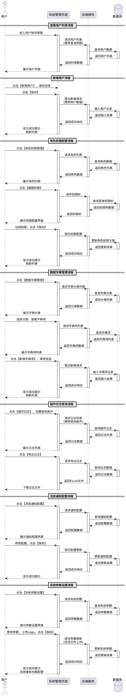

**主要交互流程：**

1. **查看用户列表流程**：用户进入用户账号管理页面，系统查询数据库返回用户列表，支持按用户名、角色、状态等条件筛选

2. **新增用户流程**：用户填写用户信息并提交，系统插入用户记录到数据库，返回成功响应，前端显示成功提示并刷新列表

3. **角色权限配置流程**：用户点击【编辑权限】按钮，系统查询权限树数据并返回，用户勾选权限并提交，系统更新角色权限关联，返回成功响应

4. **数据字典管理流程**：用户选择字典分类，系统查询字典项列表并返回；用户新增或编辑字典项，系统插入或更新字典项记录，返回成功响应

5. **操作日志查询流程**：用户设置查询条件并提交，系统查询操作日志数据并返回；用户点击【导出日志】按钮，系统查询日志数据并生成Excel文件返回

6. **消息通知配置流程**：用户进入消息通知配置页面，系统查询通知配置并返回；用户修改配置并提交，系统更新通知配置，返回成功响应

7. **系统参数设置流程**：用户进入系统参数设置页面，系统查询系统参数并返回；用户修改参数（包含文件上传）并提交，系统更新系统参数，返回成功响应，系统重新加载配置

###### 2. 核心功能

- **用户账号管理**：创建、编辑、禁用/启用用户账号，设置用户基本信息（用户名、姓名、手机号、邮箱等），分配用户角色
- **角色管理**：创建、编辑、删除、启用/禁用角色，设置角色名称和描述，支持系统预置角色和自定义角色
- **菜单权限配置**：为角色配置可访问的菜单，支持树形结构的菜单权限勾选，支持父子节点联动
- **按钮权限配置**：为角色配置页面内的按钮权限（如新增、编辑、删除、导出等），实现精细化权限控制
- **数据权限配置**：为角色配置数据范围权限（如全部数据、本部门数据、本部门及下级部门数据、仅本人数据），实现数据隔离
- **用户角色绑定**：为用户分配一个或多个角色，用户权限为所有角色权限的并集
- **密码管理**：支持用户修改密码、管理员重置用户密码、密码强度校验、密码过期提醒等功能
- **数据字典分类管理**：创建、编辑、删除字典分类，设置分类编码和名称
- **数据字典项管理**：在分类下创建、编辑、删除字典项，设置字典标签、字典值、排序、状态等
- **招聘相关字典分类（业务预置）**：为支撑第十一章招聘管理的业务需求，系统内置以下字典分类，管理员可维护字典项：
  - `recruit_reject_reason` 淘汰原因（如"学历不符"、"工作年限不足"、"薪资不匹配"、"背景调查不通过"、"综合能力不足"、"文化不匹配"、"候选人放弃"等）
  - `resume_source` 简历来源（Boss直聘、猎聘、智联招聘、前程无忧、拉勾、内推、招聘官网、主动搜寻、猎头推荐、其他）
  - `recruit_channel` 招聘渠道（与 resume_source 同步维护，用于 11.3.6 渠道 ROI 分析）
  - `referral_status` 内推状态（待处理、面试中、已Offer、已入职、试用期通过、已淘汰、已过期）
  - `background_check_status` 背调状态（待授权、已授权、进行中、已完成、已取消、异常）
  - `talent_pool_type` 人才池类型（系统预置、岗位族、事业部、招聘活动、猎头专属）
  - `interview_dimension` 面试评价维度（预置维度名称库，供面试评价模板引用）
  - `offer_reject_reason` 候选人拒绝 Offer 原因（薪资不满意、工作地点、更好的 Offer、个人原因等）
  - `onboarding_cancel_reason` 候选人入职爽约原因
- **操作日志记录**：自动记录用户的所有操作（登录、新增、修改、删除等），记录操作人、操作模块、操作类型、操作内容、操作时间、IP地址等
- **关键操作标注**：对敏感操作（如删除数据、修改权限、导出数据等）进行高亮标注，便于审计
- **日志查询**：支持按操作人、操作模块、操作类型、操作时间范围等条件查询日志
- **日志导出**：支持导出日志数据为Excel文件，用于审计和存档
- **通知场景管理**：配置系统支持的通知场景（如入职提醒、合同到期提醒、考勤异常提醒、绩效评估提醒等）
- **通知渠道配置**：为每个通知场景配置通知渠道（邮件、短信、企业微信、钉钉），支持多渠道同时推送
- **通知模板编辑**：编辑通知模板的标题和内容，支持变量占位符（如${员工姓名}、${合同到期日期}等），系统发送时自动替换
- **通知开关**：支持启用/禁用某个通知场景，灵活控制通知推送
- **测试通知**：支持对已配置的通知场景进行测试发送，验证通知配置是否正确
- **系统参数分组管理**：系统参数按分组展示（基础配置、安全配置、业务配置、集成配置），便于分类管理和配置
- **基础系统参数设置**：配置公司名称、Logo、系统标题、时区、语言、日期格式等基础参数
- **业务规则参数设置**：配置业务相关参数（如试用期默认天数、年假计算规则、加班费倍率等）
- **集成配置**：配置第三方平台对接参数（如企业微信AppID、钉钉AppKey、邮件服务器地址等）

###### 3. 字段定义

**（1）用户账号**

| 字段名称 | 字段类型 | 是否必填 | 字段说明 |
|---------|---------|---------|---------|
| 用户ID | 字符串 | 是 | 系统自动生成，唯一标识 |
| 用户名 | 字符串 | 是 | 登录账号，唯一，不可重复 |
| 姓名 | 字符串 | 是 | 用户真实姓名 |
| 手机号 | 字符串 | 是 | 用户手机号，用于登录和接收通知 |
| 邮箱 | 字符串 | 否 | 用户邮箱地址 |
| 角色 | 字符串 | 是 | 用户所属角色，关联角色表 |
| 所属部门 | 字符串 | 否 | 用户所属部门 |
| 账号状态 | 枚举 | 是 | 启用、禁用 |
| 最后登录时间 | 日期时间 | 否 | 用户最后一次登录时间 |
| 创建时间 | 日期时间 | 是 | 账号创建时间 |
| 更新时间 | 日期时间 | 是 | 账号最后更新时间 |

**（2）角色**

| 字段名称 | 字段类型 | 是否必填 | 字段说明 |
|---------|---------|---------|---------|
| 角色ID | 字符串 | 是 | 系统自动生成，唯一标识 |
| 角色名称 | 字符串 | 是 | 角色名称，如"系统管理员"、"HR专员" |
| 角色编码 | 字符串 | 是 | 角色编码，唯一，如"admin"、"hr" |
| 角色描述 | 文本 | 否 | 角色的详细描述 |
| 是否系统内置 | 枚举 | 是 | 1-系统内置，0-自定义；系统内置角色不允许删除和修改权限 |
| 数据权限范围 | 枚举 | 是 | 全部数据、本部门及下级部门、仅本部门、仅本人 |
| 角色状态 | 枚举 | 是 | 启用、禁用 |
| 创建时间 | 日期时间 | 是 | 角色创建时间 |
| 更新时间 | 日期时间 | 是 | 角色最后更新时间 |

**（3）权限**

| 字段名称 | 字段类型 | 是否必填 | 字段说明 |
|---------|---------|---------|---------|
| 权限ID | 字符串 | 是 | 系统自动生成，唯一标识 |
| 权限名称 | 字符串 | 是 | 权限名称，如"用户管理"、"查看报表" |
| 权限编码 | 字符串 | 是 | 权限编码，唯一，如"user:view"、"report:view" |
| 权限类型 | 枚举 | 是 | 菜单权限、按钮权限、数据权限 |
| 父级权限 | 字符串 | 否 | 父级权限ID，用于构建权限树 |
| 菜单路径 | 字符串 | 否 | 菜单权限对应的路由路径 |
| 排序 | 数字 | 是 | 权限显示顺序 |
| 权限状态 | 枚举 | 是 | 启用、禁用 |
| 创建时间 | 日期时间 | 是 | 权限创建时间 |
| 更新时间 | 日期时间 | 是 | 权限最后更新时间 |

**（4）数据字典**

| 字段名称 | 字段类型 | 是否必填 | 字段说明 |
|---------|---------|---------|---------|
| 字典ID | 字符串 | 是 | 系统自动生成，唯一标识 |
| 字典分类 | 字符串 | 是 | 字典分类编码，如"employee_status"、"contract_type" |
| 字典名称 | 字符串 | 是 | 字典项名称，如"在职"、"离职" |
| 字典值 | 字符串 | 是 | 字典项值，如"1"、"0" |
| 排序 | 数字 | 是 | 字典项显示顺序 |
| 字典状态 | 枚举 | 是 | 启用、禁用 |
| 备注 | 文本 | 否 | 字典项备注说明 |
| 创建时间 | 日期时间 | 是 | 字典项创建时间 |
| 更新时间 | 日期时间 | 是 | 字典项最后更新时间 |

**（5）操作日志**

| 字段名称 | 字段类型 | 是否必填 | 字段说明 |
|---------|---------|---------|---------|
| 日志ID | 字符串 | 是 | 系统自动生成，唯一标识 |
| 操作人 | 字符串 | 是 | 操作人用户名 |
| 操作模块 | 字符串 | 是 | 操作的功能模块，如"用户管理"、"角色管理" |
| 操作类型 | 枚举 | 是 | 新增、修改、删除、查询、登录、登出 |
| 操作内容 | 文本 | 是 | 操作的详细内容描述 |
| 请求参数 | 文本 | 否 | 请求的参数信息（JSON格式） |
| IP地址 | 字符串 | 是 | 操作人的IP地址 |
| 操作时间 | 日期时间 | 是 | 操作发生时间 |
| 执行时长 | 数字 | 否 | 操作执行时长（毫秒） |
| 操作结果 | 枚举 | 是 | 成功、失败 |
| 错误信息 | 文本 | 否 | 操作失败时的错误信息 |

**（6）通知配置**

| 字段名称 | 字段类型 | 是否必填 | 字段说明 |
|---------|---------|---------|---------|
| 配置ID | 字符串 | 是 | 系统自动生成，唯一标识 |
| 通知场景 | 字符串 | 是 | 通知场景编码，如"contract_expire"、"leave_approve" |
| 场景名称 | 字符串 | 是 | 通知场景名称，如"合同到期提醒"、"请假审批通知" |
| 通知渠道 | 枚举 | 是 | 站内信、邮件、短信、企业微信、钉钉 |
| 通知模板 | 文本 | 是 | 通知内容模板，支持变量替换 |
| 提前天数 | 数字 | 否 | 提前通知天数（用于到期提醒类场景） |
| 是否启用 | 枚举 | 是 | 启用、禁用 |
| 创建时间 | 日期时间 | 是 | 配置创建时间 |
| 更新时间 | 日期时间 | 是 | 配置最后更新时间 |

**（7）系统参数**

| 字段名称 | 字段类型 | 是否必填 | 字段说明 |
|---------|---------|---------|---------|
| 参数ID | 字符串 | 是 | 系统自动生成，唯一标识 |
| 参数名称 | 字符串 | 是 | 参数名称，如"系统名称"、"Logo地址" |
| 参数编码 | 字符串 | 是 | 参数编码，唯一，如"system_name"、"logo_url" |
| 参数值 | 字符串 | 是 | 参数值（文件类型时存储文件URL） |
| 参数类型 | 枚举 | 是 | 文本、数字、布尔、文件 |
| 参数分组 | 字符串 | 是 | 参数分组，如"基础配置"、"集成配置" |
| 参数描述 | 文本 | 否 | 参数的详细描述 |
| 创建时间 | 日期时间 | 是 | 参数创建时间 |
| 更新时间 | 日期时间 | 是 | 参数最后更新时间 |

###### 4. 业务规则

| 规则编号 | 规则描述 |
|---------|---------|
| SYS-001 | 用户名必须唯一，不可重复，长度为4-20个字符 |
| SYS-002 | 用户密码必须包含大小写字母、数字和特殊字符，长度不少于8位 |
| SYS-003 | 用户连续登录失败5次后，账号自动锁定30分钟 |
| SYS-004 | 用户密码90天未修改时，系统强制要求修改密码 |
| SYS-005 | 角色删除前需检查是否有用户关联，有关联用户的角色不允许删除；系统预置角色（如超级管理员、普通员工）不允许删除 |
| SYS-006 | 角色权限修改后，已登录用户需重新登录后权限才生效 |
| SYS-007 | 系统内置角色（如超级管理员）不允许删除和修改权限 |
| SYS-008 | 数据字典分类编码必须唯一，同一分类下的字典值不可重复 |
| SYS-009 | 操作日志保留365天，超过保留期的日志自动归档或删除 |
| SYS-010 | 敏感操作（如删除、修改权限）必须记录详细的操作日志 |
| SYS-011 | 通知模板支持变量替换，变量格式为${变量名}，如${userName}、${expireDate} |
| SYS-012 | 通知发送失败时，系统自动重试3次，重试间隔为5分钟 |
| SYS-013 | 系统参数修改后立即生效，部分参数（如Logo）需刷新页面后生效 |
| SYS-014 | 系统Logo支持上传PNG、JPG格式，文件大小不超过2MB |
| SYS-015 | 系统参数的修改操作需记录操作日志，包括修改前后的值 |

##### （四）业务逻辑关联

系统管理与其他模块存在以下关联关系：

| 关联模块 | 关联说明 |
|---------|---------|
| 所有模块 | 用户账号和角色权限是所有模块的基础，控制用户对各模块的访问权限 |

## 十八、技术方案

### 18.1 技术架构

#### 18.1.1 整体架构

本系统采用前后端分离的B/S架构，基于微服务架构设计，确保系统的高可用性、可扩展性和可维护性。

**架构层次：**

1. **前端展示层**：基于Vue 3 + Element Plus构建的单页面应用（SPA），提供响应式用户界面
2. **API网关层**：统一入口，负责请求路由、负载均衡、认证鉴权、限流熔断
3. **业务服务层**：按业务模块拆分的微服务，包括组织管理服务、员工管理服务、考勤服务、薪酬服务等
4. **数据访问层**：ORM框架封装数据库操作，支持读写分离和分库分表
5. **基础设施层**：包括缓存、消息队列、文件存储、日志监控等基础服务

#### 18.1.2 技术选型

**前端技术栈：**

| 技术 | 版本 | 说明 |
|------|------|------|
| Vue.js | 3.5+ | 渐进式JavaScript框架 |
| TypeScript | 5.0+ | JavaScript的超集，提供类型安全 |
| Element Plus | 2.11+ | 基于Vue 3的UI组件库 |
| Pinia | 3.0+ | Vue 3官方推荐的状态管理库 |
| Vue Router | 4.0+ | Vue官方路由管理器 |
| Axios | 1.6+ | HTTP客户端 |
| Vite | 7.1+ | 新一代前端构建工具 |

**后端技术栈：**

| 技术 | 版本 | 说明 |
|------|------|------|
| Spring Boot | 3.2+ | Java微服务开发框架 |
| Spring Cloud | 2023.0+ | 微服务治理框架 |
| MyBatis Plus | 3.5+ | MyBatis增强工具 |
| MySQL | 8.0+ | 关系型数据库 |
| Redis | 7.0+ | 缓存和会话存储 |
| RabbitMQ | 3.12+ | 消息队列 |
| Elasticsearch | 8.0+ | 全文搜索引擎 |
| MinIO | RELEASE.2024+ | 对象存储服务 |

**基础设施：**

| 技术 | 版本 | 说明 |
|------|------|------|
| Docker | 24.0+ | 容器化部署 |
| Kubernetes | 1.28+ | 容器编排平台 |
| Nginx | 1.24+ | 反向代理和负载均衡 |
| Jenkins | 2.400+ | CI/CD工具 |
| Prometheus | 2.45+ | 监控告警系统 |
| Grafana | 10.0+ | 数据可视化平台 |
| ELK Stack | 8.0+ | 日志收集和分析 |

### 18.2 数据库设计

#### 18.2.1 数据库选型

- **主数据库**：MySQL 8.0+，存储核心业务数据
- **缓存数据库**：Redis 7.0+，存储会话、缓存、分布式锁
- **搜索引擎**：Elasticsearch 8.0+，存储员工档案、全文搜索
- **文件存储**：MinIO，存储员工照片、证件扫描件、附件

#### 18.2.2 数据库设计原则

1. **规范化设计**：遵循第三范式，减少数据冗余
2. **适度反规范化**：对于高频查询的字段，适当冗余以提升性能
3. **分库分表**：按业务模块垂直拆分，按数据量水平拆分
4. **读写分离**：主库写入，从库读取，提升并发能力
5. **软删除**：重要数据采用软删除，保留历史记录
6. **审计字段**：所有表包含创建时间、创建人、更新时间、更新人字段

### 18.3 接口设计

#### 18.3.1 接口规范

**RESTful API设计原则：**

1. **资源命名**：使用名词复数形式，如 `/api/employees`、`/api/departments`
2. **HTTP方法**：GET（查询）、POST（新增）、PUT（更新）、DELETE（删除）
3. **状态码**：200（成功）、201（创建成功）、400（参数错误）、401（未认证）、403（无权限）、404（资源不存在）、500（服务器错误）
4. **统一响应格式**：
   ```json
   {
     "code": 200,
     "message": "success",
     "data": {},
     "timestamp": 1712131200000
   }
   ```

#### 18.3.2 接口安全

1. **认证机制**：JWT Token认证，Token有效期2小时，支持刷新Token
2. **权限控制**：基于RBAC的权限模型，接口级别的权限校验
3. **数据加密**：敏感数据（密码、身份证号）采用AES加密存储
4. **接口签名**：关键接口使用签名验证，防止篡改
5. **限流熔断**：接口级别的限流策略，防止恶意攻击

### 18.4 缓存设计

#### 18.4.1 缓存策略

1. **热点数据缓存**：部门树、岗位列表、数据字典等高频查询数据
2. **会话缓存**：用户登录信息、权限信息
3. **分布式锁**：防止并发操作导致的数据不一致
4. **缓存过期策略**：根据数据更新频率设置不同的过期时间（5分钟-24小时）
5. **缓存更新策略**：数据变更时主动更新缓存，避免缓存穿透

#### 18.4.2 缓存Key设计

```
# 部门树缓存
hr:dept:tree

# 员工详情缓存
hr:employee:detail:{employeeId}

# 用户权限缓存
hr:user:permission:{userId}

# 数据字典缓存
hr:dict:{dictType}
```

### 18.5 消息队列设计

#### 18.5.1 消息队列应用场景

1. **异步通知**：入职通知、离职通知、异动通知、证件到期提醒
2. **数据同步**：员工档案变更同步到考勤系统、薪酬系统
3. **日志记录**：操作日志异步写入，不影响主流程性能
4. **定时任务**：证件到期扫描、试用期到期提醒

#### 18.5.2 消息队列设计

**交换机和队列设计：**

```
# 员工管理交换机
exchange: hr.employee.exchange
  - queue: hr.employee.onboard.queue (入职通知)
  - queue: hr.employee.offboard.queue (离职通知)
  - queue: hr.employee.transfer.queue (异动通知)

# 证件管理交换机
exchange: hr.certificate.exchange
  - queue: hr.certificate.expire.queue (证件到期提醒)

# 系统通知交换机
exchange: hr.notification.exchange
  - queue: hr.notification.email.queue (邮件通知)
  - queue: hr.notification.wechat.queue (企业微信通知)
```

### 18.6 文件存储设计

#### 18.6.1 文件存储方案

采用MinIO对象存储服务，存储员工照片、证件扫描件、附件等文件。

**存储桶（Bucket）设计：**

```
# 员工照片
hr-employee-photos

# 证件扫描件
hr-certificates

# 附件文件
hr-attachments
```

#### 18.6.2 文件访问控制

1. **私有访问**：默认所有文件私有，需要通过签名URL访问
2. **临时URL**：生成有效期为1小时的临时访问URL
3. **文件大小限制**：单个文件不超过10MB
4. **文件格式限制**：图片（jpg、png、pdf），文档（doc、docx、xls、xlsx、pdf）

### 18.7 安全设计

#### 18.7.1 认证与授权

1. **单点登录（SSO）**：支持企业微信、钉钉等第三方登录
2. **多因素认证（MFA）**：敏感操作需要二次验证
3. **密码策略**：密码长度8-20位，包含大小写字母、数字、特殊字符
4. **会话管理**：会话超时自动登出，支持单设备登录或多设备登录

#### 18.7.2 数据安全

1. **数据加密**：敏感数据（身份证号、银行卡号）采用AES-256加密
2. **数据脱敏**：日志和导出数据中的敏感信息自动脱敏
3. **数据备份**：每天凌晨3点自动备份数据库，保留30天
4. **数据恢复**：支持按时间点恢复数据

#### 18.7.3 审计日志

1. **操作日志**：记录所有用户操作，包括操作人、操作时间、操作内容、IP地址
2. **登录日志**：记录登录成功和失败的日志
3. **数据变更日志**：记录关键数据的变更历史
4. **日志保留**：操作日志保留1年，登录日志保留3个月

### 18.8 性能优化

#### 18.8.1 前端性能优化

1. **代码分割**：按路由懒加载，减少首屏加载时间
2. **资源压缩**：Gzip压缩，减少传输体积
3. **CDN加速**：静态资源使用CDN加速
4. **图片优化**：图片懒加载、WebP格式、压缩

#### 18.8.2 后端性能优化

1. **数据库优化**：索引优化、SQL优化、读写分离
2. **缓存优化**：热点数据缓存、多级缓存
3. **异步处理**：耗时操作异步处理，不阻塞主流程
4. **连接池优化**：数据库连接池、Redis连接池

#### 18.8.3 性能指标

| 指标 | 目标值 |
|------|--------|
| 页面首屏加载时间 | < 2秒 |
| 接口响应时间（P95） | < 500ms |
| 接口响应时间（P99） | < 1秒 |
| 系统并发用户数 | 5000+ |
| 数据库QPS | 10000+ |
| 缓存命中率 | > 90% |

---

## 十九、非功能需求

### 19.1 性能需求

#### 19.1.1 响应时间

| 操作类型 | 响应时间要求 |
|---------|-------------|
| 页面加载 | 首屏加载时间 < 2秒 |
| 列表查询 | < 500ms |
| 详情查询 | < 300ms |
| 数据新增 | < 1秒 |
| 数据更新 | < 1秒 |
| 数据删除 | < 500ms |
| 文件上传 | < 5秒（10MB以内） |
| 报表导出 | < 10秒（1000条数据以内） |
| 批量操作 | < 30秒（100条数据以内） |

#### 19.1.2 并发性能

| 指标 | 要求 |
|------|------|
| 并发用户数 | 支持5000+在线用户 |
| 峰值QPS | 10000+ |
| 数据库连接数 | 500+ |
| 缓存命中率 | > 90% |
| CPU使用率 | < 70%（正常情况） |
| 内存使用率 | < 80%（正常情况） |

#### 19.1.3 数据容量

| 数据类型 | 容量要求 |
|---------|---------|
| 员工档案 | 支持10万+员工数据 |
| 部门数据 | 支持1000+部门 |
| 岗位数据 | 支持5000+岗位 |
| 历史数据 | 保留5年以上 |
| 附件存储 | 支持100TB+ |
| 日志数据 | 保留1年 |

### 19.2 可用性需求

#### 19.2.1 系统可用性

| 指标 | 要求 |
|------|------|
| 系统可用性 | 99.9%（年停机时间 < 8.76小时） |
| 故障恢复时间（RTO） | < 1小时 |
| 数据恢复点（RPO） | < 15分钟 |
| 计划内维护窗口 | 每月不超过4小时 |

#### 19.2.2 容错机制

1. **服务降级**：核心服务优先保障，非核心服务可降级
2. **熔断机制**：依赖服务故障时自动熔断，避免雪崩
3. **限流保护**：接口级别的限流策略，防止过载
4. **故障转移**：主节点故障时自动切换到备节点
5. **数据备份**：每天自动备份，支持快速恢复

#### 19.2.3 监控告警

1. **系统监控**：CPU、内存、磁盘、网络等资源监控
2. **应用监控**：接口响应时间、错误率、QPS等指标监控
3. **业务监控**：关键业务指标监控（入职数、离职数、异动数等）
4. **告警机制**：异常情况自动告警（邮件、短信、企业微信）
5. **日志分析**：实时日志分析，快速定位问题

### 19.3 安全性需求

#### 19.3.1 身份认证

1. **登录认证**：用户名密码登录、企业微信登录、钉钉登录
2. **多因素认证**：敏感操作需要二次验证（短信验证码、邮箱验证码）
3. **密码策略**：
   - 密码长度8-20位
   - 包含大小写字母、数字、特殊字符
   - 密码不能与用户名相同
   - 密码90天强制更换
   - 连续5次登录失败锁定账号30分钟
4. **会话管理**：
   - 会话超时时间2小时
   - 支持单设备登录或多设备登录
   - 支持强制下线

#### 19.3.2 权限控制

1. **RBAC权限模型**：基于角色的访问控制
2. **数据权限**：按部门、按岗位、按员工级别控制数据访问范围
3. **功能权限**：按菜单、按按钮、按接口控制功能访问权限
4. **字段权限**：敏感字段（薪资、身份证号）按角色控制可见性
5. **操作权限**：查看、新增、编辑、删除、导出、审批等操作权限

#### 19.3.3 数据安全

1. **数据加密**：
   - 传输加密：HTTPS协议
   - 存储加密：敏感数据AES-256加密
   - 密码加密：BCrypt加密
2. **数据脱敏**：
   - 身份证号：显示前6位和后4位，中间用*代替
   - 手机号：显示前3位和后4位，中间用*代替
   - 银行卡号：显示后4位，其余用*代替
3. **数据备份**：
   - 每天凌晨3点自动备份
   - 备份数据保留30天
   - 支持按时间点恢复
4. **数据防泄漏**：
   - 导出数据需要审批
   - 导出数据自动添加水印
   - 导出记录可追溯

#### 19.3.4 审计日志

1. **操作日志**：记录所有用户操作，包括操作人、操作时间、操作内容、IP地址、操作结果
2. **登录日志**：记录登录成功和失败的日志，包括登录时间、IP地址、设备信息
3. **数据变更日志**：记录关键数据的变更历史，包括变更前后的值
4. **日志保留**：操作日志保留1年，登录日志保留3个月，数据变更日志永久保留

### 19.4 易用性需求

#### 19.4.1 用户界面

1. **界面风格**：简洁、现代、统一的视觉风格
2. **响应式设计**：支持PC端、平板、手机端自适应
3. **多语言支持**：支持中文、英文切换
4. **主题切换**：支持浅色主题、深色主题
5. **快捷操作**：常用功能提供快捷入口和快捷键

#### 19.4.2 操作体验

1. **操作提示**：关键操作提供明确的提示信息
2. **错误提示**：错误信息清晰、友好，提供解决建议
3. **表单验证**：实时验证，及时反馈错误信息
4. **批量操作**：支持批量导入、批量导出、批量删除
5. **搜索筛选**：支持多条件组合搜索和高级筛选

#### 19.4.3 帮助文档

1. **在线帮助**：每个页面提供在线帮助文档
2. **操作指南**：提供详细的操作指南和视频教程
3. **常见问题**：整理常见问题和解决方案
4. **新手引导**：首次使用提供新手引导

### 19.5 可维护性需求

#### 19.5.1 代码质量

1. **代码规范**：遵循统一的代码规范（ESLint、Prettier、Checkstyle）
2. **代码注释**：关键代码提供清晰的注释
3. **单元测试**：核心业务逻辑单元测试覆盖率 > 80%
4. **集成测试**：关键业务流程提供集成测试
5. **代码审查**：所有代码提交前需要代码审查

#### 19.5.2 系统监控

1. **性能监控**：实时监控系统性能指标
2. **错误监控**：自动捕获和上报系统错误
3. **业务监控**：监控关键业务指标
4. **日志管理**：集中式日志管理，支持日志查询和分析
5. **告警通知**：异常情况自动告警

#### 19.5.3 部署运维

1. **容器化部署**：基于Docker容器化部署
2. **自动化部署**：基于Jenkins的CI/CD流程
3. **灰度发布**：支持灰度发布，降低发布风险
4. **版本管理**：清晰的版本管理和版本回滚机制
5. **配置管理**：集中式配置管理，支持动态配置更新

### 19.6 兼容性需求

#### 19.6.1 浏览器兼容性

| 浏览器 | 版本要求 |
|--------|---------|
| Chrome | 最近2个主版本 |
| Firefox | 最近2个主版本 |
| Safari | 最近2个主版本 |
| Edge | 最近2个主版本 |

#### 19.6.2 操作系统兼容性

| 操作系统 | 版本要求 |
|---------|---------|
| Windows | Windows 10+ |
| macOS | macOS 11+ |
| Linux | Ubuntu 20.04+、CentOS 7+ |

#### 19.6.3 移动端兼容性

| 平台 | 版本要求 |
|------|---------|
| iOS | iOS 13+ |
| Android | Android 8.0+ |
| 微信小程序 | 支持 |
| 企业微信 | 支持 |
| 钉钉 | 支持 |

### 19.7 扩展性需求

#### 19.7.1 系统扩展

1. **水平扩展**：支持通过增加服务器节点提升系统容量
2. **垂直扩展**：支持通过升级服务器配置提升系统性能
3. **模块化设计**：业务模块独立部署，互不影响
4. **插件机制**：支持通过插件扩展系统功能
5. **API开放**：提供标准API接口，支持第三方系统集成

#### 19.7.2 数据扩展

1. **分库分表**：支持按业务模块垂直拆分，按数据量水平拆分
2. **读写分离**：支持主从复制，读写分离
3. **数据归档**：历史数据自动归档，减轻主库压力
4. **弹性存储**：支持存储容量动态扩展

### 19.8 合规性需求

#### 19.8.1 法律法规

1. **劳动法合规**：试用期、劳动合同、离职流程符合《劳动法》《劳动合同法》规定
2. **数据保护**：符合《个人信息保护法》《数据安全法》要求
3. **隐私保护**：符合《网络安全法》要求，保护员工隐私
4. **电子签名**：支持电子签名，符合《电子签名法》要求

#### 19.8.2 行业标准

1. **ISO 27001**：信息安全管理体系认证
2. **等保三级**：通过国家信息安全等级保护三级认证
3. **GDPR**：符合欧盟通用数据保护条例（如有海外业务）

---

## 二十、数据需求

### 20.1 数据字典

#### 20.1.1 组织架构相关

**部门表（t_department）**

| 字段名 | 字段类型 | 长度 | 是否必填 | 说明 |
|--------|---------|------|---------|------|
| id | BIGINT | - | 是 | 主键ID |
| dept_code | VARCHAR | 50 | 是 | 部门编码（唯一） |
| dept_name | VARCHAR | 100 | 是 | 部门名称 |
| parent_id | BIGINT | - | 否 | 父部门ID（0表示顶级部门） |
| dept_level | INT | - | 是 | 部门层级（1-顶级，2-二级...） |
| dept_type | TINYINT | - | 是 | 部门类型（1-公司，2-部门，3-小组） |
| leader_id | BIGINT | - | 否 | 部门负责人ID |
| headcount | INT | - | 是 | 编制人数 |
| actual_count | INT | - | 是 | 实际人数 |
| sort_order | INT | - | 是 | 排序号 |
| status | TINYINT | - | 是 | 状态（1-正常，0-停用） |
| create_time | DATETIME | - | 是 | 创建时间 |
| update_time | DATETIME | - | 是 | 更新时间 |
| create_by | BIGINT | - | 是 | 创建人ID |
| update_by | BIGINT | - | 是 | 更新人ID |
| is_deleted | TINYINT | - | 是 | 是否删除（0-否，1-是） |

**岗位表（t_position）**

| 字段名 | 字段类型 | 长度 | 是否必填 | 说明 |
|--------|---------|------|---------|------|
| id | BIGINT | - | 是 | 主键ID |
| position_code | VARCHAR | 50 | 是 | 岗位编码（唯一） |
| position_name | VARCHAR | 100 | 是 | 岗位名称 |
| dept_id | BIGINT | - | 是 | 所属部门ID |
| position_level | VARCHAR | 50 | 是 | 岗位级别（P1-P10） |
| position_category | VARCHAR | 50 | 是 | 岗位类别（技术/产品/运营等） |
| job_description | TEXT | - | 否 | 岗位职责 |
| job_requirements | TEXT | - | 否 | 任职要求 |
| headcount | INT | - | 是 | 编制人数 |
| actual_count | INT | - | 是 | 实际人数 |
| salary_range_min | DECIMAL | 10,2 | 否 | 薪资范围下限 |
| salary_range_max | DECIMAL | 10,2 | 否 | 薪资范围上限 |
| status | TINYINT | - | 是 | 状态（1-正常，0-停用） |
| create_time | DATETIME | - | 是 | 创建时间 |
| update_time | DATETIME | - | 是 | 更新时间 |
| create_by | BIGINT | - | 是 | 创建人ID |
| update_by | BIGINT | - | 是 | 更新人ID |
| is_deleted | TINYINT | - | 是 | 是否删除（0-否，1-是） |

#### 20.1.2 员工档案相关

**员工基本信息表（t_employee）**

| 字段名 | 字段类型 | 长度 | 是否必填 | 说明 |
|--------|---------|------|---------|------|
| id | BIGINT | - | 是 | 主键ID |
| employee_no | VARCHAR | 50 | 是 | 工号（唯一） |
| name | VARCHAR | 50 | 是 | 姓名 |
| name_en | VARCHAR | 100 | 否 | 英文名 |
| gender | TINYINT | - | 是 | 性别（1-男，2-女） |
| birth_date | DATE | - | 是 | 出生日期 |
| id_card_no | VARCHAR | 18 | 是 | 身份证号（唯一） |
| phone | VARCHAR | 20 | 是 | 手机号码 |
| email | VARCHAR | 100 | 是 | 邮箱地址 |
| dept_id | BIGINT | - | 是 | 所属部门ID |
| position_id | BIGINT | - | 是 | 岗位ID |
| employee_type | TINYINT | - | 是 | 员工类型（1-正式，2-试用，3-实习，4-外包） |
| employee_status | TINYINT | - | 是 | 员工状态（1-在职，2-离职，3-停职） |
| entry_date | DATE | - | 是 | 入职日期 |
| probation_end_date | DATE | - | 否 | 试用期结束日期 |
| regular_date | DATE | - | 否 | 转正日期 |
| leave_date | DATE | - | 否 | 离职日期 |
| work_location | VARCHAR | 100 | 否 | 工作地点 |
| emergency_contact | VARCHAR | 50 | 否 | 紧急联系人 |
| emergency_phone | VARCHAR | 20 | 否 | 紧急联系电话 |
| avatar_url | VARCHAR | 255 | 否 | 头像URL |
| create_time | DATETIME | - | 是 | 创建时间 |
| update_time | DATETIME | - | 是 | 更新时间 |
| create_by | BIGINT | - | 是 | 创建人ID |
| update_by | BIGINT | - | 是 | 更新人ID |
| is_deleted | TINYINT | - | 是 | 是否删除（0-否，1-是） |

**员工教育经历表（t_employee_education）**

| 字段名 | 字段类型 | 长度 | 是否必填 | 说明 |
|--------|---------|------|---------|------|
| id | BIGINT | - | 是 | 主键ID |
| employee_id | BIGINT | - | 是 | 员工ID |
| school_name | VARCHAR | 100 | 是 | 学校名称 |
| major | VARCHAR | 100 | 是 | 专业 |
| education_level | VARCHAR | 20 | 是 | 学历（高中/大专/本科/硕士/博士） |
| degree | VARCHAR | 20 | 否 | 学位（学士/硕士/博士） |
| start_date | DATE | - | 是 | 开始日期 |
| end_date | DATE | - | 是 | 结束日期 |
| is_highest | TINYINT | - | 是 | 是否最高学历（0-否，1-是） |
| certificate_url | VARCHAR | 255 | 否 | 学历证书URL |
| create_time | DATETIME | - | 是 | 创建时间 |
| update_time | DATETIME | - | 是 | 更新时间 |

**员工工作经历表（t_employee_work_experience）**

| 字段名 | 字段类型 | 长度 | 是否必填 | 说明 |
|--------|---------|------|---------|------|
| id | BIGINT | - | 是 | 主键ID |
| employee_id | BIGINT | - | 是 | 员工ID |
| company_name | VARCHAR | 100 | 是 | 公司名称 |
| position_name | VARCHAR | 100 | 是 | 职位名称 |
| start_date | DATE | - | 是 | 开始日期 |
| end_date | DATE | - | 否 | 结束日期（在职为空） |
| job_description | TEXT | - | 否 | 工作内容 |
| leave_reason | VARCHAR | 200 | 否 | 离职原因 |
| create_time | DATETIME | - | 是 | 创建时间 |
| update_time | DATETIME | - | 是 | 更新时间 |

#### 20.1.3 入职离职相关

**入职申请表（t_onboard_application）**

| 字段名 | 字段类型 | 长度 | 是否必填 | 说明 |
|--------|---------|------|---------|------|
| id | BIGINT | - | 是 | 主键ID |
| application_no | VARCHAR | 50 | 是 | 申请单号（唯一） |
| applicant_name | VARCHAR | 50 | 是 | 应聘者姓名 |
| applicant_phone | VARCHAR | 20 | 是 | 应聘者手机 |
| applicant_email | VARCHAR | 100 | 是 | 应聘者邮箱 |
| dept_id | BIGINT | - | 是 | 入职部门ID |
| position_id | BIGINT | - | 是 | 入职岗位ID |
| expected_entry_date | DATE | - | 是 | 预计入职日期 |
| probation_months | INT | - | 是 | 试用期月数 |
| salary_offer | DECIMAL | 10,2 | 是 | 薪资待遇 |
| application_status | TINYINT | - | 是 | 申请状态（1-待审批，2-已通过，3-已拒绝，4-已撤销） |
| approval_flow_id | BIGINT | - | 否 | 审批流程ID |
| create_time | DATETIME | - | 是 | 创建时间 |
| update_time | DATETIME | - | 是 | 更新时间 |
| create_by | BIGINT | - | 是 | 创建人ID |
| update_by | BIGINT | - | 是 | 更新人ID |

**离职申请表（t_offboard_application）**

| 字段名 | 字段类型 | 长度 | 是否必填 | 说明 |
|--------|---------|------|---------|------|
| id | BIGINT | - | 是 | 主键ID |
| application_no | VARCHAR | 50 | 是 | 申请单号（唯一） |
| employee_id | BIGINT | - | 是 | 员工ID |
| leave_type | TINYINT | - | 是 | 离职类型（1-主动离职，2-被动离职，3-协商离职，4-退休） |
| leave_reason | VARCHAR | 500 | 是 | 离职原因 |
| expected_leave_date | DATE | - | 是 | 预计离职日期 |
| actual_leave_date | DATE | - | 否 | 实际离职日期 |
| handover_status | TINYINT | - | 是 | 交接状态（1-未开始，2-进行中，3-已完成） |
| application_status | TINYINT | - | 是 | 申请状态（1-待审批，2-已通过，3-已拒绝，4-已撤销） |
| approval_flow_id | BIGINT | - | 否 | 审批流程ID |
| create_time | DATETIME | - | 是 | 创建时间 |
| update_time | DATETIME | - | 是 | 更新时间 |
| create_by | BIGINT | - | 是 | 创建人ID |
| update_by | BIGINT | - | 是 | 更新人ID |

#### 20.1.4 证件管理相关

**员工证件表（t_employee_certificate）**

| 字段名 | 字段类型 | 长度 | 是否必填 | 说明 |
|--------|---------|------|---------|------|
| id | BIGINT | - | 是 | 主键ID |
| employee_id | BIGINT | - | 是 | 员工ID |
| certificate_type | VARCHAR | 50 | 是 | 证件类型（身份证/护照/驾驶证/资格证书等） |
| certificate_no | VARCHAR | 100 | 是 | 证件号码 |
| issue_date | DATE | - | 是 | 发证日期 |
| expiry_date | DATE | - | 否 | 到期日期（永久有效为空） |
| issuing_authority | VARCHAR | 100 | 否 | 发证机关 |
| certificate_url | VARCHAR | 255 | 否 | 证件扫描件URL |
| status | TINYINT | - | 是 | 状态（1-有效，2-即将到期，3-已过期） |
| reminder_days | INT | - | 是 | 提前提醒天数 |
| create_time | DATETIME | - | 是 | 创建时间 |
| update_time | DATETIME | - | 是 | 更新时间 |

**证件到期提醒表（t_certificate_reminder）**

| 字段名 | 字段类型 | 长度 | 是否必填 | 说明 |
|--------|---------|------|---------|------|
| id | BIGINT | - | 是 | 主键ID |
| certificate_id | BIGINT | - | 是 | 证件ID |
| employee_id | BIGINT | - | 是 | 员工ID |
| reminder_date | DATE | - | 是 | 提醒日期 |
| reminder_type | TINYINT | - | 是 | 提醒类型（1-90天，2-60天，3-30天，4-15天，5-7天，6-3天，7-当天） |
| reminder_status | TINYINT | - | 是 | 提醒状态（1-待处理，2-已联系，3-已更新，4-已延期） |
| contact_time | DATETIME | - | 否 | 联系时间 |
| contact_by | BIGINT | - | 否 | 联系人ID |
| create_time | DATETIME | - | 是 | 创建时间 |
| update_time | DATETIME | - | 是 | 更新时间 |

### 20.2 数据库设计

#### 20.2.1 数据库架构

**主库（Master）**
- 承担所有写操作和实时读操作
- 数据库引擎：MySQL 8.0+
- 存储引擎：InnoDB
- 字符集：utf8mb4
- 排序规则：utf8mb4_unicode_ci

**从库（Slave）**
- 承担非实时读操作和报表查询
- 主从复制延迟：< 1秒
- 读写分离比例：读80%，写20%

**分库分表策略**
- 按业务模块垂直拆分：组织模块、员工模块、考勤模块、薪酬模块
- 按数据量水平拆分：员工档案表按员工ID取模分表（预留8张表）
- 历史数据归档：超过3年的数据归档到历史库

#### 20.2.2 索引设计

**部门表索引**
```sql
-- 主键索引
PRIMARY KEY (id)
-- 唯一索引
UNIQUE KEY uk_dept_code (dept_code)
-- 普通索引
KEY idx_parent_id (parent_id)
KEY idx_leader_id (leader_id)
KEY idx_status (status)
KEY idx_create_time (create_time)
```

**员工表索引**
```sql
-- 主键索引
PRIMARY KEY (id)
-- 唯一索引
UNIQUE KEY uk_employee_no (employee_no)
UNIQUE KEY uk_id_card_no (id_card_no)
-- 普通索引
KEY idx_dept_id (dept_id)
KEY idx_position_id (position_id)
KEY idx_employee_status (employee_status)
KEY idx_entry_date (entry_date)
KEY idx_phone (phone)
KEY idx_email (email)
-- 联合索引
KEY idx_dept_status (dept_id, employee_status)
KEY idx_name_phone (name, phone)
```

**证件表索引**
```sql
-- 主键索引
PRIMARY KEY (id)
-- 普通索引
KEY idx_employee_id (employee_id)
KEY idx_expiry_date (expiry_date)
KEY idx_status (status)
-- 联合索引
KEY idx_employee_type (employee_id, certificate_type)
KEY idx_expiry_status (expiry_date, status)
```

#### 20.2.3 数据约束

**外键约束**
- 员工表.dept_id → 部门表.id（级联更新，限制删除）
- 员工表.position_id → 岗位表.id（级联更新，限制删除）
- 员工教育经历表.employee_id → 员工表.id（级联删除）
- 员工工作经历表.employee_id → 员工表.id（级联删除）
- 员工证件表.employee_id → 员工表.id（级联删除）

**唯一性约束**
- 部门编码（dept_code）全局唯一
- 岗位编码（position_code）全局唯一
- 员工工号（employee_no）全局唯一
- 身份证号（id_card_no）全局唯一
- 手机号（phone）全局唯一
- 邮箱（email）全局唯一

**检查约束**
- 员工年龄：18-70岁
- 试用期月数：1-6个月
- 部门层级：1-10级
- 薪资范围：salary_range_min <= salary_range_max
- 日期范围：start_date <= end_date

### 20.3 数据验证规则

#### 20.3.1 基础数据验证

**身份证号验证**
- 长度：18位
- 格式：前17位数字 + 最后1位数字或X
- 校验：符合身份证号校验规则
- 年龄：根据身份证号计算年龄，必须在18-70岁之间

**手机号验证**
- 长度：11位
- 格式：1开头的11位数字
- 正则：`^1[3-9]\d{9}$`

**邮箱验证**
- 格式：符合邮箱格式规范
- 正则：`^[a-zA-Z0-9_-]+@[a-zA-Z0-9_-]+(\.[a-zA-Z0-9_-]+)+$`

**工号验证**
- 长度：6-20位
- 格式：字母+数字组合
- 规则：部门代码(2位) + 入职年份(2位) + 流水号(4位)
- 示例：IT240001（IT部门2024年第1号员工）

#### 20.3.2 业务数据验证

**入职日期验证**
- 不能早于公司成立日期
- 不能晚于当前日期
- 试用期结束日期 = 入职日期 + 试用期月数

**离职日期验证**
- 不能早于入职日期
- 不能早于当前日期
- 离职后不能再进行其他操作

**证件到期日期验证**
- 到期日期必须晚于发证日期
- 到期日期早于当前日期时，状态自动更新为"已过期"
- 到期日期在提醒天数内时，状态自动更新为"即将到期"

**编制人数验证**
- 编制人数 >= 实际人数
- 编制人数 > 0
- 实际人数 >= 0

### 20.4 数据迁移与初始化

#### 20.4.1 数据迁移策略

**旧系统数据迁移**
1. **数据清洗**：清理无效数据、重复数据、错误数据
2. **数据映射**：建立旧系统字段与新系统字段的映射关系
3. **数据转换**：按照新系统数据格式转换数据
4. **数据校验**：校验迁移后的数据完整性和准确性
5. **增量同步**：迁移期间的增量数据同步

**迁移顺序**
1. 基础数据：部门、岗位、字典数据
2. 员工档案：员工基本信息、教育经历、工作经历
3. 业务数据：入职记录、离职记录、异动记录
4. 关联数据：证件信息、合同信息、考勤数据

#### 20.4.2 初始化数据

**系统字典数据**
- 部门类型：公司、部门、小组
- 员工类型：正式、试用、实习、外包
- 员工状态：在职、离职、停职
- 证件类型：身份证、护照、驾驶证、资格证书
- 离职类型：主动离职、被动离职、协商离职、退休
- 异动类型：调岗、晋升、降职、调薪

**默认组织架构**
- 创建顶级部门（公司）
- 创建默认岗位（总经理、部门经理、员工）
- 设置默认编制人数

**系统管理员账号**
- 创建超级管理员账号
- 分配所有权限
- 设置初始密码（首次登录强制修改）

### 20.5 数据归档与备份

#### 20.5.1 数据归档策略

**归档规则**
- 离职员工数据：离职3年后归档到历史库
- 入职申请数据：入职1年后归档
- 离职申请数据：离职1年后归档
- 异动记录数据：异动3年后归档
- 证件提醒数据：提醒1年后归档

**归档流程**
1. 定时任务每月1日凌晨执行归档
2. 查询符合归档条件的数据
3. 将数据迁移到历史库
4. 在主库中软删除归档数据
5. 记录归档日志

#### 20.5.2 数据备份策略

**全量备份**
- 频率：每天凌晨2点执行
- 保留：最近7天的全量备份
- 存储：备份文件存储到OSS

**增量备份**
- 频率：每小时执行一次
- 保留：最近24小时的增量备份
- 存储：备份文件存储到OSS

**Binlog备份**
- 实时备份MySQL Binlog
- 保留：最近7天的Binlog
- 用途：数据恢复、主从同步

**备份恢复演练**
- 频率：每季度执行一次
- 内容：全量恢复、增量恢复、指定时间点恢复
- 验证：恢复后数据完整性校验

### 20.6 数据安全与隐私

#### 20.6.1 敏感数据加密

**字段级加密**
- 身份证号：AES-256加密存储
- 手机号：AES-256加密存储
- 银行卡号：AES-256加密存储
- 薪资信息：AES-256加密存储

**加密密钥管理**
- 使用KMS（密钥管理服务）管理加密密钥
- 密钥定期轮换（每季度）
- 密钥访问权限严格控制

#### 20.6.2 数据脱敏

**查询脱敏**
- 身份证号：显示前6位和后4位，中间用*代替
- 手机号：显示前3位和后4位，中间用*代替
- 银行卡号：显示后4位，其余用*代替

**导出脱敏**
- 非授权用户导出数据时自动脱敏
- 授权用户导出时记录审计日志
- 敏感字段导出需要二次审批

#### 20.6.3 数据访问控制

**权限控制**
- 基于RBAC的数据访问控制
- 数据权限细化到字段级别
- 敏感数据访问需要特殊权限

**审计日志**
- 记录所有数据访问操作
- 记录数据修改前后的值
- 审计日志保留3年

## 二十一、接口需求

### 21.1 接口设计原则

#### 21.1.1 RESTful 规范

1. **资源命名**：使用名词复数形式，如 `/api/employees`、`/api/departments`
2. **HTTP 方法**：
   - GET：查询资源
   - POST：创建资源
   - PUT：更新资源（全量更新）
   - PATCH：更新资源（部分更新）
   - DELETE：删除资源
3. **状态码**：
   - 200：成功
   - 201：创建成功
   - 400：请求参数错误
   - 401：未授权
   - 403：无权限
   - 404：资源不存在
   - 500：服务器错误

#### 21.1.2 接口响应格式

**成功响应**：
```json
{
  "code": 200,
  "message": "success",
  "data": {
    // 业务数据
  },
  "timestamp": 1672531200000
}
```

**分页响应**：
```json
{
  "code": 200,
  "message": "success",
  "data": {
    "list": [],
    "total": 100,
    "page": 1,
    "pageSize": 20
  },
  "timestamp": 1672531200000
}
```

**错误响应**：
```json
{
  "code": 400,
  "message": "参数错误",
  "errors": [
    {
      "field": "name",
      "message": "姓名不能为空"
    }
  ],
  "timestamp": 1672531200000
}
```

### 21.2 组织架构接口

#### 21.2.1 部门管理接口

**获取部门列表**
- 接口地址：`GET /api/departments`
- 请求参数：
  ```json
  {
    "deptName": "string",      // 部门名称（模糊查询）
    "status": "number",        // 状态（1-正常，0-停用）
    "page": 1,
    "pageSize": 20
  }
  ```
- 响应数据：
  ```json
  {
    "code": 200,
    "data": {
      "list": [
        {
          "id": 1,
          "deptCode": "D001",
          "deptName": "技术部",
          "parentId": 0,
          "deptLevel": 1,
          "leaderName": "张三",
          "headcount": 50,
          "actualCount": 45,
          "status": 1,
          "createTime": "2024-01-01 10:00:00"
        }
      ],
      "total": 100
    }
  }
  ```

**获取部门树**
- 接口地址：`GET /api/departments/tree`
- 请求参数：无
- 响应数据：
  ```json
  {
    "code": 200,
    "data": [
      {
        "id": 1,
        "deptName": "技术部",
        "children": [
          {
            "id": 2,
            "deptName": "前端组"
          }
        ]
      }
    ]
  }
  ```

**创建部门**
- 接口地址：`POST /api/departments`
- 请求参数：
  ```json
  {
    "deptCode": "D001",
    "deptName": "技术部",
    "parentId": 0,
    "deptType": 2,
    "leaderId": 1,
    "headcount": 50,
    "sortOrder": 1
  }
  ```

**更新部门**
- 接口地址：`PUT /api/departments/{id}`
- 请求参数：同创建部门

**删除部门**
- 接口地址：`DELETE /api/departments/{id}`

#### 21.2.2 岗位管理接口

**获取岗位列表**
- 接口地址：`GET /api/positions`
- 请求参数：
  ```json
  {
    "positionName": "string",
    "deptId": "number",
    "status": "number",
    "page": 1,
    "pageSize": 20
  }
  ```

**创建岗位**
- 接口地址：`POST /api/positions`
- 请求参数：
  ```json
  {
    "positionCode": "P001",
    "positionName": "前端工程师",
    "deptId": 1,
    "positionLevel": "P5",
    "positionCategory": "技术",
    "jobDescription": "负责前端开发",
    "jobRequirements": "3年以上经验",
    "headcount": 5,
    "salaryRangeMin": 15000,
    "salaryRangeMax": 25000
  }
  ```

### 21.3 员工档案接口

#### 21.3.1 员工基本信息接口

**获取员工列表**
- 接口地址：`GET /api/employees`
- 请求参数：
  ```json
  {
    "name": "string",
    "employeeNo": "string",
    "deptId": "number",
    "positionId": "number",
    "employeeType": "number",
    "employeeStatus": "number",
    "page": 1,
    "pageSize": 20
  }
  ```
- 响应数据：
  ```json
  {
    "code": 200,
    "data": {
      "list": [
        {
          "id": 1,
          "employeeNo": "E001",
          "name": "张三",
          "gender": 1,
          "phone": "13800138000",
          "email": "zhangsan@example.com",
          "deptName": "技术部",
          "positionName": "前端工程师",
          "employeeType": 1,
          "employeeStatus": 1,
          "entryDate": "2024-01-01"
        }
      ],
      "total": 100
    }
  }
  ```

**获取员工详情**
- 接口地址：`GET /api/employees/{id}`
- 响应数据：
  ```json
  {
    "code": 200,
    "data": {
      "id": 1,
      "employeeNo": "E001",
      "name": "张三",
      "basicInfo": {
        "gender": 1,
        "birthDate": "1990-01-01",
        "idCardNo": "110101199001011234",
        "phone": "13800138000",
        "email": "zhangsan@example.com"
      },
      "workInfo": {
        "deptId": 1,
        "deptName": "技术部",
        "positionId": 1,
        "positionName": "前端工程师",
        "employeeType": 1,
        "employeeStatus": 1,
        "entryDate": "2024-01-01",
        "probationEndDate": "2024-04-01",
        "regularDate": "2024-04-01"
      },
      "educationList": [
        {
          "schoolName": "清华大学",
          "major": "计算机科学与技术",
          "educationLevel": "本科",
          "startDate": "2008-09-01",
          "endDate": "2012-06-30",
          "isHighest": 1
        }
      ],
      "workExperienceList": [
        {
          "companyName": "阿里巴巴",
          "positionName": "前端工程师",
          "startDate": "2012-07-01",
          "endDate": "2024-01-01",
          "jobDescription": "负责前端开发"
        }
      ]
    }
  }
  ```

**创建员工**
- 接口地址：`POST /api/employees`
- 请求参数：
  ```json
  {
    "employeeNo": "E001",
    "name": "张三",
    "gender": 1,
    "birthDate": "1990-01-01",
    "idCardNo": "110101199001011234",
    "phone": "13800138000",
    "email": "zhangsan@example.com",
    "deptId": 1,
    "positionId": 1,
    "employeeType": 2,
    "entryDate": "2024-01-01",
    "probationMonths": 3
  }
  ```

**更新员工**
- 接口地址：`PUT /api/employees/{id}`
- 请求参数：同创建员工

**删除员工**
- 接口地址：`DELETE /api/employees/{id}`

#### 21.3.2 员工教育经历接口

**添加教育经历**
- 接口地址：`POST /api/employees/{employeeId}/educations`
- 请求参数：
  ```json
  {
    "schoolName": "清华大学",
    "major": "计算机科学与技术",
    "educationLevel": "本科",
    "degree": "学士",
    "startDate": "2008-09-01",
    "endDate": "2012-06-30",
    "isHighest": 1
  }
  ```

**更新教育经历**
- 接口地址：`PUT /api/employees/{employeeId}/educations/{id}`

**删除教育经历**
- 接口地址：`DELETE /api/employees/{employeeId}/educations/{id}`

#### 21.3.3 员工工作经历接口

**添加工作经历**
- 接口地址：`POST /api/employees/{employeeId}/work-experiences`
- 请求参数：
  ```json
  {
    "companyName": "阿里巴巴",
    "positionName": "前端工程师",
    "startDate": "2012-07-01",
    "endDate": "2024-01-01",
    "jobDescription": "负责前端开发",
    "leaveReason": "个人发展"
  }
  ```

### 21.4 入职管理接口

**获取入职申请列表**
- 接口地址：`GET /api/onboard/applications`
- 请求参数：
  ```json
  {
    "applicantName": "string",
    "deptId": "number",
    "applicationStatus": "number",
    "page": 1,
    "pageSize": 20
  }
  ```

**创建入职申请**
- 接口地址：`POST /api/onboard/applications`
- 请求参数：
  ```json
  {
    "applicantName": "张三",
    "applicantPhone": "13800138000",
    "applicantEmail": "zhangsan@example.com",
    "deptId": 1,
    "positionId": 1,
    "expectedEntryDate": "2024-01-01",
    "probationMonths": 3,
    "salaryOffer": 20000
  }
  ```

**审批入职申请**
- 接口地址：`POST /api/onboard/applications/{id}/approve`
- 请求参数：
  ```json
  {
    "approvalResult": 1,  // 1-通过，2-拒绝
    "approvalComment": "同意入职"
  }
  ```

**办理入职手续**
- 接口地址：`POST /api/onboard/applications/{id}/process`
- 请求参数：
  ```json
  {
    "employeeNo": "E001",
    "actualEntryDate": "2024-01-01",
    "materialChecklist": [
      {
        "materialName": "身份证复印件",
        "isSubmitted": 1
      }
    ]
  }
  ```

### 21.5 离职管理接口

**获取离职申请列表**
- 接口地址：`GET /api/offboard/applications`
- 请求参数：
  ```json
  {
    "employeeName": "string",
    "deptId": "number",
    "leaveType": "number",
    "applicationStatus": "number",
    "page": 1,
    "pageSize": 20
  }
  ```

**创建离职申请**
- 接口地址：`POST /api/offboard/applications`
- 请求参数：
  ```json
  {
    "employeeId": 1,
    "leaveType": 1,
    "leaveReason": "个人发展",
    "expectedLeaveDate": "2024-12-31"
  }
  ```

**审批离职申请**
- 接口地址：`POST /api/offboard/applications/{id}/approve`
- 请求参数：
  ```json
  {
    "approvalResult": 1,
    "approvalComment": "同意离职"
  }
  ```

**办理离职手续**
- 接口地址：`POST /api/offboard/applications/{id}/process`
- 请求参数：
  ```json
  {
    "actualLeaveDate": "2024-12-31",
    "handoverChecklist": [
      {
        "itemName": "工作交接",
        "isCompleted": 1,
        "handoverTo": "李四"
      }
    ]
  }
  ```

### 21.6 员工异动接口

**获取异动申请列表**
- 接口地址：`GET /api/transfer/applications`
- 请求参数：
  ```json
  {
    "employeeName": "string",
    "transferType": "number",
    "applicationStatus": "number",
    "page": 1,
    "pageSize": 20
  }
  ```

**创建异动申请**
- 接口地址：`POST /api/transfer/applications`
- 请求参数：
  ```json
  {
    "employeeId": 1,
    "transferType": 1,
    "targetDeptId": 2,
    "targetPositionId": 3,
    "effectiveDate": "2024-02-01",
    "transferReason": "工作需要"
  }
  ```

**审批异动申请**
- 接口地址：`POST /api/transfer/applications/{id}/approve`

**生效异动**
- 接口地址：`POST /api/transfer/applications/{id}/execute`

### 21.7 试用期管理接口

**获取试用期员工列表**
- 接口地址：`GET /api/probation/employees`
- 请求参数：
  ```json
  {
    "name": "string",
    "deptId": "number",
    "probationStatus": "number",
    "page": 1,
    "pageSize": 20
  }
  ```

**发起转正评估**
- 接口地址：`POST /api/probation/evaluations`
- 请求参数：
  ```json
  {
    "employeeId": 1,
    "evaluationContent": "工作表现优秀",
    "evaluationResult": 1,
    "regularDate": "2024-04-01",
    "salaryAfterRegular": 22000
  }
  ```

**部门负责人评估**
- 接口地址：`POST /api/probation/evaluations/{id}/assess`
- 请求参数：
  ```json
  {
    "assessmentResult": 1,
    "assessmentComment": "同意转正"
  }
  ```

**办理转正手续**
- 接口地址：`POST /api/probation/evaluations/{id}/confirm`

**延长试用期**
- 接口地址：`POST /api/probation/employees/{id}/extend`
- 请求参数：
  ```json
  {
    "extendMonths": 1,
    "extendReason": "需要进一步考察",
    "newProbationEndDate": "2024-05-01"
  }
  ```

### 21.8 证件到期提醒接口

**获取到期证件列表**
- 接口地址：`GET /api/certificates/expiring`
- 请求参数：
  ```json
  {
    "employeeName": "string",
    "certificateType": "string",
    "expiryDays": "number",  // 距离到期天数
    "page": 1,
    "pageSize": 20
  }
  ```

**联系员工更新证件**
- 接口地址：`POST /api/certificates/{id}/notify`

**更新证件信息**
- 接口地址：`PUT /api/certificates/{id}`
- 请求参数：
  ```json
  {
    "certificateNo": "新证件号码",
    "issueDate": "2024-01-01",
    "expiryDate": "2034-01-01",
    "certificateFileUrl": "https://..."
  }
  ```

**延期处理**
- 接口地址：`POST /api/certificates/{id}/postpone`
- 请求参数：
  ```json
  {
    "postponeReason": "员工正在办理中",
    "expectedCompleteDate": "2024-02-01"
  }
  ```

**导出证件报表**
- 接口地址：`GET /api/certificates/export`
- 请求参数：
  ```json
  {
    "certificateType": "string",
    "expiryDays": "number"
  }
  ```
- 响应：文件流（Excel）

### 21.9 第三方系统集成接口

#### 21.9.1 钉钉集成

**同步组织架构**
- 接口地址：`POST /api/integration/dingtalk/sync-org`

**同步员工信息**
- 接口地址：`POST /api/integration/dingtalk/sync-users`

**发送钉钉通知**
- 接口地址：`POST /api/integration/dingtalk/send-message`
- 请求参数：
  ```json
  {
    "userIds": ["user1", "user2"],
    "messageType": "text",
    "content": "您有一条新的待办事项"
  }
  ```

#### 21.9.2 企业微信集成

**同步组织架构**
- 接口地址：`POST /api/integration/wework/sync-org`

**同步员工信息**
- 接口地址：`POST /api/integration/wework/sync-users`

**发送企业微信通知**
- 接口地址：`POST /api/integration/wework/send-message`

#### 21.9.3 邮件服务

**发送邮件**
- 接口地址：`POST /api/integration/email/send`
- 请求参数：
  ```json
  {
    "to": ["zhangsan@example.com"],
    "cc": [],
    "subject": "入职通知",
    "content": "欢迎加入公司",
    "attachments": []
  }
  ```

### 21.10 接口安全

#### 21.10.1 认证机制

1. **JWT Token 认证**：
   - 登录成功后返回 Access Token 和 Refresh Token
   - Access Token 有效期 2 小时
   - Refresh Token 有效期 7 天
   - 请求头携带：`Authorization: Bearer {token}`

2. **Token 刷新**：
   - 接口地址：`POST /api/auth/refresh`
   - 请求参数：
     ```json
     {
       "refreshToken": "xxx"
     }
     ```

#### 21.10.2 权限控制

1. **基于角色的权限控制（RBAC）**
2. **接口权限标识**：每个接口配置权限标识，如 `employee:view`、`employee:create`
3. **数据权限**：根据用户角色和部门限制数据访问范围

#### 21.10.3 接口限流

1. **全局限流**：单个 IP 每秒最多 100 次请求
2. **接口限流**：敏感接口（如登录、发送验证码）每分钟最多 10 次请求
3. **用户限流**：单个用户每秒最多 50 次请求

#### 21.10.4 数据加密

1. **HTTPS 传输**：所有接口使用 HTTPS 协议
2. **敏感数据加密**：身份证号、手机号等敏感数据传输时加密
3. **密码加密**：使用 BCrypt 算法加密存储

## 二十二、项目实施与验收

### 22.1 项目实施计划

#### 22.1.1 项目阶段划分

| 阶段 | 工作内容 | 工期 | 交付物 |
|------|---------|------|--------|
| 需求调研 | 业务调研、需求分析、原型设计 | 2周 | 需求说明书、原型设计稿 |
| 系统设计 | 架构设计、数据库设计、接口设计 | 2周 | 系统设计文档、数据库设计文档 |
| 开发实施 | 前端开发、后端开发、接口联调 | 8周 | 系统源代码、开发文档 |
| 测试验证 | 单元测试、集成测试、系统测试 | 3周 | 测试报告、缺陷报告 |
| 试运行 | 数据迁移、用户培训、试运行 | 2周 | 培训材料、试运行报告 |
| 上线部署 | 生产环境部署、数据切换、上线 | 1周 | 部署文档、上线报告 |
| 验收交付 | 验收测试、文档交付、项目验收 | 1周 | 验收报告、项目文档 |

**总工期**：19周（约4.5个月）

#### 22.1.2 里程碑计划

| 里程碑 | 时间节点 | 标志性成果 |
|--------|---------|-----------|
| M1：需求确认 | 第2周末 | 需求说明书评审通过 |
| M2：设计完成 | 第4周末 | 系统设计文档评审通过 |
| M3：开发完成 | 第12周末 | 所有功能开发完成，代码提交 |
| M4：测试完成 | 第15周末 | 测试报告通过，缺陷修复完成 |
| M5：试运行完成 | 第17周末 | 试运行报告通过，用户培训完成 |
| M6：正式上线 | 第18周末 | 系统正式上线，数据切换完成 |
| M7：项目验收 | 第19周末 | 验收报告签署，项目交付完成 |

### 22.2 项目组织架构

#### 22.2.1 项目团队

| 角色 | 人数 | 职责 |
|------|------|------|
| 项目经理 | 1 | 项目整体管理、进度控制、风险管理 |
| 产品经理 | 1 | 需求分析、原型设计、用户验收 |
| 架构师 | 1 | 系统架构设计、技术选型、技术攻关 |
| 前端开发 | 2 | 前端页面开发、前端组件开发 |
| 后端开发 | 3 | 后端接口开发、业务逻辑实现 |
| 测试工程师 | 2 | 测试用例编写、功能测试、性能测试 |
| UI设计师 | 1 | UI设计、交互设计、视觉规范 |
| 运维工程师 | 1 | 环境搭建、部署上线、运维保障 |

**团队总人数**：12人

#### 22.2.2 项目沟通机制

1. **日常沟通**：
   - 每日站会（15分钟）：同步进度、识别问题
   - 项目群即时沟通：钉钉/企业微信群

2. **周例会**：
   - 时间：每周五下午
   - 参与人：全体项目成员
   - 内容：周进度汇报、问题讨论、下周计划

3. **评审会议**：
   - 需求评审会：需求调研完成后
   - 设计评审会：系统设计完成后
   - 代码评审会：每周进行代码Review
   - 测试评审会：测试完成后

4. **汇报机制**：
   - 周报：每周五提交项目周报
   - 月报：每月底提交项目月报
   - 里程碑汇报：每个里程碑完成后汇报

### 22.3 质量保证措施

#### 22.3.1 开发质量控制

1. **代码规范**：
   - 前端：ESLint + Prettier
   - 后端：Checkstyle + SonarQube
   - 代码审查：所有代码提交前需要Code Review

2. **版本管理**：
   - 使用Git进行版本管理
   - 分支策略：主分支（main）、开发分支（develop）、特性分支（feature/*）
   - 提交规范：遵循Conventional Commits规范

3. **单元测试**：
   - 核心业务逻辑单元测试覆盖率 > 80%
   - 使用JUnit（后端）、Jest（前端）进行单元测试

#### 22.3.2 测试质量控制

1. **测试策略**：
   - 单元测试：开发人员负责
   - 集成测试：测试工程师负责
   - 系统测试：测试工程师负责
   - 验收测试：产品经理和用户代表负责

2. **测试类型**：
   - 功能测试：验证功能是否符合需求
   - 性能测试：验证系统性能是否达标
   - 安全测试：验证系统安全性
   - 兼容性测试：验证浏览器兼容性

3. **缺陷管理**：
   - 使用JIRA进行缺陷跟踪
   - 缺陷等级：致命、严重、一般、轻微
   - 缺陷处理流程：提交→确认→修复→验证→关闭

### 22.4 风险管理

#### 22.4.1 风险识别

| 风险类型 | 风险描述 | 风险等级 | 应对措施 |
|---------|---------|---------|---------|
| 需求风险 | 需求变更频繁，影响项目进度 | 高 | 需求冻结机制，变更评审流程 |
| 技术风险 | 技术难点攻关失败，影响功能实现 | 中 | 提前技术预研，备选技术方案 |
| 人员风险 | 核心人员离职，影响项目交付 | 中 | 知识共享，关键岗位备份 |
| 进度风险 | 开发进度延期，影响上线时间 | 高 | 每周进度跟踪，及时调整资源 |
| 质量风险 | 测试不充分，上线后出现严重缺陷 | 高 | 严格测试流程，充分测试时间 |
| 数据风险 | 数据迁移失败，影响系统使用 | 中 | 数据迁移演练，数据备份机制 |

#### 22.4.2 风险应对

1. **需求管理**：
   - 需求冻结：开发阶段需求冻结，不接受新需求
   - 变更控制：需求变更需要评审，评估影响后决定是否接受

2. **进度管理**：
   - 每周进度跟踪：识别进度偏差，及时调整
   - 资源调配：进度延期时增加人力资源

3. **质量管理**：
   - 测试充分：预留充足的测试时间
   - 灰度发布：先小范围试运行，再全面上线

### 22.5 验收标准

#### 22.5.1 功能验收标准

1. **功能完整性**：
   - 所有需求说明书中的功能均已实现
   - 功能操作流程符合需求描述
   - 功能测试用例通过率 ≥ 98%

2. **功能正确性**：
   - 业务逻辑正确，计算结果准确
   - 数据校验规则正确
   - 异常情况处理正确

3. **易用性**：
   - 界面友好，操作简便
   - 提示信息清晰明确
   - 帮助文档完整

#### 22.5.2 性能验收标准

1. **响应时间**：
   - 页面加载时间 < 2秒
   - 列表查询响应时间 < 1秒
   - 详情查询响应时间 < 500ms
   - 数据保存响应时间 < 1秒

2. **并发性能**：
   - 支持500个并发用户同时在线
   - 支持100个并发用户同时操作
   - 系统响应时间不超过3秒

3. **数据容量**：
   - 支持10万员工档案数据
   - 支持100万条历史记录数据
   - 数据库查询性能不下降

#### 22.5.3 安全验收标准

1. **身份认证**：
   - 用户登录需要用户名和密码
   - 支持多因素认证（短信验证码、邮箱验证码）
   - 密码强度要求：至少8位，包含大小写字母、数字、特殊字符

2. **权限控制**：
   - 基于角色的权限控制（RBAC）
   - 数据权限隔离（部门数据隔离）
   - 敏感操作需要二次确认

3. **数据安全**：
   - 敏感数据加密存储（密码、身份证号）
   - 数据传输加密（HTTPS）
   - 操作日志记录（谁、何时、做了什么）

#### 22.5.4 文档验收标准

1. **技术文档**：
   - 需求说明书
   - 系统设计文档
   - 数据库设计文档
   - 接口文档
   - 部署文档

2. **用户文档**：
   - 用户操作手册
   - 系统管理员手册
   - 常见问题FAQ

3. **测试文档**：
   - 测试用例
   - 测试报告
   - 性能测试报告

### 22.6 培训计划

#### 22.6.1 培训对象

| 培训对象 | 人数 | 培训内容 |
|---------|------|---------|
| 系统管理员 | 2 | 系统配置、用户管理、权限管理、数据维护 |
| HR管理员 | 5 | 组织架构管理、员工档案管理、入离职管理 |
| 部门负责人 | 20 | 员工信息查看、审批流程操作 |
| 普通员工 | 500 | 个人信息查看、请假申请、工资条查看 |

#### 22.6.2 培训方式

1. **集中培训**：
   - 系统管理员培训：2天
   - HR管理员培训：1天
   - 部门负责人培训：半天

2. **在线培训**：
   - 录制操作视频，上传到培训平台
   - 普通员工通过视频自学

3. **现场指导**：
   - 试运行期间，项目组成员现场指导
   - 解答用户疑问，收集反馈意见

#### 22.6.3 培训考核

1. **考核方式**：
   - 系统管理员：实操考核
   - HR管理员：实操考核
   - 部门负责人：在线测试
   - 普通员工：无需考核

2. **考核标准**：
   - 实操考核：完成指定操作任务，正确率 ≥ 90%
   - 在线测试：完成测试题，正确率 ≥ 80%

### 22.7 上线部署

#### 22.7.1 部署环境

| 环境 | 用途 | 配置 |
|------|------|------|
| 开发环境 | 开发人员开发调试 | 2核4G，单机部署 |
| 测试环境 | 测试人员功能测试 | 4核8G，单机部署 |
| 预生产环境 | 性能测试、试运行 | 8核16G，集群部署 |
| 生产环境 | 正式运行 | 16核32G，集群部署 |

#### 22.7.2 部署步骤

1. **环境准备**：
   - 服务器准备：申请服务器资源
   - 软件安装：安装JDK、Node.js、MySQL、Redis、Nginx
   - 网络配置：配置域名、SSL证书

2. **代码部署**：
   - 前端部署：构建前端代码，部署到Nginx
   - 后端部署：构建后端代码，部署到应用服务器
   - 数据库部署：执行数据库脚本，初始化数据

3. **配置调整**：
   - 修改配置文件：数据库连接、Redis连接、文件存储路径
   - 配置负载均衡：Nginx配置负载均衡
   - 配置监控告警：配置Prometheus、Grafana

4. **数据迁移**：
   - 导出旧系统数据
   - 数据清洗和转换
   - 导入新系统数据
   - 数据校验

5. **系统验证**：
   - 冒烟测试：验证核心功能是否正常
   - 性能测试：验证系统性能是否达标
   - 安全测试：验证系统安全性

#### 22.7.3 上线方案

1. **灰度发布**：
   - 第一阶段：10%用户试用（1周）
   - 第二阶段：30%用户试用（1周）
   - 第三阶段：100%用户全面上线

2. **回滚方案**：
   - 数据库备份：上线前完整备份数据库
   - 代码备份：保留旧版本代码
   - 快速回滚：发现严重问题立即回滚

3. **应急预案**：
   - 7×24小时值班：上线后一周内项目组成员轮流值班
   - 快速响应：发现问题30分钟内响应
   - 问题升级：重大问题立即升级到项目经理

### 22.8 验收流程

#### 22.8.1 验收组织

1. **验收小组**：
   - 组长：业务部门负责人
   - 成员：HR部门代表、IT部门代表、项目经理、产品经理

2. **验收职责**：
   - 组织验收测试
   - 审查验收文档
   - 签署验收报告

#### 22.8.2 验收步骤

1. **验收准备**（1天）：
   - 项目组提交验收申请
   - 准备验收文档和演示环境
   - 验收小组审查验收材料

2. **验收测试**（2天）：
   - 功能验收测试：按照验收用例进行测试
   - 性能验收测试：验证性能指标
   - 安全验收测试：验证安全要求
   - 文档验收：审查技术文档和用户文档

3. **问题整改**（3天）：
   - 记录验收问题
   - 项目组整改问题
   - 验收小组复测

4. **验收评审**（1天）：
   - 验收小组评审验收结果
   - 讨论是否通过验收
   - 签署验收报告

#### 22.8.3 验收标准

1. **通过标准**：
   - 功能测试用例通过率 ≥ 98%
   - 性能指标达到要求
   - 安全要求全部满足
   - 文档齐全完整
   - 无致命缺陷，无严重缺陷

2. **不通过标准**：
   - 存在致命缺陷
   - 存在3个以上严重缺陷
   - 性能指标未达到要求
   - 文档不齐全

3. **有条件通过**：
   - 存在1-2个严重缺陷，但不影响核心功能
   - 项目组承诺在1周内修复
   - 修复后验收小组复测通过

### 22.9 售后服务

#### 22.9.1 质保期

1. **质保期限**：系统上线后12个月
2. **质保内容**：
   - 免费修复系统缺陷
   - 免费提供技术支持
   - 免费进行系统维护
   - 免费提供系统升级（小版本）

#### 22.9.2 技术支持

1. **支持方式**：
   - 电话支持：工作日9:00-18:00
   - 邮件支持：7×24小时
   - 远程支持：通过远程桌面解决问题
   - 现场支持：重大问题现场解决

2. **响应时间**：
   - 致命问题：30分钟内响应，4小时内解决
   - 严重问题：2小时内响应，1个工作日内解决
   - 一般问题：4小时内响应，3个工作日内解决
   - 轻微问题：1个工作日内响应，1周内解决

#### 22.9.3 系统维护

1. **日常维护**：
   - 数据库备份：每天凌晨自动备份
   - 日志清理：每周清理过期日志
   - 性能监控：实时监控系统性能
   - 安全巡检：每月进行安全巡检

2. **版本升级**：
   - 小版本升级：修复缺陷，优化性能，免费提供
   - 大版本升级：新增功能，需要另行商议

## 二十三、附录

### 23.1 术语表

| 术语 | 英文 | 说明 |
|------|------|------|
| HR | Human Resources | 人力资源 |
| HRIS | Human Resources Information System | 人力资源信息系统 |
| RBAC | Role-Based Access Control | 基于角色的访问控制 |
| SSO | Single Sign-On | 单点登录 |
| API | Application Programming Interface | 应用程序编程接口 |
| RESTful | Representational State Transfer | 表述性状态转移 |
| JWT | JSON Web Token | JSON Web令牌 |
| OKR | Objectives and Key Results | 目标与关键成果 |
| KPI | Key Performance Indicator | 关键绩效指标 |
| SLA | Service Level Agreement | 服务级别协议 |
| RTO | Recovery Time Objective | 恢复时间目标 |
| RPO | Recovery Point Objective | 恢复点目标 |
| GDPR | General Data Protection Regulation | 通用数据保护条例 |
| CI/CD | Continuous Integration/Continuous Deployment | 持续集成/持续部署 |

### 23.2 缩略语

| 缩略语 | 全称 | 中文 |
|--------|------|------|
| DEPT | Department | 部门 |
| POS | Position | 岗位 |
| EMP | Employee | 员工 |
| CERT | Certificate | 证件 |
| PRO | Probation | 试用期 |
| TRF | Transfer | 异动 |
| ONB | Onboard | 入职 |
| OFF | Offboard | 离职 |
| APPR | Approval | 审批 |
| NOTIF | Notification | 通知 |

### 23.3 参考文档

#### 23.3.1 法律法规

1. **《中华人民共和国劳动法》**
   - 发布机关：全国人民代表大会常务委员会
   - 发布时间：1994年7月5日
   - 实施时间：1995年1月1日

2. **《中华人民共和国劳动合同法》**
   - 发布机关：全国人民代表大会常务委员会
   - 发布时间：2007年6月29日
   - 实施时间：2008年1月1日

3. **《中华人民共和国个人信息保护法》**
   - 发布机关：全国人民代表大会常务委员会
   - 发布时间：2021年8月20日
   - 实施时间：2021年11月1日

4. **《中华人民共和国数据安全法》**
   - 发布机关：全国人民代表大会常务委员会
   - 发布时间：2021年6月10日
   - 实施时间：2021年9月1日

5. **《中华人民共和国网络安全法》**
   - 发布机关：全国人民代表大会常务委员会
   - 发布时间：2016年11月7日
   - 实施时间：2017年6月1日

#### 23.3.2 技术标准

1. **ISO/IEC 27001:2013**
   - 标准名称：信息安全管理体系要求
   - 发布机构：国际标准化组织（ISO）

2. **GB/T 22239-2019**
   - 标准名称：信息安全技术 网络安全等级保护基本要求
   - 发布机构：国家市场监督管理总局、国家标准化管理委员会

3. **GB/T 35273-2020**
   - 标准名称：信息安全技术 个人信息安全规范
   - 发布机构：国家市场监督管理总局、国家标准化管理委员会

#### 23.3.3 技术文档

1. **Vue.js 官方文档**
   - 网址：https://vuejs.org/
   - 版本：Vue 3.x

2. **Element Plus 官方文档**
   - 网址：https://element-plus.org/
   - 版本：2.x

3. **Spring Boot 官方文档**
   - 网址：https://spring.io/projects/spring-boot
   - 版本：3.x

4. **MySQL 官方文档**
   - 网址：https://dev.mysql.com/doc/
   - 版本：8.0

5. **Redis 官方文档**
   - 网址：https://redis.io/documentation
   - 版本：7.x

### 23.4 数据字典补充

#### 23.4.1 枚举值定义

**性别（gender）**
- 1：男
- 2：女

**员工类型（employee_type）**
- 1：正式员工
- 2：试用期员工
- 3：实习生
- 4：外包人员

**员工状态（employee_status）**
- 1：在职
- 2：离职
- 3：停职

**部门类型（dept_type）**
- 1：公司
- 2：部门
- 3：小组

**岗位级别（position_level）**
- P1-P3：初级
- P4-P6：中级
- P7-P9：高级
- P10+：专家

**学历（education_level）**
- 高中
- 大专
- 本科
- 硕士
- 博士

**学位（degree）**
- 学士
- 硕士
- 博士

**证件类型（certificate_type）**
- 身份证
- 护照
- 驾驶证
- 学历证书
- 学位证书
- 职业资格证书
- 专业技术资格证书

**离职类型（leave_type）**
- 1：主动离职
- 2：被动离职
- 3：协商离职
- 4：退休

**异动类型（transfer_type）**
- 1：调岗
- 2：晋升
- 3：降职
- 4：调薪

**审批状态（approval_status）**
- 1：待审批
- 2：审批中
- 3：已通过
- 4：已拒绝
- 5：已撤销

**通知类型（notification_type）**
- 1：系统通知
- 2：审批通知
- 3：提醒通知
- 4：预警通知

**通知渠道（notification_channel）**
- 1：站内消息
- 2：邮件
- 3：短信
- 4：企业微信
- 5：钉钉

### 23.5 系统配置参数

#### 23.5.1 业务参数

| 参数名称 | 参数代码 | 参数值 | 说明 |
|---------|---------|--------|------|
| 试用期默认月数 | probation_default_months | 3 | 新员工默认试用期月数 |
| 转正提前提醒天数 | regular_remind_days | 30,15,7 | 转正提前提醒天数（多个值用逗号分隔） |
| 证件到期提前提醒天数 | cert_expire_remind_days | 90,60,30,15,7,3,0 | 证件到期提前提醒天数 |
| 合同到期提前提醒天数 | contract_expire_remind_days | 90,60,30 | 合同到期提前提醒天数 |
| 离职提前通知天数 | leave_notice_days | 30 | 离职提前通知天数 |
| 工号前缀 | employee_no_prefix | E | 工号前缀 |
| 工号起始编号 | employee_no_start | 10001 | 工号起始编号 |
| 部门编码前缀 | dept_code_prefix | D | 部门编码前缀 |
| 岗位编码前缀 | position_code_prefix | P | 岗位编码前缀 |

#### 23.5.2 系统参数

| 参数名称 | 参数代码 | 参数值 | 说明 |
|---------|---------|--------|------|
| 会话超时时间（分钟） | session_timeout | 30 | 用户无操作自动退出时间 |
| 密码最小长度 | password_min_length | 8 | 密码最小长度 |
| 密码复杂度要求 | password_complexity | 1 | 是否要求密码包含大小写字母、数字、特殊字符 |
| 密码有效期（天） | password_expire_days | 90 | 密码有效期 |
| 登录失败锁定次数 | login_fail_lock_count | 5 | 登录失败锁定次数 |
| 账号锁定时间（分钟） | account_lock_minutes | 30 | 账号锁定时间 |
| 文件上传大小限制（MB） | file_upload_max_size | 10 | 单个文件上传大小限制 |
| 分页默认大小 | page_default_size | 20 | 列表分页默认每页条数 |
| 分页最大大小 | page_max_size | 100 | 列表分页最大每页条数 |

### 23.6 错误码表

#### 23.6.1 系统错误码（1000-1999）

| 错误码 | 错误信息 | 说明 |
|--------|---------|------|
| 1000 | 系统错误 | 未知的系统错误 |
| 1001 | 服务不可用 | 服务暂时不可用 |
| 1002 | 请求超时 | 请求处理超时 |
| 1003 | 数据库错误 | 数据库操作失败 |
| 1004 | 缓存错误 | 缓存操作失败 |
| 1005 | 消息队列错误 | 消息队列操作失败 |

#### 23.6.2 认证授权错误码（2000-2999）

| 错误码 | 错误信息 | 说明 |
|--------|---------|------|
| 2000 | 未登录 | 用户未登录 |
| 2001 | 登录失败 | 用户名或密码错误 |
| 2002 | 账号已锁定 | 账号已被锁定 |
| 2003 | 账号已停用 | 账号已被停用 |
| 2004 | 密码已过期 | 密码已过期，需要修改 |
| 2005 | 无权限 | 没有操作权限 |
| 2006 | Token无效 | Token无效或已过期 |
| 2007 | Token已过期 | Token已过期 |

#### 23.6.3 参数错误码（3000-3999）

| 错误码 | 错误信息 | 说明 |
|--------|---------|------|
| 3000 | 参数错误 | 请求参数错误 |
| 3001 | 参数缺失 | 必填参数缺失 |
| 3002 | 参数格式错误 | 参数格式不正确 |
| 3003 | 参数值超出范围 | 参数值超出允许范围 |
| 3004 | 文件格式不支持 | 上传文件格式不支持 |
| 3005 | 文件大小超限 | 上传文件大小超过限制 |

#### 23.6.4 业务错误码（4000-4999）

| 错误码 | 错误信息 | 说明 |
|--------|---------|------|
| 4000 | 业务错误 | 业务处理失败 |
| 4001 | 数据不存在 | 请求的数据不存在 |
| 4002 | 数据已存在 | 数据已存在，不能重复添加 |
| 4003 | 数据已被使用 | 数据已被使用，不能删除 |
| 4004 | 状态不允许操作 | 当前状态不允许此操作 |
| 4005 | 超出编制人数 | 实际人数超出编制人数 |
| 4006 | 部门下有子部门 | 部门下有子部门，不能删除 |
| 4007 | 部门下有员工 | 部门下有员工，不能删除 |
| 4008 | 岗位下有员工 | 岗位下有员工，不能删除 |
| 4009 | 员工已离职 | 员工已离职，不能操作 |
| 4010 | 试用期未结束 | 试用期未结束，不能转正 |
| 4011 | 证件已过期 | 证件已过期 |
| 4012 | 审批流程未完成 | 审批流程未完成 |

### 23.7 数据库索引设计

#### 23.7.1 部门表索引

```sql
-- 主键索引
PRIMARY KEY (id)

-- 唯一索引
UNIQUE KEY uk_dept_code (dept_code)

-- 普通索引
KEY idx_parent_id (parent_id)
KEY idx_status (status)
KEY idx_create_time (create_time)
```

#### 23.7.2 员工表索引

```sql
-- 主键索引
PRIMARY KEY (id)

-- 唯一索引
UNIQUE KEY uk_employee_no (employee_no)
UNIQUE KEY uk_id_card_no (id_card_no)

-- 普通索引
KEY idx_dept_id (dept_id)
KEY idx_position_id (position_id)
KEY idx_employee_status (employee_status)
KEY idx_entry_date (entry_date)
KEY idx_phone (phone)
KEY idx_email (email)
KEY idx_create_time (create_time)

-- 组合索引
KEY idx_dept_status (dept_id, employee_status)
KEY idx_name_phone (name, phone)
```

#### 23.7.3 证件表索引

```sql
-- 主键索引
PRIMARY KEY (id)

-- 普通索引
KEY idx_employee_id (employee_id)
KEY idx_certificate_type (certificate_type)
KEY idx_expire_date (expire_date)
KEY idx_create_time (create_time)

-- 组合索引
KEY idx_emp_type (employee_id, certificate_type)
KEY idx_type_expire (certificate_type, expire_date)
```

### 23.8 变更记录

| 版本号 | 变更日期 | 变更人 | 变更内容 | 变更类型 |
|--------|---------|--------|---------|---------|
| V1.0 | 2026-04-03 | 产品团队 | 初始版本，完成组织与员工管理模块需求说明书 | 新增 |

### 23.9 审批记录

| 审批角色 | 审批人 | 审批日期 | 审批意见 | 签名 |
|---------|--------|---------|---------|------|
| 产品经理 |  |  |  |  |
| 技术负责人 |  |  |  |  |
| 业务负责人 |  |  |  |  |
| 项目经理 |  |  |  |  |

---

